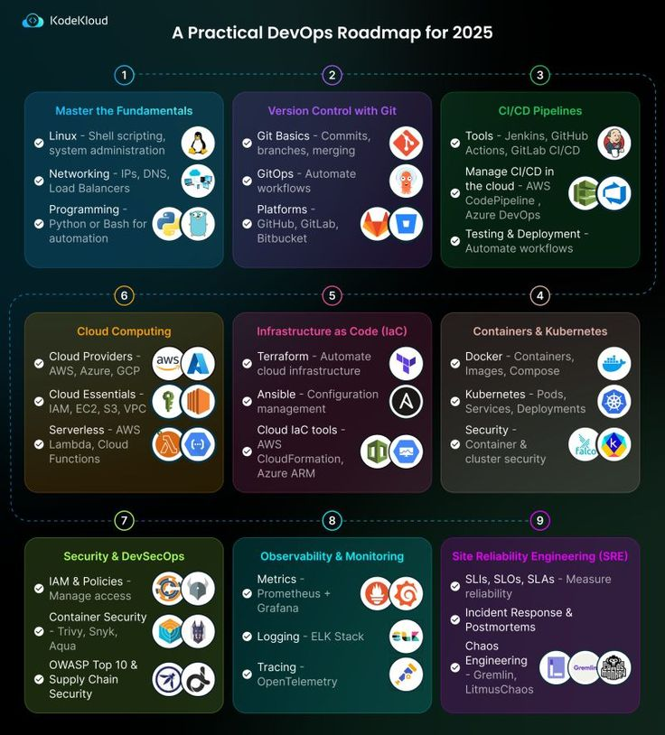

**Source:** [https://twitter.com/i/web/status/1911471908551594410](https://twitter.com/i/web/status/1911471908551594410)
**Original Post Date:** 2025-05-28 03:57:19

# A Practical DevOps Roadmap for 2025

## Introduction
The DevOps roadmap for 2025, designed by KodeKloud, is a detailed guide structured into 9 key sections. Each section represents a critical area of focus for DevOps professionals, guiding them through the skills required in the domain. From mastering the fundamentals to ensuring high availability and reliability of systems, this roadmap covers it all.

The roadmap is visually organized into a grid, with each section having a distinct color-coded background, including a title, key topics, subtopics, and relevant icons representing tools, platforms, or concepts.

## Master the Fundamentals

Building a strong foundation in essential technical skills is crucial. This includes Linux shell scripting and system administration, networking basics such as IP addresses, DNS, and load balancers, and programming skills with Python for automation and Bash scripting.

## Version Control with Git

Understanding and mastering Git for version control is vital. This involves learning Git basics like commits, branches, and merging, as well as GitOps for automating workflows, and familiarity with platforms such as GitHub, GitLab, and Bitbucket.

## CI/CD Pipelines

Implementing Continuous Integration and Continuous Deployment (CI/CD) workflows is key to efficient software development. This includes knowledge of tools like Jenkins, GitHub Actions, and GitLab CI/CD, as well as cloud integration with services such as AWS CodePipeline and Azure DevOps.

## Containers & Kubernetes

Leveraging containerization and orchestration for scalable applications is a critical skill. This involves understanding containers with Docker, images, and Compose, as well as Kubernetes including pods, services, deployments, and security considerations.

## Infrastructure as Code (IaC)

Automating infrastructure management using code is essential for modern DevOps practices. This includes knowledge of Terraform for automating cloud infrastructure, Ansible for configuration management, and other cloud IaC tools like AWS CloudFormation and Azure ARM.

## Cloud Computing

Understanding and utilizing cloud services effectively is vital. This encompasses knowledge of major cloud providers such as AWS, Azure, and GCP, cloud essentials like IAM, EC2, S3, VPC, and serverless computing with AWS Lambda and Cloud Functions.

## Security & DevSecOps

Ensuring security throughout the DevOps lifecycle is paramount. This involves managing access control with IAM and policies, securing containers with tools like Trivy, Aqua, and Snyk, and addressing supply chain security concerns through guidelines such as OWASP Top 10.

## Observability & Monitoring

Monitoring and analyzing system performance is critical for maintaining high-quality services. This includes understanding metrics with Prometheus and Grafana, logging practices using the ELK Stack, and tracing with OpenTelemetry.

## Site Reliability Engineering (SRE)

Ensuring high availability and reliability of systems is the ultimate goal. This involves measuring reliability with SLIs, SLOs, and SLAs, conducting incident response including postmortems and chaos engineering, and utilizing tools like Gremlin for chaos engineering.

## Key Takeaways

- Master foundational technical skills including Linux, networking, and programming.
- Adopt version control with Git and automate workflows with CI/CD pipelines.
- Leverage containerization with Docker and orchestration with Kubernetes.
- Automate infrastructure management using IaC tools like Terraform and Ansible.
- Ensure security practices are integrated throughout the DevOps lifecycle.

## Conclusion
The DevOps roadmap for 2025 by KodeKloud offers a comprehensive guide for professionals aiming to enhance their skills in the domain. By following this structured approach, from mastering fundamentals to advanced practices like SRE, individuals can significantly improve their proficiency and contribution to software development and operations teams.

This detailed roadmap emphasizes the importance of a holistic approach to DevOps, covering everything from foundational skills to cutting-edge technologies and best practices. It serves as a valuable resource for anyone looking to advance their DevOps skills and stay updated with the latest industry trends.

## External References

- [KodeKloud Official Website](https://kodekloud.com/)
- [DevOps Institute](https://devopsinstitute.com/)

## Media

**Image Description:** The image is a detailed roadmap titled **"A Practical DevOps Roadmap for 2025"** by KodeKloud. It is structured into **9 key sections**, each representing a critical area of focus for DevOps professionals. The roadmap is designed to guide individuals through the foundational and advanced skills required in the DevOps domain. Below is a detailed breakdown of each section:

---

### **1. Master the Fundamentals**
- **Focus**: Building a strong foundation in essential technical skills.
- **Key Topics**:
  - **Linux**: Shell scripting, system administration.
  - **Networking**: IP addresses, DNS, load balancers.
  - **Programming**: Python for automation, Bash scripting.
- **Icons**: Represent tools and concepts like Linux, Git, and Python.

---

### **2. Version Control with Git**
- **Focus**: Understanding and mastering Git for version control.
- **Key Topics**:
  - **Git Basics**: Commits, branches, merging.
  - **GitOps**: Automating workflows.
  - **Platforms**: GitHub, GitLab, Bitbucket.
- **Icons**: Git logo, GitHub, GitLab, and Bitbucket.

---

### **3. CI/CD Pipelines**
- **Focus**: Implementing Continuous Integration and Continuous Deployment (CI/CD) workflows.
- **Key Topics**:
  - **Tools**: Jenkins, GitHub Actions, GitLab CI/CD.
  - **Cloud Integration**: Managing CI/CD in the cloud (AWS CodePipeline, Azure DevOps).
  - **Testing & Deployment**: Automating workflows.
- **Icons**: Jenkins, GitHub Actions, GitLab CI/CD, AWS CodePipeline, Azure DevOps.

---

### **4. Containers & Kubernetes**
- **Focus**: Leveraging containerization and orchestration for scalable applications.
- **Key Topics**:
  - **Containers**: Docker, images, Compose.
  - **Kubernetes**: Pods, services, deployments, security.
- **Icons**: Docker, Kubernetes, and related tools.

---

### **5. Infrastructure as Code (IaC)**
- **Focus**: Automating infrastructure management using code.
- **Key Topics**:
  - **Terraform**: Automating cloud infrastructure.
  - **Ansible**: Configuration management.
  - **Cloud IaC Tools**: AWS CloudFormation, Azure ARM.
- **Icons**: Terraform, Ansible, AWS CloudFormation, Azure ARM.

---

### **6. Cloud Computing**
- **Focus**: Understanding and utilizing cloud services.
- **Key Topics**:
  - **Cloud Providers**: AWS, Azure, GCP.
  - **Cloud Essentials**: IAM, EC2, S3, VPC.
  - **Serverless**: AWS Lambda, Cloud Functions.
- **Icons**: AWS, Azure, GCP, Lambda, and other cloud services.

---

### **7. Security & DevSecOps**
- **Focus**: Ensuring security throughout the DevOps lifecycle.
- **Key Topics**:
  - **IAM & Policies**: Managing access control.
  - **Container Security**: Trivy, Aqua, Snyk.
  - **Supply Chain Security**: OWASP Top 10, Open Web Application Security Project (OWASP).
- **Icons**: IAM, Trivy, Aqua, Snyk, and other security tools.

---

### **8. Observability & Monitoring**
- **Focus**: Monitoring and analyzing system performance.
- **Key Topics**:
  - **Metrics**: Prometheus, Grafana.
  - **Logging**: ELK Stack (Elasticsearch, Logstash, Kibana).
  - **Tracing**: OpenTelemetry.
- **Icons**: Prometheus, Grafana, ELK Stack, OpenTelemetry.

---

### **9. Site Reliability Engineering (SRE)**
- **Focus**: Ensuring high availability and reliability of systems.
- **Key Topics**:
  - **SLIs, SLOs, SLAs**: Measuring reliability.
  - **Incident Response**: Postmortems, chaos engineering.
  - **Chaos Engineering**: Tools like Gremlin.
- **Icons**: Prometheus, Grafana, Gremlin, and other SRE tools.

---

### **Design and Layout**
- The roadmap is visually organized into a grid of 9 sections, each with a distinct color-coded background.
- Each section includes:
  - A title.
  - Key topics and subtopics.
  - Relevant icons representing tools, platforms, or concepts.
- The roadmap is structured in a logical flow, starting from foundational skills (Section 1) and progressing to advanced topics like SRE (Section 9).

---

### **Overall Purpose**
The image serves as a comprehensive guide for DevOps professionals, highlighting the skills, tools, and technologies they need to master to stay relevant in 2025. It emphasizes a holistic approach to DevOps, covering everything from foundational skills to advanced practices like SRE and chaos engineering.

---

This detailed roadmap is a valuable resource for anyone looking to advance their DevOps skills and stay updated with the latest industry trends.
