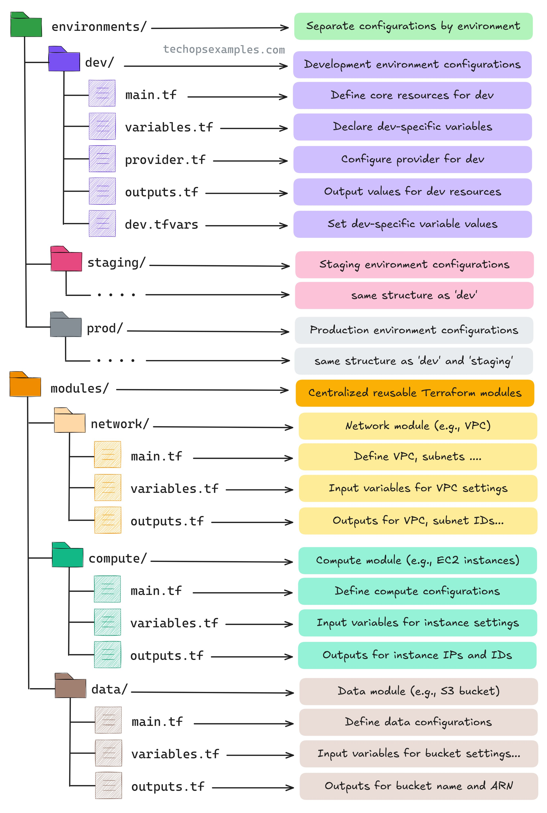

**Source:** [https://twitter.com/i/web/status/1928670646994874804](https://twitter.com/i/web/status/1928670646994874804)
**Original Post Date:** 2025-06-17 11:26:30

# Terraform Project Structure: Modular Environment Management with Reusable Components

## Introduction
Organizing Terraform code effectively is crucial for maintaining large-scale infrastructure as code projects. This knowledge base item explores a robust project structure that separates environments while promoting reusability through modules. The approach ensures scalability, maintainability, and efficient management across different deployment stages.

## Environments Management

The `environments/` directory segregates configurations based on distinct operational phases (development, staging, production). This separation prevents cross-environment contamination while allowing specific tuning for each stage. Each environment directory follows a standardized structure with core Terraform files.

Each environment includes dedicated `.tfvars` files that store environment-specific variable values, ensuring configuration isolation without code duplication.

1. Development (dev): Core infrastructure for testing and rapid iteration
1. Staging (staging): Pre-production validation environment with production-like settings
1. Production (prod): Fully optimized, hardened configurations

> **Note/Tip:** Maintain strict separation between environments to prevent accidental cross-pollution of resources.

## Modular Architecture Design

The `modules/` directory encapsulates reusable infrastructure components, promoting DRY principles and reducing configuration complexity. Each module contains self-contained logic for specific resource types (networking, compute, data storage).

Module structure ensures consistent file organization across the project, making it easier to maintain and evolve individual components without affecting others.

- Network module: Handles VPCs, subnets, security groups
- Compute module: Manages EC2 instances, auto-scaling groups
- Data storage module: Controls S3 buckets, database instances

## Key Takeaways

- Environment separation ensures configuration isolation and reduces risk of cross-pollination.
- Modular design promotes code reuse and maintainability across different stages.
- Consistent file organization improves team collaboration and project scalability.

## Conclusion
This Terraform project structure provides a solid foundation for managing infrastructure as code at scale. By separating environments and modularizing components, teams can efficiently manage complex deployments while maintaining code quality and reducing operational risks.

## External References

- [Terraform Official Documentation](https://www.terraform.io/docs)
- [HashiCorp's Best Practices Guide](https://developer.hashicorp.com/terraform/tutorials/aws-best-practices)

## Media

**Image Description:** The image depicts a structured directory layout for managing infrastructure as code using Terraform, a popular infrastructure provisioning and management tool. The layout is designed to organize configurations and modules in a modular, reusable, and environment-specific manner. Below is a detailed breakdown of the image:

---

### **Main Structure**
The directory structure is divided into two primary sections:
1. **Environments**
2. **Modules**

---

### **1. Environments**
The `environments/` directory is used to separate configurations based on different environments (e.g., development, staging, production). This ensures that each environment has its own set of configurations, variables, and outputs.

#### **Subdirectories within `environments/`:**
- **dev/** (Development Environment)
  - **Purpose:** Contains configurations specific to the development environment.
  - **Files:**
    - `main.tf`: Defines core resources for the development environment.
    - `variables.tf`: Declares variables specific to the development environment.
    - `provider.tf`: Configures the provider (e.g., AWS, Azure) for the development environment.
    - `outputs.tf`: Defines output values for resources in the development environment.
    - `dev.tfvars`: Sets variable values specific to the development environment.

- **staging/** (Staging Environment)
  - **Purpose:** Contains configurations specific to the staging environment.
  - **Structure:** Similar to the `dev/` directory, with the same file structure (`main.tf`, `variables.tf`, `provider.tf`, `outputs.tf`, `staging.tfvars`).

- **prod/** (Production Environment)
  - **Purpose:** Contains configurations specific to the production environment.
  - **Structure:** Similar to the `dev/` and `staging/` directories, with the same file structure (`main.tf`, `variables.tf`, `provider.tf`, `outputs.tf`, `prod.tfvars`).

---

### **2. Modules**
The `modules/` directory is used to centralize reusable Terraform modules. These modules encapsulate specific infrastructure components, making them modular, reusable, and easier to manage.

#### **Subdirectories within `modules/`:**
- **network/**
  - **Purpose:** Manages network-related infrastructure (e.g., VPC, subnets).
  - **Files:**
    - `main.tf`: Defines the VPC, subnets, and other network resources.
    - `variables.tf`: Declares input variables for VPC settings.
    - `outputs.tf`: Defines outputs for VPC IDs, subnet IDs, etc.

- **compute/**
  - **Purpose:** Manages compute resources (e.g., EC2 instances).
  - **Files:**
    - `main.tf`: Defines EC2 instances and related configurations.
    - `variables.tf`: Declares input variables for instance settings.
    - `outputs.tf`: Defines outputs for instance IPs and IDs.

- **data/**
  - **Purpose:** Manages data storage resources (e.g., S3 buckets).
  - **Files:**
    - `main.tf`: Defines S3 buckets and related configurations.
    - `variables.tf`: Declares input variables for bucket settings.
    - `outputs.tf`: Defines outputs for bucket names and ARNs.

---

### **Key Features of the Layout**
1. **Environment-Specific Configurations:**
   - Each environment (`dev`, `staging`, `prod`) has its own directory with tailored configurations.
   - Environment-specific variables are stored in `.tfvars` files (e.g., `dev.tfvars`, `staging.tfvars`, `prod.tfvars`).

2. **Modular Design:**
   - The `modules/` directory contains reusable modules for network, compute, and data resources.
   - Each module is self-contained with `main.tf`, `variables.tf`, and `outputs.tf` files.

3. **Separation of Concerns:**
   - Environment configurations are separated from reusable modules.
   - This ensures that changes to one environment do not affect others, and modules can be reused across environments.

4. **Consistent File Structure:**
   - Each module and environment directory follows a consistent file structure, making it easier to navigate and maintain.

---

### **Technical Details**
- **Terraform Files:**
  - **`main.tf`:** Defines the core infrastructure resources.
  - **`variables.tf`:** Declares input variables for the module or environment.
  - **`provider.tf`:** Configures the cloud provider (e.g., AWS, Azure).
  - **`outputs.tf`:** Defines output values for resources.
  - **`.tfvars`:** Stores environment-specific variable values.

- **Reusability:**
  - Modules in the `modules/` directory can be reused across different environments by passing appropriate variables.

- **Environment Isolation:**
  - Each environment (`dev`, `staging`, `prod`) has its own directory, ensuring that configurations are isolated and can be managed independently.

---

### **Summary**
The image illustrates a well-organized Terraform directory structure that promotes modularity, reusability, and environment-specific configurations. The separation of environments and modules ensures scalability, maintainability, and ease of management for infrastructure as code. This structure is particularly useful for large-scale projects where infrastructure needs to be provisioned across multiple environments and managed efficiently.
