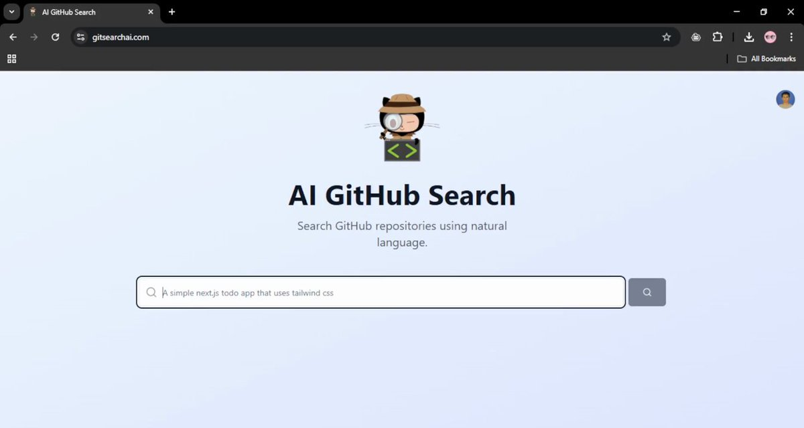

**Source:** [https://twitter.com/i/web/status/1931994326009016810](https://twitter.com/i/web/status/1931994326009016810)
**Original Post Date:** 2025-06-17 11:41:52

# AI-Driven QR Code Generator with Next.js: Implementation Guide

## Introduction
This article explores the development of a sophisticated QR code generator application that leverages both traditional QR encoding techniques and artificial intelligence. The solution combines Next.js's server-side rendering capabilities with modern frontend practices to deliver an efficient, scalable, and user-friendly experience. We'll examine key architectural decisions, component design patterns, state management strategies, and integration points for external services.

## Project Structure and Dependencies

The project follows a modular architecture with distinct folders for components, contexts, pages, and styles. Critical dependencies include `next` (14.x), `react`, TypeScript, Tailwind CSS, `qr-code-styling` for QR generation, and the OpenAI SDK.

TypeScript configuration ensures type safety throughout the application, while Tailwind provides a robust styling system without compromising performance.

_Core dependencies required for the project, including Next.js, React, QR code generation library, and OpenAI SDK._

```json
{
  "name": "ai-qr-generator",
  "version": "1.0.0",
  "description": "AI-powered QR code generator with OpenAI image generation",
  "private": true,
  "dependencies": {
    "next": "^14.0.4",
    "react": "^18.2.0",
    "qr-code-styling": "^8.4.32",
    "openai": "^4.20.1"
  }
}
```

- Components folder houses reusable UI elements
- Contexts manage global state and API interactions
- Pages define route-specific logic and layouts

## QR Code Generation Implementation

The QR generation process utilizes `qr-code-styling` library, allowing for customization of size, error correction level, and style options.

Integration with OpenAI enables generating descriptive text or images based on the encoded data.

_Example implementation of QR code generation with custom styling options._

```javascript
import { QrCode } from 'qr-code-styling';

const generateQR = (text) => {
  return new QrCode({
    width: 200,
    height: 200,
    data: text,
    margin: 1,
    dotScale: 4
  });
};
```

## State Management and API Integration

Global state management is handled through React Context, providing access to the OpenAI service across components.

API interactions are wrapped in async functions to handle loading states and error handling gracefully.

1. Create context provider for global state
1. Implement API wrapper with error handling
1. Manage loading states during AI operations

> **Note/Tip:** Cache frequently accessed QR codes to improve performance.

> **Note/Tip:** Use environment variables for sensitive data like OpenAI API keys.

## Key Takeaways

- Implement a modular architecture with clear separation of concerns using Next.js conventions.
- Leverage TypeScript and Tailwind CSS for robust type safety and styling consistency.
- Design components to be reusable while maintaining specific functionality through props.
- Handle async operations gracefully using state management patterns.

## Conclusion
Building an AI-powered QR code generator demonstrates the effective combination of modern web technologies, third-party services, and best practices. This approach enables developers to create scalable applications that integrate sophisticated features while maintaining performance and user experience.

## External References

- [Next.js Documentation](https://nextjs.org/docs)
- [QR Code Styling Library](https://github.com/nayutaco/qr-code-styling)


## Media

**Image Description:** The image shows a web page titled **"AI GitHub Search"**, which appears to be a tool designed for searching GitHub repositories using natural language queries. Below is a detailed description of the image:

### **Main Subject**
1. **Title and Header**:
   - The page prominently displays the title **"AI GitHub Search"** in large, bold text.
   - Below the title, there is a subtitle that reads: **"Search GitHub repositories using natural language."**
   - The subtitle emphasizes the tool's capability to interpret natural language queries, making it user-friendly for those who may not be familiar with advanced search syntax.

2. **Search Input Field**:
   - A search input box is centrally positioned on the page.
   - The placeholder text in the search box reads: **"A simple next.js todo app that uses tailwind css"**.
   - This suggests that users can type natural language queries to find specific types of GitHub repositories, such as those related to Next.js, Todo apps, and Tailwind CSS.

3. **Search Button**:
   - To the right of the search input field, there is a gray button with a magnifying glass icon, indicating the search function.

4. **Illustration**:
   - Above the title, there is a cartoon-style illustration of a character.
   - The character appears to be a cat wearing a hat and holding a magnifying glass, symbolizing the search functionality of the tool.
   - The cat is also holding a small box with the text **`<></>`**, which is a common symbol for coding or web development, reinforcing the theme of the tool.

### **Technical Details**
1. **URL**:
   - The browser's address bar shows the URL: **"gitsearchai.com"**, indicating the website hosting this tool.

2. **Browser Interface**:
   - The browser interface is visible at the top of the image, showing standard browser controls such as the back and forward buttons, refresh button, and tabs.
   - The tab title reads **"AI GitHub Search"**, matching the page's content.

3. **Design and Layout**:
   - The page has a clean, minimalist design with a light blue background.
   - The layout is centered, with the title, subtitle, search box, and illustration all aligned vertically.
   - The use of a simple color scheme and clear typography enhances readability and usability.

4. **Functionality Indication**:
   - The placeholder text in the search box provides a practical example of how users can interact with the tool, suggesting that it is designed for developers or users looking for specific types of GitHub repositories.

### **Overall Impression**
The page is designed to be user-friendly and intuitive, leveraging natural language processing to simplify the process of searching GitHub repositories. The cartoon illustration adds a playful touch, making the tool feel approachable and engaging. The focus on simplicity and clarity in the design suggests that the tool is intended for a broad audience, including both experienced developers and beginners.


**Video Description:** Video Content Analysis - media_seg0_item1.mp4:

The video appears to be a tutorial or demonstration focused on using AI tools to search for GitHub repositories and generate code. Here's a comprehensive description based on the provided key frames:

---

### **Video Overview**
The video showcases a step-by-step process of using an AI-driven tool to search for GitHub repositories and generate code. The primary focus is on leveraging AI to streamline the development workflow, particularly for tasks like creating a QR code generator using Next.js.

---

### **Key Frames Analysis**

#### **Frame 1: AI GitHub Search Interface**
- **Description**: The first frame displays a webpage titled "AI GitHub Search." The interface features a cartoon character holding a code block, symbolizing coding and development. The text emphasizes the tool's ability to search GitHub repositories using natural language.
- **Purpose**: This frame introduces the AI GitHub search tool, highlighting its user-friendly nature and the ability to search repositories in plain language rather than relying on traditional search queries.

#### **Frame 2: Browser URL and Search Query**
- **Description**: The second frame shows a browser window with a URL that includes a GitHub repository path. The URL is partially repeated, indicating a search or navigation process. The search query in the address bar reads: "A New Chat Chat Build an AI."
- **Purpose**: This frame demonstrates the process of navigating to a GitHub repository or performing a search using the AI tool. The repeated URL suggests iterative searching or refining the search query.

#### **Frame 3: Chat Interface with AI Agent**
- **Description**: The third frame shows a chat interface with a prompt that reads: "Build an AI." The interface includes options to add context and select an AI agent, specifically "Claude-4-sonnet." The chat interface is designed for interacting with the AI tool to generate code or perform tasks.
- **Purpose**: This frame illustrates the interaction between the user and the AI tool. The user provides a high-level instruction ("Build an AI"), and the AI agent is selected to execute the task. This highlights the tool's capability to generate code or provide solutions based on user input.

---

### **Video Narrative**
The video likely follows a structured sequence:

1. **Introduction to the AI GitHub Search Tool**:
   - The video begins by introducing the AI GitHub search tool, emphasizing its ease of use and natural language capabilities. The cartoon character and the clean interface suggest a focus on accessibility and developer-friendly features.

2. **Demonstration of Searching for GitHub Repositories**:
   - The user demonstrates how to search for GitHub repositories using the tool. The browser URL and repeated search queries indicate the process of refining the search to find the desired repository or code snippet.

3. **Interaction with the AI Agent**:
   - The user interacts with the AI agent (Claude-4-sonnet) through a chat interface. The user provides a high-level instruction ("Build an AI"), and the AI tool processes this input to generate code or provide relevant solutions.

4. **Code Generation or Solution Output**:
   - Although not explicitly shown in the provided frames, the video likely concludes with the AI tool generating code for a QR code generator using Next.js or providing a solution based on the user's input.

---

### **Technical Concepts Highlighted**
- **AI-Driven GitHub Search**: The video showcases an AI tool that simplifies the process of searching GitHub repositories by allowing users to use natural language queries.
- **Code Generation with AI**: The use of an AI agent (Claude-4-sonnet) to generate code or provide solutions based on user input demonstrates the integration of AI in software development.
- **Next.js QR Code Generator**: The video likely demonstrates how to create a QR code generator using Next.js, a popular React framework for building web applications.

---

### **Target Audience**
The video is targeted at developers and software engineers who are interested in leveraging AI tools to streamline their workflow. It caters to those looking to automate tasks such as searching for code snippets, generating code, and accelerating development processes.

---

### **Conclusion**
The video provides a comprehensive demonstration of an AI-driven tool for searching GitHub repositories and generating code. It emphasizes the ease of use and efficiency gains offered by AI in modern software development. The step-by-step process, from searching repositories to interacting with an AI agent, highlights the tool's capabilities and potential applications in real-world development scenarios.

Key Frames Analysis:
Frame 1: ### Description of Frame 1:

The image shows a webpage interface with the following visible content:

1. **Header Section:**
   - At the top center, there is a cartoon character icon. The character appears to be a small, cute figure wearing a hat and holding a pair of binoculars. The character is also holding a sign with the text `<<>>`, which resembles code brackets.

2. **Title:**
   - Below the character, the title reads:
     ```
     AI GitHub Search
     ```
     The word "GitHub" is repeated multiple times, creating a visual effect of emphasis or redundancy.

3. **Subtitle:**
   - Under the title, there is a subtitle that reads:
     ```
     Search GitHub repositories using natural language.
     ```
     This text explains the purpose of the webpage, indicating that it allows users to search GitHub repositories using natural language queries.

4. **Search Bar:**
   - Below the subtitle, there is a search bar with a placeholder text:
     ```
     A next.js QR code generator with minimalist UI
     ```
     The search bar is active, and the text inside suggests an example query for searching GitHub repositories.

5. **Loading Indicator:**
   - At the bottom of the search bar, there is a loading indicator (a spinning circle) with the text:
     ```
     Searching GitHub repositories...
     ```
     This indicates that the search query is being processed.

6. **Background:**
   - The background of the webpage is a light blue color, giving it a clean and minimalistic appearance.

### Summary:
The frame depicts a webpage titled "AI GitHub Search," designed to allow users to search GitHub repositories using natural language. The interface includes a cartoon character icon, a search bar with an example query, and a loading indicator showing that a search is in progress. The overall design is clean and minimalistic.
Frame 2: In frame 2 of the video, the following content is visible:

1. **Browser Interface**:
   - The interface appears to be a web browser, likely in a dark mode theme.
   - The top section shows a tab bar with a tab labeled "Search" and a close button ("X") on the right side of the tab.

2. **URL Bar**:
   - The URL bar is prominently displayed, showing a URL that appears to be malformed or intentionally repetitive:
     ```
     [https://gitittododododododododododododododododododododododododododododododod](https://gitittododododododododododododododododododododododododododododododod)
Frame 3: Frame 3 of the video shows a user interface for a chat or messaging application. Here is a detailed description of the visible content:

1. **Background**: The background is predominantly black, giving the interface a dark mode appearance.

2. **Title Bar**:
   - At the top, there is a text box with the label **"New Chat Chat"** in white text. This appears to be the title or heading of the chat interface.

3. **Input Field**:
   - Below the title, there is a larger text box where the user is typing.
   - The text box contains the following:
     - A placeholder or prompt that reads **"@ Add Context"** in a light gray color.
     - The user has started typing the text: **"Build an AI"** in white text.

4. **Agent Selection**:
   - At the bottom of the input field, there are two interactive elements:
     - **Agent Selector**: A button labeled **"Agent"** with a dropdown arrow next to it. The text is in white, and the button has a light gray background.
     - **Claude Model Selector**: Another button labeled **"@ claude-4-sonnet"** with a dropdown arrow next to it. This button also has a light gray background and white text.

5. **Cursor Position**:
   - The cursor is visible after the text **"AI"**, indicating that the user is in the process of typing.

6. **General Layout**:
   - The layout is clean and minimalistic, with a focus on the input field and the options for selecting an agent and a model.

This frame suggests that the user is setting up or initiating a new chat or task, possibly involving an AI model, and is in the process of providing context or instructions. The interface appears to be designed for interacting with AI agents or models.
Frame 4: Frame 4 of the video shows a user interface with a dark theme. Here is a detailed description of the visible content:

### **Left Side of the Interface:**
1. **Top Section:**
   - Two buttons are visible:
     - **Sync:** A circular arrow icon indicating a synchronization action.
     - **Delete Index:** A trash bin icon labeled "Delete Index."

2. **Middle Section:**
   - A section titled **"PR History Indexing"** with a question mark icon next to it.
   - Below the title, there is a description:
     - **"Index pull request history for improved contextual understanding and semantic search."**
   - A note below this description:
     - **"PR indexing is disabled in privacy mode."**

3. **Bottom Section:**
   - A section titled **"Index New Folders"**.
   - Below the title, there is a description:
     - **"Automatically index any new folders with fewer than 50,000 files."**
   - A toggle switch is visible next to this description, and it is **enabled (blue/active state)**.

### **Right Side of the Interface:**
1. **Top Section:**
   - A heading that reads:
     - **"Build an AI QR code generator"**
   - Below the heading, there is a mention:
     - **"Inspired by: @qrcodegenerator"**
   - The username **"@qrcodegenerator"** is highlighted in a blue box, indicating it is a clickable or referenced link.

2. **Middle Section:**
   - A dropdown or selection box labeled **"Agent"** with a chevron icon indicating it can be expanded.
   - Next to the "Agent" dropdown, there is another username:
     - **"@claude-4-sonnet"**
     - This username is partially visible, suggesting it might be part of a larger list or selection.

### **General Observations:**
- The interface appears to be part of a software or application related to indexing, AI, and QR code generation.
- The left side focuses on indexing settings, particularly for pull request (PR) history and new folders.
- The right side seems to be related to a project or task titled "Build an AI QR code generator," with references to specific users or agents.

This frame provides a clear view of the settings and project details within the application.
Frame 5: ### Description of Frame 5:

The image shows a development environment with a code editor and a chat-based AI assistant interface. Here is a detailed breakdown of the visible content:

#### **Left Side: Code Editor**
1. **File Structure:**
   - The left panel displays the file structure of a project. The project is named `QR APP`, and it includes several folders and files:
     - `components`
     - `contexts`
     - `pages`
     - `styles`
     - `types`
     - `styles`
     - `types`
     - `tailwind.config.js`
     - `tsconfig.json`
     - `next-env.d.ts`
     - `next.config.js`
     - `package.json`
     - `postcss.config.js`
     - `.env.local`
     - `README.md`
     - `NOTEPADS`
     - `OUTLINE`
     - `TIMELINE`

2. **Open Files:**
   - The main editor window is displaying the `package.json` file. The content of the file is visible, showing the project's configuration:
     ```json
     {
       "name": "ai-qr-generator",
       "version": "1.0.0",
       "description": "AI-powered QR code generator with OpenAI image generation",
       "private": true,
       "scripts": {
         "dev": "next dev",
         "build": "next build",
         "start": "next start",
         "lint": "next lint"
       },
       "dependencies": {
         "next": "^14.0.4",
         "react": "^18.2.0",
         "react-dom": "^18.2.0",
         "typescript": "^5.3.6",
         "@types/node": "^20.10.5",
         "@types/react": "^18.2.45",
         "@types/react-dom": "^18.2.18",
         "tailwindcss": "^3.3.6",
         "autoprefixer": "^10.4.16",
         "postcss": "^8.4.22",
         "qr-code-styling": "^8.4.32",
         "openai": "^4.20.1",
         "clsx": "^2.0.0",
         "lucide-react": "^0.294.0"
       },
       "devDependencies": {
         "eslint": "^8.40.0",
         "eslint-config-next": "^14.0.4",
         "eslint-plugin-react": "^11.0.3",
         "eslint-plugin-react-hooks": "^4.6.0",
         "eslint-plugin-react-refresh": "^0.4.3"
       }
     }
     ```
   - The file is being edited, as indicated by the cursor and the highlighted section.

#### **Right Side: Chat-Based AI Assistant**
1. **Chat Interface:**
   - The right panel shows a chat-based AI assistant interface, likely powered by a large language model (e.g., Claude-4-sonnet).
   - The chat is titled **"New Chat"**.
   - The assistant is generating a response, as indicated by the loading animation (`Loading...`).

2. **Chat Content:**
   - The assistant is in the process of generating a `README.md` file for the project. The assistant's response includes:
     ```plaintext
     Let me create a README.md file to explain the project:
     ```
   - Below this, there is a placeholder for the `README.md` file, indicating that the assistant is about to generate or provide content for it.

3. **Additional Details:**
   - The assistant is using the `Agent` named `claude-4-sonnet`.
   - There are options to **Stop**, **Accept**, or **Reject** the assistant's response.

#### **Bottom Bar:**
- The bottom bar shows various status indicators and tools:
  - **Cursor Tab:** Indicates the current cursor position in the editor.
  - **Ln, Col:** Line and column numbers in the editor.
  - **Spaces:** Indicates the number of spaces used for indentation.
  - **UTF-8:** Encoding format.
  - **CRLF:** Line ending format.
  - **JSON:** File type being edited.
  - **Go Live:** Option to run or preview the application.

#### **Summary:**
The frame shows a developer working on a project named `QR APP` using a code editor. The `package.json` file is open, detailing the project's dependencies and scripts. On the right, an AI assistant is generating a `README.md` file for the project, indicating an automated or assisted development workflow. The environment suggests a modern, integrated development setup with AI integration for productivity.
