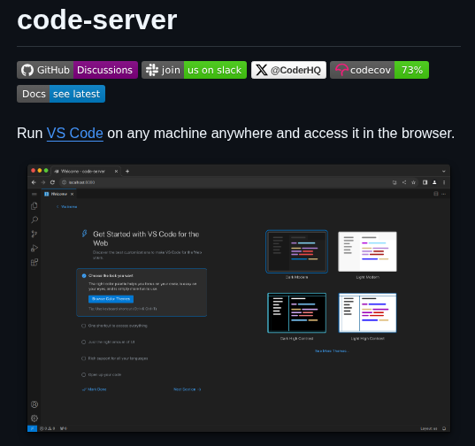

**Source:** [https://twitter.com/i/web/status/1937241851976659220](https://twitter.com/i/web/status/1937241851976659220)
**Original Post Date:** 2025-07-14 20:36:39

# Remote Development with code-server: Running VS Code in a Browser

## Introduction
In modern software development, the ability to work remotely and collaborate effectively is crucial. One tool that has gained attention for its unique approach to remote development is code-server. This open-source project allows users to run Visual Studio Code (VS Code) in a browser, making it accessible from any machine with internet access. The core functionality of code-server is to enable remote access to VS Code's powerful editing and development environment without requiring local installation.

## Main Subject: code-server

The image prominently displays the title 'code-server' at the top, highlighting its core functionality of running VS Code in a browser. The tagline 'Run VS Code on any machine anywhere and access it in the browser' underscores this capability.

The central part of the image shows a screenshot of VS Code running in a browser, with features like File Explorer, Editor Area, Activity Bar, and Status Bar visible. This visual representation emphasizes the seamless experience of using VS Code remotely.

- GitHub Link: Provides access to the open-source project's repository.
- Discussions: Allows users to engage in community discussions about code-server.
- Slack Invitation: Offers real-time support and collaboration through a Slack community.
- CoderHQ: Mentioned as a related project or community.
- Code Coverage: Shows 73% code coverage, indicating the level of automated testing.

> **Note/Tip:** The inclusion of community links and documentation adds credibility and transparency to the project.

> **Note/Tip:** The visual representation of VS Code in a browser is the focal point, showcasing the seamless experience users can expect.

## Key Features and Sections

The header section includes links to GitHub, Discussions, Slack community, and CoderHQ, as well as a code coverage badge showing 73%. This indicates the project's open-source nature and active community engagement.

A link to the documentation section prompts users to see the latest updates, suggesting regular maintenance and improvement of the project.

- File Explorer: Shows a directory structure on the left side.
- Editor Area: Displays a file with code in the center.
- Activity Bar: Provides icons for extensions, source control, and other features on the left.
- Status Bar: Shows information like the current branch, file encoding, and line numbers at the bottom.

> **Note/Tip:** The screenshot shows interactive elements like File Explorer, Editor, and Settings and Themes, highlighting the tool's practicality for coding tasks.

> **Note/Tip:** The footer section of VS Code is visible with options like 'View: Problems', 'View: Extensions', and 'View: Output'.

## Technical Details

The primary technical feature of code-server is the ability to run VS Code remotely on any machine and access it via a web browser. This eliminates the need for local installation.

The interface is rendered in a browser, making it accessible from any device with internet access. The tool is designed to work across different operating systems due to its reliance on a browser for access.

- Remote Access: Enables running VS Code remotely and accessing it via a web browser.
- Browser-Based: The interface is rendered in a browser, making it accessible from any device with internet access.
- Cross-Platform: Works across different operating systems due to its reliance on a browser for access.
- Open Source: The project is open-source, as indicated by the GitHub link and community engagement features.

> **Note/Tip:** The dark mode interface is visually appealing for coding tasks.

> **Note/Tip:** The clean and modern layout with clear navigation enhances usability.

## Design and Layout

The design of code-server's interface uses a dark theme, which is the default for VS Code and is visually appealing for coding. The layout is clean and modern, with clear navigation and a focus on usability.

The interactive screenshot of VS Code in the browser showcases how the tool works in practice, emphasizing its seamless experience.

> **Note/Tip:** The dark mode interface is visually appealing for coding tasks.

> **Note/Tip:** The clean and modern layout with clear navigation enhances usability.

## Key Takeaways

- code-server enables remote access to Visual Studio Code via a browser, making it accessible from any machine with internet access.
- The tool is open-source and has an active community engagement through GitHub, Discussions, Slack, and CoderHQ.
- The interface is rendered in a browser, making it cross-platform and eliminating the need for local installation.
- The visual representation of VS Code in a browser showcases its seamless experience and practicality for coding tasks.

## Conclusion
In conclusion, code-server offers a unique solution for remote development by enabling access to Visual Studio Code through a web browser. Its open-source nature, active community engagement, and cross-platform compatibility make it a valuable tool for developers seeking flexibility and accessibility in their workflow.

## External References

- [code-server GitHub Repository](https://github.com/coder/code-server)
- [Visual Studio Code Official Website](https://code.visualstudio.com/)

## Media

**Image Description:** The image is a screenshot of the **code-server** project's homepage, which is an open-source tool that allows users to run Visual Studio Code (VS Code) in a browser. Below is a detailed description of the image, focusing on the main subject and technical details:

### **Main Subject: code-server**
- **Title**: The page prominently displays the title **"code-server"** in large, bold text at the top.
- **Description**: The tagline reads:  
  *"Run VS Code on any machine anywhere and access it in the browser."*  
  This highlights the core functionality of code-server, which is to enable remote access to VS Code through a web browser.

### **Key Features and Sections**
1. **Header Section**:
   - **GitHub Link**: A link to the **GitHub repository** for code-server is provided, indicating that it is an open-source project.
   - **Discussions**: A link to the **Discussions** page, where users can engage in community discussions about the project.
   - **Slack Invitation**: An invitation to join the **Slack community** for real-time support and collaboration.
   - **CoderHQ**: A mention of **@CoderHQ**, likely a related project or community.
   - **Code Coverage**: A **codecov** badge showing **73%** code coverage, indicating the level of automated testing in the project.

2. **Documentation Link**:
   - A link to the **Docs** section, with a prompt to **"see latest"**, suggesting that the documentation is regularly updated.

3. **Visual Representation of VS Code in a Browser**:
   - The central part of the image shows a screenshot of **VS Code running in a browser**.
   - The interface is identical to the desktop version of VS Code, with the following elements visible:
     - **File Explorer**: On the left side, showing a directory structure.
     - **Editor Area**: In the center, displaying a file with code.
     - **Activity Bar**: On the left, with icons for extensions, source control, and other features.
     - **Status Bar**: At the bottom, showing information like the current branch, file encoding, and line numbers.
     - **Welcome Page**: The default welcome page of VS Code is visible, with options to get started, such as:
       - **Get Started with VS Code for the Web**
       - **Themes** (e.g., Dark+, Light, Light+)
       - **Extensions** (e.g., GitLens, Prettier)

4. **Interactive Elements**:
   - The screenshot shows interactive elements like:
     - **File Explorer**: A list of files and folders.
     - **Editor**: A code editor with syntax highlighting.
     - **Settings and Themes**: Options to customize the appearance of VS Code.

5. **Footer Section**:
   - The bottom of the screenshot shows the **VS Code footer**, with options like **"View: Problems"**, **"View: Extensions"**, and **"View: Output"**.

### **Technical Details**
- **Remote Access**: The primary technical feature is the ability to run VS Code remotely on any machine and access it via a web browser. This eliminates the need for installing VS Code locally.
- **Browser-Based**: The interface is rendered in a browser, making it accessible from any device with internet access.
- **Cross-Platform**: The tool is designed to work across different operating systems, as it relies on a browser for access.
- **Open Source**: The project is open-source, as indicated by the GitHub link and community engagement features.

### **Design and Layout**
- **Dark Mode**: The interface uses a dark theme, which is the default for VS Code and is visually appealing for coding.
- **Clean and Modern**: The layout is clean and modern, with clear navigation and a focus on usability.
- **Interactive Screenshot**: The screenshot of VS Code in the browser is interactive, showing how the tool works in practice.

### **Overall Impression**
The image effectively communicates the core functionality of code-server, emphasizing its ease of use, accessibility, and integration with VS Code. The inclusion of community links, documentation, and technical details like code coverage adds credibility and transparency to the project. The visual representation of VS Code in a browser is the focal point, showcasing the seamless experience users can expect.
