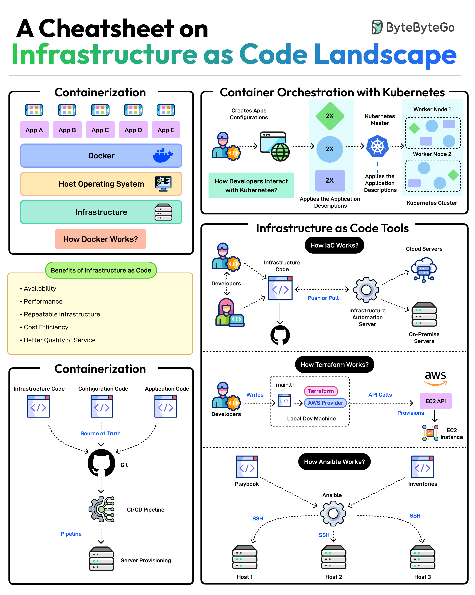

**Source:** [https://twitter.com/i/web/status/1876305237247766628](https://twitter.com/i/web/status/1876305237247766628)
**Original Post Date:** 2025-05-27 23:55:27

# Terraform Cheatsheet: Mastering Infrastructure as Code

## Introduction
Infrastructure as Code (IaC) represents a fundamental shift in how we manage cloud resources. This cheatsheet provides a deep dive into core concepts using Terraform, focusing on automation, version control, and repeatable infrastructure deployment. We'll explore containerization with Docker, orchestration via Kubernetes, and integration with CI/CD pipelines.

## Containerization Fundamentals

Docker enables application isolation through containers by bundling code, runtime dependencies, libraries, and configuration into portable units. This ensures consistent execution across development, testing, and production environments.

Key benefits include portability, scalability, and resource optimization. The containerization process involves creating Docker images, which are then deployed to run on any compatible host OS.

```bash
# Build Docker image
docker build -t myapp:1.0 .

# Run container
docker run -d --name mycontainer myapp:1.0
```

## Kubernetes Orchestration

Kubernetes automates the deployment, scaling, and management of containerized applications. It provides a control plane (master node) that manages worker nodes where containers run as pods.

The cluster architecture enables dynamic resource allocation, self-healing capabilities, and automated rollouts/rollbacks.

```yaml
# Kubernetes Deployment
apiVersion: apps/v1
kind: Deployment
metadata:
  name: myapp-deployment
spec:
  replicas: 3
  template:
```

## Infrastructure as Code with Terraform

Terraform uses declarative configuration to define infrastructure resources. The workflow includes writing HCL files, initializing providers, and applying configurations to provision resources.

Version control integration ensures infrastructure changes are tracked and reproducible.

```hcl
# Terraform Configuration
provider "aws" {
  region = "us-west-2"
}

resource "aws_instance" "web" {
  ami           = "ami-1234567890"
  instance_type = "t2.micro"
}
```

- Define infrastructure as code in .tf files
- Initialize provider plugins
- Plan changes before applying
- Apply configuration to provision resources

## CI/CD Integration with IaC

Automated pipelines combine containerized application deployment with infrastructure provisioning. Changes trigger automated testing, building of containers, and updating of infrastructure.

Version control systems like Git drive the pipeline, ensuring consistent delivery across environments.

## Key Takeaways

- Terraform enables declarative infrastructure management through HCL configurations
- Kubernetes automates container orchestration for scalable, resilient applications
- CI/CD pipelines integrate IaC with application deployment for efficient releases

## Conclusion
Mastering Terraform and IaC concepts empowers teams to manage complex cloud infrastructures with confidence. By combining containerization, orchestration, and automated deployments, organizations can achieve robust, scalable, and maintainable systems.

## External References

- [Terraform Official Documentation](https://www.terraform.io/docs)
- [Kubernetes Documentation](https://kubernetes.io/docs/)


## Media

**Image Description:** This image is a comprehensive cheatsheet on **Infrastructure as Code (IaC)**, focusing on key concepts, tools, and workflows. The main subject is the process of managing infrastructure using code, emphasizing automation, repeatability, and efficiency. Below is a detailed breakdown of the image:

---

### **1. Title and Overview**
- The title reads: **"A Cheatsheet on Infrastructure as Code Landscape"**.
- The image is organized into sections, each detailing a specific aspect of IaC, including containerization, container orchestration, IaC tools, and their workflows.

---

### **2. Section 1: Containerization**
- **Concept**: This section explains the basics of containerization using Docker.
  - **Key Components**:
    - **Apps (App A, App B, App C, App D, App E)**: These are applications that are containerized.
    - **Docker**: The tool used to create and manage containers.
    - **Host Operating System**: The underlying OS where Docker runs.
    - **Infrastructure**: The physical or virtual machines hosting the containers.
  - **How Docker Works**:
    - Docker allows developers to package applications along with their dependencies into containers.
    - These containers are lightweight and portable, enabling consistent execution across different environments.
  - **Benefits**:
    - **Availability**: Ensures applications are always available.
    - **Performance**: Optimizes resource usage.
    - **Repeatable Infrastructure**: Ensures consistency across environments.
    - **Cost Efficiency**: Reduces operational costs.
    - **Better Quality of Service**: Provides reliable and scalable services.

---

### **3. Section 2: Container Orchestration with Kubernetes**
- **Concept**: This section explains how Kubernetes orchestrates containerized applications.
  - **Key Components**:
    - **Kubernetes Cluster**: Composed of a **Master Node** and **Worker Nodes**.
    - **Master Node**: Manages the cluster, including scheduling, scaling, and load balancing.
    - **Worker Nodes**: Execute the actual workloads (containers).
    - **Applications**: Deployed as Pods, which are the smallest deployable units in Kubernetes.
  - **Workflow**:
    - Developers write application configurations (e.g., YAML files) that define how applications should be deployed.
    - These configurations are applied to the Kubernetes cluster, which then schedules and manages the containers across worker nodes.
  - **Scalability**: Kubernetes automatically scales applications based on demand.
  - **Resilience**: Ensures high availability by managing container failures and restarting them.

---

### **4. Section 3: Infrastructure as Code (IaC) Tools**
- This section introduces the concept of IaC and outlines the workflow using tools like Terraform and Ansible.

#### **4.1: How IaC Works**
- **Key Components**:
  - **Developers**: Write infrastructure code (e.g., configuration files).
  - **Infrastructure Code**: Describes the desired state of the infrastructure.
  - **Automation**: Tools like Terraform or Ansible apply the code to provision infrastructure.
  - **Cloud Servers/On-Premise Servers**: The target environments where infrastructure is provisioned.
- **Workflow**:
  - Developers write code that defines the infrastructure.
  - This code is pushed to a version control system (e.g., Git).
  - Automation tools (e.g., Terraform, Ansible) apply the code to provision or update the infrastructure.

#### **4.2: How Terraform Works**
- **Key Components**:
  - **Developers**: Write infrastructure code in Terraform's configuration language (HCL).
  - **Terraform**: The tool used to manage and provision infrastructure.
  - **AWS Provider**: Connects Terraform to AWS services.
  - **API Calls**: Terraform interacts with AWS APIs to provision resources.
  - **EC2 API**: Specifically provisions EC2 instances in AWS.
- **Workflow**:
  - Developers write Terraform configuration files (e.g., `main.tf`).
  - Terraform reads these files and applies them to provision infrastructure.
  - The AWS Provider interacts with AWS APIs to create resources like EC2 instances.

#### **4.3: How Ansible Works**
- **Key Components**:
  - **Developers**: Write playbooks in YAML format.
  - **Ansible**: The tool used for configuration management and automation.
  - **Inventories**: Define the list of hosts to manage.
  - **SSH**: Securely connects to remote servers for configuration and provisioning.
- **Workflow**:
  - Developers write playbooks that define tasks to be executed on remote servers.
  - Ansible uses SSH to connect to the servers listed in the inventory.
  - Playbooks are executed to configure and manage the servers.

---

### **5. Section 4: Containerization and CI/CD Pipeline**
- **Concept**: This section ties containerization with CI/CD (Continuous Integration/Continuous Deployment) pipelines.
- **Key Components**:
  - **Git**: Version control system for managing application and infrastructure code.
  - **Pipeline**: Automates the build, test, and deployment process.
  - **CI/CD Pipeline**: Integrates with containerization tools like Docker.
  - **Server Provisioning**: Automates the setup of servers using IaC tools.
- **Workflow**:
  - Developers commit code to Git.
  - The CI/CD pipeline builds Docker images, runs tests, and deploys the containers.
  - IaC tools (e.g., Terraform) provision the infrastructure to host the containers.

---

### **6. Visual Layout and Design**
- The image uses a clean, structured layout with:
  - **Color Coding**: Different tools and components are represented with distinct colors (e.g., Docker in blue, Kubernetes in green, Terraform in pink, Ansible in purple).
  - **Icons and Symbols**: Visual elements like containers, servers, and API calls to represent technical concepts.
  - **Arrows and Flowcharts**: Illustrate workflows and interactions between components.
  - **Text Boxes**: Summarize key points and workflows.

---

### **7. Key Takeaways**
- **Containerization**: Docker is used to package and run applications in containers.
- **Orchestration**: Kubernetes manages and scales containerized applications.
- **IaC Tools**: Terraform and Ansible automate infrastructure provisioning and configuration management.
- **CI/CD Integration**: Automates the build, test, and deployment process for containers and infrastructure.

---

This cheatsheet serves as a concise reference for understanding the core concepts and workflows of Infrastructure as Code, containerization, and orchestration. It is particularly useful for developers, DevOps engineers, and IT professionals working in modern cloud and infrastructure management.
