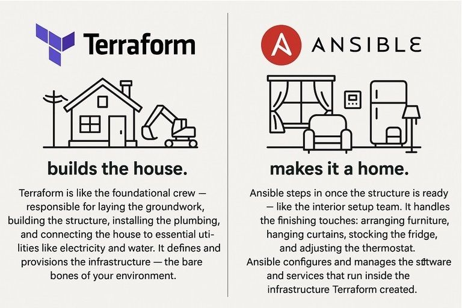

**Source:** [https://twitter.com/i/web/status/1909859367773483332](https://twitter.com/i/web/status/1909859367773483332)
**Original Post Date:** 2025-05-27 23:27:47

# Integrating Terraform and Ansible Playbooks for Infrastructure as Code and Configuration Management

## Introduction
Understanding the complementary roles of Terraform and Ansible is crucial for modern DevOps practices. While Terraform excels at infrastructure as code (IaC) provisioning, Ansible shines in configuration management. This integration creates a powerful workflow where Terraform builds the foundational infrastructure, and Ansible configures and manages the software services that run on top of it.

## Understanding Infrastructure Provisioning with Terraform

Terraform uses declarative configuration files to define desired infrastructure states. It abstracts cloud provider details through providers, allowing you to manage resources like compute instances, storage, and networking in a consistent manner.

The tool's state management ensures infrastructure changes are tracked and applied idempotently, making it ideal for reproducible environment creation.

_Shows basic AWS EC2 instance provisioning with Terraform_

```hcl
# Example Terraform configuration for AWS
provider "aws" {
  region = "us-west-2"
}

resource "aws_instance" "web_server" {
  ami           = "ami-1234567890"
  instance_type = "t2.micro"
}
```

- Define infrastructure using HCL configuration files
- Use state files to track resource changes
- Apply configurations in an idempotent manner
- Manage multiple cloud providers consistently

> **Note/Tip:** Always maintain version control over Terraform configuration files

> **Note/Tip:** Use workspaces for environment isolation (dev, staging, prod)

## Configuration Management with Ansible Playbooks

Ansible manages software configurations through playbooks written in YAML. These define the desired state of systems and services running on provisioned infrastructure.

Playbooks orchestrate configuration tasks across multiple hosts, handling dependencies and ensuring consistent deployment.

_Demonstrates basic web server configuration using Ansible_

```yaml
# Example Ansible playbook for web server
- name: Configure web server
  hosts: all
  become: yes
  tasks:
    - name: Install Apache
      package:
        name: apache2
        state: present
```

1. Define host groups in inventory files
1. Create playbooks for service configurations
1. Use roles to organize related tasks
1. Implement idempotent task execution

## Integrating Terraform with Ansible Playbooks

The integration workflow typically involves Terraform creating infrastructure resources, then passing output values to Ansible for configuration. This ensures the right systems are configured on the correct infrastructure.

Using output variables from Terraform allows Ansible to dynamically target specific hosts and apply appropriate configurations.

_Shows how to dynamically generate Ansible inventory from Terraform outputs_

```yaml
# Example inventory script
def generate_inventory():
  inventory = {
    'hosts': terraform.output('host_ips')
  }
  return yaml.dump(inventory)
```

## Key Takeaways

- Terraform and Ansible complement each other in the DevOps lifecycle
- Infrastructure provisioning should precede configuration management
- Use output values from Terraform as input for Ansible playbooks
- Maintain separate repositories for Terraform and Ansible configurations

## Conclusion
By integrating Terraform's infrastructure provisioning with Ansible's configuration management capabilities, you create a robust DevOps workflow. This combination ensures consistent environment creation while maintaining precise control over software deployments.

## External References

- [Terraform Documentation](https://www.terraform.io/docs)
- [Ansible Playbook Guide](https://docs.ansible.com/ansible/latest/user_guide/playbooks.html)


## Media

**Image Description:** This image is a conceptual comparison between two popular DevOps tools: **Terraform** and **Ansible**. The comparison is presented in a metaphorical way, using the analogy of building a house to explain the roles of these tools in infrastructure and software management. Below is a detailed description of the image:

### **Main Subjects and Layout**
The image is divided into two vertical sections, each representing one of the tools:

#### **Left Section: Terraform**
- **Logo**: The Terraform logo is displayed at the top left, consisting of a stylized "T" in blue.
- **Text**: The word "Terraform" is written in bold, black font.
- **Illustration**: Below the logo and text, there is a simple line drawing of a house under construction. The illustration includes:
  - A house with a chimney.
  - A construction vehicle (e.g., an excavator or bulldozer) working on the foundation.
  - A utility pole with power lines, symbolizing the connection to essential utilities.
- **Caption**: The phrase "builds the house" is written below the illustration.
- **Description**: A detailed explanation is provided in smaller text:
  - Terraform is likened to the foundational crew responsible for laying the groundwork, building the structure, installing plumbing, and connecting the house to essential utilities like electricity and water.
  - It defines and provisions the infrastructure, which is the "bare bones" of the environment.

#### **Right Section: Ansible**
- **Logo**: The Ansible logo is displayed at the top right, consisting of a red circle with a white "A" inside.
- **Text**: The word "Ansible" is written in bold, black font.
- **Illustration**: Below the logo and text, there is a simple line drawing of a furnished room. The illustration includes:
  - A window with curtains.
  - A refrigerator.
  - A chair and a small table.
  - A thermostat on the wall.
- **Caption**: The phrase "makes it a home" is written below the illustration.
- **Description**: A detailed explanation is provided in smaller text:
  - Ansible is likened to the interior setup team that handles the finishing touches after the structure is ready.
  - It configures and manages the software and services that run inside the infrastructure created by Terraform, such as arranging furniture, hanging curtains, stocking the fridge, and adjusting the thermostat.

### **Key Technical Details**
1. **Terraform**:
   - Focuses on **infrastructure as code (IaC)**.
   - Handles the foundational aspects of building and provisioning infrastructure.
   - Responsible for creating the basic structure and connecting it to essential utilities.
   - Emphasizes the "bare bones" of the environment, such as servers, networks, and storage.

2. **Ansible**:
   - Focuses on **configuration management** and **orchestration**.
   - Handles the setup and management of software and services within the infrastructure.
   - Responsible for the "finishing touches," such as configuring applications, setting up services, and managing the operational aspects of the environment.

### **Metaphorical Representation**
- **Terraform**: Building the house (infrastructure).
- **Ansible**: Making the house a home (configuring and managing the software and services).

### **Overall Theme**
The image effectively uses the metaphor of constructing a house to explain the complementary roles of Terraform and Ansible in DevOps workflows:
- Terraform lays the groundwork and builds the foundational structure.
- Ansible steps in to configure and manage the software and services, making the environment fully functional and ready for use.

This visual comparison helps clarify the distinction between infrastructure provisioning (Terraform) and configuration management (Ansible) in a clear and relatable way.
