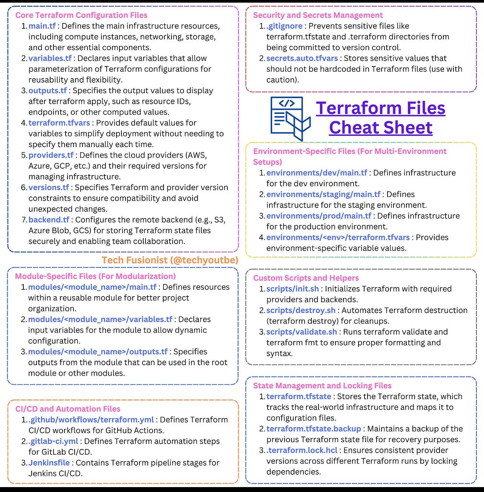

**Source:** [https://twitter.com/i/web/status/1911741070951473565](https://twitter.com/i/web/status/1911741070951473565)
**Original Post Date:** 2025-05-28 05:28:53

# Terraform Configuration Files: A Complete Guide with Ansible Integration

## Introduction
Effective infrastructure automation requires a robust understanding of Terraform's configuration structure. This guide provides an in-depth overview of essential configuration files, best practices for state management, security considerations, and how to integrate Terraform with Ansible for comprehensive DevOps workflows.

## Core Configuration Files

Terraform's foundational structure revolves around several key files that define, parameterize, and document infrastructure configurations. The main.tf serves as the central configuration file where primary resource definitions reside. Variables.tf enables dynamic value assignment through parameters, promoting reusability across different environments.

The outputs.tf file captures critical information post-deployment, while terraform.tfvars provides default values for streamlined deployments. Providers.tf and versions.tf ensure provider compatibility, and backend.tf configures secure state storage.

_Example of provider configuration with explicit versions_

```hcl
provider "aws" {
  region = var.aws_region
}

terraform {
  required_providers {
    aws = { source = "hashicorp/aws", version = ">= 3.0" }
  }
}
```

- main.tf: Core resource definitions
- variables.tf: Input parameter declarations
- outputs.tf: Output value specifications
- terraform.tfvars: Default variable values

> **Note/Tip:** Always version your providers explicitly to maintain consistency across team members

## Security and Environment Management

Security is paramount in infrastructure as code. The .gitignore file prevents sensitive state files from being committed, while secrets.auto.tfvars stores sensitive data outside the repository. For multi-environment setups, separate configuration directories under 'environments/' maintain environment-specific configurations.

Module organization promotes reusability through modular design patterns, encapsulating related resources and their dependencies within self-contained units.

```hcl
.terraform
*.tfstate
*.auto.tfvars
```

```yaml
env: dev
region: us-east-1
tf_state_file: terraform.state
```

## Integration with Ansible and CI/CD

Leverage Ansible playbooks for post-deployment configuration, combining Terraform's infrastructure provisioning capabilities with Ansible's configuration management. CI/CD integration through GitHub Actions, GitLab CI, or Jenkins ensures automated testing and deployment workflows.

```yaml
name: Terraform Deploy
on:
  push:
    branches: [ main ]
tasks:
  - name: Setup Terraform
    uses: hashicorp/setup-terraform@v1
```

## Key Takeaways

- Structure your Terraform configuration using separate files for clarity and maintainability
- Implement secure secret management practices to protect sensitive data
- Leverage modules for reusability across environments
- Integrate with CI/CD tools for automated infrastructure provisioning

## Conclusion
Mastering Terraform's configuration structure is fundamental to effective infrastructure automation. By following best practices in organization, security, and integration, you can build robust and maintainable cloud infrastructure.

## External References

- [Terraform Documentation](https://www.terraform.io/docs)
- [Ansible Official Guide](https://docs.ansible.com/ansible/latest/user_guide/index.html)


## Media

**Image Description:** The image is a comprehensive cheat sheet or reference guide for Terraform, a popular infrastructure-as-code (IaC) tool used for managing cloud infrastructure. The guide is organized into several sections, each detailing different types of files, configurations, and best practices for working with Terraform. Below is a detailed breakdown of the content:

---

### **1. Core Terraform Configuration Files**
This section outlines the essential files that form the core of a Terraform project:

- **1. main.tf**:  
  - Defines the main infrastructure resources, such as compute instances, networking, storage, and other essential components.
  - This is the primary file where most of the infrastructure configuration is written.

- **2. variables.tf**:  
  - Declares input variables that allow parameterization of Terraform configurations.
  - Enables reusability and flexibility by allowing values to be passed dynamically.

- **3. outputs.tf**:  
  - Specifies the output values to display after running `terraform apply`, such as resource IDs, endpoints, or computed values.

- **4. terraform.tfvars**:  
  - Provides default values for variables to simplify deployment without needing to specify them manually each time.

- **5. providers.tf**:  
  - Defines the cloud providers (e.g., AWS, Azure, GCP) and their required versions for managing infrastructure.

- **6. versions.tf**:  
  - Specifies Terraform and provider version constraints to ensure compatibility and avoid unexpected changes.

- **7. backend.tf**:  
  - Configures the remote backend (e.g., S3, Azure Blob, GCS) for storing Terraform state securely and enabling team collaboration.

---

### **2. Security and Secrets Management**
This section focuses on managing sensitive information and ensuring security:

- **1. .gitignore**:  
  - Prevents sensitive files like `terraform.tfstate` and `.terraform` directories from being committed to version control.

- **2. secrets.auto.tfvars**:  
  - Stores sensitive values that should not be hardcoded in Terraform files. These values are typically managed using tools like Vault or environment variables.

---

### **3. Environment-Specific Files (For Multi-Environment Setups)**
This section explains how to manage different environments (e.g., dev, staging, prod):

- **1. environments/dev/main.tf**:  
  - Defines infrastructure for the development environment.

- **2. environments/staging/main.tf**:  
  - Defines infrastructure for the staging environment.

- **3. environments/prod/main.tf**:  
  - Defines infrastructure for the production environment.

- **4. environments/<env>/terraform.tfvars**:  
  - Provides environment-specific variable values.

---

### **4. Module-Specific Files (For Modularization)**
This section describes how to organize Terraform configurations into reusable modules:

- **1. modules/<module_name>/main.tf**:  
  - Defines resources within a reusable module.

- **2. modules/<module_name>/variables.tf**:  
  - Declares input variables for the module to allow dynamic configuration.

- **3. modules/<module_name>/outputs.tf**:  
  - Specifies outputs from the module that can be used in the root module or other modules.

---

### **5. CI/CD and Automation Files**
This section covers integrating Terraform with CI/CD pipelines:

- **1. .github/workflows/terraform.yml**:  
  - CI/CD workflows for GitHub Actions.

- **2. .gitlab-ci.yml**:  
  - Defines Terraform automation steps for GitLab CI/CD.

- **3. Jenkinsfile**:  
  - Contains pipeline stages for Jenkins CI/CD.

---

### **6. Custom Scripts and Helpers**
This section lists scripts that can automate common Terraform tasks:

- **1. scripts/init.sh**:  
  - Initializes Terraform with required providers and backends.

- **2. scripts/destroy.sh**:  
  - Automates Terraform destruction for cleanups.

- **3. scripts/validate.sh**:  
  - Runs `terraform validate` and `terraform fmt` to ensure proper formatting and syntax.

---

### **7. State Management and Locking Files**
This section explains how to manage and protect the Terraform state:

- **1. terraform.tfstate**:  
  - Stores the Terraform state, which tracks the real-world infrastructure.

- **2. terraform.tfstate.backup**:  
  - Maintains a backup of the previous Terraform state file for recovery purposes.

- **3. .terraform.lock.hcl**:  
  - Ensures consistent versions of providers across different Terraform runs by locking dependencies.

---

### **Visual Layout and Design**
- The image is divided into multiple sections, each with a distinct color-coded border for easy navigation.
- Key terms and file names are highlighted in bold or colored text for emphasis.
- The layout is structured in a flowchart-like format, making it easy to follow the relationships between different components.

---

### **Overall Purpose**
The image serves as a comprehensive reference guide for Terraform users, covering everything from core configuration files to advanced topics like state management, security, and CI/CD integration. It is designed to help users understand the structure and best practices for building and managing Terraform projects effectively.
