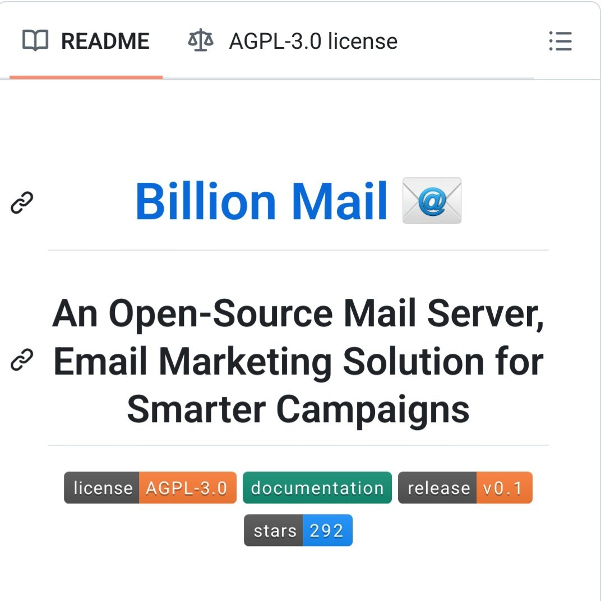

**Source:** [https://twitter.com/i/web/status/1919953003525587372](https://twitter.com/i/web/status/1919953003525587372)
**Original Post Date:** 2025-05-28 06:57:53

# Billion Mail: Open-Source Email Marketing Platform Under AGPL-3.0

## Introduction
Billion Mail represents a significant open-source initiative in the email marketing domain, offering self-hosted solutions for organizations seeking customizable campaign management systems. This knowledge base item provides an in-depth technical analysis of its current state, licensing implications, and potential deployment considerations.

## Project Overview and Technical Foundation

Billion Mail is a self-hosted email marketing solution released under the AGPL-3.0 license, which enforces copyleft requirements for all derivative works and network services.

The project is in its early stages (v0.1), demonstrating significant development potential while maintaining community interest with 292 GitHub stars.

- Primary function: Email marketing campaign management
- Deployment model: Self-hosted architecture
- License type: AGPL-3.0 (strong copyleft)

> **Note/Tip:** Consider the AGPL-3.0 implications for commercial deployments, as all modifications must be publicly shared.

## Technical Architecture and Implementation

The system requires self-hosting capabilities and likely follows a microservices architecture common in modern email solutions.

Key components would include campaign management, template systems, analytics tracking, and deliverability optimization services.

1. Setup requirements: Container orchestration (e.g., Docker/Kubernetes)
1. Infrastructure needs: High availability for email delivery
1. Security considerations: SPF/DKIM/DMARC configuration

## Deployment Considerations and Best Practices

While v0.1 indicates early development, the project's open-source nature provides flexibility for enterprise customization.

Organizations should evaluate against proprietary solutions based on specific requirements for scalability and support.

> **Note/Tip:** Monitor community activity and contribution patterns before committing to adoption.

> **Note/Tip:** Ensure alignment with organizational licensing policies regarding AGPL-3.0 obligations

## Key Takeaways

- Billion Mail offers a viable open-source alternative for organizations seeking self-hosted email marketing capabilities
- The AGPL-3.0 license mandates source code transparency and sharing of modifications
- Early version (v0.1) suggests significant development potential but requires careful evaluation

## Conclusion
Billion Mail presents an interesting open-source option for organizations with specific requirements around email marketing, self-hosting needs, or AGPL-compatible infrastructure. While the project is in early stages, its technical foundation and licensing model make it worth consideration for future adoption.

## External References

- [AGPL-3.0 License Documentation](https://www.gnu.org/licenses/agpl-3.0.en.html)

## Media

**Image Description:** The image appears to be a screenshot of a project page, likely from a code repository platform such as GitHub. Below is a detailed description of the image, focusing on the main subject and relevant technical details:

### **Header Section**
1. **Tabs/Navigation:**
   - At the top, there are two tabs:
     - **README:** This tab is highlighted, indicating that the current view is the project's README file.
     - **AGPL-3.0 license:** This tab indicates the license under which the project is released. The license is the Affero General Public License version 3.0 (AGPL-3.0), which is a copyleft license that ensures the source code remains open and freely modifiable.

2. **License Icon:**
   - Next to the "AGPL-3.0 license" tab, there is a small icon resembling a balance or legal scale, which is commonly used to represent licensing information.

3. **Menu Icon:**
   - On the far right, there is a three-line menu icon (hamburger icon), which typically provides additional options or settings for the project.

### **Main Content**
1. **Project Title:**
   - The title of the project is prominently displayed in large blue text: **"Billion Mail"**.
   - Next to the title, there is an email icon (a white envelope with a blue "at" symbol inside), suggesting that the project is related to email services or mail handling.

2. **Description:**
   - Below the title, there is a description of the project. The text is repeated multiple times, which appears to be a typographical or formatting error. The intended description is:
     - **"An Open-Source Mail Server, Email Marketing Solution for Smarter Campaigns"**
   - The repetition of words like "Open-Source," "Mail," "Marketing," and "Smarter" makes the text appear cluttered and redundant.

### **Footer Section**
1. **Tags/Labels:**
   - At the bottom, there are several colored labels providing additional information about the project:
     - **License:** The label indicates the project is licensed under **AGPL-3.0**.
     - **Documentation:** This label suggests that the project includes documentation, which is essential for users to understand and use the software.
     - **Release:** The label shows the current release version as **v0.1**, indicating that this is an early or initial version of the project.
     - **Stars:** The label shows the number of stars the project has received, which is **292**. Stars are a measure of popularity or interest in the project on platforms like GitHub.

### **Technical Details**
1. **License (AGPL-3.0):**
   - The AGPL-3.0 license is a strong copyleft license that ensures the source code remains open and freely modifiable. It also requires that any modifications or derivative works must be shared under the same license. This license is particularly relevant for server-side software, as it ensures that even if the software is used over a network, the source code remains accessible.

2. **Version (v0.1):**
   - The version number **v0.1** indicates that this is likely an early or alpha version of the project. It suggests that the project is still in development and may not be fully stable or feature-complete.

3. **Stars (292):**
   - The number of stars (292) indicates that the project has some level of interest or engagement from the community. However, this number is relatively low, suggesting that the project might be new or not widely known yet.

4. **Email Icon:**
   - The email icon next to the project title reinforces the project's focus on email-related functionalities, such as mail servers or email marketing solutions.

### **Overall Impression**
- The project appears to be an open-source initiative focused on providing a mail server and email marketing solution. The AGPL-3.0 license ensures that the project remains open and freely modifiable.
- The repeated text in the description is a noticeable issue that could be improved for clarity.
- The project is at an early stage (v0.1), and while it has some level of interest (292 stars), it is still in the early phases of development.

This detailed description covers the main elements and technical aspects visible in the image.
