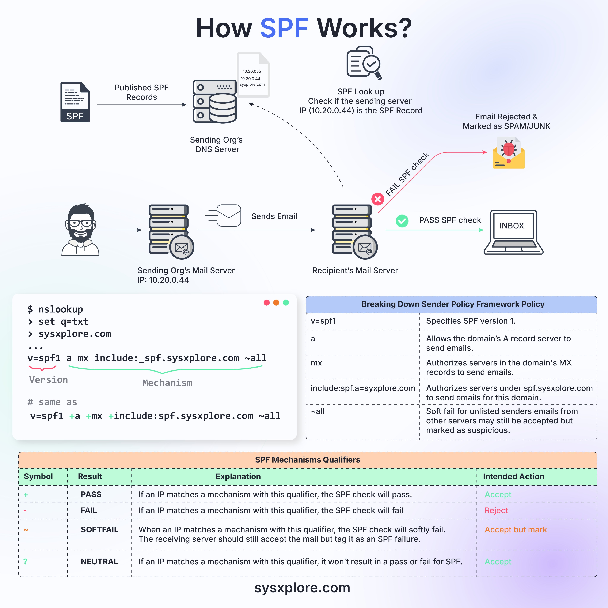

**Source:** [https://twitter.com/i/web/status/1876692536657408500](https://twitter.com/i/web/status/1876692536657408500)
**Original Post Date:** 2025-07-20 09:21:21

# Technical Analysis of Sender Policy Framework (SPF) for Email Security

## Introduction
Sender Policy Framework (SPF) is a critical component in the fight against email spoofing. This technical analysis delves into how SPF works, its configuration, and its role in securing email communications. We will explore the SPF validation process, record syntax, and best practices for implementation.

## SPF Overview

SPF is a DNS-based email validation system that helps prevent email spoofing by verifying the IP addresses from which an email is sent. It allows receiving mail servers to check if the sending IP address is authorized by the domain's SPF record.

The SPF process involves several key components: the sending organization, its DNS server, mail server, and the recipient's mail server. The recipient's mail server performs a DNS lookup to retrieve the SPF record for the sender's domain and validates the email based on this record.

- Sending Organization (Org): The entity sending the email.
- Sending Org's DNS Server: Stores the SPF records.
- Sending Org's Mail Server: Sends the email.
- Recipient's Mail Server: Receives the email and performs SPF validation.

## SPF Records and DNS Lookup

SPF records are published in the DNS server of the sending organization. These records specify which IP addresses are authorized to send emails on behalf of the domain.

When an email is sent, the recipient's mail server performs a DNS lookup to retrieve the SPF record for the sender's domain. The SPF record is stored as a TXT record in the DNS.

_This example SPF record specifies that emails can be sent from the domain's A and MX records, as well as servers under `_spf.sysxexplore.com`. The `~all` qualifier indicates a soft fail for unlisted senders._

```text
v=spf1 a mx include:_spf.sysxexplore.com ~all
```

## SPF Validation Process

The SPF validation process involves two scenarios: successful (PASS) and failed (FAIL) validations.

In a successful validation, the sending mail server's IP address matches one of the authorized IPs listed in the SPF record. The email is delivered to the recipient's inbox.

In a failed validation, the sending mail server's IP address does not match any of the authorized IPs listed in the SPF record. The email is rejected or marked as spam/junk.

- PASS: Email is delivered to the recipient's inbox.
- FAIL: Email is rejected or marked as spam/junk.

## SPF Record Syntax and Mechanisms

The SPF record syntax includes a version specification, mechanisms, and qualifiers. The version is specified using `v=spf1`.

Mechanisms in an SPF record specify which IP addresses are authorized to send emails. Common mechanisms include `a` (A records), `mx` (MX records), and `include` (external SPF records).

Qualifiers indicate the action to take for unlisted IPs: `+` (PASS), `-` (FAIL), `~` (SOFTFAIL), or `?` (NEUTRAL).

- Version (`v=spf1`): Specifies the SPF version.
- Mechanisms: `a`, `mx`, `include`.
- Qualifiers: `+`, `-`, `~`, `?`.

## DNS Lookup Example

An example of an SPF record lookup using the command-line tool `nslookup` is shown below. This demonstrates how to retrieve the SPF record from a DNS server.

_This command retrieves the SPF record for `sysxexplore.com` from the DNS server._

```bash
$ nslookup
> set q=txt
> sysxexplore.com
...
v=spf1 a mx include:_spf.sysxexplore.com ~all
```

## Visual Elements and Color Coding

The infographic uses visual elements like icons and color coding to represent different parts of the SPF process.

Green is used for successful validations (PASS), red for failed validations (FAIL), and orange for soft fails (SOFTFAIL).

- Paper icon: Represents the SPF record.
- Server icon: Represents DNS and mail servers.
- Envelope icons: Represent emails, with green for PASS and red for FAIL.

## Conclusion

The infographic effectively explains how SPF works by illustrating the process of SPF record publication, DNS lookup, and validation.

It uses visual elements like icons, color coding, and a detailed breakdown of SPF syntax to make the concept accessible.

## Key Takeaways

- SPF is a DNS-based email validation system that prevents spoofing by verifying sender IP addresses.
- SPF records specify authorized IPs for sending emails on behalf of a domain.
- The SPF validation process involves checking the sending IP against the SPF record and taking appropriate action (PASS, FAIL, SOFTFAIL).
- SPF records include mechanisms (`a`, `mx`, `include`) and qualifiers (`+`, `-`, `~`, `?`).
- Visual elements like icons and color coding enhance understanding of the SPF process.

## External References

- [Sender Policy Framework (SPF) - Wikipedia](https://en.wikipedia.org/wiki/Sender_Policy_Framework)
- [SPF: Sender Policy Framework - OpenSPF](http://www.openspf.org/)


## Media

**Image Description:** ### Image Description: How SPF (Sender Policy Framework) Works

The image is an infographic that explains the **Sender Policy Framework (SPF)**, a DNS-based email validation system used to prevent email spoofing by verifying sender IP addresses. The infographic is divided into several sections, each detailing a step in the SPF validation process. Below is a detailed breakdown:

---

#### **1. Title**
- The title at the top reads: **"How SPF Works?"**
- The word **"SPF"** is highlighted in blue, emphasizing its importance.

---

#### **2. Overview of SPF Workflow**
The infographic illustrates the SPF validation process step-by-step, involving multiple components:
- **Sending Organization (Org):** The entity sending the email.
- **Sending Org's DNS Server:** Stores the SPF records.
- **Sending Org's Mail Server:** Sends the email.
- **Recipient's Mail Server:** Receives the email and performs SPF validation.

---

#### **3. SPF Records and DNS Lookup**
- **Published SPF Records:** The sending organization publishes SPF records in its DNS (Domain Name System) server.
  - These records specify which IP addresses are authorized to send emails on behalf of the domain.
- **SPF Lookup:** When an email is sent, the recipient's mail server performs a DNS lookup to retrieve the SPF record for the sender's domain.
  - The SPF record is stored as a TXT record in the DNS.

---

#### **4. SPF Validation Process**
The infographic shows two scenarios:
1. **Successful SPF Validation (PASS):**
   - The sending mail server's IP address matches one of the authorized IPs listed in the SPF record.
   - The email is delivered to the recipient's inbox.
   - The infographic uses a green checkmark to indicate a successful SPF check.

2. **Failed SPF Validation (FAIL):**
   - The sending mail server's IP address does not match any of the authorized IPs listed in the SPF record.
   - The email is rejected or marked as spam/junk.
   - The infographic uses a red cross and a red envelope icon to indicate a failed SPF check.

---

#### **5. Detailed SPF Record Syntax**
The infographic breaks down the structure of an SPF record:
- **Example SPF Record:**
  ```
  v=spf1 a mx include:_spf.sysxexplore.com ~all
  ```
- **Components of the SPF Record:**
  - **Version (`v=spf1`):** Specifies the SPF version (version 1).
  - **Mechanisms:**
    - `a`: Allows the domain's A record server to send emails.
    - `mx`: Authorizes servers in the domain's MX records to send emails.
    - `include:_spf.sysxexplore.com`: Authorizes servers under `_spf.sysxexplore.com` to send emails for the domain.
  - **Qualifiers:**
    - `~all`: Soft fail for unlisted senders. Emails from unlisted servers may still be accepted but marked as suspicious.

---

#### **6. SPF Mechanisms and Qualifiers Table**
The infographic includes a table explaining the SPF mechanisms and qualifiers:
- **Mechanisms:**
  - `a`: Matches the IP address of the domain's A record.
  - `mx`: Matches the IP address of the domain's MX record.
  - `include`: Includes another domain's SPF record.
- **Qualifiers:**
  - `+`: PASS (Accept)
  - `-`: FAIL (Reject)
  - `~`: SOFTFAIL (Accept but mark as suspicious)
  - `?`: NEUTRAL (No specific action)

---

#### **7. DNS Lookup Example**
The infographic provides a command-line example of an SPF record lookup using `nslookup`:
```
$ nslookup
> set q=txt
> sysxexplore.com
...
v=spf1 a mx include:_spf.sysxexplore.com ~all
```
- This shows how the SPF record is retrieved from the DNS server.

---

#### **8. Visual Elements**
- **Icons and Symbols:**
  - A paper icon represents the SPF record.
  - A server icon represents the DNS and mail servers.
  - Envelope icons represent emails, with green and red colors indicating PASS and FAIL, respectively.
- **Color Coding:**
  - Green: PASS (successful SPF validation).
  - Red: FAIL (failed SPF validation).
  - Orange: SOFTFAIL (accepted but marked as suspicious).

---

#### **9. Footer**
- The footer includes the website: **sysxexplore.com**, indicating the source of the infographic.

---

### **Summary**
The infographic effectively explains how SPF works by illustrating the process of SPF record publication, DNS lookup, and validation. It uses visual elements like icons, color coding, and a detailed breakdown of SPF syntax to make the concept accessible. The SPF validation process is shown through two scenarios: successful (PASS) and failed (FAIL) validations, emphasizing the importance of proper SPF configuration in preventing email spoofing.
