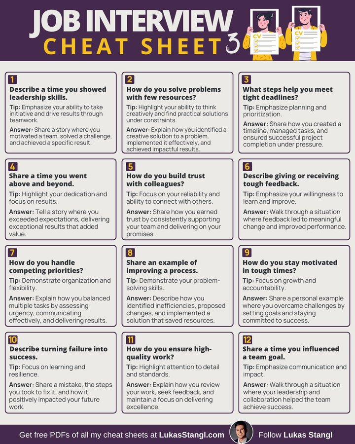

# interview_prep

**Tweet URL:** [https://x.com/AlwaysKeepL/status/1873152954003488820](https://x.com/AlwaysKeepL/status/1873152954003488820)

**Tweet Text:** Job interview cheat sheet

**Image 1 Description:** The infographic, titled "Job Interview Cheat Sheet 3," is designed to assist individuals in preparing for job interviews by providing a list of questions they may be asked. The cheat sheet features a dark purple header with white text that reads "JOB INTERVIEW CHEAT SHEET 3" and three cartoon men holding up their CVs.

Below the header, twelve numbered boxes are arranged in four rows of three columns, each containing a job interview question accompanied by a tip on how to answer it effectively. The questions cover various topics such as leadership skills, problem-solving abilities, teamwork, and personal motivation. Each box also includes an icon featuring a purple number corresponding to the order of the question.

At the bottom of the infographic, a dark purple footer contains white text that reads "Get free PDFs of all my cheat sheets at LukasStangl.com" on the left side, while the right side features a circular profile picture with the name "Lukas Stangl" and his social media handle. This infographic serves as a valuable resource for job seekers looking to prepare for their next interview.

