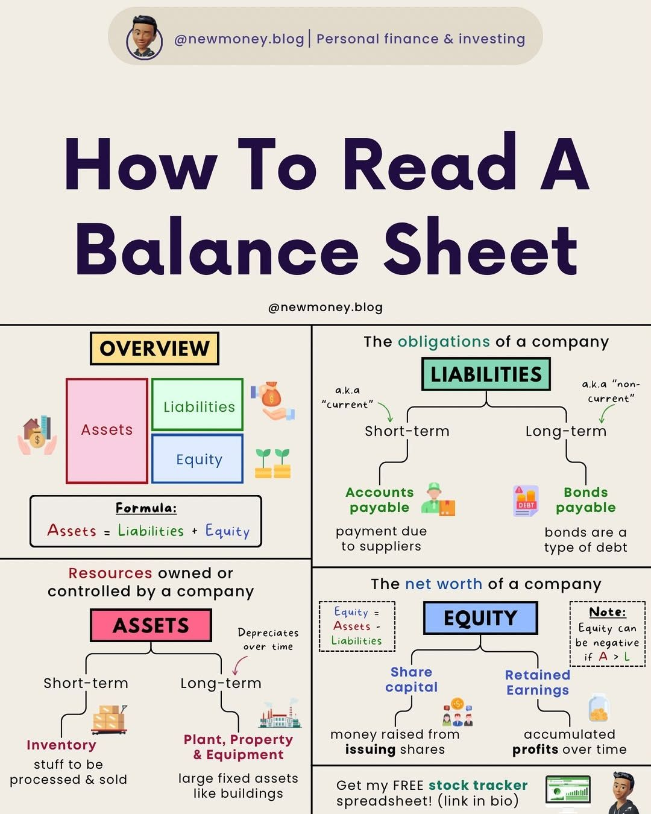

**Source:** [https://twitter.com/i/web/status/1876232999081255133](https://twitter.com/i/web/status/1876232999081255133)
**Original Post Date:** 2025-05-27 19:10:27

# Balance Sheet Fundamentals: Understanding Assets, Liabilities, and Equity

## Introduction
Understanding financial statements is crucial for software engineers working with fintech systems or evaluating company health. This guide presents a structured approach to analyzing balance sheets, covering key components (Assets, Liabilities, Equity), their classifications, and mathematical relationships. Knowledge of these fundamentals enables accurate system design, data validation, and financial analysis implementation.

## Balance Sheet Formula Fundamentals

The balance sheet follows the fundamental accounting equation: Assets = Liabilities + Equity. This formula represents a core principle of double-entry bookkeeping that ensures financial records remain consistent and balanced.

- Assets represent company resources (current and non-current)
- Liabilities denote financial obligations to external parties
- Equity shows ownership value in the business

## Asset Classification and Analysis

Assets are categorized into short-term (Current Assets) and long-term (Fixed/Non-current Assets). Understanding these classifications is crucial for cash flow analysis and system design.

Short-term assets include inventory, receivables, and liquid resources. Long-term assets encompass property, equipment, and intangible assets.

1. Inventory: Raw materials, work-in-progress, finished goods
1. Receivables: Money owed by customers for credit sales
1. Fixed Assets: Buildings, machinery, equipment

> **Note/Tip:** System design should account for different asset types and their impact on financial ratios like Current Ratio (Current Assets/Current Liabilities)

## Liability Structure

Liabilities are divided into short-term (Current) and long-term (Non-current) obligations. This classification affects company liquidity analysis and working capital calculations.

- Short-term: Accounts payable, accrued expenses, current portion of debt
- Long-term: Bonds, mortgages, long-term loans

## Equity Components and Analysis

Equity represents the residual interest in assets after deducting liabilities. It's calculated using: Equity = Assets - Liabilities.

- Share Capital: Funds raised from shareholders
- Retained Earnings: Accumulated profits minus distributions

> **Note/Tip:** Equity can be negative if liabilities exceed assets, indicating financial distress.

## Key Takeaways

- Balance sheets follow Assets = Liabilities + Equity formula
- Assets and liabilities are classified as current/non-current for detailed analysis
- Equity represents owner's claim after all liabilities are settled
- Color coding (pink: assets, green: liabilities, blue: equity) helps visualize relationships

## Conclusion
Mastering balance sheet components is essential for technical professionals working with financial systems. Understanding the mathematical relationships and classifications enables better system design, data validation, and financial analysis implementation.

## External References

- [Original Infographic Source](https://newmoney.blog/balance-sheet-reading-guide)

## Media

**Image Description:** This image is an infographic titled **"How To Read A Balance Sheet"**. It provides a detailed explanation of the components of a balance sheet, breaking it down into key sections: **Assets**, **Liabilities**, and **Equity**. The infographic uses a combination of text, icons, and color-coded boxes to make the information visually accessible and easy to understand. Below is a detailed breakdown of the image:

### **Header**
- **Title**: "How To Read A Balance Sheet"
- **Source**: The infographic is credited to **@newmoney.blog**, which focuses on personal finance and investing.

### **Main Sections**
The infographic is divided into two main columns, each explaining different aspects of a balance sheet.

#### **Left Column: Overview and Components**
1. **Overview Box**:
   - The infographic begins with a **yellow box labeled "OVERVIEW"**.
   - It introduces the **balance sheet formula**:
     \[
     \text{Assets} = \text{Liabilities} + \text{Equity}
     \]
   - This formula is visually represented with colored boxes:
     - **Assets** (pink box)
     - **Liabilities** (green box)
     - **Equity** (blue box)

2. **Assets Section**:
   - **Definition**: Assets are resources owned or controlled by a company.
   - **Color Coding**: Represented in a **pink box**.
   - **Subcategories**:
     - **Short-term Assets**:
       - **Inventory**: Represented with an icon of stacked boxes.
       - Description: "Stuff to be processed & sold."
     - **Long-term Assets**:
       - **Plant, Property, & Equipment**: Represented with an icon of a factory.
       - Description: "Large fixed assets like buildings."

3. **Equity Section**:
   - **Definition**: Equity represents the net worth of a company.
   - **Color Coding**: Represented in a **blue box**.
   - **Subcategories**:
     - **Share Capital**: Money raised from issuing shares.
       - Represented with an icon of a group of people.
     - **Retained Earnings**: Accumulated profits over time.
       - Represented with an icon of a jar of coins.

#### **Right Column: Liabilities and Equity**
1. **Liabilities Section**:
   - **Definition**: Liabilities are the obligations of a company.
   - **Color Coding**: Represented in a **green box**.
   - **Subcategories**:
     - **Short-term Liabilities**:
       - **Accounts Payable**: Payment due to suppliers.
         - Represented with an icon of a person holding a box.
     - **Long-term Liabilities**:
       - **Bonds Payable**: A type of debt.
         - Represented with an icon of a stack of bonds.

2. **Equity Section**:
   - **Definition**: Equity is the net worth of a company.
   - **Color Coding**: Represented in a **blue box**.
   - **Formula**:
     \[
     \text{Equity} = \text{Assets} - \text{Liabilities}
     \]
   - **Note**: Equity can be negative if liabilities exceed assets.

### **Visual Elements**
- **Icons**: The infographic uses icons to represent different components:
  - Inventory: Stacked boxes.
  - Plant, Property, & Equipment: Factory.
  - Accounts Payable: Person holding a box.
  - Bonds Payable: Stack of bonds.
  - Share Capital: Group of people.
  - Retained Earnings: Jar of coins.
- **Color Coding**:
  - **Assets**: Pink.
  - **Liabilities**: Green.
  - **Equity**: Blue.
- **Arrows and Flow**: Arrows are used to show relationships between components, such as how assets are divided into short-term and long-term categories.

### **Footer**
- **Call to Action**: The infographic includes a call to action at the bottom:
  - "Get my FREE stock tracker spreadsheet!" with a link in the bio.
- **Icons**: A small icon of a spreadsheet and a person are included to emphasize the resource being offered.

### **Design and Layout**
- The infographic uses a clean, organized layout with clear headings and subheadings.
- The use of contrasting colors (pink, green, blue) helps differentiate between the main components of the balance sheet.
- Icons and visual metaphors are used effectively to make the content more engaging and easier to understand.

### **Purpose**
The infographic aims to educate readers on how to interpret a balance sheet by breaking it down into its core components: assets, liabilities, and equity. It provides a clear explanation of each section and its subcategories, making it a useful resource for beginners in finance and investing. 

### **Overall Impression**
The infographic is well-structured, visually appealing, and educational, making complex financial concepts accessible to a broad audience. It effectively uses color, icons, and text to convey information in a concise and engaging manner.
