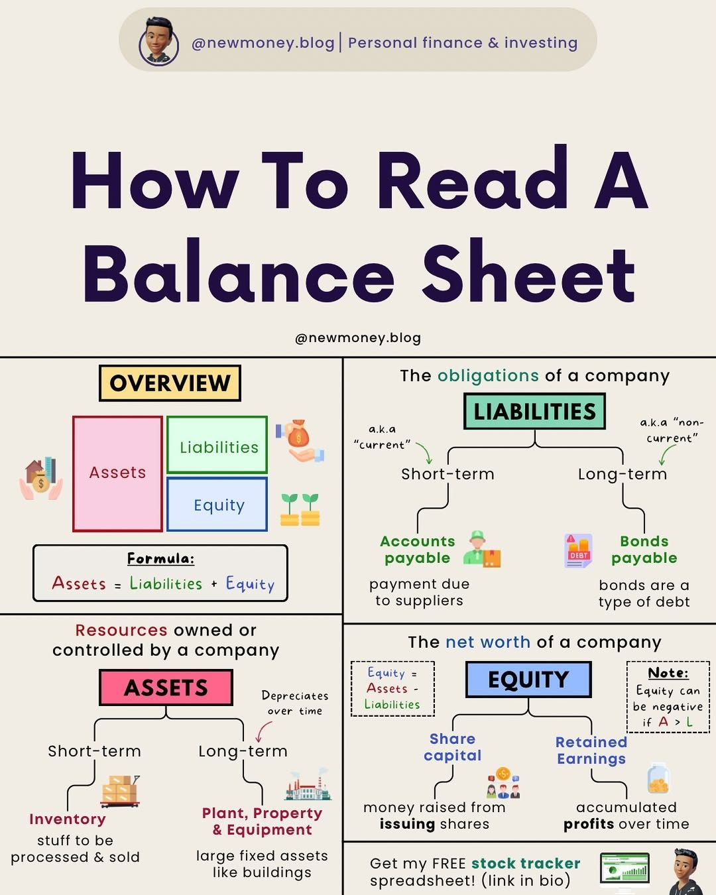

A balance sheet is a financial statement that provides a snapshot of a company's financial position at a specific point in time. It is a crucial tool for investors, analysts, and business owners to understand a company's assets, liabilities, equity, and net worth. This guide will walk you through the components of a balance sheet, explain how to read it, and provide key takeaways for making informed investment decisions.

#### Technical Content
A balance sheet consists of three main components: assets, liabilities, and equity. The relationship between these components can be represented by the following equation:
Assets = Liabilities + Equity

##### Assets
Assets are resources owned or controlled by a company that can be used to generate revenue. They are categorized into two types:

*   **Short-Term Assets**: These are assets that can be quickly converted into cash, usually within a year. Examples include:
    *   Cash: Money held in the company's bank accounts or petty cash.
    *   Accounts Receivable: Amounts owed to the company by its customers for goods or services sold on credit.
    *   Inventory: Goods or materials held for sale or in production.
*   **Long-Term Assets**: These are assets that take longer than a year to convert into cash. Examples include:
    *   Property, Plant, and Equipment (PPE): Tangible assets such as buildings, machinery, and vehicles.
    *   Investments: Long-term investments in other companies or securities.

##### Liabilities
Liabilities are debts or obligations that the company must pay or settle. They are also categorized into two types:

*   **Current Liabilities**: These are liabilities that need to be repaid within a year. Examples include:
    *   Accounts Payable: Amounts owed by the company to its suppliers for goods or services purchased on credit.
    *   Notes Payable: Short-term loans or debt obligations.
    *   Taxes Owed: Tax liabilities due to the government.
*   **Long-Term Liabilities**: These are liabilities that do not need to be repaid within a year. Examples include:
    *   Bonds: Long-term debt securities issued by the company.
    *   Loans: Long-term loans from banks or other financial institutions.

##### Equity
Equity represents the ownership interest in a company. It is calculated as the difference between total assets and total liabilities. The main components of equity are:

*   **Common Stock**: This represents the ownership interest in a company, typically represented by shares issued to investors.
    *   Number of Shares Issued and Outstanding: The total number of shares that have been issued to investors and are still held by them.
    *   Par Value per Share: The minimum price at which a share can be issued.

##### Net Worth
Net worth is the difference between total assets and total liabilities. It represents the company's financial health and its ability to meet its long-term obligations.

#### Key Takeaways and Best Practices

*   **Understand the Components**: To effectively read a balance sheet, it's crucial to understand each component and how they relate to each other.
*   **Analyze Trends**: Look for trends in the balance sheet over time to identify areas of improvement or concern.
*   **Compare with Industry Peers**: Comparing a company's balance sheet with its industry peers can provide insights into its relative financial health.
*   **Use Financial Ratios**: Utilize financial ratios such as the debt-to-equity ratio and current ratio to gain deeper insights into a company's financial position.

#### References
For a visual representation of how to read a balance sheet, refer to the infographic titled "How to Read a Balance Sheet." This graphic provides a simplified flowchart explaining the connection between assets, liabilities, equity, and net worth, along with examples of each component.
## Source

- Original Tweet: [https://twitter.com/i/web/status/1876232999081255133](https://twitter.com/i/web/status/1876232999081255133)
- Date: 2025-02-24 12:40:12

## Media

### Media 1

**Description:** The infographic, titled "How to Read a Balance Sheet," is designed for individuals seeking to understand balance sheets and their components. The title is prominently displayed at the top of the graphic in large blue text.

**Overview**

*   A simplified flowchart explains how assets, liabilities, equity, and net worth are connected.
*   Assets are broken down into short-term and long-term categories, with examples such as cash, accounts receivable, inventory, property, plant, and equipment (PPE), and investments.

**Assets**

*   **Short-Term**: Cash, accounts receivable, inventory
    *   Definition: Resources owned or controlled by a company that can be quickly converted into cash.
    *   Examples:
        *   Cash
        *   Accounts receivable
        *   Inventory
*   **Long-Term**: Property, plant, and equipment (PPE), investments

**Liabilities**

*   **Current Liabilities**
    *   Definition: Debts that need to be repaid within a year.
    *   Examples:
        *   Accounts payable
        *   Notes payable
        *   Taxes owed
*   **Long-Term Liabilities**
    *   Definition: Debts that are not due for repayment within a year.
    *   Examples:
        *   Bonds
        *   Loans

**Equity**

*   **Common Stock**
    *   Definition: Ownership interest in a company.
    *   Examples:
        *   Number of shares issued and outstanding
        *   Par value per share

**Net Worth**

*   Calculation: Total assets - total liabilities = net worth
*   Example: If a company has $100,000 in assets and $50,000 in liabilities, its net worth is $50,000.

**Key Takeaways**

*   The balance sheet provides a snapshot of a company's financial position at a specific point in time.
*   Understanding the components of a balance sheet can help investors make informed decisions about their investments.

*Last updated: 2025-02-24 12:40:12*