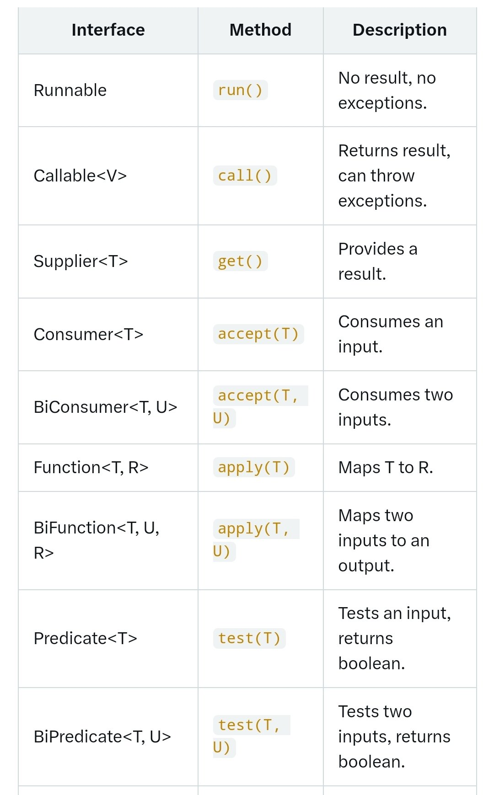

**Source:** [https://twitter.com/i/web/status/1870671151082713528](https://twitter.com/i/web/status/1870671151082713528)
**Original Post Date:** 2025-05-27 19:27:03

# Java Functional Interfaces Deep Dive: Comprehensive Reference Guide

## Introduction
Functional programming in Java has been revolutionized by the introduction of lambda expressions and streams. This reference guide provides a detailed examination of Java's core functional interfaces, which serve as the foundation for functional programming constructs. Understanding these interfaces is crucial for mastering modern Java applications, particularly when working with parallel processing, reactive programming, and stream operations.

## No Input/Output Interfaces

Runnable represents the simplest form of functional interface in Java, providing a single method run() without parameters or return values. It's commonly used for thread creation and asynchronous task execution.

```java
Runnable task = () -> System.out.println("Task executed");
Thread t = new Thread(task);
t.start();
```

> **Note/Tip:** Runnable doesn't support checked exceptions, which limits its use in scenarios requiring exception handling.

## Single Input/No Output Interfaces

Consumer family handles single input operations. Consumer<T> accepts a parameter and performs an action without returning a result. BiConsumer extends this to handle two inputs, useful for processing pairs of data.

```java
Consumer<String> printer = s -> System.out.println(s);
BiConsumer<Integer, Integer> adder = (a, b) -> System.out.println(a + b);
```

## Input/Output Transformations

Function and BiFunction interfaces are designed for data transformation. Function<T,R> maps a single input to an output, while BiFunction handles two inputs.

```java
Function<Integer, String> numberToString = n -> String.valueOf(n);
BiFunction<Double, Double, Double> multiply = (a, b) -> a * b;
```

## Conditional Processing

Predicate and BiPredicate interfaces evaluate conditions on inputs. They're fundamental for filtering operations in Java streams.

```java
Predicate<Integer> isEven = n -> n % 2 == 0;
BiPredicate<String, String> isEqualIgnoreCase = (s1, s2) -> s1.equalsIgnoreCase(s2);
```

## Key Takeaways

- Functional interfaces are the building blocks of Java's functional programming model
- Understanding input/output patterns helps in choosing the right interface for specific use cases
- Generics enable type-safe implementations across different data types
- Interface selection impacts exception handling and return value capabilities

## Conclusion
Mastering these functional interfaces is essential for effective Java development. Whether you're implementing reactive systems, parallel processing pipelines, or complex stream operations, these interfaces provide the necessary tools to write clean, maintainable, and performant code.

## External References

- [Java SE Documentation: Functional Interfaces](https://docs.oracle.com/javase/8/docs/api/java/util/function/package-summary.html)
- [Oracle Java Tutorial - Lambda Expressions](https://docs.oracle.com/javase/tutorial/java/javaOO/lambdaexpressions.html)


## Media

**Image Description:** The image is a table that provides a detailed comparison of various functional interfaces in Java, along with their methods and descriptions. These interfaces are commonly used in functional programming and are part of the `java.util.function` package. Below is a detailed breakdown of the table:

### **Structure of the Table**
The table is organized into four columns:
1. **Interface**: Lists the functional interface names.
2. **Method**: Specifies the method associated with each interface.
3. **Description**: Provides a brief explanation of the purpose and behavior of the method.

### **Rows in the Table**
Each row corresponds to a specific functional interface and its associated method. Here is a detailed description of each row:

#### **1. Runnable**
- **Interface**: `Runnable`
- **Method**: `run()`
- **Description**: 
  - No result is returned.
  - No exceptions are thrown.
  - Typically used for tasks that do not require a return value or exception handling.

#### **2. Callable**
- **Interface**: `Callable<V>`
- **Method**: `call()`
- **Description**: 
  - Returns a result of type `V`.
  - Can throw exceptions.
  - Similar to `Runnable`, but it can return a value and handle checked exceptions.

#### **3. Supplier**
- **Interface**: `Supplier<T>`
- **Method**: `get()`
- **Description**: 
  - Provides a result of type `T`.
  - No input is required.
  - Used for generating values or objects.

#### **4. Consumer**
- **Interface**: `Consumer<T>`
- **Method**: `accept(T)`
- **Description**: 
  - Consumes an input of type `T`.
  - No result is returned.
  - Used for performing operations on a single input.

#### **5. BiConsumer**
- **Interface**: `BiConsumer<T, U>`
- **Method**: `accept(T, U)`
- **Description**: 
  - Consumes two inputs of types `T` and `U`.
  - No result is returned.
  - Used for performing operations on two inputs.

#### **6. Function**
- **Interface**: `Function<T, R>`
- **Method**: `apply(T)`
- **Description**: 
  - Maps an input of type `T` to an output of type `R`.
  - Returns a result of type `R`.
  - Used for transforming one type to another.

#### **7. BiFunction**
- **Interface**: `BiFunction<T, U, R>`
- **Method**: `apply(T, U)`
- **Description**: 
  - Maps two inputs of types `T` and `U` to an output of type `R`.
  - Returns a result of type `R`.
  - Used for transforming two inputs into a single output.

#### **8. Predicate**
- **Interface**: `Predicate<T>`
- **Method**: `test(T)`
- **Description**: 
  - Tests an input of type `T`.
  - Returns a boolean result.
  - Used for filtering or testing conditions on a single input.

#### **9. BiPredicate**
- **Interface**: `BiPredicate<T, U>`
- **Method**: `test(T, U)`
- **Description**: 
  - Tests two inputs of types `T` and `U`.
  - Returns a boolean result.
  - Used for filtering or testing conditions on two inputs.

### **Key Observations**
1. **Generics**: Many interfaces use generics (e.g., `<T>`, `<T, U>`, `<T, R>`), allowing them to be used with various data types.
2. **Input and Output**: The interfaces are categorized based on whether they consume inputs, produce outputs, or both.
3. **Exception Handling**: Some interfaces (e.g., `Callable`) can throw exceptions, while others (e.g., `Runnable`) cannot.
4. **Single vs. Multiple Inputs**: Some interfaces operate on a single input (e.g., `Consumer`, `Predicate`), while others operate on multiple inputs (e.g., `BiConsumer`, `BiPredicate`).

### **Purpose**
This table serves as a reference for understanding the functional interfaces in Java, their methods, and their typical use cases. It is particularly useful for developers working with Java's functional programming capabilities, such as lambda expressions and method references.

### **Visual Layout**
- The table is neatly organized with clear headings and consistent formatting.
- Each row is separated by horizontal lines for better readability.
- The method names are highlighted in a distinct color (e.g., orange) to draw attention.

This structured presentation makes it easy to compare and understand the differences between the various functional interfaces.
