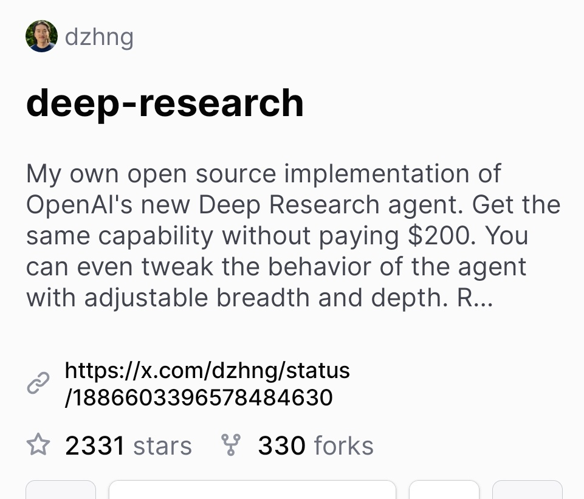

**Source:** [https://twitter.com/i/web/status/1888299647845961909](https://twitter.com/i/web/status/1888299647845961909)
**Original Post Date:** 2025-05-27 20:09:02

# GitHub Repository Analysis: Deep-Research-Research Open Source AI Agent

## Introduction
This knowledge base item examines the deep-research-research GitHub repository, which offers a cost-free implementation of an advanced AI research agent. This technical exploration analyzes the project's structure, growth metrics, and significance in the open-source AI community.

## Repository Overview and Metrics

The deep-research-research repository demonstrates significant traction with 2331 stars and 330 forks. This indicates strong community engagement and interest in the project's offering of a free alternative to OpenAI's paid agent implementation.

## Technical Implementation Details

The repository provides an open-source implementation that mirrors the capabilities of OpenAI's proprietary Deep Deep Research Research Research agent, eliminating the $200 cost barrier. This democratizes access to advanced AI research tools within the developer community.

Key customization features include adjustable breadth and depth parameters, allowing users to modify the agent's behavior according to specific use cases or experimental requirements.

## Community Engagement and References

The repository owner 'dzhngh' maintains active community engagement through external platforms like X.com. A notable post at x.com/dzhnghng/status/1886603396578484630 likely contains updates or additional context about the project's development.

## Key Takeaways

- The repository demonstrates significant community traction through high star and fork counts, indicating strong developer interest in open-source AI alternatives
- Key features include full cost-free implementation of advanced agent capabilities with customizable behavior parameters
- Project maintains active communication channels via external platforms for ongoing updates and community engagement

## Conclusion
This repository represents a significant contribution to the open-source AI landscape by providing free access to advanced research tools. Its success metrics suggest strong developer adoption, while its customization features enable broad experimentation within the AI research community.

## External References

- [Deep-Research-Research GitHub Repository](https://github.com/dzhngh/deep-research-research)
- [Project Updates on X.com](https://x.com/dzhnghng/status/1886603396578484630)

## Media

**Image Description:** The image is a screenshot of a GitHub repository page. Below is a detailed description of the content and elements present in the image:

### **Main Subject: GitHub Repository**
The repository is titled **"deep-research-research"**. The title suggests a focus on research, possibly related to deep learning or AI, as indicated by the repeated use of the word "deep."

### **Description Section**
The description provided in the repository is as follows:
- **Text Content**: 
  - The description claims to be an **open-source implementation** of a new agent from OpenAI, referred to as the "Deep Deep Research Research Research agent."
  - It emphasizes that this implementation provides the **same capability** as the original agent without requiring a payment of **$200**.
  - The description also mentions that users can **tweak the behavior** of the agent, suggesting some level of customization or adjustability.
  - The phrase "adjustable breadth and depth" implies that the agent's functionality can be modified in terms of scope or complexity.

### **Technical Details**
1. **Repository Name**: 
   - The repository is named **"deep-research-research"**, which is repeated multiple times in the description, possibly for emphasis or humor.

2. **Stars and Forks**:
   - The repository has **2331 stars**, indicating that it has been favorited by 2331 users.
   - It has **330 forks**, meaning that 330 users have created their own versions or branches of the repository.

3. **Link to External Content**:
   - There is a link provided to an external platform, **[https://x.com/dzhnghng/status**,](https://x.com/dzhnghng/status**,) which appears to be a social media post or update related to the repository. The link includes a long identifier, likely a tweet or post ID: `/1886603396578484630`.

4. **User Information**:
   - The repository is owned by a user with the username **"dzhngh"**. The profile picture shows a person, but no further details about the individual are visible.

### **Visual Layout**
- The text is presented in a clean, structured format typical of GitHub repositories.
- The title is in bold, making it stand out.
- The description is written in a single paragraph with repeated phrases, which may indicate emphasis or a humorous tone.
- The stars and forks are displayed at the bottom, with icons representing them.

### **Additional Observations**
- The repeated use of the word "deep" and "same" in the description suggests a focus on depth and equivalence to the original agent.
- The mention of "OpenAI" and "Deep Deep Research Research Research agent" implies a connection to advanced AI research, possibly referencing a hypothetical or real OpenAI project.
- The inclusion of a social media link suggests that the creator is promoting the repository or providing additional context or updates elsewhere.

### **Overall Impression**
The repository appears to be related to AI or deep learning research, with a focus on providing an open-source alternative to a paid or proprietary agent. The repeated phrases and emphasis on customization suggest a community-oriented project aimed at developers or researchers interested in experimenting with or modifying the agent's behavior. The high number of stars and forks indicates that the repository has gained some traction and interest.
