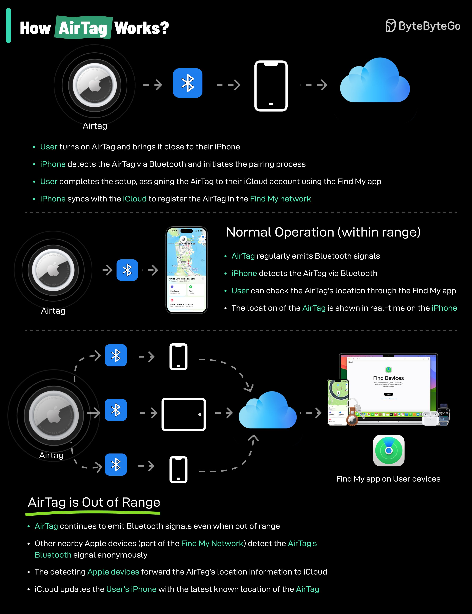

**Source:** [https://twitter.com/i/web/status/1879396854208847926](https://twitter.com/i/web/status/1879396854208847926)
**Original Post Date:** 2025-05-27 23:47:37

# AirTag Functionality: Technical Architecture of Apple's Location Tracking Device

## Introduction
The AirTag represents a sophisticated convergence of Bluetooth technology, cloud computing, and distributed network architecture. This document examines its technical implementation through four key phases: pairing setup, in-range operation, extended range functionality, and ecosystem integration.

## Pairing and Setup Architecture

The initialization process begins with physical proximity detection between the AirTag and iPhone via Bluetooth protocol. This initiates a secure pairing sequence where the device authenticates through the Find My app.

iCloud integration occurs during setup, registering the AirTag's unique identifier in Apple's distributed database. The registration process includes cryptographic verification to prevent unauthorized tracking.

- Bluetooth Low Energy (BLE) protocol for device discovery and pairing
- Secure encryption of device identifiers during iCloud registration
- Find My app authentication as the primary trust anchor

> **Note/Tip:** The pairing process includes a time-based security check to prevent unauthorized tracking

## In-Range Operation (Bluetooth Proximity)

Within Bluetooth range (~30 meters), the AirTag maintains direct communication with paired devices using periodic signal broadcasting. The iPhone decodes these signals for precise location triangulation.

Real-time updates are synchronized through the Find My app, enabling immediate tracking feedback to users.

```swift
// Simplified BLE scan setup
let peripheralManager = CBPeripheralManager()
peripheralManager.startAdvertising([CBAdvertisementDataLocalNameKey: "AirTag"])
```

## Out-of-Range Tracking via Find My Network

When beyond direct Bluetooth range, the AirTag leverages Apple's distributed Find My Network. Nearby Apple devices anonymously detect the tag's signal and relay location data to iCloud.

This creates a global positioning system where each device acts as both client and server in the network.

1. Device detects AirTag via BLE signal
1. Anonymized data is sent to Find My Network
1. iCloud processes location information
1. User receives updated position through Find My app

> **Note/Tip:** Devices must have Bluetooth enabled and be logged into iCloud to participate in the network

## Security and Privacy Architecture

The system implements multiple security layers: unique device identifiers, cryptographic verification, and proximity-based authorization.

Privacy is maintained through anonymous data handling in the Find My Network, preventing personal information exposure.

- Hardware-encrypted chip for secure identification
- Anonymous detection by network participants
- Automated tracking protection notifications

## Key Takeaways

- AirTag relies on a combination of Bluetooth LE and distributed cloud architecture for effective location tracking
- The Find My Network enables global positioning without compromising user privacy through anonymous detection
- Security is implemented at hardware, network, and application layers to prevent unauthorized use

## Conclusion
Understanding the technical architecture of AirTag reveals a sophisticated blend of local wireless communication and distributed cloud networking. This integration provides users with reliable tracking capabilities while maintaining security and privacy standards.

## External References

- [Apple's Find My Network Technical Documentation](https://developer.apple.com/documentation/corelocation/understanding-the-find-my-network)
- [Bluetooth Low Energy Protocol Specification](https://www.bluetooth.com/specifications/bluetooth-core-specification/)


## Media

**Image Description:** The image is an infographic explaining how the **AirTag**, a product by Apple, works. The infographic is divided into several sections, each detailing a specific aspect of the AirTag's functionality. Below is a detailed breakdown:

---

### **Main Title**
- The title at the top reads: **"How AirTag Works?"**
- The text is presented in a clean, modern font with a dark background, making it visually appealing and easy to read.

---

### **Section 1: Pairing and Setup**
- **Diagram:**
  - An **AirTag** icon is shown on the left.
  - A **Bluetooth** icon is connected to the AirTag.
  - An **iPhone** icon is connected to the Bluetooth icon.
  - An **iCloud** icon is connected to the iPhone icon.
  - Arrows indicate the flow of communication between these components.

- **Description:**
  - **User turns on the AirTag and brings it close to their iPhone.**
  - The **iPhone detects the AirTag via Bluetooth** and initiates the pairing process.
  - The **user completes the setup**, assigning the AirTag to their iCloud account using the **Find My app**.
  - The **iPhone syncs with iCloud** to register the AirTag in the **Find My network**.

---

### **Section 2: Normal Operation (Within Range)**
- **Diagram:**
  - An **AirTag** icon is shown on the left.
  - A **Bluetooth** icon is connected to the AirTag.
  - An **iPhone** icon is connected to the Bluetooth icon.
  - A map interface is shown on the iPhone, indicating the AirTag's location.

- **Description:**
  - **AirTag regularly emits Bluetooth signals.**
  - The **iPhone detects the AirTag via Bluetooth**.
  - The **user can check the AirTag's location** through the **Find My app**.
  - The **location of the AirTag is shown in real-time on the iPhone**.

---

### **Section 3: AirTag is Out of Range**
- **Diagram:**
  - An **AirTag** icon is shown on the left.
  - A **Bluetooth** icon is connected to the AirTag.
  - An **iPhone** icon is connected to the Bluetooth icon.
  - A **cloud (iCloud)** icon is connected to the iPhone.
  - A **Mac or other Apple device** is shown on the right, with the **Find My app** open, displaying the AirTag's location.

- **Description:**
  - **AirTag continues to emit Bluetooth signals even when out of range.**
  - **Other nearby Apple devices (part of the Find My Network)** detect the AirTag's Bluetooth signal **anonymously**.
  - These **Apple devices forward the AirTag's location information to iCloud**.
  - **iCloud updates the user's known location of the AirTag**.
  - The **user can view the AirTag's location on their iPhone or other Apple devices** using the **Find My app**.

---

### **Section 4: Additional Notes**
- The infographic emphasizes the **Find My app** as the primary tool for managing and tracking the AirTag.
- The **Find My Network** is highlighted as a key feature, leveraging other Apple devices to help locate the AirTag when it is out of range.

---

### **Design Elements**
- **Color Scheme:** The infographic uses a dark background with bright, contrasting colors (e.g., white, blue, green) for icons and text, ensuring readability.
- **Icons:** Clear, recognizable icons are used for AirTag, Bluetooth, iPhone, iCloud, and the Find My app.
- **Arrows:** Arrows are used to illustrate the flow of data and communication between components.
- **Text Formatting:** Key terms like **AirTag**, **Find My**, and **iCloud** are highlighted in bold or colored text for emphasis.

---

### **Overall Purpose**
The infographic provides a step-by-step explanation of how the AirTag works, from initial setup to real-time tracking and out-of-range detection. It emphasizes the integration of Bluetooth, the Find My app, and the Find My Network to ensure the AirTag can be tracked effectively.

---

This detailed breakdown covers the main subject and technical details presented in the image. Let me know if you need further clarification!
