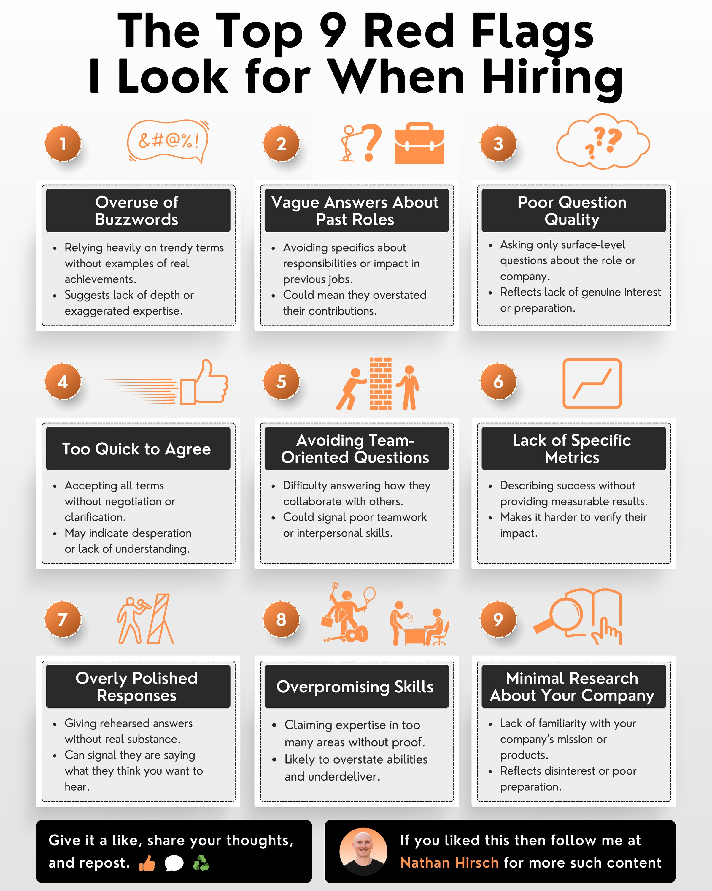

**Source:** [https://twitter.com/i/web/status/1869752150613508242](https://twitter.com/i/web/status/1869752150613508242)
**Original Post Date:** 2025-06-17 15:17:18

# Technical Hiring Red Flags: A Systematic Guide for Software Engineers

## Introduction
In software engineering, precise identification of red flags during the hiring process is crucial for building high-performing teams. This knowledge base item systematically analyzes nine key indicators that may signal unsuitable candidates, providing actionable insights for technical recruiters and interviewers.

## Overuse of Buzzwords

Candidates who rely heavily on trendy terms without concrete examples demonstrate a superficial understanding. This red flag suggests limited depth or inflated expertise claims.

- Look for specific project examples behind technical jargon
- Request measurable outcomes rather than buzzword usage

## Vague Past Role Descriptions

Candidates avoiding specifics about previous roles or impact may be overstating contributions. Clear, detailed explanations of past responsibilities are essential for technical validation.

> **Note/Tip:** Ask for specific metrics and outcomes from previous projects

## Poor Quality Questions

Surface-level questions about role or company indicate lack of preparation. Strong candidates typically ask deep, technical questions about architecture, team structure, or project challenges.

1. Technical architecture and scalability plans
1. Team composition and collaboration models
1. Current project challenges

## Overpromising Skills

Candidates claiming expertise in too many areas without concrete evidence are likely to overdeliver on promises but underdeliver in performance. Focus verification on specific skill domains.

```javascript
// Example of proper technical demonstration
function demonstrateSkill() {
  // Specific implementation
code
```

## Key Takeaways

- Prioritize candidates who provide concrete examples over those using buzzwords
- Technical questions should focus on problem-solving and system design
- Verify skills through specific project references rather than self-declaration

## Conclusion
Effective red flag identification in technical hiring requires systematic evaluation of candidate responses, demonstrated experience, and ability to handle real-world challenges. Implementing these checks ensures better quality hires and stronger engineering teams.


## Media

**Image Description:** ### Description of the Image

The image is an infographic titled **"The Top 9 Red Flags I Look for When Hiring"**. It is designed to highlight common warning signs or red flags that employers or recruiters should be aware of during the hiring process. The infographic is visually organized into nine sections, each representing a different red flag. The design uses a clean, structured layout with orange and black color accents, making it visually appealing and easy to read.

---

### **Main Subject and Structure**

The main subject of the image is the **nine red flags** that employers should look out for during the hiring process. Each red flag is numbered from 1 to 9 and is accompanied by:

1. **A Title**: A concise description of the red flag.
2. **An Icon**: A simple, orange-colored icon that visually represents the red flag.
3. **A Brief Explanation**: A short paragraph detailing the characteristics of the red flag and its implications.

---

### **Detailed Breakdown of Each Red Flag**

#### **1. Overuse of Buzzwords**
- **Icon**: An orange speech bubble with symbols like `&@@!`.
- **Description**: 
  - Relying heavily on trendy terms without providing examples of real achievements.
  - Suggests a lack of depth or exaggerated expertise.
  - Indicates a superficial understanding of the field.

#### **2. Vague Answers About Past Roles**
- **Icon**: An orange figure with a question mark and a briefcase.
- **Description**: 
  - Avoiding specifics about responsibilities or impact in previous jobs.
  - Could mean the candidate overstated their contributions.
  - Reflects a lack of clarity or honesty.

#### **3. Poor Quality Questions**
- **Icon**: An orange cloud with question marks.
- **Description**: 
  - Asking only surface-level questions about the role or company.
  - Reflects a lack of genuine interest or preparation.

#### **4. Too Quick to Agree**
- **Icon**: An orange thumbs-up icon.
- **Description**: 
  - Accepting all terms without negotiation or clarification.
  - May indicate desperation or a lack of understanding.

#### **5. Avoiding Team-Oriented Questions**
- **Icon**: An orange figure building a wall.
- **Description**: 
  - Difficulty answering how they collaborate with others.
  - Could signal poor teamwork or interpersonal skills.

#### **6. Lack of Specific Metrics**
- **Icon**: An orange graph icon.
- **Description**: 
  - Describing success without providing measurable results.
  - Makes it harder to verify their impact.

#### **7. Overly Polished Responses**
- **Icon**: An orange figure with a clipboard.
- **Description**: 
  - Giving rehearsed answers without real substance.
  - Signals that the candidate is saying what they think the interviewer wants to hear.

#### **8. Overpromising Skills**
- **Icon**: An orange figure holding a key.
- **Description**: 
  - Claiming expertise in too many areas without proof.
  - Likely to overstate abilities and underdeliver.

#### **9. Minimal Research About Your Company**
- **Icon**: An orange magnifying glass.
- **Description**: 
  - Lack of familiarity with the company’s mission or products.
  - Reflects disinterest or poor preparation.

---

### **Design Elements**

1. **Color Scheme**:
   - The primary colors are **black, white, and orange**.
   - The orange is used for icons, numbers, and accents, making the design vibrant and engaging.

2. **Icons**:
   - Each red flag is represented by a simple, orange icon that visually reinforces the concept.
   - For example, the "Overuse of Buzzwords" uses a speech bubble with symbols, while "Minimal Research About Your Company" uses a magnifying glass.

3. **Typography**:
   - The title is in a bold, black font, making it stand out.
   - The red flags are numbered in orange circles, and the titles are in bold black text.
   - The descriptions are in a smaller, black font, providing clarity without overwhelming the reader.

4. **Layout**:
   - The infographic is organized into a grid format with three columns and three rows.
   - Each red flag is contained within a black-bordered box, ensuring a clean and structured appearance.

5. **Footer**:
   - The bottom of the image includes a call-to-action section with social media icons and a profile picture of the author, **Nathan Hirsch**.
   - The text encourages viewers to like, share, and follow Nathan Hirsch for more content.

---

### **Overall Impression**

The infographic is well-organized, visually appealing, and informative. It effectively communicates the nine red flags in a concise and engaging manner, making it a useful resource for employers and recruiters. The use of icons and a clean layout enhances readability and ensures that the key points are easily digestible. The inclusion of a call-to-action at the bottom adds a personal touch and encourages further engagement with the content creator.
