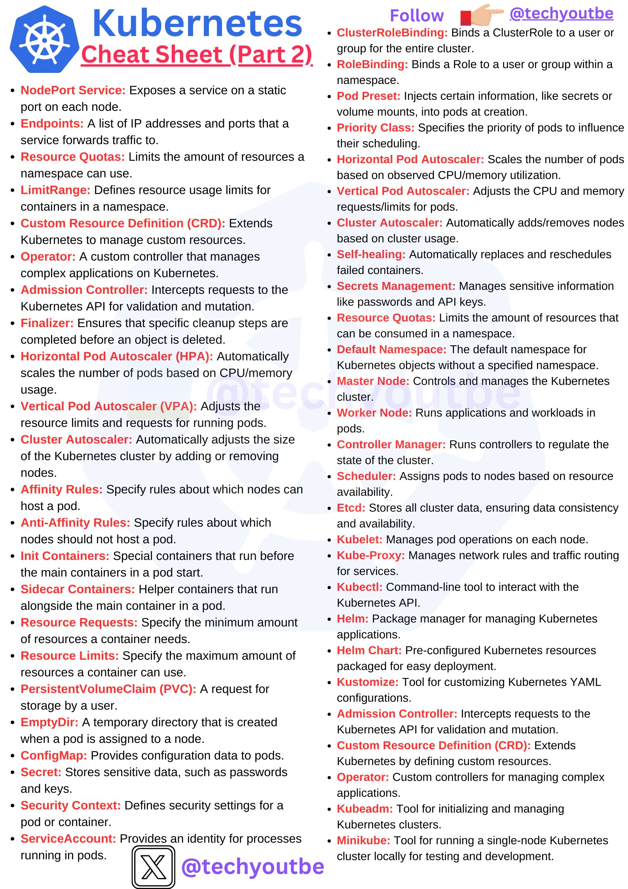

**Source:** [https://twitter.com/i/web/status/1878772132110287085](https://twitter.com/i/web/status/1878772132110287085)
**Original Post Date:** 2025-06-17 15:22:58

# Kubernetes Concepts and Tools Reference Guide: Part 2

## Introduction
This knowledge base article provides an advanced reference guide for Kubernetes concepts, components, and features covered in part two of the cheat sheet. It serves as a quick reference for experienced developers and administrators, focusing on practical aspects including service configurations, resource management, scaling mechanisms, storage solutions, and cluster management tools.

## Services and Network Configuration

Kubernetes services facilitate communication between pods. NodePort exposes a service on static ports across all nodes, while Endpoints define the actual IP addresses and ports used for traffic forwarding.

- NodePort Service: Exposes service via static port on each node
- Endpoints: List of IPs and ports for service traffic routing
- Service Affinity Rules: Define pod placement constraints

> **Note/Tip:** Choose NodePort when you need external access without additional load balancer configuration.

## Resource Management and Scaling

Kubernetes offers both horizontal and vertical scaling options. HPA automatically scales pod replicas based on resource metrics, while VPA adjusts individual container resources dynamically.

LimitRange and ResourceQuotas enforce namespace-level constraints to prevent overconsumption.

- HPA: Auto-scaling for pod replicas based on CPU/memory usage
- VPA: Dynamic adjustment of container resource limits/requests
- Cluster Autoscaler: Automatic node scaling

> **Note/Tip:** Monitor cluster autoscaling events to prevent unexpected costs.

## Storage and Configuration Management

PersistentVolumeClaims (PVCs) abstract storage requirements from the actual implementation. ConfigMaps and Secrets store non-sensitive and sensitive configuration data respectively.

Kustomize enables customization of YAML configurations without modifying base templates.

- PVC: Request for persistent storage resources
- ConfigMap: Store configuration parameters
- Secret: Securely store sensitive data

## Cluster Management and Tools

The Kubernetes control plane includes Master Nodes, etcd (data store), Scheduler, Controller Manager, and API Server. Worker nodes run kubelet for pod management.

Helm simplifies application deployment using Charts, while kubectl provides command-line access to the cluster.

- Master Node: Cluster control plane components
- Worker Node: Application execution environment
- Kubelet: Pod lifecycle manager
- Kubectl: Command-line interface

> **Note/Tip:** Regularly update cluster components and apply security patches.

## Key Takeaways

- Understand service types (NodePort, Endpoints) for network configuration
- Implement resource management using Quotas, LimitRange, and Autoscalers
- Leverage ConfigMaps and Secrets for safe configuration management
- Master cluster components and their roles in the control plane
- Utilize Helm and kubectl effectively for application deployment

## Conclusion
This reference guide provides essential knowledge about Kubernetes services, resource management, scaling, storage solutions, and administrative tools. Understanding these concepts is crucial for effective cluster operation and maintenance.

## External References

- [Official Kubernetes Documentation](https://kubernetes.io/docs/)
- [Helm Official Website](https://helm.sh/)

## Media

**Image Description:** The image is a **Kubernetes Cheat Sheet (Part 2)**, which serves as a comprehensive reference guide for Kubernetes concepts, components, and features. The cheat sheet is organized into two columns, with each section providing a concise definition or explanation of a specific Kubernetes term or resource. Below is a detailed breakdown of the image:

---

### **Header**
- **Title**: "Kubernetes Cheat Sheet (Part 2)" is prominently displayed at the top in bold blue and red text.
- **Logo**: The Kubernetes logo (a blue shield with a white ship's wheel) is positioned in the top-left corner.
- **Social Media Handle**: The handle `@techyoutubeb` is mentioned in the top-right corner, along with a "Follow" prompt and an icon of a hand pointing to the handle.

---

### **Left Column**
This column covers a variety of Kubernetes concepts, primarily focusing on services, resource management, and scaling mechanisms.

#### **Services**
- **NodePort Service**: Exposes a service on a static port on each node.
- **Endpoints**: A list of IP addresses and ports that a service forwards traffic to.
- **Resource Quotas**: Limits the amount of resources a namespace can use.
- **LimitRange**: Defines resource usage limits for containers in a namespace.
- **Custom Resource Definition (CRD)**: Extends Kubernetes to manage custom resources.
- **Operator**: A custom controller that manages complex applications on Kubernetes.
- **Finalizer**: Ensures that specific cleanup steps are completed before an object is deleted.
- **Horizontal Pod Autoscaler (HPA)**: Automatically scales the number of pods based on CPU/memory usage.
- **Vertical Pod Autoscaler (VPA)**: Adjusts the resource limits and requests for pods.
- **Cluster Autoscaler**: Automatically adds/removes nodes based on cluster usage.
- **Affinity Rules**: Specify rules about which nodes can host a pod.
- **Anti-Affinity Rules**: Specify rules about which nodes should not host a pod.
- **Init Containers**: Special containers that run before the main container in a pod starts.
- **Sidecar Containers**: Helper containers that run alongside the main container in a pod.

#### **Storage and Configuration**
- **PersistentVolumeClaim (PVC)**: A request for storage by a user.
- **EmptyDir**: A temporary directory created when a pod is assigned to a node.
- **ConfigMap**: Provides configuration data to pods.
- **Kustomize**: Tool for customizing Kubernetes YAML configurations.
- **Admission Controller**: Intercepts requests to the Kubernetes API for validation and mutation.
- **Custom Resource Definition (CRD)**: Extends Kubernetes by defining custom resources.
- **Secret**: Stores sensitive data, such as passwords and keys.
- **Security Context**: Defines security settings for a pod or container.
- **ServiceAccount**: Provides an identity for processes running in pods.

---

### **Right Column**
This column focuses on roles, scaling, scheduling, and cluster management.

#### **Roles and Permissions**
- **ClusterRoleBinding**: Binds a ClusterRole to a user or group for the entire cluster.
- **RoleBinding**: Binds a Role to a user or group within a namespace.
- **Pod Preset**: Injects certain information, like secrets or volume mounts, into pods at creation.
- **Priority Class**: Specifies the priority of pods to influence their scheduling.
- **Horizontal Pod Autoscaler**: Scales the number of pods based on observed CPU/memory utilization.
- **Vertical Pod Autoscaler**: Adjusts the CPU and memory requests/limits for pods.
- **Self-Healing**: Automatically replaces and reschedules failed containers.

#### **Cluster Management**
- **Master Node**: Controls and manages the Kubernetes cluster.
- **Worker Node**: Runs applications and workloads in pods.
- **Controller Manager**: Runs controllers to regulate the state of the cluster.
- **Scheduler**: Assigns pods to nodes based on resource availability.
- **Ectd**: Stores all cluster data, ensuring data consistency and availability.
- **Kubelet**: Manages pod operations on each node.
- **Kube-Proxy**: Manages network rules and traffic routing for services.
- **Kubectl**: Command-line tool to interact with the Kubernetes API.
- **Helm**: Package manager for managing Kubernetes applications.
- **Helm Chart**: Pre-configured Kubernetes resources packaged for easy deployment.
- **Kubeadm**: Tool for initializing and managing Kubernetes clusters.
- **Minikube**: Tool for running a single-node Kubernetes cluster locally for testing and development.

---

### **Design and Layout**
- **Color Coding**: 
  - **Red Text**: Used for section headers or key terms.
  - **Black Text**: Used for definitions and explanations.
- **Icons and Logos**: The Kubernetes logo and social media icons are present.
- **Social Media Handles**: The handle `@techyoutubeb` is repeated at the bottom and top-right corner.
- **Consistent Formatting**: Each term is listed with a bullet point, followed by a brief explanation.

---

### **Purpose**
This cheat sheet is designed to serve as a quick reference guide for Kubernetes users, developers, and administrators. It covers a wide range of topics, from basic services and storage to advanced scaling and cluster management features. The structured layout and concise definitions make it easy to navigate and use as a reference.

---

### **Key Takeaways**
1. **Services and Networking**: Focuses on NodePort, Endpoints, and Affinity/Anti-Affinity rules.
2. **Resource Management**: Covers Quotas, LimitRange, and Autoscalers (HPA, VPA).
3. **Customization and Extensibility**: Highlights CRDs, Operators, and Kustomize.
4. **Cluster Management**: Includes Master/Worker nodes, Scheduler, and Cluster Autoscaler.
5. **Security and Configuration**: Discusses Secrets, Security Contexts, and ServiceAccounts.
6. **Tools and CLI**: Mentions Kubectl, Helm, and Minikube.

This cheat sheet is a valuable resource for anyone working with Kubernetes, providing a concise overview of its core concepts and tools.
