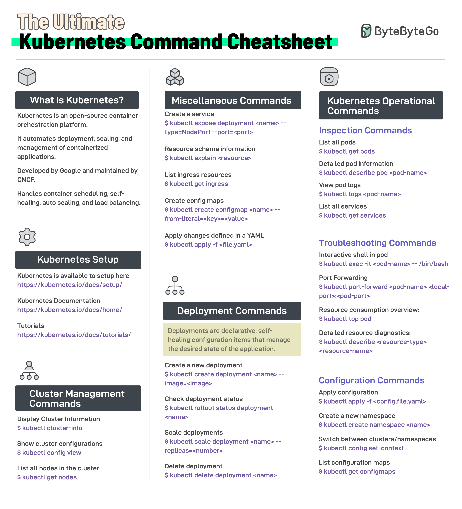

**Source:** [https://twitter.com/i/web/status/1869424532727157012](https://twitter.com/i/web/status/1869424532727157012)
**Original Post Date:** 2025-05-28 05:18:20

# Kubernetes Command Cheatsheet: Essential CLI Commands for Cluster Management and Operations

## Introduction
This cheatsheet provides a structured collection of critical Kubernetes (k8s) commands across various operational domains. Whether you're managing clusters, deploying applications, or performing maintenance tasks, these CLI commands form the foundation of effective k8s operations. This guide covers everything from basic setup to advanced troubleshooting scenarios.

## What is Kubernetes?

Kubernetes (k8s) is an open-source container orchestration platform developed by Google and maintained by the Cloud Native Computing Foundation (CNCF). It automates deployment, scaling, and management of containerized applications, providing a robust framework for modern cloud-native architectures.

## Cluster Management Commands

Essential commands for inspecting and managing Kubernetes clusters

```shell
$ kubectl cluster-info
$ kubectl get nodes
$ kubectl config view
```

- View cluster status and endpoints with 'cluster-info'
- List all nodes in the cluster using 'get nodes'
- Examine configuration details with 'config view'

## Deployment Commands

Core commands for managing application deployments in Kubernetes

```shell
$ kubectl create deployment <name> --image=<image>
$ kubectl rollout status deployment <name>
$ kubectl scale deployment <name> --replicas=3
$ kubectl delete deployment <name>
```

> **Note/Tip:** Use 'rollout history' to track deployment revisions

> **Note/Tip:** Scale deployments incrementally for zero-downtime updates

## Operational Commands

Commands for inspection, troubleshooting, and resource management

```shell
$ kubectl logs <pod-name>
$ kubectl port-forward <pod-name> 8080:80
$ kubectl exec -it <pod-name> -- /bin/bash
```

1. Inspection: $ kubectl get pods, services, deployments
1. Troubleshooting: $ kubectl describe pod <pod-name>
1. Resource Management: $ kubectl top node, pod

- Port forwarding for service debugging
- Pod exec for interactive shell access
- ConfigMap and Secret management commands

## Setup and Configuration

Resources for setting up Kubernetes environments and managing configurations

- Official setup documentation: kubernetes.io/docs/setup/
- Tutorials and quickstart guides available at kubernetes.io/tutorials/

> **Note/Tip:** Always start with official Kubernetes documentation for version-specific guidance

## Key Takeaways

- Master core cluster inspection commands to diagnose issues quickly
- Use YAML-based resource management with 'kubectl apply' for declarative operations
- Understand the difference between imperative and declarative command approaches

## Conclusion
This cheatsheet provides a solid foundation for working with Kubernetes. Regular practice with these commands builds muscle memory essential for efficient cluster management and application deployment. Remember to consult official documentation for version-specific details and advanced use cases.

## External References

- [Official Kubernetes Setup Guide](https://kubernetes.io/docs/setup/)
- [Kubernetes Documentation](https://kubernetes.io/docs/home/)
- [Kubernetes Tutorials](https://kubernetes.io/docs/tutorials/)


## Media

**Image Description:** ### Description of the Image

The image is a comprehensive **Kubernetes Command Cheatsheet** titled **"The Ultimate Kubernetes Command Command Command Cheatsheet"**. It is designed to serve as a quick reference guide for Kubernetes commands, covering various aspects of Kubernetes operations, management, and troubleshooting. The content is organized into several sections, each focusing on a specific category of commands. Below is a detailed breakdown of the image:

---

### **Header**
- **Title**: "The Ultimate Kubernetes Command Command Command Cheatsheet"
- **Logo**: On the top right, there is a logo with the text "ByteByteByteGo," which appears to be the source or creator of the cheatsheet.
- **Background**: The background is white, with a clean and organized layout.

---

### **Main Sections**
The cheatsheet is divided into several sections, each with a distinct heading and corresponding commands. Below is a detailed description of each section:

#### **1. What is Kubernetes?**
- **Description**: This section provides a brief overview of Kubernetes.
  - Kubernetes is an open-source container orchestration platform.
  - It automates deployment, scaling, and management of containerized applications.
  - Developed by Google and maintained by the CNCF (Cloud Native Computing Foundation).
- **Purpose**: This section serves as an introduction for those unfamiliar with Kubernetes.

#### **2. Kubernetes Setup**
- **Description**: This section provides links and instructions for setting up Kubernetes.
  - **Setup Link**: [[https://kubernetes.io/docs/setup/](https://kubernetes.io/docs/setup/)](https://kubernetes.io/docs/setup/](https://kubernetes.io/docs/setup/))
  - **Documentation Link**: [[https://kubernetes.io/docs/home/](https://kubernetes.io/docs/home/)](https://kubernetes.io/docs/home/](https://kubernetes.io/docs/home/))
  - **Tutorials Link**: [[https://kubernetes.io/docs/tutorials/](https://kubernetes.io/docs/tutorials/)](https://kubernetes.io/docs/tutorials/](https://kubernetes.io/docs/tutorials/))
- **Purpose**: Guides users to official Kubernetes resources for setup and learning.

#### **3. Cluster Management Commands**
- **Description**: This section focuses on commands related to managing Kubernetes clusters.
  - **Display Cluster Information**: `$ kubectl cluster-info`
  - **List Nodes in the Cluster**: `$ kubectl get nodes`
  - **Show Cluster Configurations**: `$ kubectl config view`
- **Purpose**: Helps in managing and inspecting the cluster setup.

#### **4. Miscellaneous Commands**
- **Description**: This section includes a variety of commands for different tasks.
  - **Create a Service**: `$ kubectl expose deployment <name> --type=NodePort --port=<port>`
  - **Resource Schema Information**: `$ kubectl explain <resource>`
  - **List Ingress Resources**: `$ kubectl get ingress`
  - **Create Config Maps**: `$ kubectl create configmap <name> --from-literal=<key>=<value>`
  - **Apply Changes from YAML**: `$ kubectl apply -f <file.yaml>`
- **Purpose**: Provides commands for creating and managing various Kubernetes resources.

#### **5. Deployment Commands**
- **Description**: This section focuses on commands related to Kubernetes deployments.
  - **Create a New Deployment**: `$ kubectl create deployment <name> --image=<image>`
  - **Check Deployment Status**: `$ kubectl rollout status deployment <name>`
  - **Scale Deployments**: `$ kubectl scale deployment <name> --replicas=<number>`
  - **Delete Deployments**: `$ kubectl delete deployment <name>`
- **Purpose**: Helps in managing and scaling deployments.

#### **6. Kubernetes Operational Commands**
- **Subsection: Inspection Commands**
  - **List All Pods**: `$ kubectl get pods`
  - **Detailed Pod Information**: `$ kubectl describe pod <pod-name>`
  - **View Pod Logs**: `$ kubectl logs <pod-name>`
  - **List All Services**: `$ kubectl get services`
- **Subsection: Troubleshooting Commands**
  - **Interactive Shell in Pod**: `$ kubectl exec -it <pod-name> -- /bin/bash`
  - **Port Forwarding**: `$ kubectl port-forward <pod-name> <local-port>:<pod-port>`
  - **Resource Consumption Overview**: `$ kubectl top pod`
  - **Detailed Resource Diagnostics**: `$ kubectl describe <resource-type> <resource-name>`
- **Subsection: Configuration Commands**
  - **Apply Configuration**: `$ kubectl apply -f <config.file.yaml>`
  - **Create a New Namespace**: `$ kubectl create namespace <name>`
  - **Switch Between Namespaces**: `$ kubectl config set-context`
  - **List Config Maps**: `$ kubectl get configmaps`
- **Purpose**: Provides commands for inspecting, troubleshooting, and configuring Kubernetes resources.

---

### **Visual Elements**
- **Icons**: Each section is accompanied by an icon to visually represent the category:
  - **What is Kubernetes?**: A cube icon.
  - **Kubernetes Setup**: A gear icon.
  - **Cluster Management**: A cluster icon.
  - **Miscellaneous Commands**: A stack of cubes.
  - **Deployment Commands**: A tree-like structure.
  - **Kubernetes Operational Commands**: A camera icon.
- **Color Coding**: 
  - Headings are in black with a white background.
  - Subheadings are in purple.
  - Command examples are in purple, making them stand out.
- **Layout**: The content is organized into three columns, making it easy to scan and reference.

---

### **Overall Purpose**
The cheatsheet is a concise and structured guide for Kubernetes users, providing a wide range of commands for various tasks, from setup and management to deployment and troubleshooting. It is designed to be a quick reference for both beginners and experienced users.

---

### **Key Technical Details**
- **Kubectl**: All commands use the `kubectl` CLI tool, which is the primary command-line interface for interacting with Kubernetes.
- **Resource Types**: The cheatsheet covers various Kubernetes resources, including pods, services, deployments, config maps, and namespaces.
- **Command Syntax**: Each command is presented with placeholders for variables (e.g., `<name>`, `<image>`, `<pod-name>`), making it easy to adapt to specific use cases.

This cheatsheet is a valuable resource for anyone working with Kubernetes, offering a comprehensive list of commands for efficient cluster management and application deployment.
