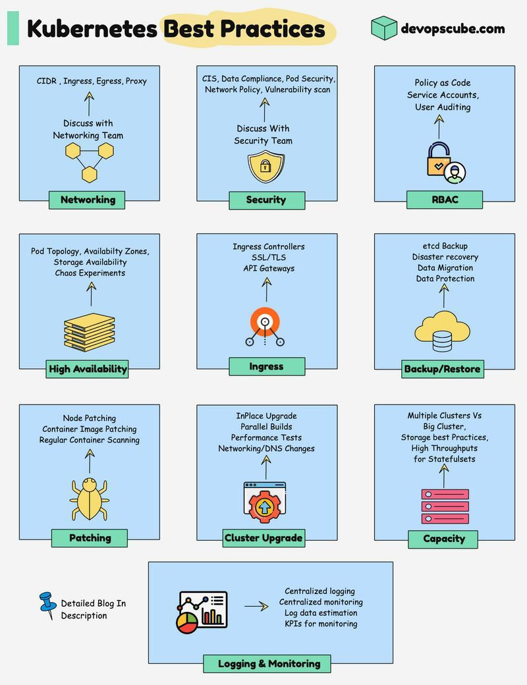

**Source:** [https://twitter.com/i/web/status/1911630646629261817](https://twitter.com/i/web/status/1911630646629261817)
**Original Post Date:** 2025-05-28 04:58:55

# Kubernetes Cluster Design Best Practices: A Comprehensive Guide

## Introduction
Designing a production-ready Kubernetes cluster requires careful consideration of multiple architectural and operational aspects. This guide outlines critical best practices across essential areas such as network configuration, security controls, availability strategies, and monitoring systems. By following these recommendations, teams can ensure their clusters are resilient, efficient, and aligned with modern cloud-native architecture principles.

## Network Architecture

Implement proper network segmentation using CIDR blocks for each namespace to prevent unauthorized access between workloads. Configure ingress controllers like NGINX or Traefik to manage external traffic effectively.

Utilize Kubernetes Network Policies to restrict pod-to-pod communication and implement firewall rules at the service level.

- Define separate CIDR blocks for different namespaces
- Configure ingress controllers with SSL/TLS termination
- Implement network policies based on workloads

> **Note/Tip:** Always discuss networking requirements with your infrastructure team before cluster deployment.

## Security Framework

Apply CIS Kubernetes Benchmark standards to ensure baseline security. Implement Pod Security Policies (PSP) or Pod Security Standards to enforce secure container configurations.

Regularly perform vulnerability scans using tools like Trivy and conduct compliance audits for data protection regulations.

```yaml
apiVersion: policy/v1beta1
kind: PodSecurityPolicy
metadata:
  name: baseline
spec:
  privileged: false
  seLinux:
    rule: RunAsAny
  runAsUser:
    rule: MustRunAsNonRoot
```

1. Apply security patches to all cluster components
1. Enable audit logging for all API server requests
1. Use role-based access control (RBAC) for user permissions

## High Availability Strategy

Distribute worker nodes across multiple availability zones to ensure fault tolerance. Implement pod anti-affinity rules to prevent co-location of critical workloads.

Configure etcd cluster with odd number of members (3 or 5) for quorum and use external volume storage like AWS EBS for persistent data.

```yaml
apiVersion: apps/v1
kind: Deployment
spec:
  replicas: 3
  template:
    spec:
      affinity:
        podAntiAffinity:
          requiredDuringSchedulingIgnoredDuringExecution:
```

## Monitoring and Logging

Implement a centralized logging solution like the ELK stack or Loki for comprehensive log aggregation.

Set up Prometheus with Grafana dashboards to monitor key metrics such as CPU usage, memory consumption, and network traffic.

- Monitor etcd health and node status
- Track cluster resource utilization trends
- Set up alerting for critical system events

## Key Takeaways

- Design clusters with network isolation and security as foundational principles
- Implement proper RBAC and least-privilege access control
- Ensure high availability through multi-zone deployments and anti-affinity rules
- Set up comprehensive monitoring and logging systems

## Conclusion
A well-designed Kubernetes cluster requires careful consideration of networking, security, availability, and operational aspects. By following these best practices, organizations can build robust, scalable, and secure cloud-native applications while maintaining high levels of performance and reliability.

## External References

- [DevOps Cube Kubernetes Best Practices](https://devopscube.com/kubernetes-best-practices/)
- [Kubernetes Security Hardening Guide](https://kubernetes.io/docs/concepts/security/hardening/)


## Media

**Image Description:** The image is a comprehensive infographic titled **"Kubernetes Best Practices"**, which outlines key areas and best practices for managing Kubernetes clusters effectively. The infographic is organized into multiple sections, each focusing on a specific aspect of Kubernetes operations. Below is a detailed breakdown of the image:

### **Header**
- **Title**: "Kubernetes Best Practices"
- **Source**: The infographic is attributed to **devopscube.com**, as indicated in the top-right corner.
- **Design**: The title is styled with a gradient yellow background, and the overall layout is clean and visually organized.

### **Main Sections**
The infographic is divided into 11 main sections, each represented by a blue box with a green label at the bottom. Each section includes a brief description, relevant icons, and some technical details. Below is a detailed description of each section:

#### 1. **Networking**
   - **Label**: Networking
   - **Content**:
     - Key concepts: CIDR, Ingress, Egress, Proxy
     - **Action**: "Discuss with Networking Team"
     - **Icons**: Hexagonal shapes representing network topology.
   - **Focus**: Managing network configurations and ensuring proper communication between pods and services.

#### 2. **Security**
   - **Label**: Security
   - **Content**:
     - Key concepts: CIS, Data Compliance, Pod Security, Network Policy, Vulnerability scan
     - **Action**: "Discuss With Security Team"
     - **Icons**: Shield and lock symbols representing security measures.
   - **Focus**: Implementing security policies, compliance checks, and vulnerability assessments.

#### 3. **RBAC (Role-Based Access Control)**
   - **Label**: RBAC
   - **Content**:
     - Key concepts: Policy as Code, Service Accounts, User Auditing
     - **Icons**: User and lock symbols representing access control and auditing.
   - **Focus**: Managing user permissions and ensuring secure access to Kubernetes resources.

#### 4. **High Availability**
   - **Label**: High Availability
   - **Content**:
     - Key concepts: Pod Topology, Availability Zones, Storage Availability, Chaos Experiments
     - **Icons**: Stacks of books representing storage and availability.
   - **Focus**: Ensuring high availability through proper pod placement, availability zones, and chaos testing.

#### 5. **Ingress**
   - **Label**: Ingress
   - **Content**:
     - Key concepts: Ingress Controllers, SSL/TLS, API Gateways
     - **Icons**: Circular diagram representing ingress controllers and routing.
   - **Focus**: Configuring ingress controllers for external traffic management and secure communication.

#### 6. **Backup/Restore**
   - **Label**: Backup/Restore
   - **Content**:
     - Key concepts: etcd Backup, Disaster Recovery, Data Migration, Data Protection
     - **Icons**: Cloud and database symbols representing backup and restore processes.
   - **Focus**: Implementing backup strategies and ensuring data recovery in case of failures.

#### 7. **Patching**
   - **Label**: Patching
   - **Content**:
     - Key concepts: Node Patching, Container Image Patching, Regular Container Scanning
     - **Icons**: Bug symbol representing patching and security updates.
   - **Focus**: Regularly updating nodes and container images to address security vulnerabilities.

#### 8. **Cluster Upgrade**
   - **Label**: Cluster Upgrade
   - **Content**:
     - Key concepts: In-Place Upgrade, Parallel Builds, Networking/DNS Changes
     - **Icons**: Gear symbol representing upgrades and maintenance.
   - **Focus**: Performing in-place upgrades of Kubernetes clusters while ensuring minimal downtime.

#### 9. **Capacity**
   - **Label**: Capacity
   - **Content**:
     - Key concepts: Multiple Clusters vs Big Cluster, Storage for Statefulsets
     - **Icons**: Stacked boxes representing cluster capacity and storage.
   - **Focus**: Managing cluster capacity, deciding between multiple smaller clusters or a single large cluster, and ensuring adequate storage for stateful applications.

#### 10. **Logging & Monitoring**
   - **Label**: Logging & Monitoring
   - **Content**:
     - Key concepts: Centralized logging, Monitoring, KPIs for monitoring
     - **Icons**: Graphs and charts representing monitoring and logging.
   - **Focus**: Implementing centralized logging and monitoring solutions to track cluster performance and health.

#### 11. **Detailed Blog**
   - **Label**: Detailed Blog
   - **Content**:
     - Key concepts: In-depth descriptions and best practices.
     - **Icons**: Pushpin and graph symbols representing detailed documentation and analysis.
   - **Focus**: Providing comprehensive documentation and best practices for Kubernetes management.

### **Design Elements**
- **Color Scheme**: The infographic uses a clean color palette with blue boxes, green labels, and yellow accents for titles and icons.
- **Icons**: Simple, intuitive icons are used to represent each section's focus (e.g., shield for security, bug for patching, cloud for backup).
- **Arrows and Flow**: Arrows are used to indicate actions or processes, such as "Discuss with Networking Team" or "Centralized logging."

### **Overall Structure**
The infographic is structured in a grid format, making it easy to navigate and understand. Each section is self-contained but collectively provides a holistic view of Kubernetes best practices. The use of icons and concise descriptions ensures that the information is accessible and visually engaging.

### **Purpose**
The infographic serves as a quick reference guide for Kubernetes administrators and DevOps engineers, highlighting critical areas to focus on for efficient and secure cluster management. It emphasizes collaboration with relevant teams (e.g., Networking, Security) and the importance of proactive measures like monitoring, patching, and backup strategies. 

This visual summary is ideal for both beginners and experienced users looking to optimize their Kubernetes deployments.
