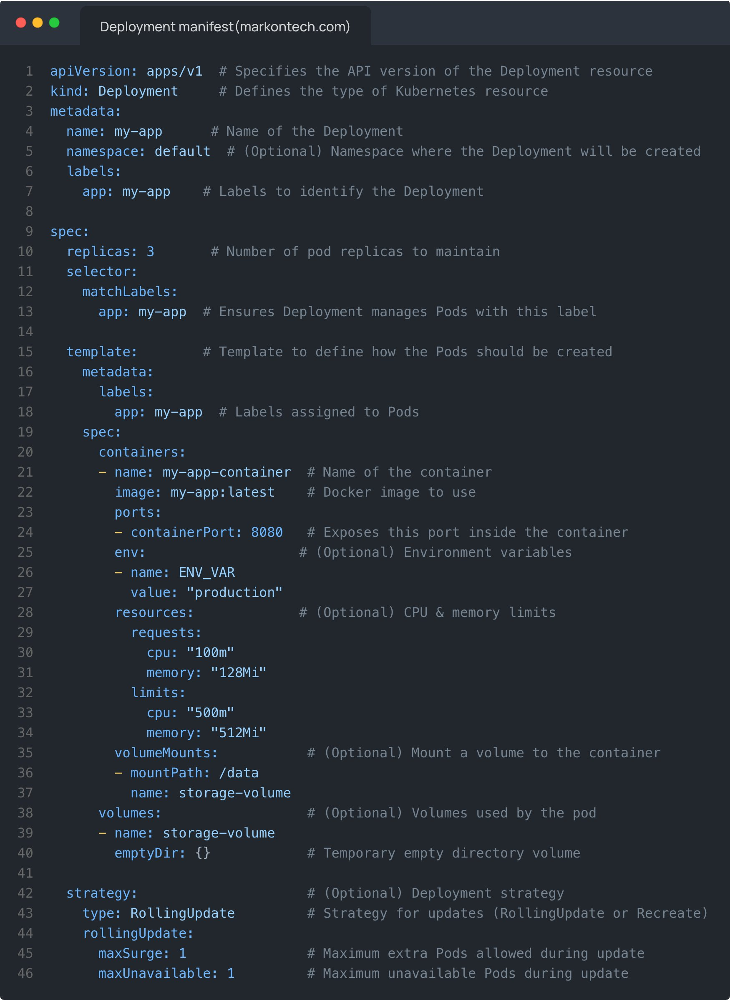

**Source:** [https://twitter.com/i/web/status/1888703569395654704](https://twitter.com/i/web/status/1888703569395654704)
**Original Post Date:** 2025-05-27 17:23:49

# Kubernetes Deployment Manifest Deep Dive: Architecture & Implementation

## Introduction
Kubernetes deployments are fundamental for managing containerized applications in production environments. This knowledge base item explores the intricate details of a Deployment manifest, focusing on its architectural components, configuration patterns, and operational considerations. We'll examine how Deployments ensure application reliability, scalability, and continuous availability through proper resource management and update strategies.

## Understanding Core Manifest Structure

The Kubernetes Deployment manifest follows a strict YAML structure with essential sections: apiVersion, kind, metadata, spec, and strategy. This standardized format ensures consistent deployment configuration across different environments.

Each section serves a specific purpose - from defining the API version (apps/v1) to specifying resource management parameters like replicas and container configurations.

```yaml
apiVersion: apps/v1
kind: Deployment
metadata:
  name: my-app
spec:
  replicas: 3
```

## Resource Management & Scaling Strategies

Deployments use the spec section to define resource requirements and scaling policies. The example manifest specifies three replicas, ensuring high availability through multiple pod instances.

The rolling update strategy with maxSurge: 1 and maxUnavailable: 1 enables safe application updates while maintaining service continuity.

```yaml
spec:
  replicas: 3
  strategy:
    type: RollingUpdate
    rollingUpdate:
      maxSurge: 1
      maxUnavailable: 1
```

## Container Configuration & Resource Constraints

The container specification includes essential runtime parameters such as image references, port mappings, environment variables, and resource limits.

Resource requests (100m CPU, 128Mi memory) ensure baseline availability while limits (500m CPU, 512Mi memory) prevent resource exhaustion.

```yaml
containers:
- name: my-app-container
  image: my-app:latest
  resources:
    requests:
      cpu: 100m
      memory: 128Mi
    limits:
      cpu: 500m
      memory: 512Mi
```

## Storage & Volume Management

The manifest demonstrates temporary storage using emptyDir volumes, suitable for session data or runtime files.

VolumeMounts at /data provide consistent access to the container's persistent storage requirements.

```yaml
volumes:
- name: storage-volume
  emptyDir: {}
volumeMounts:
- mountPath: /data
  name: storage-volume
```

## Key Takeaways

- Deployments use rolling updates to minimize downtime during application changes
- Resource limits prevent container resource exhaustion in shared clusters
- Structured YAML configuration ensures consistent deployment behavior across environments

## Conclusion
This Deployment manifest exemplifies best practices for Kubernetes application management. Understanding its structure, from basic configuration to advanced scaling strategies, enables engineers to deploy reliable and scalable applications while maintaining operational efficiency.

## External References

- [Kubernetes Documentation: Deployments](https://kubernetes.io/docs/concepts/workloads/controllers/deployment/)
- [Container Resource Management Best Practices](https://kubernetes.io/docs/tasks/configure-pod-container/assign-memory-resource/)


## Media

**Image Description:** The image shows a YAML configuration file for a Kubernetes Deployment manifest. This manifest defines how a Deployment resource is created, managed, and scaled in a Kubernetes cluster. Below is a detailed breakdown of the content:

### **Header**
- **File Name**: The file is named `Deployment manifest (markontech.com)`, indicating it is a Kubernetes Deployment configuration file.
- **Editor**: The code is displayed in a code editor with a dark theme, likely VSCode or a similar editor.

### **Main Structure**
The YAML file is structured into several key sections: `apiVersion`, `kind`, `metadata`, `spec`, and others. Each section serves a specific purpose in defining the Deployment.

#### **1. `apiVersion`**
- **Value**: `apps/v1`
- **Purpose**: Specifies the API version of the Kubernetes resource being defined. In this case, it is `apps/v1`, which is the version for Deployments.

#### **2. `kind`**
- **Value**: `Deployment`
- **Purpose**: Defines the type of Kubernetes resource. Here, it is a `Deployment`, which is used to manage the lifecycle of Pods and ensure a desired number of replicas are running.

#### **3. `metadata`**
- **Purpose**: Contains metadata about the Deployment, such as its name, namespace, and labels.
  - **name**: `my-app`
    - Identifies the Deployment with the name `my-app`.
  - **namespace**: `default`
    - Specifies the namespace where the Deployment will be created. The `default` namespace is used here.
  - **labels**:
    - `app: my-app`
      - Adds a label to the Deployment for identification and selection purposes.

#### **4. `spec`**
- **Purpose**: Defines the desired state of the Deployment, including the number of replicas, pod template, and update strategy.
  - **replicas**: `3`
    - Specifies that the Deployment should maintain 3 replicas (Pods) at all times.
  - **selector**:
    - **matchLabels**:
      - `app: my-app`
        - Ensures that the Deployment manages Pods with the label `app: my-app`. This is used to match the Deployment with the Pods it manages.
  - **template**:
    - Defines the Pod template that the Deployment will use to create Pods.
      - **metadata**:
        - **labels**:
          - `app: my-app`
            - Labels applied to the Pods created by this Deployment.
      - **spec**:
        - Defines the specifications for the Pods.
          - **containers**:
            - **name**: `my-app-container`
              - The name of the container running inside the Pod.
            - **image**: `my-app:latest`
              - Specifies the Docker image to use for the container. The tag `latest` indicates the latest version of the image.
            - **ports**:
              - **containerPort**: `8080`
                - Exposes port `8080` inside the container, allowing communication with the application running inside.
            - **env**:
              - **name**: `ENV_VAR`
                - Defines an environment variable named `ENV_VAR` with the value `production`.
            - **resources**:
              - **requests**:
                - **cpu**: `100m`
                  - Requests `100m` (100 millicores) of CPU resources.
                - **memory**: `128Mi`
                  - Requests `128Mi` (128 megabytes) of memory.
              - **limits**:
                - **cpu**: `500m`
                  - Limits CPU usage to `500m` (500 millicores).
                - **memory**: `512Mi`
                  - Limits memory usage to `512Mi` (512 megabytes).
            - **volumeMounts**:
              - **mountPath**: `/data`
                - Mounts a volume at the path `/data` inside the container.
              - **name**: `storage-volume`
                - Refers to the volume named `storage-volume` defined in the `volumes` section.
          - **volumes**:
            - **name**: `storage-volume`
              - Defines a volume named `storage-volume` using an `emptyDir` type, which provides temporary storage for the Pod.

#### **5. `strategy`**
- **Purpose**: Defines the update strategy for the Deployment.
  - **type**: `RollingUpdate`
    - Specifies that the Deployment should use a rolling update strategy, where new Pods are gradually replaced with old ones to ensure minimal downtime.
  - **rollingUpdate**:
    - **maxSurge**: `1`
      - Allows up to 1 additional Pod to be created beyond the desired number of replicas during an update.
    - **maxUnavailable**: `1`
      - Allows up to 1 Pod to be unavailable during an update.

### **Comments**
- The file includes inline comments (prefixed with `#`) that explain the purpose of each section and field. These comments are helpful for understanding the configuration.

### **Summary**
This YAML file defines a Kubernetes Deployment named `my-app` in the `default` namespace. The Deployment ensures that 3 replicas of a Pod are maintained, each running a container with the image `my-app:latest`. The container exposes port `8080`, uses environment variables, and has resource requests and limits for CPU and memory. It also mounts a temporary volume (`emptyDir`) at `/data`. The Deployment uses a rolling update strategy to manage updates with minimal downtime.

This manifest is a complete and well-structured example of a Kubernetes Deployment configuration, suitable for deploying and managing applications in a Kubernetes cluster.
