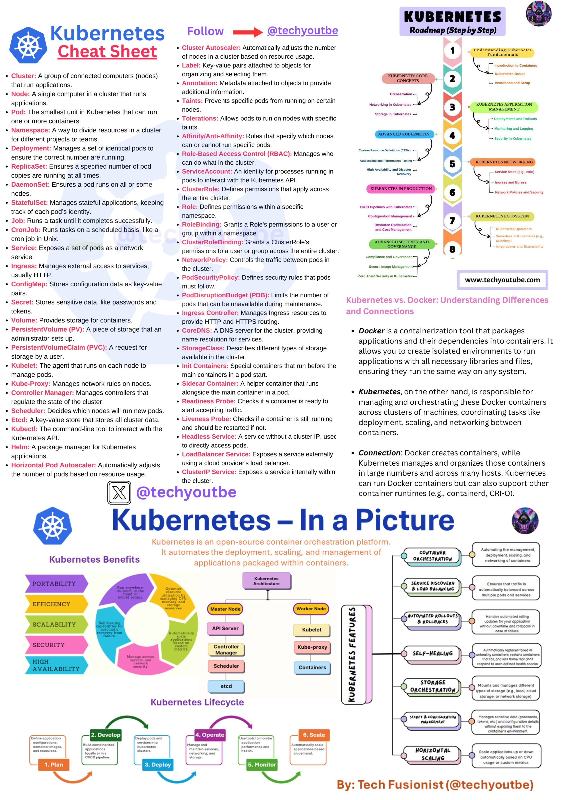

**Source:** [https://twitter.com/i/web/status/1912576616435503389](https://twitter.com/i/web/status/1912576616435503389)
**Original Post Date:** 2025-05-28 05:35:35

# Comprehensive Overview of Kubernetes: Architecture, Concepts, and Best Practices

## Introduction
Kubernetes has become the de facto standard for container orchestration in modern cloud-native applications. This comprehensive guide explores its core architecture, fundamental components, advanced features, and best practices. Understanding Kubernetes is crucial for effectively managing distributed systems at scale, ensuring high availability, efficient resource utilization, and automated deployment workflows.

## Kubernetes Architecture

The Kubernetes architecture consists of two primary components: the Control Plane (Master Node) and Worker Nodes. The Control Plane manages the cluster's state through the API Server, etcd database, Scheduler, and Controller Manager.

Worker nodes host the applications in containers, managed by kubelet processes that communicate with the Control Plane to maintain desired states.

1. API Server: Central gateway for cluster operations
1. etcd: Distributed key-value store maintaining cluster state
1. Scheduler: Determines pod placement on nodes
1. Controller Manager: Ensures desired state through controllers

> **Note/Tip:** Always secure the etcd database as it contains all cluster information

## Core Components and Resources

Kubernetes orchestrates containers through various resources including Deployments, Services, ConfigMaps, and Secrets. Deployments manage pod replicas, while Services provide stable network endpoints.

- Deployments: Manage stateless applications with rolling updates
- StatefulSets: Handle stateful workloads like databases
- Services: Enable service discovery and load balancing
- ConfigMaps & Secrets: Externalize configuration and sensitive data

> **Note/Tip:** Use ConfigMaps for non-sensitive configurations to avoid secret sprawl

## Scaling and Automation Features

Kubernetes offers advanced automation through Horizontal Pod Autoscaler (HPA) and Cluster Autoscaler. HPA automatically adjusts pod replicas based on CPU/memory usage, while the Cluster Autoscaler scales node count to meet demand.

- HPA: Scales pods based on metrics like CPU or custom metrics
- Cluster Autoscaler: Adds/removes nodes based on pod scheduling pressure
- Canary Deployments: Gradually roll out new versions for testing

> **Note/Tip:** Configure appropriate HPA thresholds to prevent oscillation

## Key Takeaways

- Master the core components (Deployments, Services, ConfigMaps) before advancing to advanced features
- Implement RBAC properly to secure cluster access and operations
- Leverage automated scaling and self-healing capabilities for resilient deployments
- Understand pod lifecycle management through probes and readiness checks

## Conclusion
Kubernetes provides a robust platform for container orchestration, enabling teams to manage complex distributed systems with confidence. By mastering its core concepts, components, and automation features, organizations can build scalable, reliable cloud-native applications.

## External References

- [Official Kubernetes Documentation](https://kubernetes.io/docs/home/)
- [Kubernetes Architecture Deep Dive](https://kubernetes.io/docs/concepts/overview/components/)

## Media

**Image Description:** ### Description of the Image: Kubernetes Cheat Sheet

This image is a comprehensive **Kubernetes Cheat Sheet** designed to provide an overview of Kubernetes concepts, components, and features. It is visually organized into sections, with a mix of text, diagrams, and flowcharts to explain Kubernetes in a structured manner. Below is a detailed breakdown of the image:

---

#### **Header and Branding**
- **Title**: "Kubernetes Cheat Sheet"
- **Logo**: The Kubernetes logo (a blue and white design resembling a ship's wheel) is prominently displayed.
- **Social Media Handle**: The image includes a call to action to follow the creator on social media: `@techyoutube`.

---

#### **Main Sections**

1. **Kubernetes Basics**
   - **Cluster**: A group of connected computers (nodes) that run applications.
   - **Node**: A single computer in a cluster that runs applications.
   - **Pod**: The smallest unit in Kubernetes that can run one or more containers.
   - **Namespace**: A way to divide resources in a cluster for different projects or teams.
   - **Deployment**: Manages a set of identical pods to ensure the correct number is running.
   - **ReplicaSet**: Ensures a specified number of pod copies are running.
   - **DaemonSet**: Ensures a pod runs on all or some nodes.
   - **StatefulSet**: Manages stateful applications, keeping track of their state.
   - **Job**: Runs a task until it completes successfully.
   - **CronJob**: Runs tasks on a scheduled basis, like a cron job in Unix.
   - **Service**: Exposes a set of pods as a network service.
   - **Ingress**: Manages external access to services, usually HTTP.
   - **ConfigMap**: Stores external configuration data as key-value pairs.
   - **Secret**: Stores sensitive data, like passwords and tokens.
   - **Volume**: Provides storage for containers.
   - **PersistentVolume (PV)**: A piece of storage that an administrator sets up.
   - **PersistentVolumeClaim (PVC)**: A request for storage by a user.
   - **StorageClass**: Describes different types of storage available in the cluster.
   - **Etcd**: A key-value store that stores all cluster data.
   - **Kubectl**: The command-line tool to interact with the Kubernetes API.
   - **Helm**: A package manager for Kubernetes applications.

2. **Kubernetes Concepts**
   - **Label**: Key-value pairs attached to objects for organizing and selecting them.
   - **Annotation**: Metadata attached to objects to provide additional information.
   - **Taints**: Prevents specific pods from running on certain nodes.
   - **Tolerations**: Allows pods to run on nodes with specific taints.
   - **Affinity/Anti-Affinity**: Rules that specify which nodes can or cannot run specific pods.
   - **Role-Based Access Control (RBAC)**: Manages who can do what in the cluster.
   - **Role**: Defines permissions within a specific namespace.
   - **ClusterRole**: Defines permissions that apply across the entire cluster.
   - **RoleBinding**: Grants a Role’s permissions to a user or group within a namespace.
   - **ClusterRoleBinding**: Grants a ClusterRole’s permissions to a user or group across the entire cluster.
   - **Service Account**: An identity for processes running in pods to interact with the Kubernetes API.
   - **PodSecurityPolicy (PSP)**: Defines security rules that pods must follow.
   - **PodDisruptionBudget (PDB)**: Limits the number of pods that can be unavailable during maintenance.
   - **Ingress Controller**: Manages Ingress resources to provide HTTP and HTTPS routing.
   - **CoreDNS**: A DNS server for the cluster, providing name resolution for services.
   - **Kube-Proxy**: Manages network rules on nodes.
   - **Controller Manager**: Manages controllers that regulate the state of the cluster.
   - **Scheduler**: Decides which nodes will run new pods.
   - **Init Containers**: Special containers that run before the main containers in a pod start.
   - **Sidecar Container**: A helper container that runs alongside the main container in a pod.
   - **Readiness Probe**: Checks if a container is ready to start accepting traffic.
   - **Liveness Probe**: Checks if a container is still running and should be restarted if not.
   - **Headless Service**: A service without a cluster IP, used for deployment, scaling, and networking between containers.

3. **Kubernetes Features**
   - **Horizontal Pod Autoscaler (HPA)**: Automatically adjusts the number of pods based on resource usage.
   - **Cluster Autoscaler**: Automatically adjusts the number of nodes in a cluster based on resource usage.
   - **LoadBalancer Service**: Exposes a service externally using a cloud provider’s load balancer.
   - **ClusterIP Service**: Exposes a service internally within the cluster.

4. **Kubernetes Roadmap (Step by Step)**
   - A flowchart outlining the steps to understand Kubernetes:
     1. **Understanding Fundamentals**
     2. **Kubernetes Core Concepts**
     3. **Kubernetes Installation and Setup**
     4. **Kubernetes Application Management**
     5. **Advanced Kubernetes**
     6. **Kubernetes Networking**
     7. **Kubernetes in Production**
     8. **Kubernetes Ecosystem**

5. **Kubernetes vs. Docker**
   - A comparison of Kubernetes and Docker:
     - **Docker**: A containerization tool that packages applications and their dependencies into containers.
     - **Kubernetes**: Responsible for managing, orchestrating, and scaling Docker containers across clusters of machines.

6. **Kubernetes Benefits**
   - A circular diagram highlighting the benefits of Kubernetes:
     - **Portability**: Run applications on any infrastructure.
     - **Efficiency**: Optimal utilization of resources.
     - **Scalability**: Automatically scale applications.
     - **Security**: Manage access and ensure security.
     - **High Availability**: Self-healing and automated recovery from failures.

7. **Kubernetes Architecture**
   - A diagram illustrating the Kubernetes architecture:
     - **Master Node**: Includes components like the API Server, Controller Manager, Scheduler, and etcd.
     - **Worker Node**: Includes components like Kubelet, Kube-proxy, and containers.

8. **Kubernetes Features**
   - A flowchart summarizing Kubernetes features:
     - **Container Orchestration**
     - **Service Discovery**
     - **Storage & Load Balancing**
     - **Automated Rollouts & Rollbacks**
     - **Self-Healing**
     - **Secrets & Configuration Management**

9. **Kubernetes Lifecycle**
   - A flowchart illustrating the Kubernetes lifecycle:
     1. **Plan**: Define application requirements.
     2. **Develop**: Build and test applications.
     3. **Deploy**: Deploy pods and services.
     4. **Operate**: Monitor and manage applications.
     5. **Monitor**: Use tools to monitor performance and health.
     6. **Scale**: Automatically scale applications based on demand.

10. **Footer**
    - **By**: Tech Fusionist (@techyoutube)
    - **Website**: www.techyoutube.com

---

#### **Visual Design**
- The image uses a clean, structured layout with:
  - **Color Coding**: Different sections are highlighted with distinct colors (e.g., blue, yellow, green, purple).
  - **Icons and Logos**: The Kubernetes logo and other relevant icons are used for visual appeal.
  - **Flowcharts and Diagrams**: Visual aids to explain complex concepts.
  - **Text Formatting**: Bold and italicized text to emphasize key terms and concepts.

---

### Summary
This Kubernetes Cheat Sheet is a detailed and visually appealing resource that covers the fundamentals, concepts, features, and lifecycle of Kubernetes. It is designed to help users understand Kubernetes from a beginner to an advanced level, with clear explanations, diagrams, and comparisons to related technologies like Docker. The structured layout and use of visuals make it an effective learning tool for developers and IT professionals.
