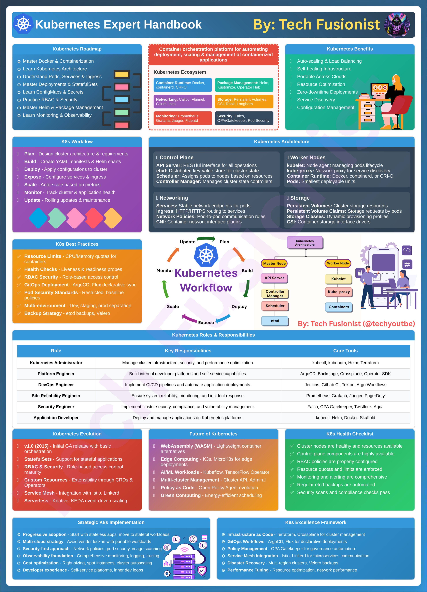

**Source:** [https://twitter.com/i/web/status/1929470544488824909](https://twitter.com/i/web/status/1929470544488824909)
**Original Post Date:** 2025-06-17 12:07:19

# Kubernetes Expert Handbook: Architectural Depth & Strategic Implementation

## Introduction
Kubernetes has evolved from a container orchestration platform to a foundational technology driving modern cloud-native architectures. This handbook provides expert-level insights into Kubernetes' architectural components, operational workflows, and strategic deployment patterns, enabling practitioners to build resilient, scalable systems while adhering to best practices in security, observability, and automation.

## Kubernetes Roadmap

The mastery of Kubernetes requires a structured approach starting with foundational concepts. This roadmap guides practitioners through essential topics including containerization fundamentals, core architecture components, networking patterns, and advanced operational practices.

1. Master Docker & Containerization
1. Learn Kubernetes Architecture
1. Understand Pods, Services, & Ingress
1. Master Deployments & StatefulSets
1. Learn ConfigMaps & Secrets

> **Note/Tip:** Begin with container fundamentals before diving into orchestration patterns.

## Kubernetes Architecture Deep Dive

The Kubernetes architecture comprises a control plane and worker nodes. The control plane manages cluster state through etcd, orchestrates resources via the API server, schedules pods with the scheduler, and maintains system stability through controllers.

_Basic pod definition demonstrating Kubernetes object model_

```yaml
apiVersion: v1
kind: Pod
metadata:
  name: nginx-pod
code
```

## Strategic Implementation Patterns

Successful Kubernetes deployments require careful consideration of architecture patterns, security controls, and operational practices. This section explores progressive adoption strategies, multi-cloud approaches, and cost optimization techniques.

- Start with stateless applications before moving to stateful workloads
- Implement GitOps workflows for configuration management
- Establish clear security boundaries using RBAC and network policies

## Ecosystem Components & Tools

The Kubernetes ecosystem provides a rich set of tools for extending functionality. From package managers like Helm to observability solutions such as Prometheus, these components form the backbone of modern K8s deployments.

- Package Management: Helm, Operator Hub
- Monitoring & Logging: Prometheus, Grafana, Fluentd
- Networking: Calico, Flannel, Cilium

## Key Takeaways

- Implement GitOps practices for reliable configuration management
- Design multi-cloud strategies to avoid vendor lock-in
- Integrate observability from day one using Prometheus and Grafana
- Apply security-first principles with RBAC and network policies

## Conclusion
Mastering Kubernetes requires a deep understanding of its architecture, ecosystem tools, and strategic implementation patterns. This handbook provides the knowledge needed to design robust systems that leverage K8s' full capabilities while maintaining operational excellence.

## External References

- [Official Kubernetes Documentation](https://kubernetes.io/docs/)
- [CNCF Landscape](https://landscape.cncf.io)


## Media

**Image Description:** This image is a comprehensive infographic titled **"Kubernetes Expert Handbook"** by **Tech Fusionist**. It serves as a detailed guide to Kubernetes, covering its architecture, ecosystem, workflow, best practices, roles, and future directions. Below is a detailed breakdown of the image:

---

### **1. Title and Introduction**
- **Title**: "Kubernetes Expert Handbook"
- **Author**: By Tech Fusionist
- **Visual Elements**: The Kubernetes logo is prominently displayed, along with a colorful, organized layout.

---

### **2. Kubernetes Roadmap**
- **Objective**: Outlines a structured learning path for mastering Kubernetes.
- **Key Topics**:
  - Master Docker & Containerization
  - Learn Kubernetes Architecture
  - Understand Pods, Services, & Ingress
  - Master Deployments & StatefulSets
  - Learn ConfigMaps & Secrets
  - Practice RBAC & Security
  - Master Helm & Package Management
  - Learn Monitoring & Observability

---

### **3. Kubernetes Ecosystem**
- **Description**: Highlights the components of the Kubernetes ecosystem.
- **Key Components**:
  - **Container Runtime**: Docker, containerd, CRI-O
  - **Package Management**: Helm, Operator Hub
  - **Networking**: Calico, Flannel, Cilium, Istio
  - **Storage**: Persistent Volumes, CSI, Rook, Longhorn
  - **Monitoring**: Prometheus, Grafana, Jaeger, Fluentd
  - **Security**: Falco, Pod Security, Gatekeeper

---

### **4. Kubernetes Benefits**
- **Key Features**:
  - Auto-scaling & Load Balancing
  - Self-healing Infrastructure
  - Portable Resource Across Clouds
  - Resource Optimization
  - Zero-downtime Deployments
  - Service Discovery
  - Configuration Management

---

### **5. Kubernetes Workflow**
- **Stages**:
  - **Plan**: Design cluster architecture & requirements
  - **Build**: Apply YAML manifests & Helm charts
  - **Deploy**: Apply configurations to the cluster
  - **Expose**: Configure services & ingress
  - **Monitor**: Track cluster & application health
  - **Scale**: Auto-scale based on metrics
  - **Update**: Rolling updates & maintenance

---

### **6. Kubernetes Architecture**
- **Control Plane**:
  - API Server: RESTful interface for all operations
  - etcd: Distributed key-value store for cluster state
  - Scheduler: Assigns pods to nodes based on resources
  - Controller Manager: Manages cluster state controllers
- **Worker Nodes**:
  - kubelet: Manages pods lifecycle
  - kube-proxy: Network proxy for service discovery
  - Container Runtime: Docker, containerd, CRI-O
  - Pods: Smallest deployable units
- **Networking**:
  - Services: Network endpoints for pods
  - Ingress: HTTP/HTTPS routing to services
  - CNI: Container network interface plugins
- **Storage**:
  - Persistent Volumes: Cluster storage resources
  - CSI: Container storage interface drivers

---

### **7. Kubernetes Best Practices**
- **Resource Management**:
  - CPU/Memory limits for containers
  - Liveness & readiness probes
- **Security**:
  - RBAC Security: Role-based access control
  - Pod Security Standards
- **Automation**:
  - GitOps Deployment: ArgoCD, Flux
  - Multi-environment: Dev, staging, prod separation
- **Backup Strategy**:
  - etcd backups, Velero

---

### **8. Kubernetes Roles & Responsibilities**
- **Roles**:
  - **Kubernetes Administrator**: Manages cluster infrastructure, security, and performance.
  - **Platform Engineer**: Builds internal developer platforms and self-service capabilities.
  - **DevOps Engineer**: Implements CI/CD pipelines and automates application deployments.
  - **Site Reliability Engineer**: Ensures system reliability, monitoring, and incident response.
  - **Security Engineer**: Manages cluster security, compliance, and vulnerability management.
  - **Application Developer**: Deploys and manages applications on Kubernetes.

- **Core Tools**:
  - kubectl, kubeadm, Helm, Terraform, Jenkins, ArgoCD, Prometheus, Falco, etc.

---

### **9. Kubernetes Evolution**
- **Key Milestones**:
  - v1.0 (2015): Initial GA release with basic orchestration
  - StatefulSets: Support for stateful applications
  - RBAC & Security: Role-based access control
  - Custom Resources: Extensibility through CRDs & Operators
  - Service Mesh: Integration with Istio, Linkerd
  - Serverless: Knative, KEDA for event-driven scaling

---

### **10. Future of Kubernetes**
- **Emerging Trends**:
  - WebAssembly (WASM): Lightweight container alternatives
  - Edge Computing: K3s, MicroK8s for edge deployments
  - AI/ML Workloads: Kubeflow for declarative sync
  - Multi-cluster Management: Open Policy Agent
  - Policy as Code: Governance automation
  - Green Computing: Energy-efficient Kubernetes

---

### **11. K8s Health Checklist**
- **Key Checks**:
  - Cluster nodes are healthy and resources are available
  - Control plane components are highly available
  - RBAC policies are properly configured
  - Resource quotas and limits are enforced
  - Monitoring and alerting are comprehensive
  - Regular etcd backups are automated
  - Security scans and compliance checks pass

---

### **12. Strategic K8s Implementation**
- **Approaches**:
  - Progressive adoption: Start with stateless apps, move to stateful workloads
  - Multi-cloud strategy: Avoid vendor lock-in with portable workloads
  - Security-first approach: Network policies, pod security, image scanning
  - Observability: Comprehensive monitoring, logging, tracing
  - Cost optimization: Right-sizing, spot instances, cluster auto-scaling
  - Developer experience: Self-service platforms, inner dev loops

---

### **13. K8s Excellence Framework**
- **Key Components**:
  - **As Code**: Terraform, GitOps workflows
  - **Infrastructure**: Crossplane for cluster management
  - **Security**: Network policies, pod security, image scanning
  - **Observability**: Prometheus, Grafana, Jaeger
  - **Service Mesh**: Istio, Linkerd
  - **Disaster Recovery**: Multi-region clusters, Velero backups

---

### **Design and Layout**
- **Color Coding**: Uses a vibrant color scheme to differentiate sections (e.g., blue, purple, orange, green).
- **Icons and Visuals**: Includes icons for Kubernetes components, tools, and concepts.
- **Flowchart**: A central flowchart illustrates the Kubernetes workflow (Plan, Build, Deploy, Expose, Monitor, Scale, Update).
- **Icons and Logos**: Features logos of popular tools (e.g., Docker, Helm, Prometheus, Istio).

---

### **Overall Purpose**
This infographic serves as a comprehensive resource for Kubernetes learners and practitioners, covering everything from foundational concepts to advanced strategies. It is visually engaging and structured to provide a holistic understanding of Kubernetes.

---

### **Final Notes**
The image is well-organized, making it an excellent reference for anyone looking to deepen their understanding of Kubernetes, from beginners to experts. It effectively combines technical details with practical insights, making it a valuable tool for both learning and professional use.
