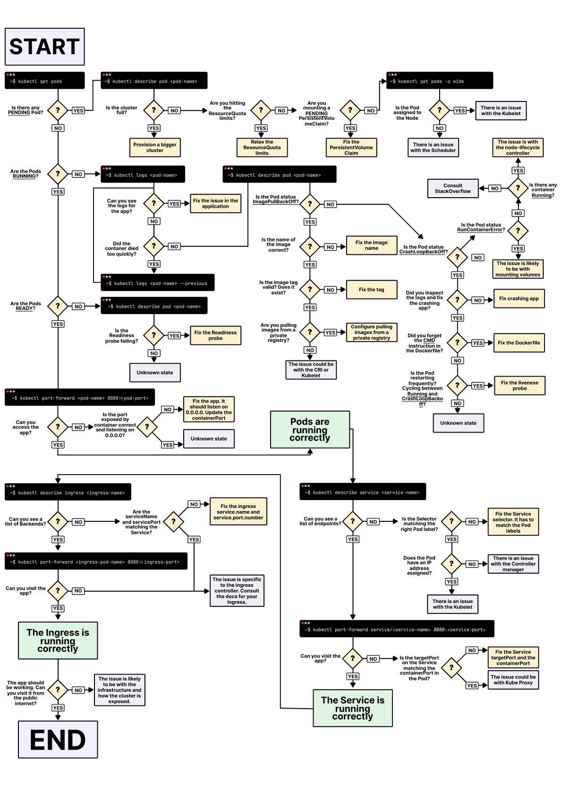

**Source:** [https://twitter.com/i/web/status/1870391276660732144](https://twitter.com/i/web/status/1870391276660732144)
**Original Post Date:** 2025-06-17 10:55:02

# Systematic Approach to Troubleshooting Kubernetes Deployments Using Flowcharts

## Introduction
Kubernetes deployment troubleshooting requires a methodical approach due to its distributed nature. This knowledge base presents a structured decision-tree flowchart that guides administrators through systematic checks for Pods, Services, and Ingress components. The process identifies critical issues such as ImagePullBackOff, CrashLoopBackOff, and connectivity problems while leveraging essential diagnostic commands.

## Initial Pod Status Verification

Begin the troubleshooting journey by examining basic pod status using kubectl commands. These foundational checks help identify immediate issues with pod creation and scheduling.

_These commands provide essential information about pod status, events, and resource utilization._

```bash
# List all pods
kubectl get pods
# Detailed inspection of specific pod
kubectl describe pod <pod-name>
```

## Cluster Resource Analysis

Resource constraints often prevent successful pod scheduling. This section addresses cluster capacity and quota limitations that may hinder deployment.

- Check for full clusters requiring scaling or resource provisioning
- Review ResourceQuota configurations limiting deployment
- Evaluate PersistentVolumeClaim status

> **Note/Tip:** Always check node resources before assuming quota issues

## Pod Status Analysis and Error Resolution

Examine pod states to identify specific failure patterns. Understanding these error states is crucial for targeted troubleshooting.

```bash
# View pod logs
kubectl logs <pod-name>
# Check for CrashLoopBackOff
grep 'CrashLoopBackOff' $(kubectl describe pod <pod-name> | grep Events -A 5)
```

1. ImagePullBackOff: Verify image registry access and credentials
1. CrashLoopBackOff: Analyze container logs and Dockerfile configuration
1. RunContainerError: Check container runtime configuration

## Service and Ingress Troubleshooting

Address connectivity issues through systematic Service and Ingress inspection. Ensure correct selector configurations, endpoint associations, and backend health.

```bash
# Verify service configuration
kubectl describe service <service-name>
# Check ingress status
kubectl describe ingress <ingress-name>
```

## Key Takeaways

- Systematic troubleshooting reduces resolution time by following structured decision paths
- Understanding pod states and error conditions is crucial for targeted diagnostics
- Proper service selector configuration and endpoint association are critical for network connectivity

## Conclusion
A methodical approach to Kubernetes deployment troubleshooting ensures efficient issue identification and resolution. By following this systematic process, administrators can quickly diagnose and resolve common issues while maintaining system reliability.


## Media

**Image Description:** ### Description of the Image

The image is a detailed flowchart designed to troubleshoot issues related to Kubernetes deployments, specifically focusing on Pods, Services, and Ingress. The flowchart is structured as a decision tree, guiding the user through a series of checks and actions to identify and resolve problems. Below is a detailed breakdown of the main components and technical details:

---

#### **1. Start**
- The flowchart begins with the label **"START"** at the top-left corner, indicating the beginning of the troubleshooting process.

---

#### **2. Initial Checks**
- The first set of checks focuses on the status of Pods:
  - **Check 1:** Use the command `kubectl get pods` to list all Pods.
  - **Check 2:** Use the command `kubectl describe pod <pod-name>` to inspect a specific Pod.
  - **Check 3:** Determine if there are any **PENDING Pods**:
    - If **YES**, proceed to check if the cluster is full or if there are ResourceQuota limits.
    - If **NO**, continue to the next set of checks.

---

#### **3. Cluster and Resource Checks**
- **Cluster Full?**
  - If the cluster is full, provision a bigger cluster or adjust the ResourceQuota.
- **ResourceQuota Limits?**
  - If ResourceQuota limits are being hit, adjust or relax the limits.
- **PersistentVolumeClaim (PVC) Issues?**
  - If there is a PVC issue, fix the PersistentVolume or resolve the PVC claim.

---

#### **4. Pod Status Checks**
- The flowchart then evaluates the status of Pods:
  - **Is the Pod assigned to a Node?**
    - If **NO**, check the Scheduler or Node issues.
  - **Is the Pod Running?**
    - If **NO**, check for issues with the Kubelet or Scheduler.
  - **Is the Pod in ImagePullBackOff?**
    - If **YES**, inspect the image name, tag, or registry access.
  - **Is the Pod in CrashLoopBackOff?**
    - If **YES**, inspect logs, fix the container, or adjust the Dockerfile.
  - **Is the Pod in RunContainerError?**
    - If **YES**, check the container image or Dockerfile.

---

#### **5. Application Logs and Readiness**
- **Check Application Logs:**
  - Use `kubectl logs <pod-name>` to inspect logs for application issues.
  - If logs indicate a problem, fix the application or adjust the image.
- **Readiness Probe:**
  - Check if the Readiness probe is failing:
    - If **YES**, fix the probe or adjust the application.
    - If **NO**, proceed to the next checks.

---

#### **6. Pod Accessibility**
- **Can you access the app?**
  - Use `kubectl port-forward <pod-name> 8080:<pod-port>` to test access.
  - If **NO**, check if the container is listening on the correct port.
  - If **YES**, proceed to the next checks.

---

#### **7. Service Checks**
- **Service Status:**
  - Use `kubectl describe service <service-name>` to inspect the Service.
  - Check if the Service has the correct Selector and endpoints:
    - If **NO**, fix the Service selector or endpoints.
    - If **YES**, check if the Pod has the correct labels.
- **Port Forwarding:**
  - Use `kubectl port-forward service/<service-name> 8080:<service-port>` to test access.
  - If **NO**, check the targetPort and containerPort configuration.

---

#### **8. Ingress Checks**
- **Ingress Status:**
  - Use `kubectl describe ingress <ingress-name>` to inspect the Ingress.
  - Check if the Ingress has the correct Service and port configuration:
    - If **NO**, fix the Ingress configuration.
    - If **YES**, check if the backends are correctly configured.
- **Port Forwarding:**
  - Use `kubectl port-forward <ingress-pod-name> 8080:<ingress-port>` to test access.
  - If **NO**, check the Ingress configuration or network issues.
  - If **YES**, the Ingress is running correctly.

---

#### **9. End**
- The flowchart concludes with the label **"END"** at the bottom-right corner, indicating the completion of the troubleshooting process.

---

### **Key Technical Details**
1. **Commands Used:**
   - `kubectl get pods`
   - `kubectl describe pod <pod-name>`
   - `kubectl logs <pod-name>`
   - `kubectl describe service <service-name>`
   - `kubectl describe ingress <ingress-name>`
   - `kubectl port-forward <pod-name> 8080:<pod-port>`
   - `kubectl port-forward service/<service-name> 8080:<service-port>`
   - `kubectl port-forward <ingress-pod-name> 8080:<ingress-port>`

2. **Key Concepts:**
   - **Pods:** The basic unit of deployment in Kubernetes.
   - **Services:** Abstractions that define a logical set of Pods and a policy by which to access them.
   - **Ingress:** A reverse proxy that manages external access to Services.
   - **Readiness Probe:** Ensures a Pod is ready to receive traffic.
   - **Liveness Probe:** Ensures a Pod is still running and healthy.
   - **PersistentVolumeClaim (PVC):** A request for storage by a Pod.

3. **Error States:**
   - **ImagePullBackOff:** Unable to pull the container image.
   - **CrashLoopBackOff:** Container keeps crashing and restarting.
   - **RunContainerError:** Error in running the container.
   - **Pending:** Pod is waiting to be scheduled.

4. **Troubleshooting Steps:**
   - Check logs for application issues.
   - Verify network and port configurations.
   - Ensure correct labels and selectors.
   - Adjust ResourceQuota and PersistentVolume limits.

---

### **Overall Structure**
The flowchart is organized into a decision tree format, guiding the user through a series of checks and actions. Each decision point is marked with a question, and the flowchart provides clear paths for both **YES** and **NO** answers. The use of commands and technical terms ensures that the flowchart is actionable and practical for Kubernetes administrators or developers.

---

This detailed flowchart is an excellent resource for systematically troubleshooting Kubernetes deployments, ensuring that issues are identified and resolved efficiently.
