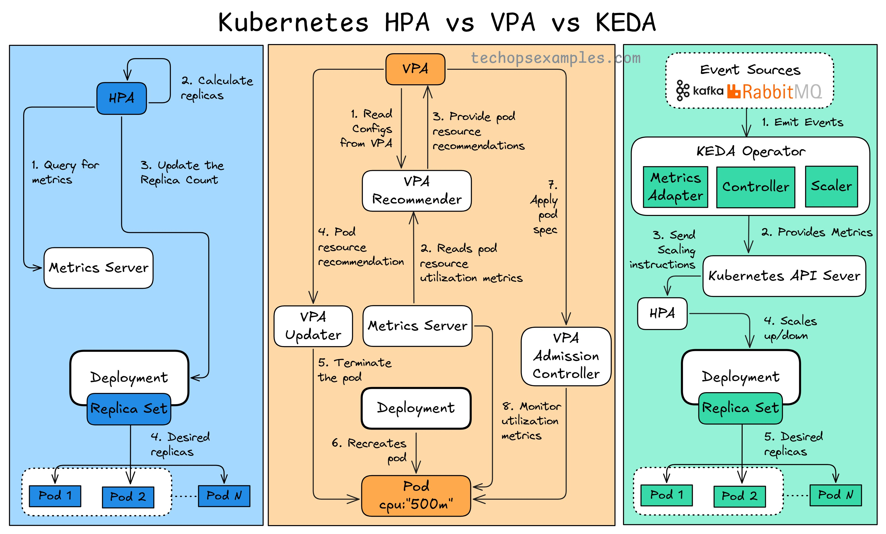

**Source:** [https://twitter.com/i/web/status/1911797592901754957](https://twitter.com/i/web/status/1911797592901754957)
**Original Post Date:** 2025-05-27 21:48:43

# Kubernetes Autoscaling Mechanisms: HPA, VPA, KEDA Comparison

## Introduction
Kubernetes autoscaling is crucial for optimizing resource utilization in containerized environments. This knowledge base item provides a comprehensive comparison of three key scaling mechanisms: HPA (Horizontal Pod Autoscaler) for scaling pod replicas based on metrics like CPU/memory usage, VPA (Vertical Pod Autoscaler) for adjusting individual pod resources, and KEDA (Kubernetes Event-Driven Autoscaler) for scaling event-driven workloads. Understanding these mechanisms enables effective resource management across diverse application requirements.

## Horizontal Pod Autoscaler (HPA)

HPA implements horizontal scaling by adjusting the number of pod replicas based on observed metrics such as CPU or memory usage. It operates through the Kubernetes API, monitoring the Metrics Server for real-time data.

The workflow involves querying metrics, calculating desired replica counts, updating deployments, and managing ReplicaSets to maintain the correct number of pods.

1. Query metrics from Metrics Server
1. Calculate desired replica count
1. Update Deployment configuration
1. ReplicaSet manages pod count

## Vertical Pod Autoscaler (VPA)

VPA enables vertical scaling by adjusting resource requests for individual pods based on their usage patterns. This approach optimizes resource allocation without adding or removing pods.

The VPA Recommender analyzes metrics and provides recommendations to the Updater, which applies changes through Kubernetes' admission control mechanisms.

1. Read pod configurations from VPA
1. Analyze resource utilization patterns
1. Generate resource recommendation
1. Terminate and recreate pods with updated resources

## Kubernetes Event-Driven Autoscaler (KEDA)

KEDA extends Kubernetes autoscaling capabilities to event-driven workloads by scaling based on external metrics from sources like message queues.

Unlike HPA and VPA, KEDA monitors external event sources and scales pods in response to the number of pending events or messages.

1. Event source emits data
1. KEDA Metrics Adapter collects metrics
1. KEDA Controller processes scaling decisions
1. Deployment is scaled based on event volume

## Comparative Analysis

Each autoscaling mechanism serves distinct use cases. HPA is ideal for steady-state workloads, VPA optimizes resource efficiency, and KEDA excels in event-driven scenarios.

- HPA: Horizontal scaling based on CPU/memory metrics
- VPA: Vertical scaling for optimizing individual pod resources
- KEDA: Event-driven scaling for message queues and external sources

## Key Takeaways

- Choose HPA for workloads with predictable scaling patterns based on resource utilization
- Implement VPA to optimize pod resource allocation without adding overhead from new pods
- Deploy KEDA when scaling needs to respond directly to external event volumes

## Conclusion
Understanding these three autoscaling mechanisms allows for effective Kubernetes cluster management. HPA addresses traditional scaling needs, VPA optimizes resource efficiency, and KEDA enables dynamic response to event-driven workloads.

## External References

- [Kubernetes Horizontal Pod Autoscaler Documentation](https://kubernetes.io/docs/tasks/run-application/horizontal-pod-autoscale/)
- [Kubernetes Vertical Pod Autoscaler Documentation](https://github.com/kubernetes/autoscaler/tree/master/vertical-pod-autoscaler)
- [KEDA Official Documentation](https://keda.sh/docs/)

## Media

**Image Description:** The image is a detailed flowchart comparing three Kubernetes scaling mechanisms: **HPA (Horizontal Pod Autoscaler)**, **VPA (Vertical Pod Autoscaler)**, and **KEDA (Kubernetes Event-Driven Autoscaler)**. Each section of the flowchart illustrates the workflow and key components of these scaling mechanisms. Below is a detailed breakdown:

---

### **1. HPA (Horizontal Pod Autoscaler)**
#### **Overview:**
HPA is used for **horizontal scaling**, meaning it adjusts the number of replicas (pods) in a deployment based on observed metrics (e.g., CPU or memory usage).

#### **Workflow:**
1. **Query for Metrics:**
   - The HPA queries the **Metrics Server** to gather metrics about the current state of the pods.
2. **Calculate Replica Count:**
   - Based on the metrics, HPA calculates the desired number of replicas needed to meet the scaling criteria.
3. **Update Replica Count:**
   - HPA updates the **Deployment** to reflect the new desired number of replicas.
4. **Desired Replicas:**
   - The **ReplicaSet** is updated to manage the desired number of pods.
5. **Pods:**
   - The actual pods (`Pod 1`, `Pod 2`, ..., `Pod N`) are scaled up or down based on the updated ReplicaSet.

#### **Key Components:**
- **Metrics Server:** Provides the metrics data (e.g., CPU or memory usage).
- **Deployment:** Manages the scaling of pods.
- **ReplicaSet:** Ensures the desired number of pods are running.
- **Pods:** The actual workloads being scaled.

---

### **2. VPA (Vertical Pod Autoscaler)**
#### **Overview:**
VPA is used for **vertical scaling**, meaning it adjusts the resource requests (CPU and memory) of individual pods based on observed usage.

#### **Workflow:**
1. **Read Configs from VPA:**
   - The VPA reads configuration data to understand how to scale pods.
2. **Read Pod Spec:**
   - VPA reads the pod specification to understand its current resource requests and limits.
3. **Provide Pod Resource Recommendations:**
   - VPA analyzes the pod's resource usage and provides recommendations for adjusting resource requests.
4. **Pod Resource Recommendation:**
   - The recommendations are sent to the **VPA Updater**.
5. **Pod Termination:**
   - If necessary, the VPA terminates the pod to apply the new resource configuration.
6. **Pod Recreation:**
   - The pod is recreated with the updated resource requests.
7. **Apply Pod Resource:**
   - The updated resource requests are applied to the pod.
8. **Monitor Pod Utilization:**
   - VPA continuously monitors the pod's resource utilization to ensure it is optimized.

#### **Key Components:**
- **VPA Recommender:** Analyzes pod resource usage and provides recommendations.
- **VPA Updater:** Applies the recommended resource changes to the pod.
- **Metrics Server:** Provides the metrics data for analysis.
- **Admission Controller:** Ensures that the updated resource requests are valid and applied.
- **Deployment:** Manages the pods.
- **Pods:** The actual workloads being scaled vertically.

---

### **3. KEDA (Kubernetes Event-Driven Autoscaler)**
#### **Overview:**
KEDA is used for scaling based on **event-driven workloads**, such as message queues or other external event sources. It scales pods based on the number of events or messages in the queue.

#### **Workflow:**
1. **Emit Events:**
   - Event sources (e.g., Kafka, RabbitMQ) emit events or messages.
2. **Provides Metrics:**
   - The **KEDA Metrics Adapter** collects metrics from the event sources (e.g., the number of messages in the queue).
3. **Send Scaling Instructions:**
   - The **KEDA Controller** processes the metrics and sends scaling instructions to the Kubernetes API Server.
4. **Scales Up/Down:**
   - The Kubernetes API Server updates the **HPA** or directly scales the **Deployment** to adjust the number of pods based on the event-driven workload.

#### **Key Components:**
- **Event Sources:** External systems like Kafka or RabbitMQ that emit events.
- **KEDA Metrics Adapter:** Collects metrics from the event sources.
- **KEDA Controller:** Processes the metrics and sends scaling instructions.
- **Kubernetes API Server:** Manages the scaling of deployments.
- **HPA:** Optionally used to scale the deployment based on the event-driven metrics.
- **Deployment:** Manages the pods.
- **ReplicaSet:** Ensures the desired number of pods are running.
- **Pods:** The actual workloads being scaled based on event-driven metrics.

---

### **Comparison Summary:**
- **HPA:** Scales the number of pods horizontally based on metrics like CPU or memory.
- **VPA:** Scales the resource requests (CPU and memory) of individual pods vertically.
- **KEDA:** Scales pods based on event-driven workloads (e.g., message queues) by monitoring external event sources.

---

### **Visual Layout:**
The flowchart is divided into three vertical sections, each representing one of the scaling mechanisms:
1. **HPA (Blue Section):** Focuses on horizontal scaling by adjusting the number of replicas.
2. **VPA (Orange Section):** Focuses on vertical scaling by adjusting resource requests for individual pods.
3. **KEDA (Green Section):** Focuses on event-driven scaling by monitoring external event sources and adjusting the number of pods.

Each section uses arrows to illustrate the flow of data and control between components, making it easy to follow the workflow of each scaling mechanism.

---

### **Conclusion:**
The image provides a comprehensive comparison of HPA, VPA, and KEDA, highlighting their workflows, key components, and use cases. This visual representation is useful for understanding how each scaling mechanism operates in a Kubernetes environment.
