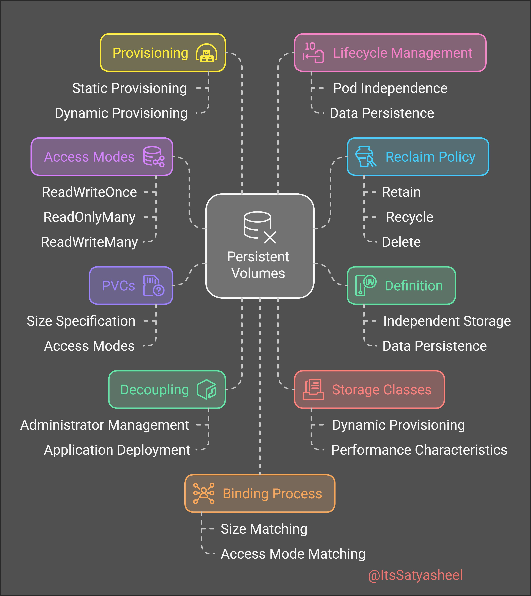

**Source:** [https://twitter.com/i/web/status/1880285956001132998](https://twitter.com/i/web/status/1880285956001132998)
**Original Post Date:** 2025-05-27 20:40:43

# Kubernetes Persistent Volumes: Comprehensive Guide to Storage Management

## Introduction
Persistent Volumes (PVs) are a crucial component of Kubernetes infrastructure that provide abstraction for storage resources. This guide explores the architecture, lifecycle management, and best practices for PV implementation. Understanding these concepts is essential for managing data persistence effectively in containerized environments.

We'll examine key aspects including provisioning strategies, access modes, decoupling principles, and storage class configuration.

## Provisioning Strategies

Kubernetes offers two main provisioning approaches: static and dynamic. Static provisioning involves manually creating PVs before they're requested by applications, while dynamic provisioning automatically creates them when PVCs are submitted.

Dynamic provisioning leverages StorageClasses to define volume creation policies based on resource requests.

_Example of a statically provisioned PV using hostPath_

```yaml
---
apiVersion: v1
kind: PersistentVolume
metadata:
  name: example-pv
spec:
  capacity:
    storage: 10Gi
  accessModes:
    - ReadWriteOnce
  hostPath:
    path: /data/example
```

- Static provisioning provides explicit control over storage allocation
- Dynamic provisioning automates volume creation based on PVC requests
- StorageClasses define the dynamic provisioning behavior

## Access Modes and Volume Claims

PV access modes determine how volumes can be used by pods. The three main modes are ReadWriteOnce, ReadOnlyMany, and ReadWriteMany.

PVCs act as requests for storage resources, specifying desired size and access mode requirements.

```yaml
---
apiVersion: v1
kind: PersistentVolumeClaim
metadata:
  name: example-pvc
spec:
  accessModes:
    - ReadWriteOnce
  resources:
    requests:
      storage: 5Gi
```

- ReadWriteOnce allows single pod read-write access
- ReadOnlyMany enables multiple pods with read-only access
- ReadWriteMany permits multiple concurrent read-write accesses

## Lifecycle Management and Reclamation

PV lifecycle is independent of the pods using them, ensuring data persistence through pod restarts or failures.

Reclaim policies determine what happens to volumes after release from PVCs.

1. Retain policy requires manual cleanup of storage resources
1. Recycle policy automatically cleans and makes the volume available again
1. Delete policy removes both PV and associated data

## Storage Classes and Decoupling

StorageClasses define different types of storage with varying performance characteristics.

The decoupling principle separates storage management from application deployment, enhancing flexibility.

```yaml
---
apiVersion: storage.k8s.io/v1
kind: StorageClass
metadata:
  name: standard-storage
capacity:
  storage: 5Gi
provisioner: kubernetes.io/aws-ebs
```

## Key Takeaways

- Understanding PV lifecycles is crucial for data persistence management
- Dynamic provisioning simplifies storage resource allocation in large clusters
- Proper reclaim policies prevent accidental data loss and unnecessary cleanup overhead

## Conclusion
Mastering Persistent Volume management requires understanding the interaction between static/dynamic provisioning, access modes, and lifecycle policies. This knowledge ensures reliable data persistence while maintaining operational efficiency.

## External References

- [Official Kubernetes PV Documentation](https://kubernetes.io/docs/concepts/storage/persistent-volumes/)
- [Kubernetes Storage Class Guide](https://kubernetes.io/docs/concepts/storage/storage-classes/)


## Media

**Image Description:** The image is a conceptual diagram illustrating the components and processes involved in managing **Persistent Volumes (PVs)** in a Kubernetes or similar container orchestration environment. The central focus is on the **Persistent Volumes** and their interactions with various related concepts. Below is a detailed breakdown:

### **Central Element: Persistent Volumes**
- **Main Subject**: The diagram's core is the **Persistent Volumes (PVs)**, represented by a central gray box with a database icon. This signifies the storage resources that are provisioned and managed for persistent data storage in a Kubernetes cluster.
- **Icon**: The database icon inside the box emphasizes that these volumes are used for storing data persistently, ensuring that data survives beyond the lifecycle of pods or containers.

### **Surrounding Components and Processes**
The diagram is organized into several sections, each highlighting different aspects of Persistent Volume management. These sections are color-coded and connected to the central Persistent Volumes box with dashed lines, indicating their relationships.

#### **1. Provisioning**
- **Color**: Yellow
- **Description**: This section deals with the process of creating and allocating Persistent Volumes.
  - **Static Provisioning**: Manually creating Persistent Volumes before they are used by Persistent Volume Claims (PVCs).
  - **Dynamic Provisioning**: Automatically creating Persistent Volumes when a Persistent Volume Claim is made, based on Storage Classes.

#### **2. Access Modes**
- **Color**: Purple
- **Description**: This section defines how Persistent Volumes can be accessed by Pods.
  - **ReadWriteOnce**: The volume can be mounted as read-write by a single Pod.
  - **ReadOnlyMany**: The volume can be mounted as read-only by multiple Pods.
  - **ReadWriteMany**: The volume can be mounted as read-write by multiple Pods.

#### **3. Persistent Volume Claims (PVCs)**
- **Color**: Purple
- **Description**: PVCs are requests for storage by applications. They act as a consumer of Persistent Volumes.
  - **Size Specification**: Users can specify the required size of the Persistent Volume.
  - **Access Modes**: PVCs can request specific access modes (e.g., ReadWriteOnce, ReadOnlyMany, etc.).

#### **4. Decoupling**
- **Color**: Green
- **Description**: This section highlights the separation of concerns between the application and the storage management.
  - **Administrator Management**: Administrators manage the Persistent Volumes and Storage Classes, decoupling storage management from application deployment.
  - **Application Deployment**: Applications request storage via PVCs without needing to know the underlying storage details.

#### **5. Storage Classes**
- **Color**: Red
- **Description**: Storage Classes define the types of storage available in a cluster.
  - **Dynamic Provisioning**: Storage Classes enable dynamic creation of Persistent Volumes when a PVC is requested.
  - **Performance Characteristics**: Different Storage Classes can offer varying performance levels (e.g., high I/O, SSD, HDD, etc.).

#### **6. Lifecycle Management**
- **Color**: Pink
- **Description**: This section covers the management of the Persistent Volume lifecycle.
  - **Pod Independence**: Persistent Volumes are independent of the lifecycle of Pods, ensuring data persistence.
  - **Data Persistence**: Ensures that data remains intact even if the Pod using the volume is deleted or restarted.

#### **7. Reclaim Policy**
- **Color**: Blue
- **Description**: Defines what happens to a Persistent Volume when it is released from a Persistent Volume Claim.
  - **Retain**: The volume is not deleted and can be manually reclaimed.
  - **Recycle**: The volume is recycled, and its data is removed.
  - **Delete**: The volume is deleted automatically.

#### **8. Definition**
- **Color**: Green
- **Description**: This section emphasizes the definition and configuration of Persistent Volumes and their associated resources.
  - **Independent Storage**: Persistent Volumes are defined independently of the applications that use them.
  - **Data Persistence**: Ensures that data is stored reliably and is not lost due to Pod or container failures.

#### **9. Binding Process**
- **Color**: Orange
- **Description**: This section illustrates the process of binding Persistent Volumes to Persistent Volume Claims.
  - **Size Matching**: Ensures that the requested size in the PVC matches the available size in the PV.
  - **Access Mode Matching**: Ensures that the access mode requested in the PVC is supported by the PV.

### **Overall Structure**
- The diagram uses dashed lines to connect the central Persistent Volumes box to the surrounding components, indicating the flow and interactions between them.
- Each section is labeled with a descriptive title and additional details, providing a comprehensive overview of the Persistent Volume ecosystem.

### **Purpose**
The diagram serves as an educational tool to explain the architecture and processes involved in managing Persistent Volumes in Kubernetes. It highlights the separation of concerns, the lifecycle of volumes, and the mechanisms for ensuring data persistence and availability.

### **Notable Features**
- **Color-Coding**: Each section is color-coded for easy differentiation.
- **Icons**: Icons are used to visually represent concepts (e.g., database for Persistent Volumes, file for PVCs, etc.).
- **Annotations**: Additional text provides further clarification on each section.

This diagram is highly technical and targeted toward individuals familiar with Kubernetes or similar container orchestration systems. It provides a clear and structured overview of Persistent Volume management.
