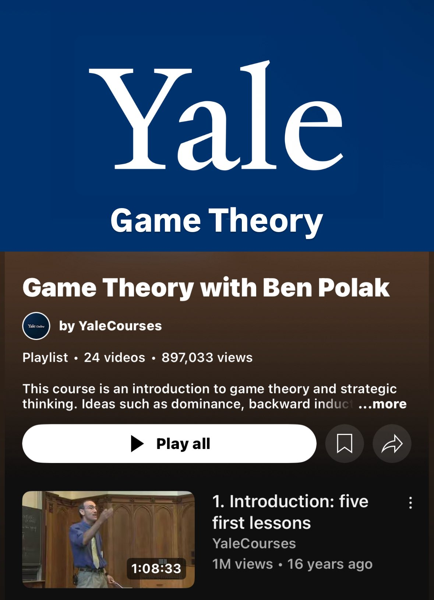

**Source:** [https://twitter.com/i/web/status/1931146026557296856](https://twitter.com/i/web/status/1931146026557296856)
**Original Post Date:** 2025-06-17 11:19:04

# Yale University's Open Course: Introduction to Game Theory by Ben Polak

## Introduction
Game theory is a fundamental mathematical approach to analyzing strategic decision-making that has applications in economics, computer science, artificial intelligence, and algorithm design. Yale University's open course series on Game Theory provides technical professionals with essential knowledge about strategic interactions, optimal decision making, and theoretical foundations applicable to modern software development challenges.

## Overview of the Yale Game Theory Course

YaleCourses hosts this comprehensive game theory course taught by Professor Ben Polak. The series consists of 24 videos totaling over 30 hours of content, making it a substantial resource for technical professionals seeking to understand strategic thinking frameworks.

The course has garnered significant attention with 897,033 views and the first video alone has received over 1 million views since its upload 16 years ago. This enduring popularity reflects the timeless nature of game theory concepts and their relevance across multiple technical disciplines.

- Introduction to strategic thinking fundamentals
- Analysis of dominant strategies and Nash equilibrium
- Backward induction applications in algorithm design
- Applications in machine learning decision-making
- Game theory principles for distributed systems

> **Note/Tip:** This course provides theoretical foundations that can be applied to practical problems in software architecture and system design.

## Technical Applications of Game Theory Concepts

For technical professionals, game theory offers valuable frameworks for understanding competitive scenarios, optimizing algorithms, and designing robust systems. Key concepts from this course translate directly into practical applications.

The backward induction principle taught in the course is particularly relevant to algorithm design, allowing developers to systematically analyze decision trees and optimize recursive functions.

_Example implementation of backward induction algorithm demonstrating recursive decision tree analysis_

```python
def backward_induction(node):
    if is_terminal_node(node):
        return node.utility
    next_player = get_next_player(node)
    if next_player == 'maximizer':
        return max(backward_induction(child) for child in node.children)
    else:
        return min(backward_induction(child) for child in node.children)
```

1. Model strategic interactions between distributed system components
1. Design incentive-compatible protocols for blockchain systems
1. Optimize resource allocation in cloud computing environments
1. Analyze adversarial scenarios in cybersecurity
1. Develop self-interested agent behavior models

## Learning and Resource Access

The course is freely accessible on the YaleCourses YouTube channel, making it an excellent resource for self-directed learning. The structured format allows professionals to progress at their own pace while gaining insights into both theoretical foundations and practical applications.

Each video focuses on specific concepts with clear examples and real-world analogies that technical professionals can relate to.

> **Note/Tip:** The course's open accessibility makes it an ideal supplement for software engineers looking to deepen their understanding of strategic algorithm design and system optimization.

## Key Takeaways

- Game theory provides essential frameworks for analyzing complex decision-making scenarios in technical systems
- Backward induction principles have direct applications in algorithmic design and recursive problem-solving
- Strategic thinking concepts from this course can inform distributed system architecture and protocol development

## Conclusion
Yale University's Game Theory course represents a comprehensive open resource for technical professionals seeking to understand strategic decision-making frameworks. The theoretical foundations provided translate directly into practical applications across algorithm design, distributed systems, and machine learning domains.

## External References

- [Ben Polak's Yale Course on Game Theory](https://www.youtube.com/playlist?list=PL2SOU6wwxB0fW9T57vF1nDn3rVgjQ4z8R)
- [YaleCourses YouTube Channel](https://www.youtube.com/user/YaleCourses)


## Media

**Image Description:** The image is a screenshot of a YouTube playlist page for a course titled **"Game Theory"** offered by Yale University. Below is a detailed description:

### **Main Subject:**
The main subject of the image is the YouTube playlist for the course **"Game Theory"** taught by **Ben Polak**, a professor at Yale University. The playlist is hosted by **YaleCourses**, a YouTube channel dedicated to sharing Yale University's open course content.

### **Visual Elements:**
1. **Header:**
   - The top section features a dark blue background with the word **"Yale"** in large, bold, white font. This prominently identifies the university associated with the course.

2. **Title:**
   - Below the "Yale" header, the title of the playlist is displayed in white text: **"Game Theory"**. The title is repeated multiple times, likely due to a formatting or display issue, making it appear as **"Game Game Theory Theory Theory Theory"**.

3. **Course Details:**
   - The course is described as an **introduction to game theory and strategic thinking**. The description mentions key concepts such as dominance, backward induction, and other foundational ideas in game theory.
   - The text is partially cut off, with the option to view more by clicking **"...more"**.

4. **Playlist Information:**
   - The playlist contains **24 videos**.
   - It has accumulated **897,033 views**.

5. **Professor and Course Content:**
   - The course is taught by **Ben Polak**, as indicated in the title.
   - The thumbnail image shows a classroom setting with a professor (presumably Ben Polak) standing in front of a chalkboard, gesturing while teaching. The professor is wearing a blue shirt and a tie, and the classroom has wooden paneling and a traditional academic atmosphere.

6. **Video Details:**
   - The first video in the playlist is titled **"Introduction: five first lessons"**.
   - The video duration is **1 hour, 8 minutes, and 33 seconds**.
   - It has **1 million views** and was uploaded **16 years ago**.

7. **Buttons and Options:**
   - Below the video thumbnail, there are standard YouTube interface elements:
     - A **"Play all"** button to start the entire playlist.
     - Icons for **bookmarking**, **sharing**, and additional options (three vertical dots).

### **Technical Details:**
- **Platform:** The content is hosted on **YouTube**.
- **Channel:** The channel is **YaleCourses**, which is dedicated to sharing Yale University's open course content.
- **Accessibility:** The course is freely available, as indicated by the high number of views and the open course format.
- **Design:** The layout follows YouTube's standard playlist page design, with clear sections for the title, description, video thumbnails, and interaction buttons.

### **Overall Impression:**
The image effectively communicates the availability of a high-quality educational resource on game theory from Yale University. The repeated title issue in the description is a minor anomaly, but the overall presentation is professional and user-friendly, making it easy for viewers to access and engage with the course content. The high number of views and the long-standing availability of the course suggest its popularity and enduring relevance.
