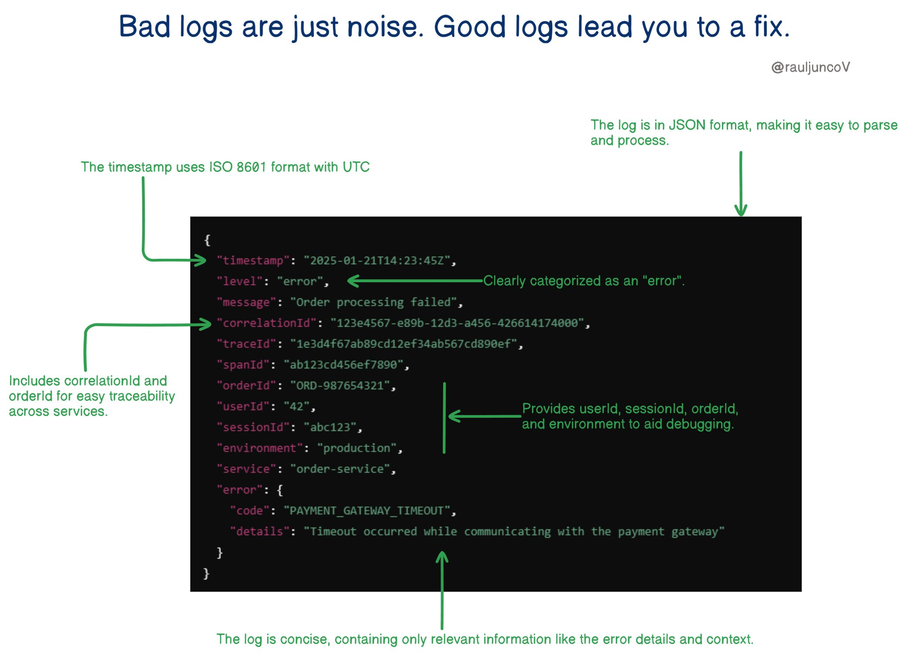

**Source:** [https://twitter.com/i/web/status/1881696953190264862](https://twitter.com/i/web/status/1881696953190264862)
**Original Post Date:** 2025-05-27 19:00:25

# Structured Logging Best Practices: Creating Actionable JSON Logs

## Introduction
Structured logging is a critical practice that transforms log analysis from guesswork to precision. By implementing well-structured logs in JSON format, teams can achieve faster incident resolution, better monitoring capabilities, and enhanced distributed tracing across microservices. This guide provides expert-level insights into creating logs that are both human-readable and machine-processable.

## Fundamental Components of Structured Logs

Structured logging relies on a consistent format with key components: timestamps in ISO 8601, standardized log levels (INFO/WARN/ERROR), context identifiers, and semantic labels. Each component serves a specific purpose in making logs actionable.

Consider this base structure for all logs:
{
  "timestamp": "2025-01-21T14:23:45Z",
  "level": "error",
  "message": "Order processing failed"
}

_Base JSON structure for consistent logging across services_

```json
{
  "timestamp": "2025-01-21T14:23:45Z",
  "level": "error",
  "message": "Order processing failed"
}
```

- Use UTC timestamps (ISO 8601) to avoid timezone issues
- Standardize log levels across your organization
- Include a clear, action-oriented message field

> **Note/Tip:** Never embed business-critical data in logs without encryption

> **Note/Tip:** Keep messages concise but descriptive enough for triage

## Traceability and Distributed Tracing

Distributed systems require unique identifiers to correlate events. Implementing trace IDs, span IDs, and correlation IDs enables complete request flow visibility.

Example of a fully instrumented log entry with tracing information:

_Tracing identifiers for cross-service request tracking_

```json
{
  "traceId": "1e3d4f67ab89cd12ef34ab567cd890ef",
  "spanId": "ab123cd456ef7890",
  "correlationId": "123e4567-e89b-12d3-a456-426614174000"
}
```

1. Use UUIDs for correlation IDs to ensure uniqueness across systems
1. Implement trace ID propagation through HTTP headers
1. Consider using existing distributed tracing libraries (OpenTelemetry, Jaeger)

## Error Handling and Contextual Information

Errors require both machine-readable codes and human-friendly descriptions. Include contextual information like order IDs, user IDs, and environment details to facilitate debugging.

Example of a structured error log:

_Structured error object with contextual information_

```json
{
  "error": {
    "code": "PAYMENT_GATEWAY_TIMEOUT",
    "details": "Timeout occurred while communicating with the payment gateway"
  },
  "orderId": "ORD-987654321",
  "userId": "42",
  "environment": "production"
}
```

## Key Takeaways

- Always use JSON for structured logs to enable efficient parsing and filtering
- Implement trace IDs and correlation IDs to track requests across services
- Include standardized error codes alongside descriptive messages
- Maintain consistency in log structure across your entire application stack

## Conclusion
Effective structured logging transforms chaos into clarity. By implementing these practices, organizations can achieve faster incident response times, better system observability, and improved collaboration between development and operations teams.

## External References

- [OpenTelemetry Specification](https://opentelemetry.io/docs/specs/)
- [RFC 3339 (Date/Time Format)](https://tools.ietf.org/html/rfc3339)


## Media

**Image Description:** The image is a detailed illustration of a well-structured log entry, emphasizing the importance of good logging practices in software development and operations. The main subject is a JSON-formatted log entry, which is annotated with various technical details to highlight its key features and benefits. Below is a detailed breakdown:

### **Main Subject: JSON Log Entry**
The central part of the image is a JSON-formatted log entry, which is structured and annotated to explain its components. The log entry is designed to be informative, concise, and easily parseable. Here is the JSON structure:

```json
{
  "timestamp": "2025-01-21T14:23:45Z",
  "level": "error",
  "message": "Order processing failed",
  "correlationId": "123e4567-e89b-12d3-a456-426614174000",
  "traceId": "1e3d4f67ab89cd12ef34ab567cd890ef",
  "spanId": "ab123cd456ef7890",
  "orderId": "ORD-987654321",
  "userId": "42",
  "sessionId": "abc123",
  "environment": "production",
  "service": "order-service",
  "error": {
    "code": "PAYMENT_GATEWAY_TIMEOUT",
    "details": "Timeout occurred while communicating with the payment gateway"
  }
}
```

### **Annotations and Key Features**
1. **Timestamp**:
   - **Value**: `"2025-01-21T14:23:45Z"`
   - **Annotation**: The timestamp is in ISO 8601 format with UTC, ensuring consistency and ease of parsing across different systems and time zones.

2. **Level**:
   - **Value**: `"error"`
   - **Annotation**: The log is clearly categorized as an "error," making it easy to filter and prioritize critical issues.

3. **Message**:
   - **Value**: `"Order processing failed"`
   - **Annotation**: A concise and descriptive message that summarizes the issue.

4. **Correlation ID**:
   - **Value**: `"123e4567-e89b-12d3-a456-426614174000"`
   - **Annotation**: A unique identifier for the request or operation, enabling traceability across different services and logs.

5. **Trace ID and Span ID**:
   - **Trace ID**: `"1e3d4f67ab89cd12ef34ab567cd890ef"`
   - **Span ID**: `"ab123cd456ef7890"`
   - **Annotation**: These IDs are used for distributed tracing, helping to track the flow of a request through multiple services.

6. **Order ID, User ID, and Session ID**:
   - **Order ID**: `"ORD-987654321"`
   - **User ID**: `"42"`
   - **Session ID**: `"abc123"`
   - **Annotation**: These identifiers provide context about the specific entities involved in the operation, aiding in debugging and analysis.

7. **Environment**:
   - **Value**: `"production"`
   - **Annotation**: Indicates the environment where the log was generated, which is crucial for distinguishing between production and non-production issues.

8. **Service**:
   - **Value**: `"order-service"`
   - **Annotation**: Specifies the service that generated the log, helping to pinpoint the source of the issue.

9. **Error Object**:
   - **Code**: `"PAYMENT_GATEWAY_TIMEOUT"`
   - **Details**: `"Timeout occurred while communicating with the payment gateway"`
   - **Annotation**: The error object provides a specific error code and a detailed description, making it easier to diagnose and resolve the issue.

### **Additional Annotations**
- **JSON Format**:
  - The log is in JSON format, which is highly structured, easy to parse, and widely supported by logging tools and systems.

- **Conciseness**:
  - The log is concise, containing only relevant information, such as error details, context, and identifiers, without unnecessary noise.

- **Traceability**:
  - The inclusion of `correlationId`, `traceId`, and `spanId` ensures that the log can be traced across different services and systems.

- **Contextual Information**:
  - The log includes `orderId`, `userId`, `sessionId`, and `environment`, providing valuable context for debugging and analysis.

### **Overall Message**
The image emphasizes the importance of good logging practices. It contrasts "bad logs" (which are noisy and unhelpful) with "good logs" (which are structured, informative, and actionable). The annotations highlight how a well-designed log entry can lead to efficient debugging, monitoring, and resolution of issues.

### **Visual Design**
- The JSON log is displayed in a dark theme with syntax highlighting, making it visually appealing and easy to read.
- Green arrows and text annotations are used to point out and explain specific parts of the log, enhancing the educational value of the image.

### **Conclusion**
The image serves as a comprehensive guide for creating effective log entries, focusing on structure, clarity, and relevance. It underscores the importance of including essential details like timestamps, error codes, identifiers, and contextual information to facilitate troubleshooting and system monitoring.
