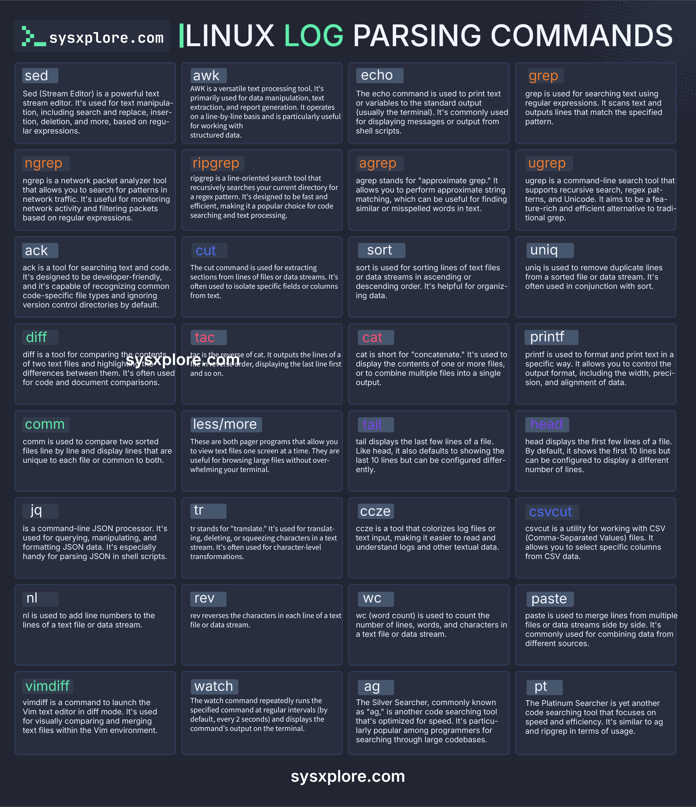

**Source:** [https://twitter.com/i/web/status/1877734236003742011](https://twitter.com/i/web/status/1877734236003742011)
**Original Post Date:** 2025-05-27 18:41:32

# Linux Log Parsing Commands Reference: A Comprehensive Guide

## Introduction
Understanding how to effectively parse logs in a Linux environment is crucial for system administrators, developers, and DevOps engineers. This reference sheet covers 36 powerful command-line tools designed for text processing, log analysis, and data manipulation tasks. From basic search commands like grep to advanced tools like awk and sed, this guide provides detailed descriptions of each tool's capabilities and common use cases in the context of log analysis.

## Essential Text Processing & Search Tools

The foundation of Linux log parsing begins with text processing tools. These commands are designed to search, filter, and manipulate text data efficiently.

grep is the most fundamental tool for searching text using regular expressions. It's commonly used to find specific patterns in logs by filtering through large volumes of data quickly.

_Basic grep usage with error searching and counting_

```bash
# Search for errors in system log
sudo grep 'error' /var/log/syslog
# Count occurrences using wc
grep -c 'error' /var/log/syslog
```

- grep: Pattern matching in text files
- ripgrep: Advanced recursive search for improved performance
- ngrep: Network packet analysis with pattern matching

## Advanced Data Manipulation Tools

For complex log parsing scenarios, advanced tools like awk and sed are indispensable. These tools provide sophisticated text processing capabilities.

awk is particularly powerful for structured data analysis. It allows you to extract specific fields from logs, perform calculations, and generate custom reports.

_Basic and advanced awk usage for log analysis_

```bash
# Extract third field (PID) from process log
ps aux | awk '{print $2}'
# Calculate average response time from access.log
awk '{sum += $4} END {print sum/NR}' /var/log/access.log
```

> **Note/Tip:** Always use -i flag with sed to make in-place modifications safe

> **Note/Tip:** Combine awk with sort and uniq for log summary generation

## File Comparison & Analysis

When analyzing logs across different time periods or environments, comparison tools become essential.

diff highlights differences between files line by line, making it invaluable for tracking changes in configuration files and log formats.

_Using diff and comm for configuration comparison_

```bash
# Compare two versions of config file
diff -u /etc/nginx/nginx.conf.bak /etc/nginx/nginx.conf
# Show only lines present in both files
comm -12 file1.txt file2.txt
```

## Practical Log Parsing Scenarios

Real-world log parsing often requires combining multiple tools into pipelines.

For example, analyzing Apache access logs typically involves filtering specific error codes, extracting IP addresses, and generating reports.

_Complex pipeline for analyzing HTTP errors and monitoring critical issues_

```bash
# Find 404 errors in Apache logs
grep 'HTTP/1.1" 404' /var/log/apache2/access.log | cut -d' ' -f1 | sort | uniq -c | sort -nr
# Monitor log file for specific pattern in real-time
watch -n 5 "grep 'critical error' /var/log/system.log"
```

## Key Takeaways

- Mastering grep, awk, and sed forms the foundation of effective log parsing
- Use pipelines to combine multiple tools for complex analysis tasks
- For network-related logs, ngrep provides valuable packet-level insights
- Modern alternatives like ripgrep offer significant performance improvements over traditional grep

## Conclusion
Linux offers a rich ecosystem of command-line tools that make log parsing and text manipulation highly efficient. By understanding the capabilities and appropriate use cases for each tool, you can dramatically improve your ability to analyze logs, troubleshoot issues, and extract meaningful insights from system data.

## External References

- [GNU Grep Documentation](https://www.gnu.org/software/grep/manual/)
- [Awk Programming Language](https://www.gnu.org/software/gawk/manual/gawk.html)


## Media

**Image Description:** ### Description of the Image

The image is a comprehensive reference sheet titled **"Linux Log Parsing Commands"**, presented by **sysxplore.com**. It is designed to provide an overview of various Linux command-line tools used for text processing, log parsing, and data manipulation. The layout is organized in a grid format, with each cell containing a command name, its description, and its primary use. The background is dark, and the text is highlighted in different colors for better readability and categorization.

### Main Subject
The main subject of the image is a collection of **36 Linux command-line tools** used for text processing, log parsing, and data manipulation. These tools are categorized into different groups based on their functionality, such as text editing, searching, filtering, sorting, merging, and more.

### Grid Layout
The grid is divided into **6 rows and 6 columns**, with each cell containing:
1. **Command Name**: Highlighted in a colored box.
2. **Description**: A brief explanation of the command's purpose and usage.

### Commands and Their Descriptions
Below is a detailed breakdown of the commands and their functionalities:

#### **Row 1**
1. **sed**
   - **Description**: Stream Editor. Used for text manipulation, including search and replace, insertion, deletion, and more, based on regular expressions.
2. **awk**
   - **Description**: A versatile text processing tool primarily used for data manipulation, text extraction, and report generation. It operates on a line-by-line basis and is useful for working with structured data.
3. **echo**
   - **Description**: Prints text or variables to the standard output (usually the terminal). Commonly used for displaying messages or output from shell scripts.
4. **grep**
   - **Description**: Searches text using regular expressions. Outputs lines that match the specified pattern.

#### **Row 2**
1. **ngrep**
   - **Description**: A network packet analyzer tool that allows searching for patterns in network traffic. Useful for monitoring network activity and filtering packets.
2. **ripgrep**
   - **Description**: A fast, recursive search tool that searches the current directory for a regex pattern. Designed for speed and efficiency.
3. **agrep**
   - **Description**: Stands for "approximate grep." Allows approximate string matching, useful for finding similar or misspelled words in text.
4. **ugrep**
   - **Description**: A command-line search tool that supports recursive search, regex patterns, and Unicode. A feature-rich alternative to traditional `grep`.

#### **Row 3**
1. **ack**
   - **Description**: A tool for searching text and code. Designed to be developer-friendly, it recognizes common code sections and ignores version control files.
2. **cut**
   - **Description**: Extracts specific fields or columns from lines of files or data streams.
3. **sort**
   - **Description**: Sorts lines of text files in ascending or descending order. Often used in conjunction with `uniq`.
4. **uniq**
   - **Description**: Removes duplicate lines from a sorted file or data stream.

#### **Row 4**
1. **diff**
   - **Description**: Compares the contents of two text files and highlights differences between them. Useful for code and document comparisons.
2. **tac**
   - **Description**: The reverse of `cat`. Outputs lines in reverse order, displaying the last line first.
3. **cat**
   - **Description**: Concatenates and displays the contents of one or more files. Often used to combine multiple files into a single output.
4. **printf**
   - **Description**: Formats and prints text in a specific output way. Allows control over the width, precision, and alignment of data.

#### **Row 5**
1. **comm**
   - **Description**: Compares two sorted files line by line and displays lines that are unique to each file or common to both.
2. **less/more**
   - **Description**: Pager programs for viewing text files one screen at a time. Useful for browsing large files without overwhelming the terminal.
3. **tail**
   - **Description**: Displays the last few lines of a file. By default, shows the last 10 lines but can be configured to display a different number of lines.
4. **head**
   - **Description**: Displays the first few lines of a file. By default, shows the first 10 lines but can be configured to display a different number of lines.

#### **Row 6**
1. **jq**
   - **Description**: A command-line JSON processor. Used for querying, manipulating, and formatting JSON data. Especially handy for parsing JSON in shell scripts.
2. **tr**
   - **Description**: Translates, deletes, or squeezes characters in a text stream. Often used for character-level transformations.
3. **ccze**
   - **Description**: A tool that colorizes log files or text input, making it easier to read and understand logs and other textual data.
4. **csvcut**
   - **Description**: A utility for working with CSV files. Allows selecting specific columns from CSV data.

#### **Row 7**
1. **nl**
   - **Description**: Adds line numbers to the lines of a text file or data stream.
2. **rev**
   - **Description**: Reverses the characters in each line of a text file or data stream.
3. **wc**
   - **Description**: Counts the number of lines, words, and characters in a text file or data stream.
4. **paste**
   - **Description**: Merges lines from multiple files or data streams side by side. Commonly used for combining data from different sources.

#### **Row 8**
1. **vimdiff**
   - **Description**: Launches the Vim text editor in diff mode. Used for visually comparing and merging text files.
2. **watch**
   - **Description**: Repeatedly runs the specified command at regular intervals (default 2 seconds) and displays the output on the terminal.
3. **ag**
   - **Description**: The Silver Searcher, a fast code searching tool optimized for speed. Popular among programmers for searching through large codebases.
4. **pt**
   - **Description**: The Platinum Searcher, another fast code searching tool that focuses on speed and efficiency. Similar to `ag` for searching codebases.

### Design and Formatting
- **Color Coding**: Each command is highlighted in a colored box, making it easy to distinguish between different categories of tools.
- **Consistent Layout**: Each cell follows a uniform structure, with the command name at the top and a detailed description below.
- **Dark Background**: The dark background enhances readability by providing a high contrast with the text.

### Purpose
The image serves as a quick reference guide for Linux users, developers, and system administrators who need to perform text processing, log parsing, and data manipulation tasks. It provides a concise overview of the most commonly used commands and their functionalities, making it a valuable resource for both beginners and experienced users.

### Conclusion
This image is a well-organized and informative reference sheet that highlights 36 essential Linux commands for text processing and log parsing. It is designed to be easily accessible and useful for anyone working with Linux systems, providing a quick way to understand and utilize these powerful tools.
