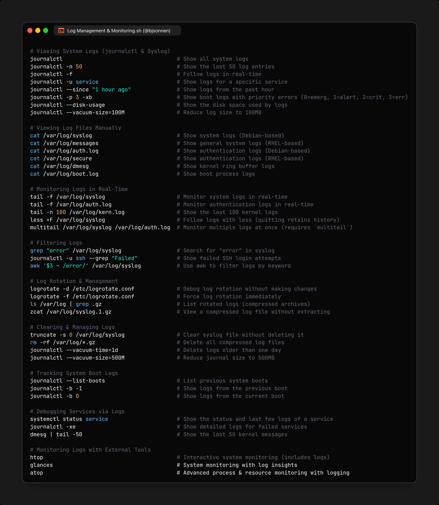

**Source:** [https://twitter.com/i/web/status/1893690930655285750](https://twitter.com/i/web/status/1893690930655285750)
**Original Post Date:** 2025-05-28 07:23:34

# Linux Log Management and Monitoring: Commands and Techniques

## Introduction
System logs are critical for diagnosing issues, maintaining security, and ensuring system reliability in Linux environments. This technical guide explores essential commands and techniques for viewing, managing, rotating, and monitoring logs using tools like journalctl, syslog, logrotate, and external utilities. Understanding these concepts is crucial for efficient system administration and development work.

## Viewing System Logs (journalctl & Syslog)

The journalctl command provides comprehensive access to systemd logs, offering powerful filtering and viewing options.

```bash
journalctl -n 50
journalctl -f
journalctl -u service
journalctl --since "1 hour ago"
journalctl -p 3 -xb
journalctl --disk-usage
journalctl --vacuum-size=100M
```

> **Note/Tip:** Use 'journalctl -f' for real-time monitoring

> **Note/Tip:** --vacuum commands help manage disk space efficiently

## Real-Time Log Monitoring

Real-time monitoring is essential for detecting issues as they occur. This section covers tools and commands for continuous log observation.

```bash
tail -f /var/log/syslog
multitail /var/log/syslog /var/log/auth.log
less +F /var/log/syslog
```

## Log Rotation and Management

Proper log rotation prevents disk space issues and ensures manageable log files.

```bash
logrotate -d /etc/logrotate.conf
journalctl --vacuum-time=1d
```

## External Monitoring Tools

Advanced monitoring requires more than just log viewing. This section introduces tools for comprehensive system observation.

```bash
htop
glances
atop
```

## Key Takeaways

- journalctl is the primary tool for systemd log management
- Real-time monitoring is crucial for immediate issue detection
- Log rotation must be configured to prevent disk space exhaustion
- External tools provide deeper insights into system behavior

## Conclusion
Mastering Linux log management requires proficiency with journalctl, understanding of log file locations, and knowledge of real-time monitoring techniques. Regular maintenance through log rotation ensures system stability while proper monitoring enables quick response to issues.

## External References

- [journalctl Documentation](https://man7.org/linux/man-pages/man1/journalctl.1.html)
- [logrotate Manual](https://linux.die.net/man/8/logrotate)


## Media

**Image Description:** The image is a screenshot of a terminal or code editor displaying a comprehensive guide on **Log Management and Monitoring** in a Linux environment. The content is organized into sections, each detailing various commands and techniques for viewing, managing, rotating, and monitoring system logs. Below is a detailed breakdown of the image:

---

### **Main Subject**
The main subject of the image is a collection of Linux commands and explanations related to log management and monitoring. These commands are categorized into sections, each focusing on a specific aspect of log handling.

---

### **Sections and Details**

#### **1. Viewing System Logs (journalctl & Syslog)**
This section explains how to use `journalctl` and `syslog` to view system logs. Key commands include:
- `journalctl -n 50`: Show the last 50 log entries.
- `journalctl -f`: Follow logs in real-time.
- `journalctl -u service`: Show logs for a specific service.
- `journalctl --since "1 hour ago"`: Show logs from the past hour.
- `journalctl -p 3 -xb`: Show boot logs with priority errors.
- `journalctl --disk-usage`: Show disk space used by logs.
- `journalctl --vacuum-size=100M`: Reduce log size to 100MB.

#### **2. Viewing Log Files Manually**
This section lists commands to manually view log files stored in `/var/log/`. Examples include:
- `cat /var/log/syslog`: Show system logs (Debian-based).
- `cat /var/log/messages`: Show general system logs (RHEL-based).
- `cat /var/log/auth.log`: Show authentication logs (Debian-based).
- `cat /var/log/secure`: Show authentication logs (RHEL-based).
- `cat /var/log/dmesg`: Show kernel ring buffer logs.
- `cat /var/log/boot.log`: Show boot process logs.

#### **3. Monitoring Logs in Real-Time**
Commands for monitoring logs in real-time are provided:
- `tail -f /var/log/syslog`: Monitor system logs in real-time.
- `tail -f /var/log/auth.log`: Monitor authentication logs in real-time.
- `tail -n 100 /var/log/kern.log`: Monitor the last 100 kernel logs.
- `less +F /var/log/syslog`: Monitor logs with `less` (retains history).
- `multitail /var/log/syslog /var/log/auth.log`: Monitor multiple logs simultaneously.

#### **4. Filtering Logs**
Commands for filtering logs by specific keywords or patterns:
- `grep "error" /var/log/syslog`: Search for "error" in syslog.
- `journalctl -u ssh --grep "Failed"`: Show failed SSH login attempts.
- `awk '$3 ~ /error/' /var/log/syslog`: Filter logs by keyword using `awk`.

#### **5. Log Rotation & Management**
This section covers log rotation and management using `logrotate`:
- `logrotate -d /etc/logrotate.conf`: Debug log rotation without making changes.
- `logrotate /etc/logrotate.conf`: Force log rotation immediately.
- `ls /var/log | grep .gz`: List rotated log files (compressed archives).
- `zcat /var/log/syslog.1.gz`: View a compressed log file without extracting.

#### **6. Clearing & Managing Logs**
Commands for clearing and managing log files:
- `truncate -s 0 /var/log/syslog`: Clear syslog file without deleting it.
- `rm -rf /var/log/*.gz`: Delete all compressed log files.
- `journalctl --vacuum-time=1d`: Delete logs older than one day.
- `journalctl --vacuum-size=500M`: Reduce journal size to 500MB.

#### **7. Tracking System Boot Logs**
Commands for listing and viewing system boot logs:
- `journalctl --list-boots`: List previous system boots.
- `journalctl -b -1`: Show logs from the previous boot.
- `journalctl -b 0`: Show logs from the current boot.

#### **8. Debugging Services via Logs**
Commands for debugging services using logs:
- `systemctl status service`: Show the status and logs of a service.
- `journalctl -xe`: Show detailed logs for failed services.
- `dmesg | tail -n 50`: Show the last 50 kernel messages.

#### **9. Monitoring Logs with External Tools**
This section lists tools for advanced monitoring:
- `htop`: Monitor system processes.
- `glances`: Monitor system resources.
- `atop`: Advanced monitoring with process and resource insights.

---

### **Visual and Formatting Details**
- **Color Coding**: The text is color-coded to distinguish between commands, comments, and file paths:
  - **Green**: Commands.
  - **Gray**: Comments (starting with `#`).
  - **White**: File paths and other text.
- **Comments**: Each command is followed by a comment explaining its purpose.
- **Organization**: The content is well-organized into sections with clear headings and subheadings.

---

### **Technical Details**
- **Log Management Tools**:
  - `journalctl`: The primary tool for viewing and managing systemd logs.
  - `syslog`: Traditional log file for system events.
  - `logrotate`: Tool for managing log file rotation.
- **Log Files**:
  - `/var/log/syslog`: System logs (Debian-based).
  - `/var/log/messages`: System logs (RHEL-based).
  - `/var/log/auth.log`: Authentication logs (Debian-based).
  - `/var/log/secure`: Authentication logs (RHEL-based).
  - `/var/log/dmesg`: Kernel ring buffer logs.
  - `/var/log/boot.log`: Boot process logs.
- **Filtering and Monitoring Tools**:
  - `grep`: Search for specific patterns in logs.
  - `awk`: Filter logs based on conditions.
  - `tail -f`: Monitor logs in real-time.
  - `less +F`: Monitor logs with history retention.
  - `multitail`: Monitor multiple logs simultaneously.
- **Compression and Rotation**:
  - Log files are often compressed using `.gz` format.
  - `logrotate` is used to manage log rotation and compression.

---

### **Overall Purpose**
The image serves as a comprehensive reference guide for system administrators or developers working with Linux systems. It provides a wide range of commands and tools for managing, monitoring, and debugging system logs effectively. The structured format and detailed explanations make it easy to understand and apply the commands in practical scenarios.
