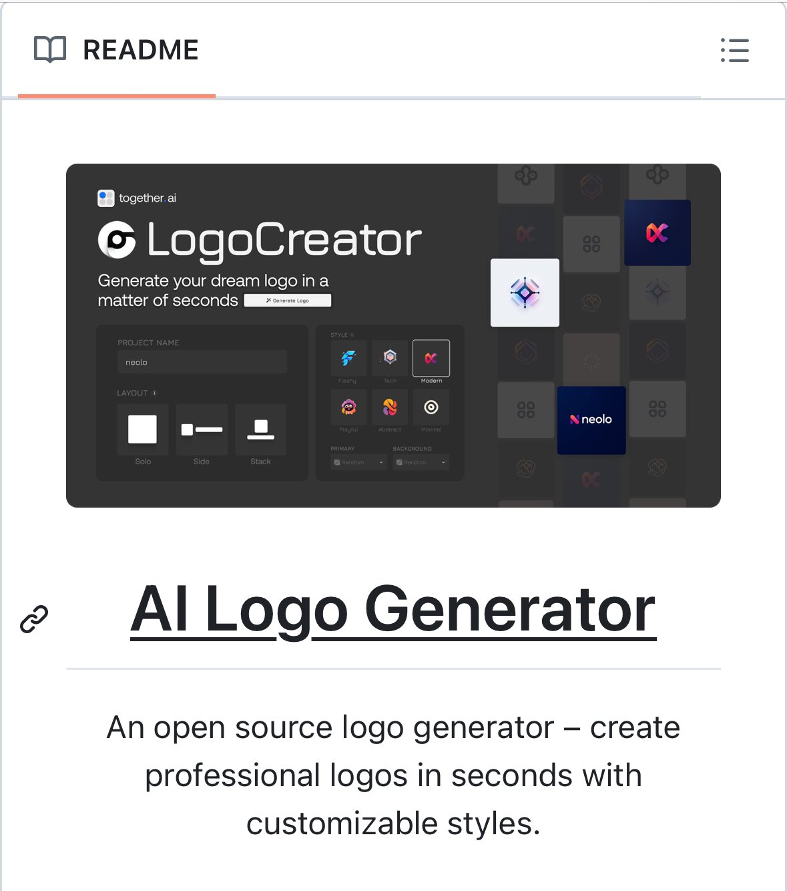

**Source:** [https://twitter.com/i/web/status/1891015177836884059](https://twitter.com/i/web/status/1891015177836884059)
**Original Post Date:** 2025-05-27 19:23:41

# Open Source AI Logo Generator: Technical Architecture & Features

## Introduction
This knowledge base item explores the technical architecture and features of a modern open-source AI logo generator. The tool combines artificial intelligence with intuitive user interface design to enable rapid professional logo creation. Key aspects include dynamic preview generation, customizable styling options, and platform integration capabilities.

## Interface Architecture

The generator features a dark-themed UI optimized for contrast and readability, with clean typography and visual hierarchy.

Key components include a header section with branding elements, main content area, project input field, layout options, and style selectors.

- Header Section: together.ai branding and LogoCreator logo
- Project Input Field for brand name specification
- Three layout options: Solo, Side, Stack
- Six distinct style categories: Flashy, Tech, Modern, Playful, Abstract, Minimal

> **Note/Tip:** Dark theme implementation enhances visual contrast and reduces eye strain during extended use.

## Dynamic Preview System

The preview area updates in real-time as users modify design parameters, providing immediate feedback.

Central preview window with white border ensures visibility against the dark background theme.

1. Design elements update dynamically based on user selections
1. Preview area maintains responsiveness across different layout options
1. Color scheme changes propagate instantly to preview

## Technical Implementation Details

The system employs real-time AI processing for logo generation, leveraging pre-trained models.

Customization features include color selection via dropdown menus and style presets.

> **Note/Tip:** Performance optimization is crucial due to real-time rendering requirements

## Key Takeaways

- Dark theme UI design enhances user experience with optimal contrast
- Dynamic preview system enables immediate feedback on design changes
- Open-source nature facilitates community contributions and customization
- Real-time AI processing supports efficient logo generation workflow

## Conclusion
The open-source AI Logo Generator represents a sophisticated balance of technical capabilities and user-friendly interface. Its modular architecture, coupled with real-time preview and customization options, makes it an effective tool for both developers and designers seeking professional-grade logo creation.

## External References

- [GitHub Repository](https://github.com/together-ai/logo-generator)

## Media

**Image Description:** The image depicts a README page for a project titled **"AI Logo Generator"**, which is an open-source tool designed to create professional logos using artificial intelligence. Below is a detailed description of the image, focusing on the main subject and relevant technical details:

### **Main Subject: AI Logo Generator**
The central focus of the image is the **AI Logo Generator** interface, which is displayed prominently in the upper section of the image. The interface is dark-themed, with a clean and modern design. Here are the key elements of the interface:

1. **Header Section**:
   - The top-left corner displays the text **"together.ai"**, indicating the platform or organization associated with the tool.
   - The logo of the tool is prominently displayed as **"LogoCreator"**, with a stylized "G" icon next to the text.

2. **Main Content Area**:
   - The central text reads: **"Generate your dream logo in a matter of seconds"**, emphasizing the tool's primary function and efficiency.
   - Below this text is a button labeled **"Generate Logo"**, which is likely the primary action button for users to initiate the logo generation process.

3. **Project Name Input Field**:
   - A section labeled **"PROJECT NAME"** is visible, where users can input the name of their project or brand. The example text shown is **"neolo"**.

4. **Layout Options**:
   - Below the project name, there are three layout options:
     - **Solo**: A single element logo.
     - **Side**: Elements placed side by side.
     - **Stack**: Elements stacked vertically.
   - These options allow users to choose the structure of their logo.

5. **Style Options**:
   - On the right side, there are several style options represented by icons and labels:
     - **Flashy**: A vibrant, eye-catching style.
     - **Tech**: A modern, tech-oriented style.
     - **Modern**: A clean, contemporary style.
     - **Playful**: A fun and engaging style.
     - **Abstract**: A more artistic and abstract style.
     - **Minimal**: A minimalist design.
   - These styles provide users with a variety of aesthetic choices for their logo.

6. **Preview and Customization**:
   - A central preview area shows a logo design in progress, with a geometric, abstract shape. This area likely updates dynamically as users select different styles, layouts, and project names.
   - The logo preview is highlighted with a white border, making it stand out against the dark background.

7. **Additional Options**:
   - Below the style options, there are dropdown menus for **"PRIMARY"** and **"BACKGROUND"** colors, allowing users to customize the color scheme of their logo.

### **README Section**
Below the interface image, there is a **README** section with the following details:

1. **Title**:
   - The title is **"AI Logo Generator"**, which is prominently displayed in bold, large text.

2. **Description**:
   - The description reads:
     > "An open-source logo generator – create professional logos in seconds with customizable styles."
   - This text emphasizes the tool's open-source nature, its efficiency, and the ability to customize logo styles.

3. **Formatting**:
   - The text is well-organized, with clear headings and bullet points to convey information effectively.

### **Technical Details and Observations**:
1. **Dark Theme**:
   - The interface uses a dark theme with white and light-colored text, which is visually appealing and modern.
   - The dark theme helps the icons and text stand out, improving readability.

2. **User-Friendly Design**:
   - The interface is designed to be intuitive, with clear labels and options for users to navigate and customize their logo easily.

3. **Dynamic Preview**:
   - The central logo preview area suggests that the tool provides real-time feedback, allowing users to see how their choices affect the final design.

4. **Open-Source Nature**:
   - The README explicitly mentions that the tool is open-source, indicating that the source code is available for modification and contribution by the community.

5. **Repetition in Text**:
   - There is some repetition in the text, such as "logo" and "styles," which might be intentional for emphasis but could be streamlined for clarity.

### **Overall Impression**
The image effectively communicates the purpose and functionality of the **AI Logo Generator**. The interface is modern, user-friendly, and visually appealing, with clear options for customization. The README provides a concise and informative description of the tool, highlighting its key features and open-source nature. The combination of the interface screenshot and the README text makes it easy for potential users to understand the tool's capabilities and how to use it.
