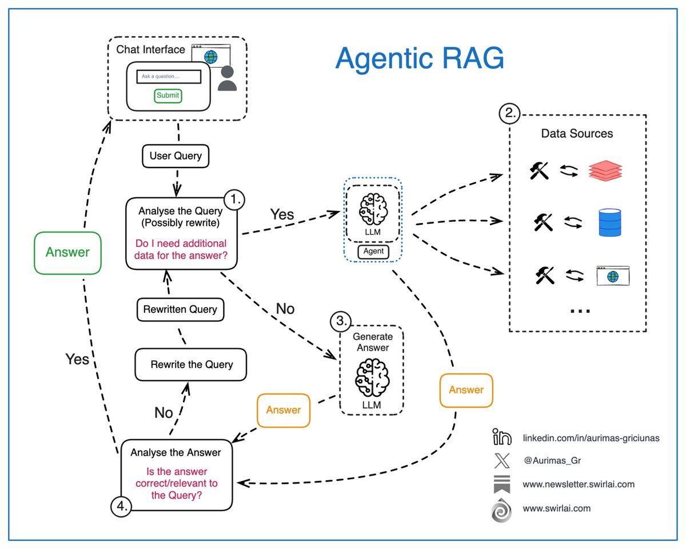

# agentic_rag

**Tweet URL:** [https://x.com/Aurimas_Gr/status/1876244332748873979](https://x.com/Aurimas_Gr/status/1876244332748873979)

**Tweet Text:** Here is why you need to understand 𝗔𝗴𝗲𝗻𝘁𝗶𝗰 𝗥𝗔𝗚 as an AI Engineer.

Simple naive RAG systems are rarely used in real world applications. To provide correct actions to solve the user intent, we are always adding some agency to the RAG system - it is usually just a bit of it.

It is important to 𝗻𝗼𝘁 𝗴𝗲𝘁 𝗹𝗼𝘀𝘁 𝗶𝗻 𝘁𝗵𝗲 𝗯𝘂𝘇𝘇 𝗮𝗻𝗱 𝘁𝗲𝗿𝗺𝗶𝗻𝗼𝗹𝗼𝗴𝘆 and understand that there is 𝗻𝗼 𝘀𝗶𝗻𝗴𝗹𝗲 𝗯𝗹𝘂𝗲𝗽𝗿𝗶𝗻𝘁 to add this agency to your RAG system and you should adapt to your use case. My advice is to think in systems and engineering flows.

Let’s explore some of the moving pieces in Agentic RAG:

𝟭. Analysis of the user query: we pass the original user query to a LLM based Agent for analysis. This is where:

 The original query can be rewritten, sometimes multiple times to create either a single or multiple queries to be passed down the pipeline.
 The agent decides if additional data sources are required to answer the query.

𝟮. If additional data is required, the Retrieval step is triggered. In Agentic RAG case, we could have a single or multiple agents responsible for figuring out what data sources should be tapped into, few examples:

 Real time user data. This is a pretty cool concept as we might have some real time information like current location available for the user.
 Internal documents that a user might be interested in.
 Data available on the web.
 …

𝟯. If there is no need for additional data, we try to compose the answer (or multiple answers or a set of actions) straight via an LLM.
𝟰. The answer gets analyzed, summarized and evaluated for correctness and relevance:

 If the Agent decides that the answer is good enough, it gets returned to the user.
 If the Agent decides that the answer needs improvement, we try to rewrite the user query and repeat the generation loop.

 Remember the Reflection pattern from my last Newsletter article? This is exactly that. 

The real power of Agentic RAG lies in its ability to perform additional routing pre and post generation, handle multiple distinct data sources for retrieval if it is needed and recover from failures while generating correct answers.

What are your thoughts on Agentic RAG? Let me know in the comments! 

#RAG #LLM #AI

**Image 1 Description:** The infographic, titled "Agentic RAG," presents a flowchart illustrating the process of an AI-driven chat interface designed to assist users in answering their questions through data-based responses. The chart is divided into four main sections: **Chat Interface**, **Data Sources**, and two answer-related sections.

**Chat Interface**

*   This section represents the user's interaction with the chat interface, where they can submit a question.
*   The process begins here, and the flowchart branches out from this point to guide the user through the query-answering process.

**Data Sources**

*   This section highlights the sources of data that the AI system uses to generate answers.
*   It includes images representing various types of data sources, such as databases, documents, and websites, which are used to gather information relevant to the user's question.

**Answer Generation**

*   The flowchart branches out from the **Chat Interface** section into two main answer-related sections: **Analyse the Query (Possibly Rewrite)** and **Generate Answer**.
*   In the **Analyse the Query (Possibly Rewrite)** section, the AI system analyzes the user's question to determine if it needs to be rewritten or rephrased for better understanding.
*   If necessary, the AI system will rewrite the query to improve its clarity and relevance.

**Generate Answer**

*   Once the query has been analyzed and potentially rewritten, the AI system generates an answer based on the data sources provided.
*   The generated answer is then presented back to the user through the chat interface.

**Additional Features**

*   The flowchart also includes additional features that can be integrated into the AI-driven chat interface, such as:
    *   **LLM (Large Language Model)**: A type of artificial intelligence model that uses natural language processing techniques to generate human-like text.
    *   **Data Sources**: Various types of data sources, including databases, documents, and websites, which are used to gather information relevant to the user's question.

**Conclusion**

The infographic provides a clear and concise overview of the process of an AI-driven chat interface designed to assist users in answering their questions through data-based responses. By analyzing the user's query, generating an answer based on relevant data sources, and providing additional features such as LLM and data sources, this system aims to provide accurate and informative answers to users' queries.

