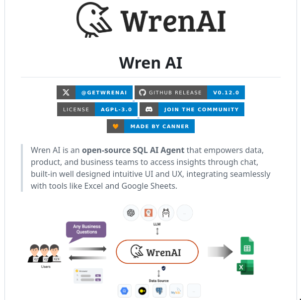

# sql_ai_agent

**Tweet URL:** [https://x.com/tom_doerr/status/1866923282081124684](https://x.com/tom_doerr/status/1866923282081124684)

**Tweet Text:** Wren AI is an open-source SQL AI agent that converts natural language questions into SQL  queries, integrates with various databases and LLMs, and provides a user interface for  data analysis and query generation

**Image 1 Description:** The image presents a comprehensive overview of Wren AI, an open-source SQL AI agent designed to empower users with data-driven insights. The visual content is organized into distinct sections, each highlighting key features and functionalities.

• **Header Section**
	+ Features the Wren AI logo, comprising a stylized bird icon and the text "WrenAI" in black font.
	+ Includes a brief description of the platform's purpose: "Wren AI is an open-source SQL AI agent that empowers data, product, and business teams to access insights through chat, built-in well-designed intuitive UI and UX, integrating seamlessly with tools like Excel and Google Sheets."

• **License Information**
	+ Displays the license type as AGPL-3.0.
	+ Provides a link to join the community.

• **Footer Section**
	+ Lists various social media platforms where users can connect with Wren AI, including GitHub Release (v0.12.0), Twitter (@GETWRENAI), and Discord.

**Summary**

The image effectively communicates the core features and benefits of Wren AI, making it an attractive option for those seeking a user-friendly and powerful SQL AI agent. By highlighting its open-source nature, intuitive interface, and seamless integration with popular tools, Wren AI positions itself as a valuable resource for data-driven decision-making.

