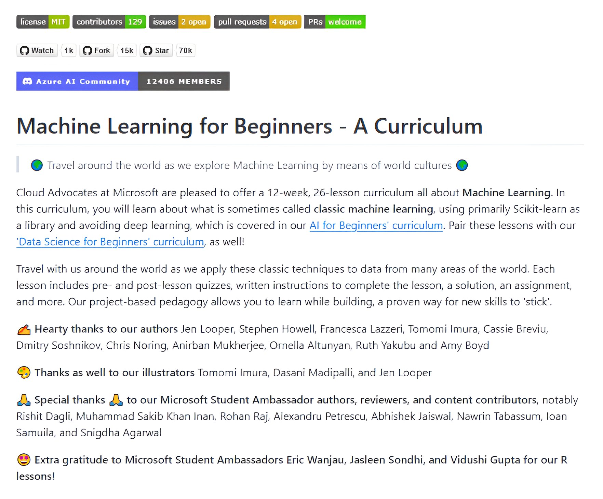

**Source:** [https://twitter.com/i/web/status/1876663746166398993](https://twitter.com/i/web/status/1876663746166398993)
**Original Post Date:** 2025-05-27 17:46:10

# Microsoft's Community-Driven Machine Learning Curriculum: A Comprehensive Overview

## Introduction
This knowledge base item examines Microsoft's 'Machine Learning for Beginners - A Curriculum', a collaborative open-source initiative hosted on GitHub. The curriculum represents a comprehensive 12-week educational journey designed by Cloud Advocates at Microsoft, focusing exclusively on classic machine learning techniques using Scikit-learn.

The repository showcases exceptional community engagement with over 30k stars and 21k forks, positioning it as one of the most popular ML education resources. This article provides a detailed breakdown of its structure, pedagogical approach, and technical implementation.

## Repository Structure and Engagement

The curriculum is hosted on GitHub under the Azure AI Community banner with 12,406 members. The repository's open-source nature is evidenced by its MIT license and 129 contributors.

With 2 open issues and 4 pull requests actively being managed, the project maintains a dynamic development cycle while encouraging further contributions through its 'PRs welcome' policy.

- Repository Engagement Metrics: 30k stars, 1k watchers, 21k forks
- Development Status: Active with community contributions
- Project Governance: Open-source under MIT License

> **Note/Tip:** The high engagement metrics suggest this resource is highly valued in the ML learning community.

> **Note/Tip:** Active issue and PR management indicates a well-maintained repository.

## Curriculum Design and Content

The curriculum spans 12 weeks with 26 lessons, focusing on foundational machine learning concepts using Scikit-learn as the primary toolset.

Each lesson follows a structured approach including pre/post quizzes, written instructions, solutions, and practical assignments.

1. Focus on classic ML techniques avoiding deep learning topics
1. Project-based learning with real-world datasets
1. Complementary pairing with 'Data Science for Beginners' curriculum

## Contributor Ecosystem

The curriculum features contributions from multiple Microsoft employees and Student Ambassadors, demonstrating a collaborative educational approach.

Key contributors include Jen Looper, Stephen Howell, Francesca Lazzeri, and several Microsoft Student Ambassadors.

- 12 Cloud Advocate authors
- 3 illustrators (Tomomi Imura, Dasani Madipalli, Jen Looper)
- 8 Student Ambassador Authors

## Key Takeaways

- The curriculum provides a structured approach to learning classic ML without deep learning complexity.
- Strong community engagement and open-source nature make it highly accessible and continuously evolving.
- Project-based pedagogy emphasizes practical application over theoretical concepts alone.

## Conclusion
Microsoft's 'Machine Learning for Beginners' curriculum stands out as a well-structured, community-driven resource leveraging GitHub's collaborative platform. Its focus on foundational ML techniques using Scikit-learn, combined with extensive project work and strong community support, makes it an excellent starting point for beginners in machine learning.

## External References

- [GitHub Repository](https://github.com/Azure/MachineLearningForBeginners)
- [Azure AI Community](https://azure.microsoft.com/en-us/overview/ai-platform/)

## Media

**Image Description:** ### Description of the Image

The image is a screenshot of a GitHub repository page for a curriculum titled **"Machine Learning for Beginners - A Curriculum"**. The page is part of the **Azure AI Community**, as indicated by the banner at the top. Below is a detailed breakdown of the content and elements present in the image:

---

#### **Header Section**
1. **GitHub Repository Details**:
   - **License**: The repository is licensed under the **MIT License**, as indicated by the green "license MIT" button.
   - **Contributors**: There are **129 contributors** to the project, as shown by the "contributors 129" button.
   - **Issues**: There are **2 open issues**, as indicated by the "issues 2 open" button.
   - **Pull Requests**: There are **4 open pull requests**, as shown by the "pull requests 4 open" button.
   - **PRs Welcome**: The repository encourages contributions, as indicated by the "PRs welcome" button.

2. **Interaction Metrics**:
   - **Watch**: The repository has **1k watchers**.
   - **Fork**: The repository has been **forked 21k times**.
   - **Star**: The repository has **30k stars**.

3. **Azure AI Community Banner**:
   - The banner at the top indicates that this repository is part of the **Azure AI Community**, which has **12,406 members**.

---

#### **Main Content**
1. **Title**:
   - The main title of the repository is **"Machine Learning for Beginners - A Curriculum"**, written in bold black text.

2. **Introduction**:
   - The introduction describes the curriculum as a **12-week, 26-lesson program** designed to teach **classic machine learning** concepts.
   - The curriculum is developed by **Cloud Advocates at Microsoft**.
   - It focuses on using **Scikit-learn** as the primary library and avoids deep learning topics, which are covered in a separate curriculum titled **"AI for Beginners"**.
   - The curriculum is designed to be paired with another curriculum, **"Data Science for Beginners"**, for a comprehensive learning experience.

3. **Curriculum Overview**:
   - The curriculum is project-based, allowing learners to apply classic machine learning techniques to real-world data from various global regions.
   - Each lesson includes:
     - Pre- and post-lesson quizzes.
     - Written instructions.
     - Solutions.
     - Assignments.
   - The project-based pedagogy is emphasized as a proven method for skill retention.

4. **Acknowledgments**:
   - The curriculum acknowledges the contributions of various individuals:
     - **Authors**: A list of authors is provided, including Jen Looper, Stephen Howell, Francesca Lazzeri, Tomomi Imura, Cassie Breviu, Dmitry Soshnikov, Chris Noring, Anirban Mukherjee, Ornella Altunyan, Ruth Yakubu, and Amy Boyd.
     - **Illustrators**: Tomomi Imura, Dasani Madipalli, and Jen Looper are credited for illustrations.
     - **Microsoft Student Ambassador Authors**: Rishit Dagli, Muhammad Sakib Khan Inan, Rohan Raj, Alexandru Petrescu, Abhishek Jaiswal, Nawrin Tabassum, Ioan Samuila, and Snigdha Agarwal are thanked for their contributions.
     - **Microsoft Student Ambassadors**: Eric Wanjau, Jasleen Sondhi, and Vidushi Gupta are acknowledged for their support.

---

#### **Visual Elements**
1. **Icons**:
   - Various icons are used to highlight different sections:
     - **Travel Icon**: Used to emphasize the global aspect of the curriculum.
     - **Heart Icon**: Used to express gratitude to contributors.
     - **Illustration Icon**: Used to acknowledge the illustrators.
     - **Bell Icon**: Used to highlight special thanks to Microsoft Student Ambassador authors.

2. **Color Coding**:
   - The GitHub interface uses standard color coding for buttons and links:
     - Green for "license MIT" and "PRs welcome".
     - Yellow for "issues" and "pull requests".
     - Black and white for interaction metrics (watch, fork, star).

3. **Text Formatting**:
   - The title is in bold black text.
   - Hyperlinks are in blue, indicating clickable links to other curricula or resources.
   - Acknowledgments are organized into sections with icons for emphasis.

---

#### **Technical Details**
1. **Repository Structure**:
   - The repository is structured to facilitate learning and collaboration, as evidenced by the high number of contributors and forks.
   - The use of GitHub as the platform suggests that the curriculum is open-source and community-driven.

2. **Learning Approach**:
   - The curriculum emphasizes **classic machine learning** using **Scikit-learn**, a popular Python library for machine learning.
   - It avoids deep learning topics, focusing instead on foundational concepts.

3. **Community Engagement**:
   - The high number of watchers, forks, and stars indicates significant community interest and engagement.
   - The acknowledgment of contributors highlights the collaborative nature of the project.

---

### Summary
The image depicts a GitHub repository for a beginner-friendly **Machine Learning Curriculum** developed by Microsoft Cloud Advocates. The curriculum is designed as a 12-week, 26-lesson program focusing on classic machine learning techniques using Scikit-learn. It is part of the **Azure AI Community** and is supported by a large and active community of contributors, authors, and illustrators. The repository emphasizes project-based learning and is intended to be paired with other curricula for a comprehensive learning experience. The use of GitHub as the platform underscores its open-source and collaborative nature.
