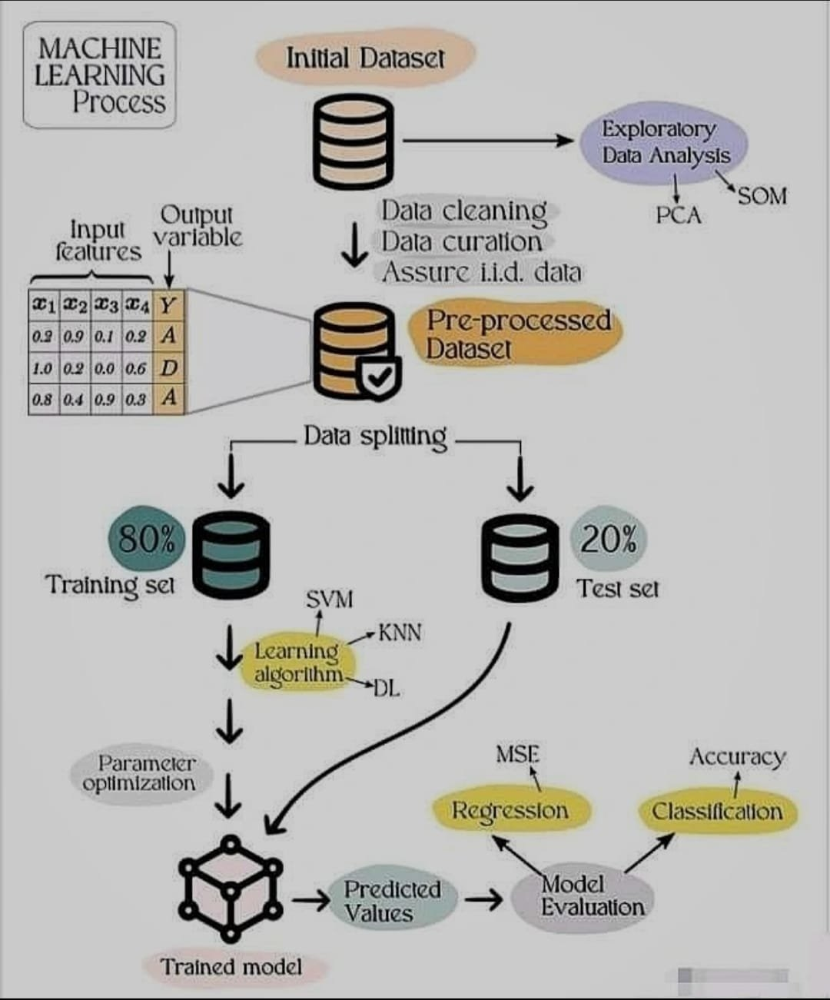

**Source:** [https://twitter.com/i/web/status/1912365333501079987](https://twitter.com/i/web/status/1912365333501079987)
**Original Post Date:** 2025-05-28 01:48:57

# Machine Learning Process Flow: Comprehensive Steps from Data Preparation to Model Deployment

## Introduction
The machine learning process represents a systematic workflow for transforming raw data into operational models. This comprehensive guide outlines each critical phase, emphasizing the importance of rigorous methodology from data preprocessing to model deployment. Understanding these steps is fundamental for developing robust and reliable ML solutions that generalize well to real-world applications.

This knowledge base item provides detailed insights into each component of the ML pipeline, highlighting best practices in data handling, algorithm selection, and performance evaluation.

## Data Preparation Pipeline

The process begins with an initial dataset that serves as raw material for all subsequent steps. This phase encompasses exploratory data analysis (EDA) using techniques like Self-Organizing Maps (SOM) and Principal Component Analysis (PCA). These analyses help identify patterns, detect anomalies, and understand data characteristics.

Data cleaning is a critical step involving the handling of missing values, removal of duplicates, and correction of errors to ensure data consistency. Following this, data curation focuses on proper organization, formatting, and ensuring independence and identical distribution (i.i.d.) properties essential for ML algorithms.

- Raw data collection and validation
- Exploratory Data Analysis techniques
- Missing value imputation strategies
- Data normalization and standardization

> **Note/Tip:** Maintaining detailed documentation of data transformations is crucial for reproducibility.

> **Note/Tip:** Early identification of i.i.d. violations can prevent model bias.

## Model Training and Optimization

The pre-processed dataset undergoes splitting into training (80%) and test sets (20%). The training subset is used to build models using algorithms like SVM, KNN, or Deep Learning networks. Parameter optimization through techniques such as grid search ensures optimal model performance.

Deep learning frameworks often require careful hyperparameter tuning for network architecture, learning rates, and batch sizes to achieve satisfactory convergence.

1. Select appropriate algorithm based on problem type (classification vs regression)
1. Configure cross-validation strategy
1. Implement early stopping criteria

## Model Evaluation and Deployment

The trained model is rigorously evaluated using the test set with metrics such as Mean Squared Error (MSE) for regression tasks or accuracy for classification problems. This step ensures the model's ability to generalize beyond training data.

Final validation involves comparing against baseline models and considering business-specific performance thresholds before deployment.

## Key Takeaways

- Proper data preparation significantly impacts model performance, with EDA being a crucial first step in understanding dataset characteristics.
- Algorithm selection should align with problem type and data structure, considering computational resources and scalability requirements.
- Evaluation metrics must be chosen carefully to reflect the specific business objectives and constraints of the application.

## Conclusion
A well-structured machine learning process ensures systematic progression from raw data through model deployment. By following this pipeline rigorously and focusing on each phase's critical aspects, practitioners can develop robust models that deliver reliable results in real-world applications.

## External References

- [Hands-On Machine Learning with Scikit-Learn, Keras & TensorFlow](https://www.oreilly.com/library/view/hands-on-machine-learning/9781492032632/)
- [The Elements of Statistical Learning](http://statweb.stanford.edu/~tibs/ElemStatLearn/)

## Media

**Image Description:** The image depicts a flowchart illustrating the **Machine Learning Process**. It outlines the steps involved in building and evaluating a machine learning model, from data preparation to model training and evaluation. Below is a detailed description of the image, focusing on the main subject and technical details:

---

### **1. Initial Dataset**
- **Main Subject**: The process begins with an **Initial Dataset**, represented by a cylinder icon.
- **Description**: This is the raw data collected for the machine learning task. It is the starting point for all subsequent steps.

---

### **2. Exploratory Data Analysis (EDA)**
- **Main Subject**: The **Exploratory Data Analysis (EDA)** step is shown as a blue oval.
- **Description**: This step involves analyzing the dataset to understand its characteristics, identify patterns, and detect anomalies. Techniques such as **SOM (Self-Organizing Maps)** and **PCA (Principal Component Analysis)** are mentioned as tools for EDA.

---

### **3. Data Cleaning**
- **Main Subject**: The **Data Cleaning** step is represented as a gray oval.
- **Description**: This step focuses on handling missing values, removing duplicates, correcting errors, and ensuring data consistency. It is a critical step to improve data quality.

---

### **4. Data Curation**
- **Main Subject**: The **Data Curation** step is shown as a gray oval.
- **Description**: This involves ensuring the data is well-organized and formatted correctly. It also includes steps to **assure i.i.d. (independent and identically distributed) data**, which is essential for many machine learning algorithms.

---

### **5. Pre-processed Dataset**
- **Main Subject**: The **Pre-processed Dataset** is represented by a cylinder with a checkmark icon.
- **Description**: After cleaning and curating the data, the dataset is now ready for further processing. This pre-processed dataset is used for the next steps.

---

### **6. Data Splitting**
- **Main Subject**: The **Data Splitting** step is shown as a gray oval.
- **Description**: The dataset is divided into two subsets:
  - **Training Set (80%)**: Used to train the machine learning model.
  - **Test Set (20%)**: Used to evaluate the model's performance on unseen data.

---

### **7. Training Set**
- **Main Subject**: The **Training Set** is represented by a cylinder with a teal color.
- **Description**: This subset of the data is used to train the machine learning model. The training set is typically larger (80% of the data) to ensure the model learns effectively.

---

### **8. Test Set**
- **Main Subject**: The **Test Set** is represented by a cylinder with a gray color.
- **Description**: This subset of the data is reserved for evaluating the model's performance. It is typically smaller (20% of the data) and is used to assess how well the model generalizes to new, unseen data.

---

### **9. Learning Algorithms**
- **Main Subject**: The **Learning Algorithms** are represented as a yellow oval.
- **Description**: Various machine learning algorithms are used to train the model. The image mentions:
  - **SVM (Support Vector Machines)**: A supervised learning algorithm used for classification and regression.
  - **KNN (K-Nearest Neighbors)**: A simple, non-parametric algorithm used for classification and regression.
  - **DL (Deep Learning)**: A subset of machine learning that uses neural networks with multiple layers to learn complex patterns.

---

### **10. Parameter Optimization**
- **Main Subject**: The **Parameter Optimization** step is shown as a gray oval.
- **Description**: This step involves tuning the hyperparameters of the machine learning model to improve its performance. Techniques such as grid search, random search, or Bayesian optimization are often used.

---

### **11. Trained Model**
- **Main Subject**: The **Trained Model** is represented by a neural network icon.
- **Description**: After training, the model is ready for evaluation. The neural network icon suggests that deep learning might be one of the algorithms used.

---

### **12. Model Evaluation**
- **Main Subject**: The **Model Evaluation** step is shown as a gray oval.
- **Description**: The trained model is evaluated using the test set. The evaluation metrics mentioned are:
  - **MSE (Mean Squared Error)**: Used for regression tasks to measure the average squared difference between predicted and actual values.
  - **Accuracy**: Used for classification tasks to measure the proportion of correctly classified instances.
  - **Regression**: Evaluation for continuous output tasks.
  - **Classification**: Evaluation for categorical output tasks.

---

### **13. Predicted Values**
- **Main Subject**: The **Predicted Values** are represented as a teal oval.
- **Description**: These are the outputs generated by the trained model when it is applied to the test set or new data.

---

### **14. Final Model**
- **Main Subject**: The **Final Model** is represented as a gray oval.
- **Description**: After evaluation, the model is finalized and ready for deployment or further refinement.

---

### **Overall Flow**
The flowchart is structured in a top-to-bottom and left-to-right manner, illustrating the sequential steps of the machine learning process. It emphasizes the importance of data preparation, algorithm selection, and model evaluation in building an effective machine learning model.

---

### **Key Technical Details**
1. **Data Preparation**: Focuses on cleaning, curating, and splitting the dataset.
2. **Algorithms**: Includes SVM, KNN, and Deep Learning as examples of learning algorithms.
3. **Evaluation Metrics**: MSE for regression and Accuracy for classification.
4. **Data Splitting**: 80% for training and 20% for testing.

This flowchart provides a comprehensive overview of the machine learning pipeline, highlighting the importance of each step in building a robust model.
