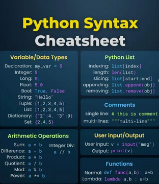

# tech_insight_20250114_18786280

**Tweet URL:** [https://x.com/Python_Dv/status/1878628030614290897](https://x.com/Python_Dv/status/1878628030614290897)

**Tweet Text:** Python syntax cheatsheet 

#python #programming #developer #programmer #coding #coder #softwaredeveloper #computerscience #webdev #webdeveloper #webdevelopment #pythonprogramming #pythonquiz #ai #ml #machinelearning #datascience

**Image 1 Description:** The infographic is an "Python Syntax Cheatsheet," which provides a list of commands and their meanings.

**Variable/Data Types**

* Declaration: my_var = 5
* Integer: 5
* Long: 5L
* Float: 5.0
* Book: True, False
* String: 'Hello'
* Tuple: (1,2,3,4,5)
* Dictionary: {'2':4,'3':9}
* Set: {2,4,5}

**Python List**

* Indexing: my_list[index]
* Slicing: my_list[start:end]
* Appending: my_list.append(obj)
* Removing: list.remove(obj)

**Comments**

* Single line: # this is a comment
* Multi-line: """multi-line comment"""

**Arithmetic Operations**

* Sum: a + b
* Difference: a - b
* Product: a * b
* Quotient: a / b
* Modulus: a % b
* Power: a ** b

**User Input/Output**

* User input: v = input("msg")
* Output: print(v)

**Functions**

* Normal function: def func(a,b): a+b
* Lambda function: lambda a,b:a+b

**Image 2 Description:** The image presents a code snippet in Python, accompanied by explanations for two programming concepts: "Logic" and "Equality checking". The code is displayed on a dark blue background with white text.

*   **Code Snippet**
    *   The code snippet consists of three sections:
        *   **Logic**: This section demonstrates the use of Boolean logic to compare values.
            *   It includes an if statement that checks whether the value of `True` is equal to `False`.
            *   If true, it prints "if True: statement".
        *   **Python Loops**: This section illustrates the concept of while loops in Python.
            *   It initializes a variable `i` with a value of 1 and increments it by 1 in each iteration until it reaches 10.
            *   The loop prints the current value of `i` during each iteration.
        *   **Equality Checking**: This section shows how to compare two values using equality operators.
            *   It defines an object named "val_1" with a value of 3 and another object named "val_2" with a value of 4.
            *   The code checks if the values of `val_1` and `val_2` are equal, and if they are not, it prints the message "[1,2,3,4] is [1,2,3,4]".

In summary, the image provides examples of basic programming concepts in Python, including Boolean logic, while loops, and equality checking. These examples can serve as a starting point for beginners looking to learn these fundamental principles of programming.

