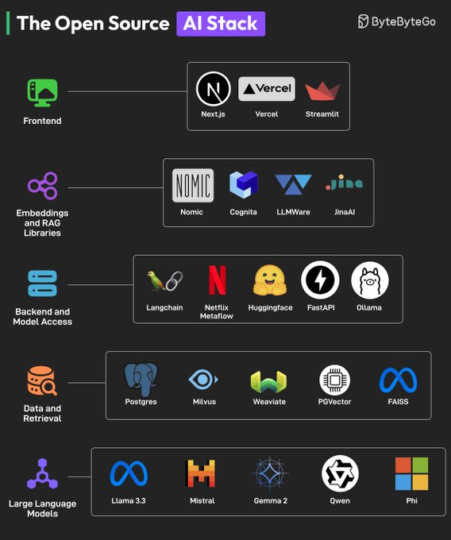

# ai_stack_overview

**Tweet URL:** [https://x.com/alexxubyte/status/1878846182962962551](https://x.com/alexxubyte/status/1878846182962962551)

**Tweet Text:** The Open Source AI Stack

What did we miss?

**Image 1 Description:** The image presents a comprehensive overview of the Open Source AI Stack, showcasing various tools and technologies that can be used to build AI applications. The image is divided into several sections, each highlighting different aspects of the AI stack.

*   **Frontend**
    *   Vercel
    *   Streamlit
*   **Embeddings and RAG Libraries**
    *   Nomic
    *   Cognita
    *   LLMWare
    *   JinaAI
*   **Backend and Model Access**
    *   Langchain
    *   Netflix Metaflow
    *   Huggingface
    *   FastAPI
    *   Qllama
*   **Data and Retrieval**
    *   PostgreSQL
    *   Milvus
    *   Weaviate
    *   PGVector
    *   FAISS
*   **Large Language Models**
    *   Llama 3.3
    *   Mistral
    *   Gemma 2
    *   Owen
    *   Phi

The image provides a visual representation of the Open Source AI Stack, making it easier for developers to navigate and understand the various tools and technologies available for building AI applications. By highlighting different aspects of the stack, the image offers a comprehensive overview of the tools and technologies that can be used to build AI applications.

