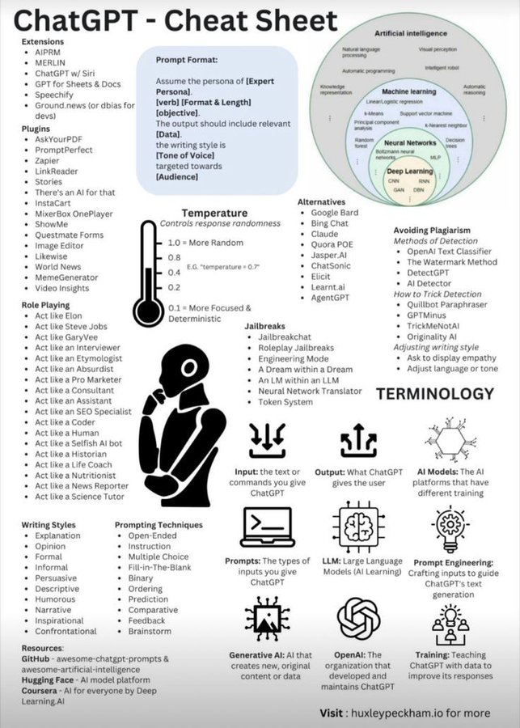

# custom_gpts

**Tweet URL:** [https://x.com/shedntcare_/status/1878601021469192572](https://x.com/shedntcare_/status/1878601021469192572)

**Tweet Text:** I'm deleting this in 24hrs because it's a legit formula to PRINT CASH.

CUSTOM GPTs.

You can make THOUSANDS building and selling them, and literally anyone can do it.

Comment "FREE" and I will DM you my full 23-hour video course right now! (must follow)

**Image 1 Description:** The infographic, titled "ChatGPT - Cheat Sheet," provides an overview of ChatGPT's capabilities and features. The sheet is divided into several sections, each addressing a different aspect of the tool.

**Extensions**

* AIPRM
* MERLIN
* ChatGPT w/ Siri
* GPT for Sheets & Docs

**Plugins**

* AskYourPDF
* PromptPerfect
* Zapier
* LinkReader
* Stories
* Thre3 an AI for that
* InstaCart
* MixrBox OnePlayer
* ShowMe
* Questmate Forms
* Image Editor
* Likewise
* World News
* MemeGenerator
* Video Insights

**Prompt Format**

* Assume the persona of an expert personal
* Verb: [Format & Length] objective
* The output should include relevant data, with writing styles being Tone of Voice targeted towards the audience

**Alternatives to ChatGPT**

* Google Bard
* Bing Chat
* Claude
* Quora POE
* Jasper.AI
* ChatSonic
* Elicit
* Leamt.ai
* Agent GPT

**Avoiding Plagiarism Methods of Detection**

* OpenAI Text Classifier
* The Watermark Method
* DetectGPT
* AI Detector
* How to Trick Detection
* Qulbot Paraphraser
* GPTMinus
* TrickMeNotAI
* Originality AI
* Adjusting writing style
* Ask to display empathy

**Terminology**

* AI models: The AI platforms that have different training
* Large Language Models (LLM): Large language models are a type of machine learning model designed for natural language processing tasks. They are typically trained on large datasets and can generate human-like text.
* OpenAI: OpenAI is an artificial intelligence research laboratory founded in 2015 by Elon Musk, Sam Altman, Nick Bostrom, and others. It focuses on developing and promoting friendly AI that benefits society as a whole.

**Writing Styles**

* Explanation
* Opinion
* Formal
* Informal
* Persuasive
* Descriptive
* Humorous
* Narrative
* Inspirational
* Confrontational

**Prompting Techniques**

* Open-ended instruction
* Multiple choice
* Fill-in-the-blank
* Binary ordering
* Prediction
* Comparative feedback
* Brainstorming

**Resources**

* GitHub: GitHub is a web-based platform for version control and collaboration on software development projects. It allows users to host and manage their code repositories, track changes, collaborate with others, and share their work publicly or privately.
* Hugging Face: Hugging Face is an open-source AI model hub that provides pre-trained models, tools, and resources for natural language processing, computer vision, and other tasks. It offers a range of features, including model hosting, versioning, and collaboration tools.

**Generative AI**

* Generative AI refers to a subfield of artificial intelligence (AI) that involves generating new content or data based on patterns learned from existing data. This can include text generation, image synthesis, music composition, and more.

