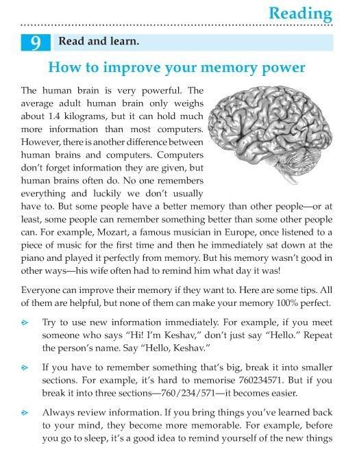

**Source:** [https://twitter.com/i/web/status/1879498442072109551](https://twitter.com/i/web/status/1879498442072109551)
**Original Post Date:** 2025-07-23 06:34:19

# Optimizing Memory Management: Practical Techniques for Software Engineers

## Introduction
Memory optimization is a critical aspect of software development that directly impacts application performance. This article delves into practical techniques inspired by cognitive science to enhance memory management in software systems. We will explore how immediate repetition, breaking down complex data structures, and regular reviews can significantly improve memory efficiency.

## Immediate Repetition for Memory Retention

In software development, immediate repetition of newly learned information or patterns is crucial. This technique leverages the brain's short-term memory to reinforce learning. For example, when encountering a new API call or data structure, repeating its usage immediately helps in better retention.

This method aligns with cognitive science principles where immediate repetition strengthens neural pathways associated with the information being learned.

- Repeat new API calls or data structures immediately after learning them.
- Use echoing techniques, such as repeating a new function name or method signature out loud or in code comments.

> **Note/Tip:** Immediate repetition is most effective when the information is still fresh in short-term memory.

> **Note/Tip:** This technique can be integrated into coding practices by writing down or using the new information right after learning it.

## Chunking Complex Information

Breaking down complex data structures or large datasets into smaller, manageable chunks is a proven method to enhance memory retention. This technique is particularly useful when dealing with large-scale data processing or complex algorithmic patterns.

For instance, when handling a large dataset, breaking it into smaller subsets for individual processing can make the task more manageable and easier to remember.

- Divide large datasets or complex data structures into smaller, logical chunks.
- Process each chunk individually before integrating them back together.
- Use modular programming techniques to break down complex functions or classes into smaller, reusable components.

> **Note/Tip:** Chunking helps in reducing cognitive load by breaking down overwhelming tasks into simpler sub-tasks.

> **Note/Tip:** This technique is also useful for improving code readability and maintainability.

## Regular Review for Long-Term Memory

Regular review of learned information is essential for transferring it from short-term to long-term memory. This practice is particularly important in software development, where continuous learning and adaptation are necessary.

For example, reviewing newly learned programming concepts or algorithms before going to sleep can reinforce memory retention through the process of consolidation during sleep.

- Schedule regular review sessions for new information or skills.
- Use spaced repetition techniques to enhance long-term retention.
- Integrate review practices into daily coding routines, such as revisiting and refactoring old code.

> **Note/Tip:** Regular reviews help in identifying gaps in understanding and reinforcing knowledge.

> **Note/Tip:** Spaced repetition tools can be used to optimize the review schedule for maximum retention.

## Visual Aids and Mnemonic Devices

Incorporating visual aids, such as diagrams or flowcharts, can significantly enhance memory retention. Additionally, using mnemonic devices—such as acronyms or analogies—to represent complex concepts can make them easier to remember.

For example, creating a diagram of a data structure or algorithm can help in visualizing and remembering its components and relationships.

- Use diagrams, flowcharts, and other visual aids to represent complex information.
- Create mnemonic devices such as acronyms or analogies for difficult concepts.
- Leverage mind mapping techniques to connect related ideas visually.

> **Note/Tip:** Visual aids help in breaking down complex information into more digestible parts.

> **Note/Tip:** Mnemonic devices can be particularly useful for remembering technical terms, commands, or algorithms.

## Practical Applications in Software Development

Applying these memory improvement techniques in software development can lead to better code quality and efficiency. For instance, using chunking to break down large functions into smaller, reusable methods can improve code readability and maintainability.

Regular reviews of codebases or documentation can help in identifying areas for improvement and reinforcing best practices.

- Break down complex functions into smaller, reusable components using chunking techniques.
- Conduct regular code reviews to reinforce learning and identify improvement opportunities.
- Use visual aids such as UML diagrams or architecture charts to represent system designs.

> **Note/Tip:** Applying memory improvement techniques in software development can lead to better code quality and efficiency.

> **Note/Tip:** Regular reviews of codebases or documentation can help in identifying areas for improvement and reinforcing best practices.

## Key Takeaways

- Immediate repetition strengthens neural pathways associated with newly learned information.
- Chunking breaks down complex data structures into smaller, manageable parts.
- Regular reviews enhance long-term memory retention through the process of consolidation during sleep.
- Visual aids and mnemonic devices make complex concepts easier to remember.
- Applying these techniques in software development improves code quality and efficiency.

## Conclusion
By integrating immediate repetition, chunking, regular review, and visual aids into your learning and coding practices, you can significantly enhance memory management and overall performance in software development. These techniques not only improve retention but also lead to better code organization and maintainability.

## External References

- [Cognitive Science Principles for Learning](https://www.cogsci.org/learning)
- [Memory Techniques in Software Development](https://www.softwareengineeringdaily.com/2018/05/23/memory-techniques-software-development/)

## Media

**Image Description:** The image is a page from an educational reading material titled **"How to improve your memory power."** The content is structured to provide tips and insights on enhancing memory skills. Below is a detailed description:

### **Main Subject and Layout**
1. **Title**: 
   - The main title is **"How to improve your memory power"**, written in bold blue text at the top of the page.
   - The subtitle, **"Read and learn,"** is written in smaller text above the main title.

2. **Introduction**:
   - The introduction discusses the human brain's power and its ability to hold more information than most computers, despite being relatively small (about 1.4 kilograms).
   - It highlights a key difference between human brains and computers: computers do not forget information, whereas human brains often do.
   - The text mentions that some people have better memories than others, using examples like Mozart, who could play music perfectly from memory after hearing it once, and contrasts this with Mozart's wife having to remind him of the day of the week.

3. **Memory Improvement Tips**:
   - The page lists several practical tips for improving memory, each introduced with a bullet point:
     1. **Use new information immediately**: The text advises repeating new information right away. For example, if someone introduces themselves as "Keshav," the reader should repeat the name immediately: "Hello, Keshav."
     2. **Break information into smaller sections**: For complex information like long numbers, the text suggests breaking them into smaller, manageable sections. For example, the number **760234571** can be broken into **760/234/571** to make it easier to remember.
     3. **Review information regularly**: The text emphasizes the importance of reviewing learned information to make it more memorable. It suggests reminding oneself of new information before going to sleep.

4. **Visual Elements**:
   - A **black-and-white illustration of a human brain** is placed on the right side of the page, serving as a visual aid to reinforce the topic of memory and the brain.
   - The text is organized into clear paragraphs with bullet points for the tips, making the content easy to follow.

5. **Design and Formatting**:
   - The page is clean and well-structured, with a mix of bold and regular text for emphasis.
   - The title and subheading are in blue, drawing attention to the main topic.
   - The bullet points are clearly marked with arrows (">") to highlight the tips.

### **Technical Details**
- **Font**: The text uses a clear, readable font suitable for educational materials.
- **Color Scheme**: The page uses a simple color scheme with blue for headings and black for the main text.
- **Layout**: The layout is organized, with the brain illustration aligned to the right, leaving ample space for the text on the left.
- **Page Number**: The page number "9" is visible in the top-left corner, indicating its position in the book or document.

### **Overall Impression**
The page is designed to be educational and engaging, combining textual information with a visual aid to explain the concept of memory improvement. The tips provided are practical and easy to implement, making the content accessible to readers of various ages and backgrounds. The use of examples and clear formatting enhances the readability and effectiveness of the material.
