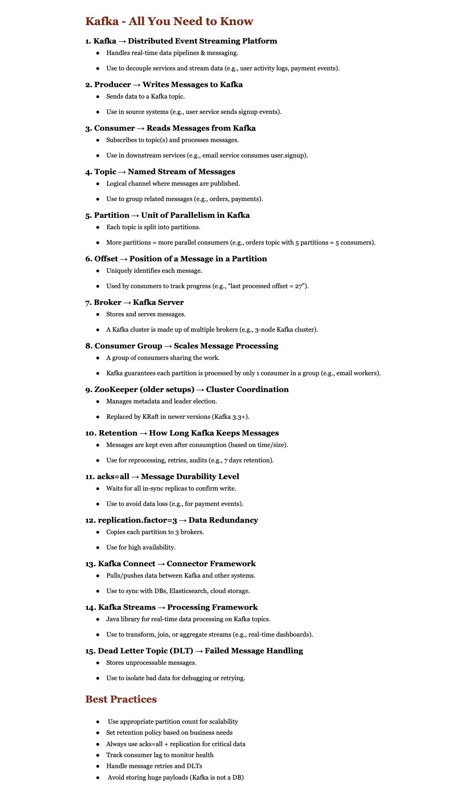

**Source:** [https://twitter.com/i/web/status/1947150878550479256](https://twitter.com/i/web/status/1947150878550479256)
**Original Post Date:** 2025-07-23 06:30:08

# Apache Kafka: Comprehensive Overview of Architecture, Components, and Best Practices

## Introduction
Apache Kafka is a distributed event streaming platform designed for handling large volumes of real-time data. This document provides an in-depth overview of Kafka's key concepts, components, and best practices to help developers and architects implement it effectively.

## Kafka as a Distributed Event Streaming Platform

Apache Kafka is a distributed system designed for handling real-time data pipelines and messaging. It excels at processing large volumes of data efficiently and reliably, making it ideal for use cases like decoupling services and streaming user activity logs or payment events.

- Decoupling services and streaming data (e.g., user activity logs, payment events).
- Real-time data processing and analytics.

## Producers: Writing Messages to Kafka

Producers are responsible for sending data to Kafka topics. They act as the source systems that generate messages, such as a user service sending signup events.

Producers write messages to specific Kafka topics, which are named streams of messages.

## Consumers: Reading Messages from Kafka

Consumers read messages from Kafka topics and subscribe to one or more topics. They process the messages consumed from Kafka, often used in downstream services like an email service consuming user.signup events.

Consumer groups allow multiple consumers to work together by sharing the workload of processing messages from a topic.

## Topics: Named Streams of Messages

A topic in Kafka is a named stream of messages. It serves as a logical channel for publishing and subscribing to messages, grouping related messages such as orders or payments.

Topics are divided into partitions, which enable parallelism and allow multiple consumers to process messages simultaneously.

## Partitions: Units of Parallelism in Kafka

Each topic is split into partitions, which are the units of parallelism in Kafka. More partitions allow for more parallel consumers, enabling efficient processing of large volumes of data.

For example, if an orders topic has 5 partitions, it can be processed by up to 5 consumers simultaneously.

## Offsets: Position of a Message in a Partition

An offset uniquely identifies each message within a partition. It is used by consumers to track their progress and ensure that messages are processed in order.

For instance, if the last processed offset is 27, the consumer knows it has processed up to the 28th message in the partition.

## Brokers: Kafka Servers

A broker is a Kafka server that stores and serves messages. A Kafka cluster typically consists of multiple brokers, which work together to provide high availability and fault tolerance.

For example, a 3-node Kafka cluster ensures redundancy and reliability.

## Consumer Groups: Scaling Message Processing

A consumer group is a group of consumers that share the work of processing messages from a topic. Kafka ensures that each partition within a topic is processed by only one consumer in a group.

This allows for scaling message processing across multiple consumers, such as multiple email workers processing orders.

## ZooKeeper (Older Setups): Cluster Coordination

In older Kafka setups, ZooKeeper was used to manage metadata and leader election within the cluster. It provided coordination services for the Kafka brokers.

However, newer versions of Kafka (3.3+) have replaced ZooKeeper with KRaft, which is a more efficient and scalable solution.

## Retention: How Long Kafka Keeps Messages

Retention in Kafka defines how long messages are kept after they have been consumed. This can be based on time or size, depending on the business requirements.

For example, a retention policy might specify that messages should be retained for 7 days to allow for reprocessing, retries, and audits.

## acks=all: Message Durability Level

The acks=all setting ensures message durability by waiting for all in-sync replicas to confirm that the write operation has been completed successfully.

This is particularly important for critical messages, such as payment events, where data loss cannot be tolerated.

## replication.factor=3: Data Redundancy

The replication.factor=3 setting copies each partition to 3 brokers within the cluster. This ensures high availability and fault tolerance by protecting against broker failures.

If one broker fails, the data is still available on the other two replicas.

## Kafka Connect: Connector Framework

Kafka Connect is a framework that allows for pulling and pushing data between Kafka and other systems. It provides connectors for integrating with databases, Elasticsearch, cloud storage, and more.

This makes it easier to sync data between Kafka and external systems without writing custom code.

## Kafka Streams: Processing Framework

Kafka Streams is a Java library for real-time data processing. It allows developers to process Kafka topics in real-time, performing transformations, joins, and aggregations on the data.

This makes it ideal for building applications that require real-time analytics or stream processing.

## Dead Letter Topic (DLT): Failed Message Handling

A Dead Letter Topic (DLT) is used to store messages that cannot be processed successfully by a consumer. These messages are isolated for debugging, retrying, or further analysis.

This helps in handling and recovering from errors without affecting the main message flow.

## Best Practices for Using Kafka

To use Kafka effectively, it is important to follow best practices such as using an appropriate partition count for scalability, setting a retention policy based on business needs, and always using acks=all for message durability.

Additionally, tracking consumer lag helps monitor the health of the system, handling message retries and DLTs ensures robustness, and avoiding storing huge payloads keeps Kafka efficient.

- Use appropriate partition count for scalability.
- Set retention policy based on business needs.
- Always use acks=all for message durability.
- Track consumer lag to monitor health.
- Handle message retries and DLTs.
- Avoid storing huge payloads (Kafka is not a database).

## Key Takeaways

- Apache Kafka is a distributed event streaming platform designed for handling real-time data pipelines and messaging.
- Producers send data to Kafka topics, while consumers read messages from these topics.
- Topics are divided into partitions, enabling parallel processing and scalability.
- Consumer groups allow multiple consumers to work together by sharing the workload of processing messages from a topic.
- Kafka ensures high availability and fault tolerance through replication and appropriate retention policies.
- Best practices include using appropriate partition counts, setting retention policies based on business needs, and always using acks=all for message durability.

## Conclusion
In conclusion, Apache Kafka is a powerful tool for handling real-time data pipelines and messaging. By understanding its architecture, components, and best practices, developers and architects can implement Kafka effectively to meet their data streaming needs.

## External References

- [Apache Kafka Documentation](https://kafka.apache.org/documentation/)
- [Kafka: The Definitive Guide](https://www.oreilly.com/library/view/kafka-the-definitive/9781492056936/)

## Media

**Image Description:** The image is a structured document titled **"Kafka - All You Need to Know"**, which serves as a comprehensive overview of Apache Kafka, a distributed event streaming platform. The document is organized into sections, each explaining key concepts, components, and best practices related to Kafka. Below is a detailed breakdown:

---

### **Main Subject: Apache Kafka Overview**
The document focuses on Apache Kafka, a distributed streaming platform used for handling real-time data pipelines and messaging. It is designed to process large volumes of data efficiently and reliably.

---

### **Key Sections and Details**

#### **1. Kafka → Distributed Event Streaming Platform**
- **Description**: Kafka is a distributed system for handling real-time data pipelines and messaging.
- **Use Cases**: 
  - Decoupling services and streaming data (e.g., user activity logs, payment events).
  - Real-time data processing and analytics.

#### **2. Producer → Writes Messages to Kafka**
- **Function**: Producers send data to Kafka topics.
- **Details**:
  - Data is sent from source systems (e.g., user service sending signup events).
  - Producers write messages to specific Kafka topics.

#### **3. Consumer → Reads Messages from Kafka**
- **Function**: Consumers read messages from Kafka topics.
- **Details**:
  - Subscribes to one or more topics and processes messages.
  - Used in downstream services (e.g., email service consuming user.signup events).

#### **4. Topic → Named Stream of Messages**
- **Definition**: A named stream of messages.
- **Purpose**:
  - Logical channel for publishing messages.
  - Groups related messages (e.g., orders, payments).

#### **5. Partition → Unit of Parallelism in Kafka**
- **Description**: Each topic is split into partitions.
- **Details**:
  - Partitions enable parallelism.
  - More partitions allow more parallel consumers (e.g., 5 partitions = 5 consumers for an orders topic).

#### **6. Offset → Position of a Message in a Partition**
- **Definition**: Uniquely identifies each message in a partition.
- **Usage**:
  - Consumers use offsets to track their progress (e.g., "last processed offset = 27").
  - Ensures message ordering and replayability.

#### **7. Broker → Kafka Server**
- **Function**: Stores and serves messages.
- **Details**:
  - A Kafka cluster consists of multiple brokers.
  - Example: A 3-node Kafka cluster.

#### **8. Consumer Group → Scales Message Processing**
- **Description**: A group of consumers sharing the work.
- **Details**:
  - Kafka ensures that each partition is processed by only one consumer in a group.
  - Example: Multiple email workers processing orders.

#### **9. ZooKeeper (older setups) → Cluster Coordination**
- **Function**: Manages metadata and leader election.
- **Details**:
  - Used in older Kafka versions.
  - Replaced by KRaft in newer versions (Kafka 3.3+).

#### **10. Retention → How Long Kafka Keeps Messages**
- **Description**: Defines how long messages are retained after consumption.
- **Details**:
  - Based on time or size (e.g., 7 days retention).
  - Used for reprocessing, retries, and audits.

#### **11. acks=all → Message Durability Level**
- **Function**: Ensures message durability.
- **Details**:
  - Waits for all in-sync replicas to confirm write.
  - Prevents data loss (e.g., for payment events).

#### **12. replication.factor=3 → Data Redundancy**
- **Description**: Copies each partition to 3 brokers.
- **Details**:
  - Ensures high availability.
  - Protects against broker failures.

#### **13. Kafka Connect → Connector Framework**
- **Function**: Pulls/pushes data between Kafka and other systems.
- **Details**:
  - Used to sync with databases, Elasticsearch, or cloud storage.

#### **14. Kafka Streams → Processing Framework**
- **Description**: Java library for real-time data processing.
- **Details**:
  - Processes Kafka topics in real-time.
  - Supports transformations, joins, and aggregations.

#### **15. Dead Letter Topic (DLT) → Failed Message Handling**
- **Function**: Stores unprocessable messages.
- **Details**:
  - Isolates bad data for debugging or retrying.

---

### **Best Practices**
The document concludes with a section on best practices for using Kafka effectively:

- **Use appropriate partition count** for scalability.
- **Set retention policy** based on business needs.
- **Always use acks=all** for message durability.
- **Track consumer lag** to monitor health.
- **Handle message retries** and DLTs.
- **Avoid storing huge payloads** (Kafka is not a database).

---

### **Visual Layout**
- The document is formatted in a clean, structured manner with bullet points and numbered sections.
- Key terms are bolded for emphasis.
- The layout is easy to read, with clear separation between concepts.

---

### **Overall Purpose**
The document serves as a concise yet comprehensive guide to understanding Kafka's architecture, components, and best practices. It is ideal for developers, architects, or anyone looking to implement Kafka in their systems. The technical details are presented in a way that balances depth with clarity, making it accessible to both beginners and experienced users.
