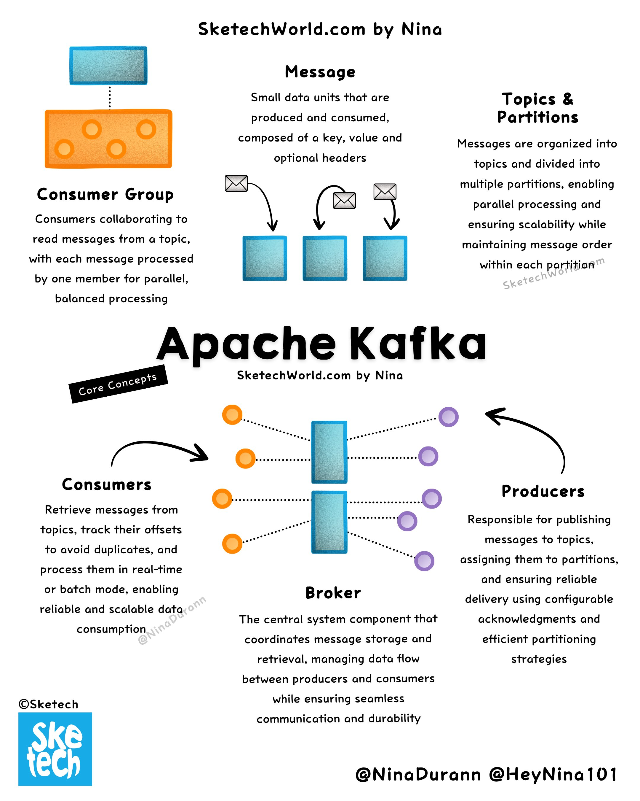

**Source:** [https://twitter.com/i/web/status/1879458854703976780](https://twitter.com/i/web/status/1879458854703976780)
**Original Post Date:** 2025-07-20 09:15:51

# Apache Kafka Core Components: A Deep Dive into Producers, Consumers, Brokers, Topics, and Partitions

## Introduction
Apache Kafka is a distributed streaming platform that enables the processing of real-time data feeds at scale. This knowledge base item delves into its core components: producers, consumers, brokers, topics, and partitions. Understanding these components is crucial for designing and implementing robust data streaming solutions.

## Overview of Kafka Components

Apache Kafka's architecture revolves around several key components that work together to handle real-time data streams. The primary components include producers, consumers, brokers, topics, and partitions.

Producers are responsible for publishing messages to Kafka topics. They play a crucial role in the initial stages of data streaming by generating and sending data to specific topics.

Consumers, on the other hand, read messages from these topics. They process the data streamed by producers, ensuring that each message is handled efficiently and without duplication.

- Producers publish messages to Kafka topics.
- Consumers read messages from Kafka topics.
- Brokers manage the storage and retrieval of messages.
- Topics categorize messages into different feeds.
- Partitions divide topics into smaller, more manageable units.

> **Note/Tip:** Ensure that producers are configured to balance load across partitions.

> **Note/Tip:** Monitor consumer groups to avoid bottlenecks in message processing.

> **Note/Tip:** Regularly check broker health and performance metrics.

## Core Concepts: Producers, Consumers, Brokers

Producers are the entry points for data into Kafka. They generate messages and send them to specific topics. Each producer can publish messages to multiple topics.

Consumers are responsible for processing the messages produced by producers. They read messages from topics and process them in real-time or batch mode, depending on the use case.

Brokers act as the central nervous system of Kafka. They manage message storage, retrieval, and coordination between producers and consumers. Each broker can handle multiple topics and partitions.

- Producers generate messages and send them to Kafka topics.
- Consumers read messages from Kafka topics for processing.
- Brokers manage message storage, retrieval, and coordination.

> **Note/Tip:** Use key-based partitioning in producers to ensure related messages end up in the same partition.

> **Note/Tip:** Implement consumer group rebalancing to handle dynamic changes in consumer groups.

> **Note/Tip:** Monitor broker disk I/O to prevent performance bottlenecks.

## Topics and Partitions

Topics are categories or feeds to which records (messages) are published by producers. Each topic is divided into multiple partitions, which allow for parallel processing of messages.

Partitions are ordered sequences of messages that are continually appended to. They provide scalability and fault tolerance by allowing multiple consumers to read from the same topic concurrently.

The number of partitions per topic determines the level of parallelism and fault tolerance in Kafka. Choosing the right number of partitions is crucial for optimal performance.

- Topics categorize messages into different feeds.
- Partitions divide topics into smaller, more manageable units.
- The number of partitions determines parallelism and fault tolerance.

> **Note/Tip:** Start with a reasonable number of partitions and scale as needed.

> **Note/Tip:** Monitor partition leader changes to detect potential issues.

> **Note/Tip:** Use partition keys to ensure related messages are processed together.

## Visual Representation

The infographic uses color-coded rectangles and circles to represent different components: blue for brokers, orange for consumers, and purple for producers.

Arrows illustrate the flow of messages between these components. Dotted lines indicate tracking mechanisms like offsets and acknowledgments.

The central diagram shows the broker as a hub connecting producers and consumers, emphasizing its role in message distribution and coordination.

- Blue rectangles represent brokers.
- Orange circles represent consumers.
- Purple circles represent producers.
- Arrows show the flow of messages between components.
- Dotted lines indicate tracking and acknowledgment mechanisms.

> **Note/Tip:** Visual aids like infographics can greatly enhance understanding of complex systems.

> **Note/Tip:** Color-coding helps in quickly identifying different components in diagrams.

> **Note/Tip:** Arrows and dotted lines provide clarity on data flow and interactions between components.

## Technical Details

Topics are the primary mechanism for organizing messages in Kafka. Each topic is divided into partitions, which allow for parallel processing and fault tolerance.

Producers publish messages to topics, assigning them to specific partitions based on configurable strategies like round-robin or key-based partitioning.

Consumers read messages from topics, tracking offsets to ensure that each message is processed only once. They can process messages in real-time or batch mode.

Brokers manage the storage and retrieval of messages, ensuring reliable delivery and coordination between producers and consumers.

Consumer groups allow multiple consumers to collaborate on processing messages from a topic, ensuring load balancing and fault tolerance.

- Topics organize messages into categories or feeds.
- Partitions divide topics for parallel processing.
- Producers publish messages to specific partitions in topics.
- Consumers read messages from topics, tracking offsets.
- Brokers manage message storage and retrieval.
- Consumer groups collaborate on processing messages from a topic.

> **Note/Tip:** Use key-based partitioning for related messages to end up in the same partition.

> **Note/Tip:** Monitor consumer group rebalancing to handle dynamic changes efficiently.

> **Note/Tip:** Ensure brokers have sufficient disk I/O to prevent performance bottlenecks.

> **Note/Tip:** Regularly check partition leader changes to detect potential issues.

## Key Takeaways

- Apache Kafka's core components include producers, consumers, brokers, topics, and partitions.
- Producers generate messages and send them to Kafka topics.
- Consumers read messages from Kafka topics for processing.
- Brokers manage message storage, retrieval, and coordination between producers and consumers.
- Topics categorize messages into different feeds, divided into partitions for parallel processing.

## Conclusion
Understanding the core components of Apache Kafka is essential for designing and implementing robust data streaming solutions. Producers generate messages, consumers process them, brokers manage storage and retrieval, topics organize messages into categories, and partitions enable parallel processing. By leveraging these components effectively, organizations can handle real-time data streams at scale with fault tolerance and reliability.

## External References

- [Apache Kafka Documentation](https://kafka.apache.org/documentation/)
- [Kafka: The Definitive Guide](https://www.oreilly.com/library/view/kafka-the-definitive/9781492056936/)

## Media

**Image Description:** ### Image Description

The image is an infographic titled **"Apache Kafka"** by **Nina**, as indicated at the top of the image. The infographic is designed to explain the core concepts of Apache Kafka, a distributed streaming platform used for handling real-time data feeds. The layout is visually organized with text, icons, and diagrams to illustrate the key components and processes involved in Kafka.

---

### **Main Sections and Details**

#### **1. Top Section: Overview of Kafka Components**
- **Consumer Group Group**:
  - **Description**: Consumers collaborating to read messages from a topic.
  - **Key Points**:
    - Consumers are organized into groups.
    - Each message from a topic is processed by one member of the group.
    - This ensures parallel and balanced processing.
  - **Visual Representation**:
    - An orange rectangle with circular icons represents the consumer group.
    - Arrows indicate the flow of messages from the broker to consumers.

- **Message**:
  - **Description**: Small data units that are produced, consumed, and composed of a key, value, and optional headers.
  - **Visual Representation**:
    - Envelopes with arrows illustrate the flow of messages.
    - Three blue rectangles represent partitions, showing how messages are distributed.

- **Topics & Partitions**:
  - **Description**: Messages are organized into topics and divided into multiple partitions for scalability and maintaining order within each partition.
  - **Visual Representation**:
    - Blue rectangles represent partitions.
    - Arrows show the flow of messages into these partitions.

---

#### **2. Core Concepts Section**
- **Consumers**:
  - **Description**: Retrieve messages from topics, track offsets to avoid duplicates, and process messages in real-time or batch mode.
  - **Visual Representation**:
    - Orange circles represent consumers.
    - Arrows show the flow of messages from the broker to consumers.
    - Dotted lines indicate the tracking of offsets.

- **Producers**:
  - **Description**: Responsible for publishing messages to topics, assigning messages to partitions, and ensuring reliable delivery.
  - **Visual Representation**:
    - Purple circles represent producers.
    - Arrows show the flow of messages from producers to the broker.

- **Broker**:
  - **Description**: The central system component that coordinates message storage, retrieval, and data flow between producers and consumers.
  - **Key Points**:
    - Ensures reliable communication and durability.
    - Manages acknowledgments and efficient partitioning strategies.
  - **Visual Representation**:
    - A blue rectangle represents the broker.
    - Arrows show the flow of messages between producers, consumers, and the broker.

---

#### **3. Central Diagram**
- **Central Visual**:
  - A central blue rectangle (broker) is connected to multiple orange circles (consumers) and purple circles (producers) via arrows.
  - Dotted lines indicate the tracking of offsets and acknowledgments.
  - The broker acts as the central hub for message distribution and coordination.

---

#### **4. Footer and Branding**
- **Branding**:
  - The bottom left corner features the **Sketech** logo.
  - The bottom right corner includes social media handles: **@NinaDurannann** and **@HeyNina101**.
- **Copyright**:
  - The copyright symbol (©) is present, indicating ownership by **Sketech**.

---

### **Technical Details**
1. **Topics**:
   - Kafka organizes messages into topics, which are categories or feeds of messages.
   - Each topic is divided into multiple partitions for scalability and parallel processing.

2. **Partitions**:
   - Partitions are sub-divisions of a topic that allow for parallel processing.
   - Each partition is an ordered, immutable sequence of messages that is continually appended to.

3. **Producers**:
   - Producers publish messages to topics.
   - They can assign messages to specific partitions based on configurable strategies (e.g., round-robin, key-based partitioning).

4. **Consumers**:
   - Consumers read messages from topics.
   - They track offsets to ensure that messages are processed only once and to avoid duplicates.

5. **Broker**:
   - The broker is the central component that manages the storage and retrieval of messages.
   - It ensures reliable delivery and coordination between producers and consumers.

6. **Consumer Groups**:
   - Consumers within a group collaborate to process messages from a topic.
   - Each message is processed by only one member of the group, ensuring load balancing.

---

### **Visual Elements**
- **Colors**:
  - Blue: Represents the broker and partitions.
  - Orange: Represents consumers.
  - Purple: Represents producers.
  - White: Background for clarity.
- **Icons**:
  - Envelopes: Represent messages.
  - Arrows: Indicate the flow of messages.
  - Dotted lines: Represent tracking and acknowledgments.

---

### **Overall Purpose**
The infographic effectively explains the core concepts of Apache Kafka, including producers, consumers, brokers, topics, and partitions. It uses a combination of text, icons, and diagrams to make the technical details accessible and visually engaging. The design is clean and organized, making it easy to understand the flow of data and the roles of each component in Kafka's architecture.
