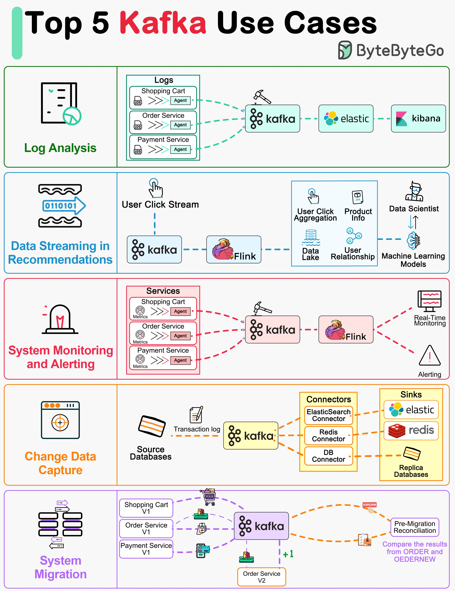

**Source:** [https://twitter.com/i/web/status/1884106639760056387](https://twitter.com/i/web/status/1884106639760056387)
**Original Post Date:** 2025-06-17 10:08:17

# Apache Kafka: Enterprise-Grade Use Cases for Distributed Streaming

## Introduction
Apache Kafka has become a cornerstone technology in distributed streaming architectures. This knowledge base explores five critical enterprise use cases where Kafka serves as the central message broker, handling high-volume data streams with reliability and scalability. From real-time analytics to complex system migrations, these scenarios demonstrate Kafka's versatility in modern microservices environments.

## 1. Log Analysis

Kafka efficiently centralizes logging from distributed services using dedicated agents.

The pipeline streams logs through Kafka to Elasticsearch for indexing, with Kibana providing real-time visualization capabilities.

1. Implement agents in each microservice for consistent logging
1. Configure Kafka retention policies based on log volume and compliance needs

> **Note/Tip:** Ensure proper partitioning of log topics based on service names or timestamps

## 2. Real-Time Data Streaming for Recommendations

User interaction streams are captured via click tracking and processed in real-time using Apache Flink.

Processed data feeds into a data lake, enabling ML models to generate personalized recommendations.

- Use schema registry for consistent event structure
- Implement backpressure mechanisms to handle peak loads

## 3. System Monitoring and Alerting

Metrics from distributed services are streamed through Kafka using specialized agents.

Flink processes these metrics in real-time, enabling immediate alert generation based on predefined thresholds.

> **Note/Tip:** Design compact metric events to optimize network usage

## 4. Change Data Capture

Kafka Connectors capture database transaction logs for CDC.

Data is distributed through Kafka to various sinks including Elasticsearch, Redis, and replica databases.

## 5. System Migration

Kafka facilitates zero-downtime system migrations by capturing data from legacy systems.

Pre-migration reconciliation ensures data consistency between old and new versions of services.

> **Note/Tip:** Maintain dual-write capability during migration phase

## Key Takeaways

- Kafka's distributed architecture enables reliable handling of high-volume streams across multiple use cases
- Integration with tools like Flink, Elasticsearch, and Redis extends Kafka's capabilities for specific use cases
- Structured approach to logging and monitoring ensures operational efficiency and proactive issue detection

## Conclusion
Apache Kafka's message broker architecture provides a robust foundation for enterprise-grade streaming applications. Its ability to handle diverse workloads while maintaining high throughput and reliability makes it essential for modern distributed systems. Whether implementing real-time analytics, system monitoring, or complex migrations, Kafka's patterns provide proven solutions for common architectural challenges.

## External References

- [Apache Kafka Documentation](https://kafka.apache.org/documentation)
- [ByteByteGo Kafka Use Cases Infographic](https://bytebytego.com/kafka-use-cases)

## Media

**Image Description:** The image is an infographic titled **"Top 5 Kafka Use Cases"**, created by **ByteByteGo**. It visually illustrates five primary use cases for Apache Kafka, a popular distributed streaming platform. Each use case is presented in a separate section with icons, diagrams, and brief descriptions. Below is a detailed breakdown of each section:

---

### **1. Log Analysis**
- **Icon**: A document icon with a green checkmark.
- **Description**: This section focuses on using Kafka for log analysis.
- **Diagram**:
  - **Sources**: Logs from various services such as **Shopping Cart**, **Order Service**, and **Payment Service**.
  - **Agents**: Each service sends logs to Kafka using an **Agent**.
  - **Kafka**: Kafka acts as the central message broker, collecting and processing logs.
  - **Elasticsearch**: Kafka streams logs to Elasticsearch for indexing and search capabilities.
  - **Kibana**: Kibana is used for visualizing and analyzing the logs.

---

### **2. Data Streaming for Recommendations**
- **Icon**: A binary data stream icon (0110101).
- **Description**: This section demonstrates Kafka's role in real-time data streaming for recommendation systems.
- **Diagram**:
  - **User Click Stream**: User interactions (clicks) are captured as a stream of data.
  - **Kafka**: Kafka collects and processes the user click stream.
  - **Flink**: Apache Flink is used for real-time stream processing.
  - **Data Lake**: Processed data is stored in a Data Lake.
  - **Product Info**: Product information is integrated into the system.
  - **Data Scientist**: Data scientists use the processed data for analysis.
  - **Machine Learning Models**: Models are trained to generate personalized recommendations.

---

### **3. System Monitoring and Alerting**
- **Icon**: A bell icon, symbolizing alerts.
- **Description**: This section highlights Kafka's use in system monitoring and alerting.
- **Diagram**:
  - **Services**: Various services such as **Shopping Cart**, **Order Service**, and **Payment Service**.
  - **Metrics Agents**: Each service sends metrics (e.g., performance, errors) to Kafka using an **Agent**.
  - **Kafka**: Kafka collects and processes the metrics.
  - **Flink**: Flink is used for real-time aggregation and analysis of metrics.
  - **Real-Time Monitoring**: Metrics are visualized in real-time.
  - **Alerting**: Alerts are triggered based on predefined thresholds.

---

### **4. Change Data Capture**
- **Icon**: A database icon with a magnifying glass.
- **Description**: This section explains Kafka's role in capturing changes in databases.
- **Diagram**:
  - **Source Databases**: Transaction logs from databases are captured.
  - **Kafka**: Kafka acts as the central broker for change data capture.
  - **Connectors**: Kafka Connectors are used to integrate with databases.
  - **Sinks**: Data is streamed to various sinks such as:
    - **Elasticsearch**: For search and analytics.
    - **Redis**: For caching and fast access.
    - **Replica Databases**: For maintaining backups or replicas.

---

### **5. System Migration**
- **Icon**: A database migration icon.
- **Description**: This section illustrates Kafka's use in system migration.
- **Diagram**:
  - **Old System**: Existing services such as **Shopping Cart V1**, **Order Service V1**, and **Payment Service V1**.
  - **Kafka**: Kafka captures data from the old system.
  - **New System**: New versions of services (**V2**) are being developed.
  - **Pre-Migration Reconciliation**: Kafka is used to compare and reconcile data between the old and new systems.
  - **Order Service V2**: The new version of the Order Service is integrated with Kafka.

---

### **Overall Design and Layout**
- The infographic uses a clean, structured layout with distinct sections for each use case.
- Each section includes:
  - A **title** and **icon** to represent the use case.
  - A **diagram** illustrating the flow of data and components involved.
  - **Color coding** to differentiate between use cases and components (e.g., green for Log Analysis, blue for Data Streaming, etc.).
- The **Kafka logo** is prominently featured in each diagram, emphasizing its central role in all use cases.

---

### **Key Technical Details**
1. **Kafka as a Message Broker**: Kafka is shown as the central component in all use cases, handling data ingestion, processing, and distribution.
2. **Integration with Other Tools**:
   - **Elasticsearch and Kibana**: For log analysis and visualization.
   - **Flink**: For real-time stream processing.
   - **Redis**: For caching and fast access.
   - **Kafka Connectors**: For integrating with databases and other systems.
3. **Real-Time Processing**: Kafka is used for real-time data streaming and processing in multiple use cases.
4. **Scalability and Resilience**: The diagrams imply Kafka's ability to handle large volumes of data and ensure reliability.

---

This infographic effectively communicates the versatility of Kafka across various enterprise use cases, highlighting its role in log analysis, data streaming, monitoring, change data capture, and system migration.
