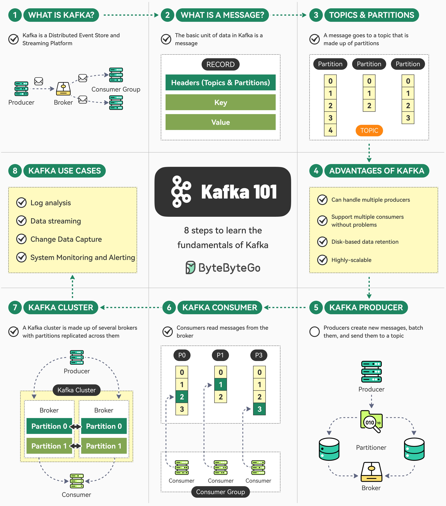

**Source:** [https://twitter.com/i/web/status/1931931018690519219](https://twitter.com/i/web/status/1931931018690519219)
**Original Post Date:** 2025-06-17 11:37:08

# Apache Kafka Fundamentals: Understanding Core Components and Use Cases

## Introduction
Apache Kafka has revolutionized event-driven architectures by providing a robust distributed messaging system. This knowledge base item explores the fundamental concepts of Kafka, its core architectural components, and real-world use cases that demonstrate its value in enterprise environments.

## What is Apache Kafka?

Kafka is an open-source distributed event streaming platform designed to handle high-throughput messaging. It functions as both a message broker and data storage system, enabling scalable real-time data processing.

- Distributed architecture with fault tolerance
- High throughput and low latency
- Persistent message storage

> **Note/Tip:** Kafka's design makes it ideal for both streaming real-time data and serving as a source of truth for historical data

## Message Structure and Components

Each message in Kafka consists of three key components: headers, key, and value. The structure enables efficient routing and processing of data.

Headers contain metadata about the topic and partition.

The optional key field is used for deterministic message distribution across partitions.

## Topics and Partitions

Kafka organizes messages into topics, which serve as categories or feeds. Each topic is further divided into partitions for parallel processing.

Partitions are ordered sequences of messages that enable scalable consumption patterns.

```bash
# Create a new topic with 3 partitions
kafka-topics.sh --create --topic orders --bootstrap-server localhost:9092 --partitions 3
```

## Advantages of Kafka Architecture

Kafka's distributed nature offers several key advantages:
- Horizontal scalability
- High availability through replication
- Persistent message storage

1. Support for multiple producers and consumers
1. Disk-based retention policies
1. Cluster-wide fault tolerance

## Producer Component

Producers are responsible for publishing messages to Kafka topics. They batch messages before sending them to brokers.

```java
// Example producer configuration
Properties props = new Properties();
props.put(ProducerConfig.BOOTSTRAP_SERVERS_CONFIG, "localhost:9092");
```

## Consumer Component

Consumers subscribe to topics and process messages in parallel through consumer groups.

> **Note/Tip:** Each partition can only be consumed by one consumer within a group at any time

## Kafka Cluster Architecture

A Kafka cluster consists of multiple brokers that manage partitions. Replication across brokers ensures fault tolerance.

Replication factor determines the level of redundancy and availability.

```bash
# Configure replication
kafka-topics.sh --alter --topic orders --bootstrap-server localhost:9092 --replication-factor 3
```

## Real-World Use Cases

Kafka is widely used in various enterprise scenarios:
- Real-time log analysis
- Data stream processing
- Change Data Capture (CDC)
- Monitoring and alerting systems

- Log aggregation from distributed systems
- Real-time analytics dashboards
- Event sourcing patterns in microservices

## Key Takeaways

- Kafka's distributed architecture enables high-throughput, fault-tolerant message processing
- Topics and partitions provide scalable data organization for parallel consumption
- Consumer groups ensure efficient load balancing across multiple consumers
- Kafka is ideal for both real-time streaming and historical data processing

## Conclusion
Apache Kafka's robust architecture makes it an essential component in modern data architectures, offering a reliable platform for handling high-volume event streams while maintaining scalability and fault tolerance.

## External References

- [Official Apache Kafka Documentation](https://kafka.apache.org/documentation/)
- [Kafka: The Definitive Guide by Confluent](https://www.confluent.io/resources/kafka-definitive-guide)


## Media

**Image Description:** This image is a detailed infographic titled **"Kafka 101"**, which provides an overview of Apache Kafka, a distributed event streaming platform. The infographic is organized into **8 steps**, each explaining a key concept or component of Kafka. Below is a detailed breakdown of the image:

---

### **1. What is Kafka?**
- **Description**: Kafka is introduced as a **Distributed Event Store and Streaming Platform**.
- **Diagram**: 
  - Shows a high-level architecture with components:
    - **Producer**: Sends messages to Kafka.
    - **Broker**: Manages the storage and replication of messages.
    - **Consumer Group**: Reads messages from Kafka.
  - Arrows indicate the flow of messages from the Producer to the Broker and then to the Consumer Group.

---

### **2. What is a Message?**
- **Description**: A message is the basic unit of data in Kafka.
- **Diagram**:
  - A message is represented as a **Record** with the following structure:
    - **Headers**: Contains metadata about the topic and partition.
    - **Key**: Optional field used for partitioning messages.
    - **Value**: The actual payload of the message.

---

### **3. Topics & Partitions**
- **Description**: 
  - **Topic**: A category or feed name to which messages are published.
  - **Partition**: A topic is divided into one or more partitions, which are ordered and immutable sequences of messages.
- **Diagram**:
  - Shows a topic divided into multiple partitions (e.g., Partition 0, Partition 1, Partition 2).
  - Each partition contains a sequence of messages (e.g., 0, 1, 2, 3, etc.).
  - Emphasizes that a message is sent to a specific partition within a topic.

---

### **4. Advantages of Kafka**
- **Description**: Lists the key benefits of using Kafka:
  - Can handle multiple producers.
  - Supports multiple consumers.
  - Disk-based data retention.
  - Highly scalable.
- **Diagram**: None, but the text highlights Kafka's robustness and scalability.

---

### **5. Kafka Producer**
- **Description**: 
  - Producers create and send new messages to Kafka.
  - Messages are batched and sent to a specific topic.
- **Diagram**:
  - Shows a Producer sending messages to a Broker.
  - Messages are batched and sent to a specific partition within a topic.
  - Includes a Partitioner component that determines which partition a message should go to based on the message key.

---

### **6. Kafka Consumer**
- **Description**: 
  - Consumers read messages from Kafka topics.
  - Consumers can be part of a Consumer Group, which ensures that messages are processed in a distributed manner.
- **Diagram**:
  - Shows multiple Consumers reading from different partitions of a topic.
  - Emphasizes that each partition is consumed by one Consumer within a Consumer Group at a time.
  - Arrows indicate the flow of messages from the Broker to the Consumers.

---

### **7. Kafka Cluster**
- **Description**: 
  - A Kafka cluster consists of multiple brokers.
  - Partitions are replicated across brokers for fault tolerance and scalability.
- **Diagram**:
  - Shows a Kafka Cluster with multiple Brokers.
  - Each Broker manages one or more partitions.
  - Arrows indicate the replication of partitions across brokers for redundancy.

---

### **8. Kafka Use Cases**
- **Description**: Lists common use cases for Kafka:
  - Log analysis.
  - Data streaming.
  - Change Data Capture (CDC).
  - System Monitoring, Monitoring, and Alerting.
- **Diagram**: None, but the text highlights Kafka's versatility in handling real-time data processing and analytics.

---

### **Central Layout and Design**
- The infographic is structured in a grid format with 8 sections, each focusing on a specific aspect of Kafka.
- Each section uses a combination of text and diagrams to explain the concept.
- Key terms are highlighted in bold or colored text for emphasis.
- Arrows and flow diagrams are used to illustrate the flow of data and interactions between components.

---

### **Overall Theme**
The infographic provides a comprehensive introduction to Kafka, covering its architecture, key components, advantages, and use cases. It is designed to be educational and accessible, making it suitable for beginners learning about Kafka.

---

### **Key Technical Details**
1. **Producer**: Sends messages to Kafka.
2. **Broker**: Manages storage and replication of messages.
3. **Consumer**: Reads messages from Kafka.
4. **Topic**: A category or feed name for messages.
5. **Partition**: A subset of a topic, used for parallelism and scalability.
6. **Partitioner**: Determines which partition a message should go to.
7. **Consumer Group**: Ensures that messages are processed in a distributed manner.
8. **Replication**: Partitions are replicated across brokers for fault tolerance.

This structured approach ensures that the viewer understands Kafka's core concepts and its practical applications.
