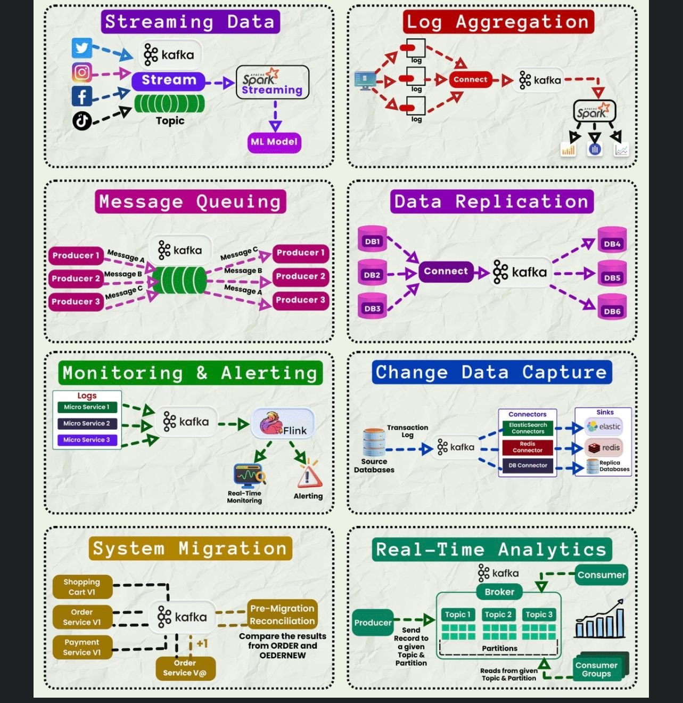

**Source:** [https://twitter.com/i/web/status/1867406019066052827](https://twitter.com/i/web/status/1867406019066052827)
**Original Post Date:** 2025-06-17 13:00:41

# Apache Kafka Use Cases: Comprehensive Analysis of Core Enterprise Applications

## Introduction
Apache Kafka has evolved from a simple message queue to a powerful distributed streaming platform. This analysis explores its diverse applications across enterprise architectures, focusing on how Kafka's unique features enable scalable, fault-tolerant systems for various use cases including data streaming, log management, real-time analytics, and system migration. Understanding these scenarios is crucial for architects designing modern event-driven systems.

## Streaming Data Processing

Kafka serves as a central hub for real-time data processing from social media platforms (Twitter, Instagram, Facebook, Spotify). The architecture leverages Kafka Streams and Spark Streaming for immediate analysis, feeding processed data into ML models.

Key components include multiple topic partitions for scalability, stream processing layers for real-time transformation, and integration with external analytics tools.

- Ingest social media streams into Kafka topics
- Apply real-time transformations using Kafka Streams
- Process data through Spark Streaming layer

> **Note/Tip:** Consider message retention policies based on downstream consumer needs

> **Note/Tip:** Use separate topic partitions for high-throughput data sources

## Log Aggregation and Monitoring

Kafka's ability to handle high-volume log streams makes it ideal for centralized logging systems. Multiple log sources feed into Kafka topics, enabling real-time analysis.

Integration with Spark enables complex log analytics and anomaly detection.

- Aggregate logs from distributed services
- Stream to Kafka Connect for external system integration
- Process using Apache Spark for real-time insights

## System Migration Patterns

Kafka facilitates zero-downtime migrations by acting as an intermediate layer between legacy and new systems. It ensures data consistency during transitions.

Reconciliation processes monitor data accuracy across both systems.

> **Note/Tip:** Use Kafka Connect for automated data synchronization

> **Note/Tip:** Implement idempotent consumers in the target system

## Key Takeaways

- Kafka's event streaming architecture enables real-time processing across diverse enterprise scenarios
- Central role of topics and partitions in managing high-throughput data streams
- Integration patterns with tools like Spark, Flink, and Kafka Connect are essential for comprehensive solutions

## Conclusion
Apache Kafka's versatility as a distributed streaming platform makes it invaluable for modern data architectures. From real-time analytics to system migration, its capabilities address enterprise needs across multiple domains.

## External References

- [Apache Kafka Documentation](https://kafka.apache.org/documentation/)
- [Kafka Connect Reference Guide](https://docs.confluent.io/current/connect/index.html)

## Media

**Image Description:** The image is a detailed diagram illustrating various use cases and workflows involving Apache Kafka, a popular distributed streaming platform. The diagram is organized into a 3x4 grid, with each cell representing a different use case or scenario. Below is a detailed breakdown of each section:

---

### **Top Row:**
#### **1. Streaming Data**
- **Description:** This section demonstrates how Kafka is used for streaming data from various sources.
- **Key Components:**
  - **Data Sources:** Social media platforms (Twitter, Instagram, Facebook, and Spotify) are shown as data sources.
  - **Kafka Topics:** Data from these sources is ingested into Kafka topics, represented by green cylinders labeled "Topic."
  - **Stream Processing:** Kafka Streams is used to process the data in real-time.
  - **Spark Streaming:** Data is further processed using Apache Spark Streaming.
  - **ML Model:** The processed data is fed into a machine learning model for further analysis.
- **Flow:** Social media data → Kafka Topics → Kafka Streams → Spark Streaming → ML Model.

#### **2. Log Aggregation**
- **Description:** This section shows how Kafka is used for aggregating logs from multiple sources.
- **Key Components:**
  - **Log Sources:** Multiple log sources (labeled as "log") are shown.
  - **Kafka Topics:** Logs are ingested into Kafka topics.
  - **Kafka Connect:** Kafka Connect is used to transfer data between Kafka and other systems.
  - **Spark:** Spark is used for processing and analyzing the aggregated logs.
- **Flow:** Logs → Kafka Topics → Kafka Connect → Spark.

---

### **Middle Row:**
#### **3. Message Queuing**
- **Description:** This section illustrates Kafka's role as a message queue.
- **Key Components:**
  - **Producers:** Multiple producers (Producer 1, Producer 2, Producer 3) send messages (Message A, Message B, Message C) to Kafka topics.
  - **Kafka Topics:** Messages are stored in Kafka topics, represented by green cylinders.
  - **Consumers:** Producers can also act as consumers, reading messages from Kafka topics.
- **Flow:** Producers → Kafka Topics → Consumers.

#### **4. Data Replication**
- **Description:** This section shows how Kafka is used for data replication across multiple databases.
- **Key Components:**
  - **Databases:** Multiple databases (DB1, DB2, DB3) are shown.
  - **Kafka Topics:** Data is replicated into Kafka topics.
  - **Kafka Connect:** Kafka Connect is used to replicate data from Kafka to other databases (DB4, DB5, DB6).
- **Flow:** Databases → Kafka Topics → Kafka Connect → Replicated Databases.

---

### **Bottom Row:**
#### **5. Monitoring & Alerting**
- **Description:** This section demonstrates how Kafka is used for monitoring and alerting in microservices.
- **Key Components:**
  - **Microservices:** Multiple microservices (Micro Service 1, Micro Service 2, Micro Service 3) generate logs.
  - **Kafka Topics:** Logs are sent to Kafka topics.
  - **Flink:** Apache Flink is used for real-time processing and alerting.
  - **Monitoring Tools:** Real-time monitoring and alerting tools are used to detect anomalies.
- **Flow:** Microservices → Kafka Topics → Flink → Monitoring & Alerting.

#### **6. Change Data Capture (CDC)**
- **Description:** This section illustrates Kafka's use in Change Data Capture (CDC) for database replication.
- **Key Components:**
  - **Source Databases:** Transaction logs from source databases are captured.
  - **Kafka Topics:** Change data is sent to Kafka topics.
  - **Connectors:** Kafka Connectors (e.g., ElasticSearch, Redis) are used to replicate data to sinks.
- **Flow:** Source Databases → Kafka Topics → Kafka Connectors → Sinks.

---

### **Bottom Row (Continued):**
#### **7. System Migration**
- **Description:** This section shows how Kafka is used in system migration scenarios.
- **Key Components:**
  - **Old System:** An old system (e.g., Shopping Cart VI, Order Service VI) is shown.
  - **Kafka Topics:** Data is migrated from the old system to Kafka topics.
  - **New System:** A new system (e.g., Order Service VI) is set up.
  - **Reconciliation:** Data is reconciled between the old and new systems.
- **Flow:** Old System → Kafka Topics → New System → Reconciliation.

#### **8. Real-Time Analytics**
- **Description:** This section demonstrates Kafka's role in real-time analytics.
- **Key Components:**
  - **Producer:** Data is produced and sent to Kafka topics.
  - **Kafka Topics:** Data is stored in Kafka topics, which are partitioned for scalability.
  - **Consumer:** Consumers read data from Kafka topics for real-time analytics.
- **Flow:** Producer → Kafka Topics → Consumer → Real-Time Analytics.

---

### **Overall Observations:**
1. **Central Role of Kafka:** Kafka is the central component in all use cases, serving as a message broker, data pipeline, and streaming platform.
2. **Integration with Other Tools:** Kafka is integrated with tools like Spark, Flink, Kafka Connect, and various databases and services.
3. **Scalability and Flexibility:** The diagram highlights Kafka's scalability and flexibility in handling diverse use cases, from real-time streaming to data replication and system migration.
4. **Real-Time Processing:** Many use cases emphasize real-time processing and analytics, leveraging Kafka's ability to handle high-throughput data streams.

This diagram is a comprehensive overview of Kafka's capabilities and its integration with other technologies in various enterprise scenarios.
