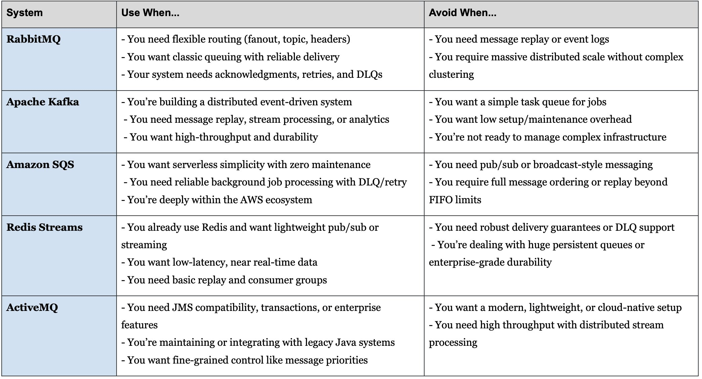

**Source:** [https://twitter.com/i/web/status/1909916300144411048](https://twitter.com/i/web/status/1909916300144411048)
**Original Post Date:** 2025-06-17 08:39:18

# Message Queue System Selection Guide: Use Cases and Pitfalls

## Introduction
Selecting the right message queue system is crucial for building robust distributed applications. This guide provides a detailed analysis of five major messaging systems - RabbitMQ, Apache Kafka, Amazon SQS, Redis Streams, and ActiveMQ - focusing on when to use or avoid each based on specific requirements and constraints.

## RabbitMQ: Enterprise-Grade Messaging with Flexible Routing

RabbitMQ is built around AMQP protocol and provides robust message queuing capabilities with multiple routing patterns. It's particularly effective for systems requiring reliable message delivery, acknowledgments, and dead letter queue management.

- Use When: Implementing flexible routing (fanout, topic, headers)
- Use When: Requiring classic queuing with reliable topic delivery
- Avoid When: Needing message replay or event logs
- Avoid When: Dealing with massive distributed scale without complex clustering

> **Note/Tip:** RabbitMQ's flexibility comes at the cost of additional configuration complexity.

## Apache Kafka: High-Throughput Event Streaming Platform

Kafka is designed for distributed event-driven systems with high-throughput requirements. It excels in scenarios requiring message replay, stream processing, and analytics capabilities.

- Use When: Building distributed event-driven architectures
- Use When: Requiring message replay and stream processing
- Avoid When: Simple task queue requirements exist
- Avoid When: Low setup/maintenance overhead is needed

> **Note/Tip:** Kafka clusters require careful planning for optimal performance.

## Amazon SQS: Serverless Queue Management in AWS

SQS provides serverless simplicity within the AWS ecosystem, ideal for background job processing with minimal management overhead.

- Use When: Working within AWS environment
- Avoid When: Pub/sub or broadcast messaging is needed
- Avoid When: Full message ordering beyond FIFO limits required

> **Note/Tip:** SQS integration with other AWS services can streamline architecture design.

## Redis Streams: Lightweight Message Queuing

Redis Streams offers a lightweight solution for real-time data processing, particularly beneficial when you already have Redis in your stack.

- Use When: Low-latency streaming is required
- Avoid When: Enterprise-grade durability needed
- Avoid When: Handling huge persistent queues

> **Note/Tip:** Redis Streams are well-suited for microservices architectures requiring real-time communication.

## ActiveMQ: JMS-Compliant Legacy Integration

ActiveMQ serves as a bridge between modern applications and legacy Java systems, offering JMS compatibility and fine-grained message control.

- Use When: Maintaining legacy Java integrations
- Avoid When: Modern cloud-native setup preferred
- Avoid When: High throughput distributed processing needed

> **Note/Tip:** ActiveMQ's feature richness comes with a higher complexity cost.

## Key Takeaways

- Select message queue systems based on specific requirements like scale, reliability, and ecosystem integration
- Consider trade-offs between simplicity (SQS) and flexibility (RabbitMQ/Kafka)
- Evaluate infrastructure readiness when choosing complex systems like Kafka

## Conclusion
Choosing the right message queue system requires careful evaluation of project needs. Consider factors such as scale requirements, existing ecosystem integration, maintenance overhead, and specific feature needs before making a selection.

## External References

- [RabbitMQ Official Documentation](https://www.rabbitmq.com/documentation.html)
- [Apache Kafka Docs](https://kafka.apache.org/documentation/)

## Media

**Image Description:** The image is a table comparing the use cases and scenarios to avoid for four popular messaging and queuing systems: **RabbitMQ**, **Apache Kafka**, **Amazon SQS**, and **Redis Streams**. The table is divided into three columns:

1. **System**: Lists the names of the messaging systems being compared.
2. **Use When...**: Provides scenarios or conditions under which each system is best suited.
3. **Avoid When...**: Lists scenarios or conditions where the system should not be used.

### Detailed Breakdown:

#### **RabbitMQ**
- **Use When...**
  - You need flexible routing (fanout, topic, headers, headers).
  - You want classic queuing with reliable topic delivery.
  - Your system needs acknowledgments, retries, and DLQs (Dead Letter Queues).
- **Avoid When...**
  - You need message replay or event logs.
  - You require massive distributed scale without complex clustering.

#### **Apache Kafka**
- **Use When...**
  - You're building a distributed event-driven system.
  - You need message replay, stream processing, or analytics.
  - You want high-throughput and durability.
- **Avoid When...**
  - You want a simple task queue for jobs.
  - You want low setup/maintenance overhead.
  - You're not ready to manage complex infrastructure.

#### **Amazon SQS**
- **Use When...**
  - You want serverless simplicity with zero maintenance.
  - You need reliable background job processing with DLQ/retry.
  - You're deeply within the AWS ecosystem.
- **Avoid When...**
  - You need pub/sub or broadcast-style messaging.
  - You require full message ordering or replay beyond FIFO limits.

#### **Redis Streams**
- **Use When...**
  - You already use Redis and want lightweight pub/sub or streaming.
  - You want low-latency, near real-time data.
  - You need basic replay and consumer groups.
- **Avoid When...**
  - You need robust delivery guarantees or DLQ support.
  - You're dealing with huge persistent queues or enterprise-grade durability.

#### **ActiveMQ**
- **Use When...**
  - You need JMS (Java Message Service) compatibility.
  - You're maintaining or integrating with legacy Java systems.
  - You want fine-grained control like message priorities.
- **Avoid When...**
  - You want a modern, lightweight, or cloud-native setup.
  - You need high throughput with distributed stream processing.

### Key Observations:
1. **Flexibility and Routing**: RabbitMQ excels in flexible routing and classic queuing with acknowledgments and retries.
2. **Distributed Systems**: Kafka is ideal for distributed event-driven systems, stream processing, and analytics.
3. **Serverless and AWS**: Amazon SQS is best for serverless applications within the AWS ecosystem.
4. **Lightweight Pub/Sub**: Redis Streams are suitable for lightweight pub/sub and real-time data processing.
5. **JMS Compatibility**: ActiveMQ is tailored for JMS compatibility and legacy Java systems.

### Technical Details:
- **RabbitMQ**: Supports various routing patterns (fanout, topic, headers) and DLQs.
- **Apache Kafka**: Designed for high-throughput, distributed systems, and stream processing.
- **Amazon SQS**: Offers serverless simplicity and integrates seamlessly with AWS services.
- **Redis Streams**: Provides lightweight pub/sub and real-time data processing.
- **ActiveMQ**: Focuses on JMS compatibility and fine-grained message control.

### Purpose:
The table serves as a decision-making guide for developers or architects choosing the right messaging system based on their specific requirements and constraints. It highlights the strengths and limitations of each system, helping to avoid misconfigurations or suboptimal choices. 

### Formatting:
- The table is structured with alternating row colors for readability.
- Each row corresponds to a specific system, with clear bullet points under each column for concise information.

This table is a valuable resource for anyone evaluating messaging systems for their project or application.
