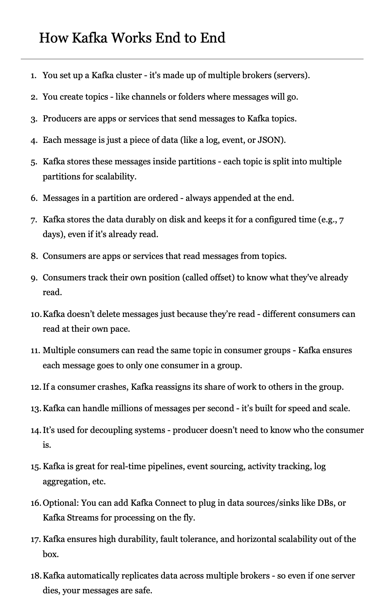

**Source:** [https://twitter.com/i/web/status/1909942573923197054](https://twitter.com/i/web/status/1909942573923197054)
**Original Post Date:** 2025-05-27 21:14:40

# Apache Kafka Explained: Core Components and End-to-End Flow

## Introduction
Apache Kafka is a distributed streaming platform designed for high-throughput, fault-tolerant real-time data processing. This knowledge base article provides an in-depth explanation of Kafka's core architecture, components, and operational flow. Understanding these fundamentals is essential for designing scalable event-driven systems and implementing robust message pipelines.

## Kafka Cluster Architecture

A Kafka cluster consists of multiple brokers (servers) working together to form a distributed system capable of handling large volumes of data. Each broker stores specific partitions of topics, enabling horizontal scalability and fault tolerance.

1. Cluster is the top-level organizational unit in Kafka
1. Each broker maintains metadata about all topics and their partitions
1. Brokers communicate with Zookeeper for coordination

## Topics, Producers, and Consumers

Messages are categorized into Topics which act as logical channels. Producers write messages to specific topics while consumers read from them. This decoupled architecture allows independent scaling of producers and consumers.

- Topics provide namespace for message categorization
- Producers are responsible for message creation
- Consumers track their position using offsets

## Partitioning and Message Ordering

Partitions divide topics into segments for parallel processing. Within a partition, messages maintain strict ordering and are appended sequentially.

This design enables high throughput while preserving message order within each partition.

> **Note/Tip:** Consider partition count based on expected throughput

> **Note/Tip:** Use key-based partitioning for ordered delivery

## Consumer Groups and Resilience

Multiple consumers can belong to a consumer group, with each consuming messages from distinct partitions. Kafka ensures exactly-once processing within groups.

Automatic rebalancing occurs when consumers join or leave the group.

1. One consumer per partition in a group
1. Automated failover through leader election
1. Group coordinator manages assignment

## Scalability and Use Cases

Kafka's distributed architecture enables processing millions of messages per second. It's widely adopted for real-time pipelines, event sourcing, activity tracking, log aggregation, and stream processing.

- Real-time data ingestion
- Event streaming platforms
- Log management systems

## Key Takeaways

- Kafka's distributed architecture ensures high throughput and fault tolerance through partitioning and replication
- Consumer groups enable parallel message processing with exactly-once semantics
- Decoupled producer-consumer model allows independent scaling of components

## Conclusion
Understanding Kafka's architectural principles is crucial for designing robust event-driven systems. The platform's combination of high throughput, fault tolerance, and scalability makes it ideal for real-time data processing applications.

## External References

- [Apache Kafka Documentation](https://kafka.apache.org/documentation/)
- [Kafka Design Patterns and Best Practices](https://www.confluent.io/blog/designing-kafka-topics-10-best-practices)

## Media

**Image Description:** The image is a document titled **"How Kafka Works End to End"**, which provides a detailed explanation of the Apache Kafka distributed streaming platform. The document is structured as a numbered list, outlining the key components, processes, and functionalities of Kafka. Below is a detailed breakdown of the content:

---

### **Main Subject:**
The main subject of the image is the **end-to-end workings of Apache Kafka**, a distributed streaming platform used for handling real-time data feeds. The document explains how Kafka operates, from setting up the infrastructure to consuming messages.

---

### **Technical Details:**

1. **Kafka Cluster Setup:**
   - Kafka is organized into a **cluster** consisting of multiple **brokers** (servers).
   - These brokers work together to form a distributed system capable of handling large volumes of data.

2. **Topics:**
   - Kafka uses **topics** to categorize messages.
   - Topics can be thought of as channels or folders where messages are stored.
   - Producers send messages to specific topics, and consumers read messages from these topics.

3. **Producers:**
   - **Producers** are applications or services that send messages to Kafka topics.
   - These messages are typically pieces of data, such as logs, events, or JSON objects.

4. **Messages:**
   - Each message is a piece of data, such as a log entry, event, or JSON object.
   - Messages are appended to the end of a partition within a topic, maintaining an ordered sequence.

5. **Partitions:**
   - Kafka stores messages inside **partitions**.
   - Each topic is divided into multiple partitions for scalability.
   - Partitions allow Kafka to distribute data across brokers, enabling parallel processing and high throughput.

6. **Message Ordering:**
   - Within a partition, messages are **ordered** and appended at the end.
   - This ensures that messages are processed in the order they were sent.

7. **Durability:**
   - Kafka stores messages **durably** on disk.
   - Messages are retained for a configured period (e.g., 7 days), even after they have been read.
   - This ensures data persistence and fault tolerance.

8. **Consumers:**
   - **Consumers** are applications or services that read messages from Kafka topics.
   - Consumers track their position in a topic using **offsets**, which indicate the last message they have read.

9. **Consumer Groups:**
   - Multiple consumers can read from the same topic in a **consumer group**.
   - Kafka ensures that each message is delivered to only one consumer within a group.
   - This prevents duplicate message processing.

10. **Consumer Resilience:**
    - If a consumer crashes, Kafka automatically **reassigns** its workload to other consumers in the group.
    - This ensures continuous message processing and fault tolerance.

11. **Scalability and Performance:**
    - Kafka is designed to handle **millions of messages per second**.
    - It is optimized for speed and scalability, making it suitable for high-throughput use cases.

12. **Decoupling Systems:**
    - Kafka decouples systems by allowing producers and consumers to operate independently.
    - Producers do not need to know who the consumers are, and vice versa.

13. **Use Cases:**
    - Kafka is widely used for:
      - Real-time pipelines
      - Event sourcing
      - Activity tracking
      - Log aggregation
      - Streaming data processing

14. **Optional Features:**
    - **Kafka Connect**: A tool for integrating Kafka with external systems (e.g., databases).
    - **Kafka Streams**: A library for processing data streams in real-time.

15. **Built-in Features:**
    - Kafka provides **high durability**, **fault tolerance**, and **horizontal scalability** out of the box.
    - Data is automatically replicated across multiple brokers to ensure availability and reliability.

16. **Replication:**
    - Kafka automatically replicates data across multiple brokers.
    - This ensures that even if one broker fails, the data remains safe and accessible.

---

### **Visual Layout:**
- The document is formatted as a numbered list, making it easy to follow the flow of information.
- Each point is clearly labeled with a number, and the text is presented in a clean, readable font.
- The content is organized logically, starting from the basics (e.g., cluster setup) and progressing to advanced features (e.g., consumer groups, replication).

---

### **Key Takeaways:**
- Kafka is a distributed streaming platform designed for high throughput and scalability.
- It uses topics, partitions, producers, and consumers to manage and process data.
- Kafka ensures durability, fault tolerance, and horizontal scalability through replication and consumer groups.
- It is widely used for real-time data processing and decoupling systems.

This document serves as an excellent introduction to Kafka's architecture and functionality, providing a comprehensive overview for both beginners and experienced users.
