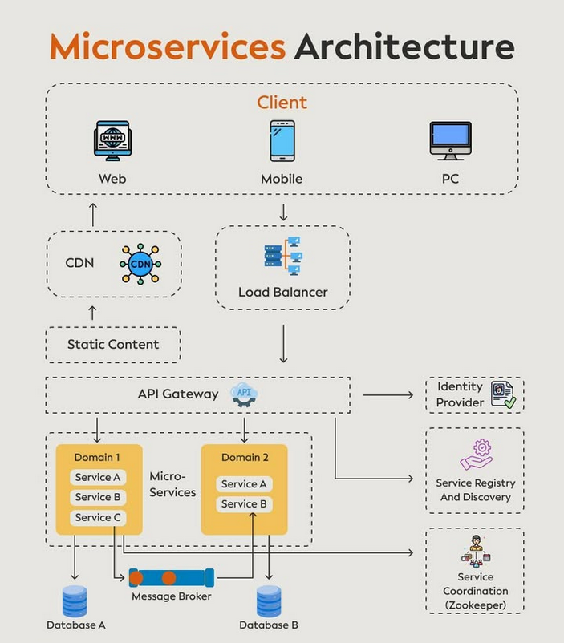

**Source:** [https://twitter.com/i/web/status/1872829824773046485](https://twitter.com/i/web/status/1872829824773046485)
**Original Post Date:** 2025-05-28 00:20:58

# Netflix Microservices Architecture: Core Components and Best Practices

## Introduction
Microservices architecture has become a cornerstone of modern software development, particularly at scale. This article explores Netflix's implementation, focusing on key architectural components that enable resilience, scalability, and maintainability in distributed systems. We'll examine how these principles transform complex applications into efficient, loosely-coupled services.

## Client Layer Architecture

The client layer represents the end-user interface, encompassing web browsers, mobile apps, and desktop clients. These interact with the system through well-defined APIs, enabling consistent service consumption across platforms.

## Content Delivery Network (CDN) Strategy

The CDN plays a crucial role in optimizing performance by caching and delivering static assets closer to users. This reduces latency and leverages edge computing principles for improved user experience.

- Caching of static resources (images, CSS, JavaScript)
- Reduced server load through distributed content delivery
- Improved global performance metrics

## API Gateway Implementation

The API Gateway serves as the single entry point for all client requests, handling critical responsibilities such as authentication, routing, and request aggregation. This component centralizes cross-cutting concerns and simplifies service discovery.

> **Note/Tip:** Consider rate limiting and circuit breaking patterns to protect backend services

> **Note/Tip:** Implement API versioning strategies for backward compatibility

## Service Registry and Discovery

Service registry tools like Consul or Zookeeper maintain dynamic service inventories, enabling automatic discovery of available instances. This decouples service dependencies and supports horizontal scaling.

- Dynamic service registration upon startup
- Health monitoring and instance status tracking
- Load balancing across healthy instances

## Event-Driven Architecture Patterns

Message brokers like Kafka facilitate asynchronous communication between services, enabling decoupled architectures. This pattern supports high throughput and fault tolerance in distributed systems.

> **Note/Tip:** Implement idempotent message handling for reliability

> **Note/Tip:** Use dead-letter queues for failed message processing

## Key Takeaways

- Decouple services around business capabilities to enable independent deployment and scaling
- Implement robust service discovery mechanisms for dynamic runtime environments
- Embrace event-driven patterns to improve system resilience and scalability
- Centralize cross-cutting concerns through API Gateway to simplify system management

## Conclusion
Netflix's microservices architecture demonstrates how strategic component design and architectural patterns can create highly scalable, resilient systems. By implementing these best practices, organizations can build distributed applications that efficiently handle evolving business requirements while maintaining operational excellence.

## External References

- [Netflix Technology Blog](https://netflixtechblog.com/)
- [Eureka Service Registry Documentation](https://github.com/Netflix/eureka/wiki)

## Media

**Image Description:** The image depicts a **Microservices Architecture** diagram, illustrating the components and flow of a modern distributed system. Below is a detailed description of the image, focusing on the main subject and relevant technical details:

---

### **Main Subject: Microservices Architecture**
The diagram illustrates how a microservices-based system is structured, highlighting the key components and their interactions. Microservices architecture is a software development approach where an application is built as a collection of small, independent services that communicate with each other over well-defined APIs.

---

### **Components and Flow**

#### **1. Client Layer**
- **Client**: The topmost section shows the client-facing components, which include:
  - **Web**: A web browser or web-based client.
  - **Mobile**: A mobile application.
  - **PC**: A desktop application.
- These clients interact with the system through APIs.

#### **2. Content Delivery Network (CDN)**
- **CDN**: A content delivery network is shown as a component that serves static content (e.g., images, CSS, JavaScript files) directly to the client. This reduces latency and improves performance by caching and distributing content closer to the user.

#### **3. Static Content**
- **Static Content**: This section represents the storage and delivery of static assets (e.g., images, CSS, JavaScript files) that are cached and served efficiently by the CDN.

#### **4. Load Balancer**
- **Load Balancer**: This component distributes incoming client requests across multiple servers or services to ensure even load distribution and high availability. It helps in managing traffic and improving system performance.

#### **5. API Gateway**
- **API Gateway**: Acts as a single entry point for all client requests. It handles tasks such as:
  - Authentication and Authorization.
  - Request routing to the appropriate microservices.
  - Aggregating responses from multiple microservices.
  - Rate limiting and monitoring.
- The API Gateway is a critical component in managing the complexity of microservices by providing a unified interface.

#### **6. Identity Provider**
- **Identity Provider (IdP)**: This component manages user authentication and authorization. It ensures that only authenticated and authorized users can access the services. The IdP typically uses protocols like OAuth2 or OpenID Connect.

#### **7. Microservices Domains**
- **Domain 1 and Domain 2**: These represent logical groupings of microservices based on business or functional domains.
  - **Domain 1**:
    - Contains services like **Service A**, **Service B**, and **Service C**.
  - **Domain 2**:
    - Contains services like **Service A** and **Service B**.
- Each domain encapsulates a specific set of functionalities, and services within a domain are designed to be loosely coupled but work together to achieve business goals.

#### **8. Service Registry**
- **Service Registry**: This component maintains a list of all available services, their locations, and metadata. It helps in service discovery, allowing services to find and communicate with each other dynamically. Tools like **Zookeeper** or **Consul** are commonly used for this purpose.

#### **9. Service Coordination**
- **Service Coordination**: This component ensures that services can coordinate with each other for tasks like distributed transactions, event handling, and workflow management. It may involve tools like **Apache Kafka** or **RabbitMQ** for message passing and coordination.

#### **10. Message Broker**
- **Message Broker**: A component that facilitates communication between microservices using asynchronous messaging. It helps in decoupling services and managing communication patterns like publish-subscribe or request-response. Common tools include **RabbitMQ**, **Kafka**, or **ActiveMQ**.

#### **11. Databases**
- **Database A and Database B**: Each microservice typically has its own database to ensure data consistency and isolation. This avoids the need for a shared database, which can lead to coupling and scalability issues.
  - **Database A**: Associated with services in **Domain 1**.
  - **Database B**: Associated with services in **Domain 2**.

---

### **Key Technical Details**
1. **Decoupling**: Each microservice is independent and can be developed, deployed, and scaled independently.
2. **Scalability**: The use of a load balancer and separate databases for each domain ensures that the system can scale horizontally.
3. **Resilience**: By isolating services, failures in one service do not affect others, improving system resilience.
4. **Service Discovery**: The service registry ensures that services can dynamically discover and communicate with each other.
5. **Event-Driven Architecture**: The message broker supports event-driven communication, enabling asynchronous processing and decoupling between services.

---

### **Summary**
The diagram effectively illustrates a modern microservices architecture, showcasing how various components work together to build a scalable, resilient, and maintainable system. Key elements include the client-facing components, API gateway, load balancer, service registry, message broker, and independent databases, all working in harmony to support a distributed and loosely coupled system.
