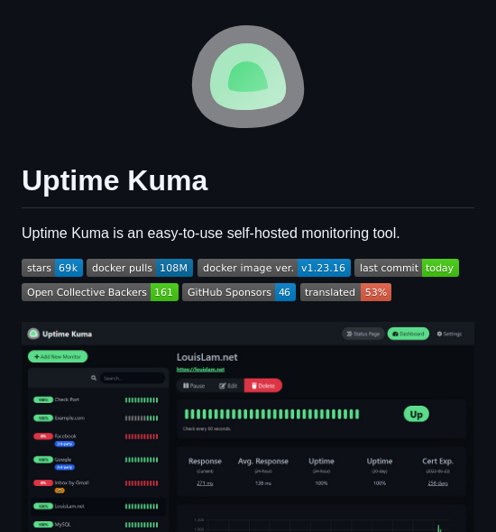

**Source:** [https://twitter.com/i/web/status/1919136851987755305](https://twitter.com/i/web/status/1919136851987755305)
**Original Post Date:** 2025-05-27 17:30:43

# Self-Hosted Monitoring Solution: Uptime Kuma Technical Overview

## Introduction
In the realm of infrastructure monitoring, controlling data sovereignty while maintaining operational efficiency is paramount. Uptime Kuma emerges as a leading open-source solution, offering self-hosted monitoring capabilities with enterprise-grade features. This technical overview explores its architecture, deployment options, and community-driven development ecosystem.

## Core Monitoring Architecture

Uptime Kuma implements a comprehensive monitoring stack capable of tracking multiple service endpoints simultaneously. The system utilizes HTTP/HTTPS requests to evaluate service availability, response times, and SSL certificate validity across different timeframes.

The monitoring engine supports various check intervals, allowing for fine-grained control over resource utilization while maintaining real-time visibility into service health.

- Real-time uptime tracking with multi-tiered monitoring (1h, 1d, 1w, 1m)
- Automatic SSL certificate expiration alerts
- Customizable check intervals and thresholds

> **Note/Tip:** Deploy with appropriate CPU allocation to handle multiple concurrent checks without performance degradation

## Deployment & Integration Architecture

Uptime Kuma's architecture is optimized for containerized deployment, leveraging Docker as its primary distribution method. The tool's modular design allows seamless integration with existing infrastructure through REST APIs and webhook support.

The system maintains a clean separation between the monitoring engine and data storage layers, facilitating horizontal scaling in high-availability deployments.

_Standard Docker Compose configuration for production deployment_

```yaml
---
version: '3.8'
services:
  uptimekuma:
    image: louislam/uptime-kuma:v1.23.16
    restart: unless-stopped
    volumes:
      - ./data:/app/data
    ports:
      - '3001:3001'
    environment:
      TZ: UTC
```

## Community & Sustainability

The project maintains active development through community contributions, evidenced by regular commits and 161 Open Collective backers. The distributed development model ensures robust feature implementation while maintaining code quality.

Localization efforts at 53% indicate a growing global user base, with ongoing translation initiatives to enhance accessibility.

1. 161 Open Collective Backers supporting development
1. 46 GitHub Sponsors providing financial resources
1. 53% localized for international adoption

## Key Takeaways

- Self-hosting offers complete control over monitoring data and infrastructure without third-party dependencies
- Docker-based deployment ensures consistent, containerized environments across different hosting platforms
- Active community support drives continuous improvement with regular updates and feature enhancements

## Conclusion
Uptime Kuma represents a mature, scalable solution for self-hosted monitoring needs. Its container-native architecture, combined with active community involvement, positions it as an ideal choice for organizations prioritizing data sovereignty while maintaining operational visibility.

## External References

- [GitHub Repository](https://github.com/louislam/uptime-kuma)
- [Docker Hub Page](https://hub.docker.com/r/louislam/uptime-kuma)


## Media

**Image Description:** The image depicts the GitHub repository page for **Uptime Kuma**, a self-hosted monitoring tool. Below is a detailed description of the image, focusing on the main subject and relevant technical details:

### **Main Subject: Uptime Kuma**
- **Title**: The repository is titled **"Uptime Kuma"**.
- **Description**: The description states that **Uptime Kuma** is an easy-to-use, self-hosted monitoring tool for monitoring uptime and availability of websites, APIs, and other services.

### **Key Metrics and Statistics**
1. **Stars**: The repository has **69 stars**, indicating its popularity and engagement within the GitHub community.
2. **Docker Pulls**: The Docker image for Uptime Kuma has been pulled **108M** times, suggesting widespread usage.
3. **Docker Image Version**: The latest Docker image version is **v1.23.16**.
4. **Last Commit**: The last commit to the repository was made **today**, indicating active development and maintenance.
5. **Open Collective Backers**: There are **161 backers** supporting the project through Open Collective, showcasing community support.
6. **GitHub Sponsors**: The project has **46 sponsors** on GitHub, further highlighting community involvement.
7. **Translation Progress**: The project is **53% translated**, indicating ongoing localization efforts.

### **User Interface (UI) Screenshot**
The lower portion of the image shows a screenshot of the Uptime Kuma dashboard, which provides insights into its functionality:

1. **Dashboard Overview**:
   - The dashboard is clean and user-friendly, with a dark theme.
   - It displays a list of monitored services or websites.

2. **Monitored Services**:
   - Each monitored service is listed with:
     - **Status Indicator**: Green bars indicate "Up" status, while red bars indicate "Down" status.
     - **Service Name**: Names of the services being monitored (e.g., "LouisLam.net," "Examples.com," "Facebook," etc.).
     - **Response Time**: Displays the average response time for each service.
     - **Uptime**: Shows the uptime percentage for each service over different timeframes (e.g., 1h, 1d, 1w, 1m).
     - **Cert Exp.**: Indicates the expiration date of SSL certificates for services that have them.

3. **Action Buttons**:
   - Each service has an **"Edit"** button, allowing users to modify monitoring settings.
   - A **"Delete"** button is also available for removing services from monitoring.

4. **Additional Features**:
   - The dashboard includes a search bar for filtering monitored services.
   - There is a **"Status Page"** button, suggesting a public-facing status page feature.
   - A **"Settings"** button is available for configuring the tool.

### **Technical Details**
1. **Self-Hosted**: The tool is designed to be self-hosted, meaning users can deploy it on their own servers or infrastructure.
2. **Docker Integration**: The high number of Docker pulls (108M) indicates that the tool is widely used with Docker containers, making deployment straightforward.
3. **Monitoring Capabilities**:
   - Monitors uptime and response times.
   - Supports SSL certificate monitoring.
   - Provides historical uptime data over various timeframes.
4. **Community Support**:
   - The presence of Open Collective Backers and GitHub Sponsors highlights active community involvement and financial support.
   - Translation progress indicates efforts to make the tool accessible to a global audience.

### **Design and Aesthetics**
- The design is modern and minimalistic, with a dark theme that enhances readability.
- The use of color coding (green for "Up" and red for "Down") makes it easy to quickly identify the status of monitored services.
- The layout is organized, with clear sections for monitoring details, settings, and actions.

### **Conclusion**
The image effectively showcases **Uptime Kuma** as a robust, community-supported, and user-friendly self-hosted monitoring tool. The combination of technical details, community engagement metrics, and a clean UI design highlights its appeal to developers and system administrators looking for a reliable monitoring solution.
