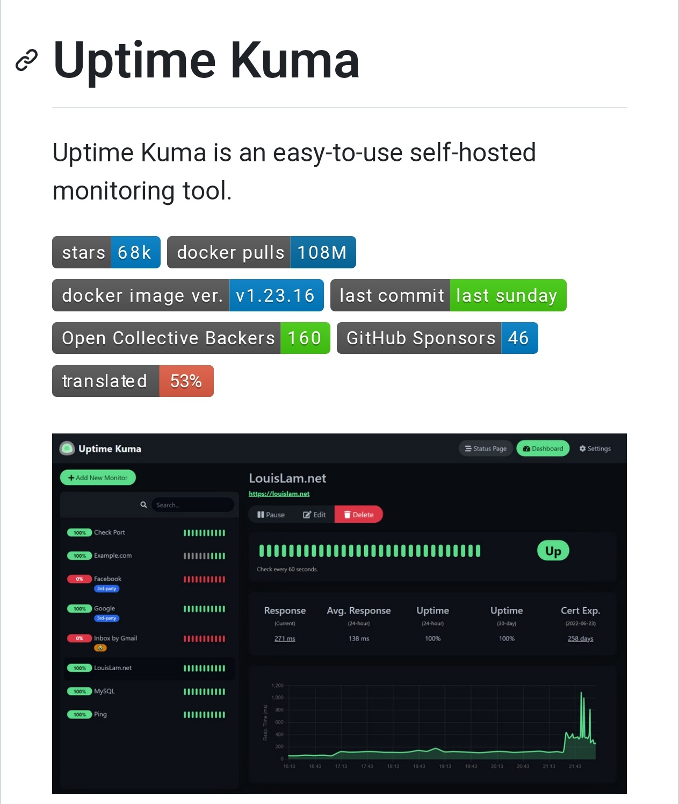

**Source:** [https://twitter.com/i/web/status/1917391436150104504](https://twitter.com/i/web/status/1917391436150104504)
**Original Post Date:** 2025-05-28 04:01:11

# Uptime Kuma: Advanced Self-Hosted Monitoring Tool Architecture

## Introduction
Uptime Kuma represents a modern approach to self-hosted monitoring solutions, offering real-time tracking of service availability and performance metrics. With over 68,000 GitHub stars and 108 million Docker pulls, it has established itself as a leading tool for infrastructure monitoring. This guide explores its technical architecture, deployment considerations, and operational capabilities.

## Core Architecture and Deployment

Uptime Kuma is architected as a self-hosted solution with Docker integration, enabling rapid deployment across various environments. The system processes health checks for multiple services simultaneously, maintaining real-time status through efficient resource management.

The application leverages a Node.js backend coupled with an Electron-based interface for cross-platform compatibility. This architecture ensures consistent performance and user experience across different operating systems.

```bash
# Deployment via Docker
docker run -d \
  --name uptime-kuma \
  -p 3001:3001 \
  --restart unless-stopped \
  louislam/uptime-kuma
```

- Containerized deployment using Docker v1.23.16
- Supports HTTPS with automatic certificate management
- Built-in database for historical metrics storage

> **Note/Tip:** Ensure sufficient memory allocation (minimum 512MB recommended) for optimal performance

## Monitoring Capabilities and Metrics

The platform provides comprehensive monitoring through multiple check types, including HTTP(S), ping, TCP, and DNS. Each monitored endpoint generates detailed metrics such as response time and uptime statistics.

For instance, the LouisLam.net example demonstrates how Uptime Kuma captures real-time data: 271ms current response time, 138ms average over 24 hours, and perfect uptime records.

1. Real-time status indicators (green/red) for immediate visibility
1. Response time monitoring with historical graphing capabilities
1. SSL certificate expiration tracking

## Community and Support Ecosystem

With 160 Open Collective backers and 46 GitHub sponsors, Uptime Kuma maintains active development and community support. The project's 53% translation progress indicates its global reach and accessibility.

The last commit being from 'last Sunday' demonstrates consistent maintenance and rapid feature iteration.

> **Note/Tip:** Monitor the GitHub repository for regular updates and security patches

## Key Takeaways

- Deploy Uptime Kuma as a Docker container for simplified management and scalability
- Leverage its comprehensive monitoring capabilities including real-time status, response time metrics, and certificate tracking
- Consider the active community support and regular updates when evaluating long-term maintenance requirements

## Conclusion
Uptime Kuma offers a robust solution for self-hosted monitoring needs, combining simplicity with advanced features. Its containerized architecture, comprehensive metrics, and strong community backing make it an excellent choice for modern infrastructure monitoring.

## External References

- [GitHub Repository](https://github.com/louislam/uptime-kuma)
- [Docker Hub Image](https://hub.docker.com/r/louislam/uptime-kuma)


## Media

**Image Description:** The image showcases **Uptime Kuma**, a self-hosted monitoring tool designed for tracking the uptime and availability of websites, APIs, and other services. Below is a detailed description of the image, focusing on its main subject and relevant technical details:

### **Header Section**
1. **Title**: 
   - The title "Uptime Kuma" is prominently displayed at the top of the image.
   - The subtitle emphasizes that Uptime Kuma is an "easy-to-use self-hosted monitoring tool."

2. **Key Metrics**:
   - **Stars**: The project has **68k stars** on GitHub, indicating its popularity.
   - **Docker Pulls**: It has been pulled **108 million times**, showcasing widespread adoption.
   - **Docker Image Version**: The current version of the Docker image is **v1.23.16**.
   - **Last Commit**: The last commit was made **last Sunday**, indicating active maintenance and updates.
   - **Open Collective Backers**: There are **160 backers** supporting the project financially.
   - **GitHub Sponsors**: The project has **46 sponsors** on GitHub.
   - **Translation Progress**: The project is **53% translated**, suggesting ongoing localization efforts.

### **Main Interface Screenshot**
The lower portion of the image shows a screenshot of the Uptime Kuma dashboard, which is the main subject of the image. Here are the key elements:

#### **Dashboard Layout**
1. **Header**:
   - The top bar includes navigation options:
     - **Status Page**: Likely a public-facing status page for users to view service availability.
     - **Dashboard**: The main monitoring interface shown in the screenshot.
     - **Settings**: Access to configuration and customization options.

2. **Monitored Services**:
   - The left sidebar lists the services being monitored:
     - **LouisLam.net**: A website being monitored.
     - **Facebook**: An example of a third-party service being checked.
     - **Google**: Another third-party service.
     - **MySQL**: A database service being monitored.
     - **Ping**: A basic network connectivity check.
   - Each service has a corresponding status indicator:
     - **Green**: Indicates the service is "Up" or functioning correctly.
     - **Red**: Indicates the service is "Down" or experiencing issues.
     - **Progress Bars**: Show the percentage of uptime or response time.

3. **Detailed Metrics for "LouisLam.net"**:
   - The main section of the dashboard provides detailed metrics for the service **LouisLam.net**:
     - **Response Time**: 
       - Current response time: **271 ms**.
       - Average response time over the last 24 hours: **138 ms**.
     - **Uptime**:
       - Uptime over the last 24 hours: **100%**.
       - Uptime over the last 30 days: **100%**.
     - **Certificate Expiry**: The SSL certificate for the site expires in **258 days**.

4. **Graphs**:
   - A line graph at the bottom of the dashboard shows the response time over time:
     - The x-axis represents time (e.g., hours or days).
     - The y-axis represents response time in milliseconds.
     - The graph indicates fluctuations in response time, with most values staying relatively low.

5. **Action Buttons**:
   - For each monitored service, there are action buttons:
     - **Pause**: Temporarily stops monitoring the service.
     - **Edit**: Allows configuration changes for the service.
     - **Delete**: Removes the service from monitoring.

### **Design and Aesthetics**
- The dashboard uses a **dark theme** with green and red indicators for status, making it visually intuitive.
- The layout is clean and organized, with clear sections for monitoring details and actions.

### **Technical Details**
1. **Self-Hosted**: 
   - Uptime Kuma is designed to be self-hosted, meaning users can run the tool on their own servers or infrastructure.
2. **Docker Integration**:
   - The tool is available as a Docker image, simplifying deployment and management.
3. **Monitoring Features**:
   - Supports monitoring of websites, APIs, databases, and network services.
   - Provides real-time status updates, response time metrics, and uptime statistics.
4. **Community and Support**:
   - The high number of stars, Docker pulls, and sponsors indicates strong community support and active development.

### **Conclusion**
The image effectively communicates the key features and popularity of Uptime Kuma, a robust and user-friendly self-hosted monitoring tool. The dashboard screenshot provides a clear view of its functionality, including real-time monitoring, detailed metrics, and a user-friendly interface. The technical details, such as Docker integration and community support, highlight its versatility and reliability.
