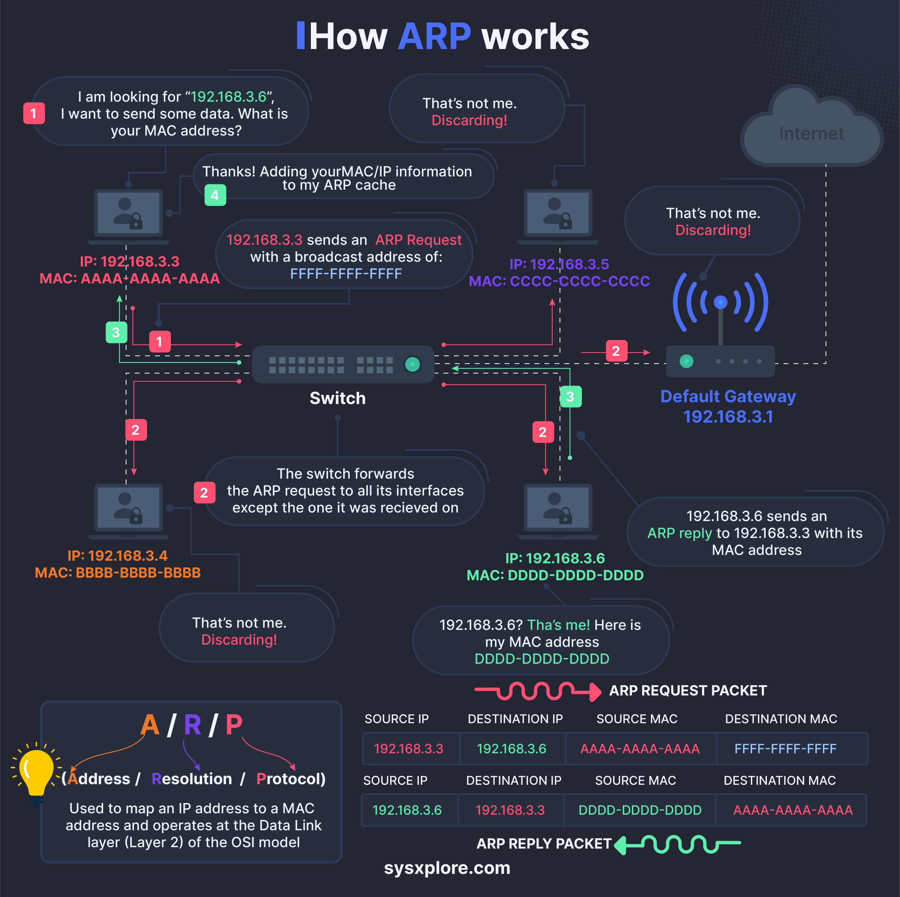

**Source:** [https://twitter.com/i/web/status/1875630944713085212](https://twitter.com/i/web/status/1875630944713085212)
**Original Post Date:** 2025-05-27 17:08:32

# Address Resolution Protocol (ARP): Mechanism and Implementation Details

## Introduction
The Address Resolution Protocol (ARP) is a fundamental component of modern networks, enabling the crucial task of mapping IPv4 addresses to their corresponding MAC addresses. This protocol operates at the Data Link layer of the OSI model, facilitating communication between devices on local networks. Understanding ARP's mechanics, from request broadcasting to cache management, is essential for network administrators and developers working with low-level networking.

## ARP Request Mechanism

When a device needs to communicate with another host on the same local network, it must first resolve the destination's MAC address. This process begins with an ARP request, which is broadcast across the entire subnet.

The source device (e.g., 192.168.3.3) creates an ARP request packet containing its own IP and MAC addresses as source information, while setting the destination MAC to a broadcast address (FF:FF:FF:FF:FF:FF).

_ARP Request Packet Structure_

```json
{
  "source_ip": "192.168.3.3",
  "source_mac": "AAAA-AAAA-AAAA-AAAA",
  "destination_ip": "192.168.3.6",
  "destination_mac": "FFFF-FFFF-FFFF-FFFF"
}
```

- Source IP address
- Source MAC address
- Target IP address (destination)
- Broadcast MAC address (FFFF-FFFF-FFFF-FFFF)

## ARP Response and Cache Management

Upon receiving the ARP request, only devices with a matching target IP address respond. The responding device sends an ARP reply containing its MAC address.

Devices maintain an ARP cache to store resolved IP-to-MAC mappings, reducing network traffic by avoiding repeated resolution requests.

_ARP Reply Packet Structure_

```json
{
  "source_ip": "192.168.3.6",
  "source_mac": "DDDD-DDDD-DDDD-DDDD",
  "destination_ip": "192.168.3.3",
  "destination_mac": "AAAA-AAAA-AAAA-AAAA"
}
```

## Switch Role in ARP Communication

Network switches play a crucial role by forwarding ARP requests to all connected devices except the source. They direct ARP replies only to the requesting device, optimizing network traffic.

1. Receive ARP request from source device
1. Forward broadcast to all other ports
1. Direct ARP reply to specific port of requesting device

## Key Takeaways

- ARP operates at the Data Link Layer (Layer 2) of the OSI model
- ARP uses broadcast addressing for initial MAC resolution
- Devices maintain ARP caches to reduce network traffic
- Switches handle ARP traffic differently for requests and replies

## Conclusion
Understanding ARP's mechanics is crucial for troubleshooting network issues and optimizing local network performance. The protocol's efficient design ensures reliable communication between devices on the same subnet while maintaining scalability.

## External References

- [RFC 826 - An Ethernet Address Resolution Protocol](https://datatracker.ietf.org/doc/html/rfc826)
- [OSI Model Layer Reference](https://en.wikipedia.org/wiki/OSI_model#Layer_2:_Data_Link_Layer)


## Media

**Image Description:** The image is a detailed infographic explaining the Address Resolution Protocol (ARP) and how it works in a network environment. ARP is a fundamental protocol used to map an IP address to a MAC address, enabling communication between devices on a local network. Below is a detailed breakdown of the image:

---

### **Main Subject: ARP Protocol**
The infographic illustrates the process of ARP in a step-by-step manner, showing how a device resolves the MAC address of another device on the same network using an ARP request and reply mechanism.

---

### **Key Components and Steps:**

#### **1. Initial Request for MAC Address**
- **Node 192.168.3.3 (Source IP)**: This device wants to send data to another device with the IP address **192.168.3.6**.
- **Unknown MAC Address**: Node 192.168.3.3 does not know the MAC address of 192.168.3.6, so it initiates an ARP request to resolve it.

#### **2. ARP Request Broadcast**
- **ARP Request Packet**: Node 192.168.3.3 broadcasts an ARP request packet to all devices on the local network.
  - **Source IP**: 192.168.3.3
  - **Source MAC**: AAAA-AAAA-AAAA-AAAA
  - **Destination IP**: 192.168.3.6
  - **Destination MAC**: FFFF-FFFF-FFFF-FFFF (Broadcast MAC address)
- **Switch Forwarding**: The switch receives the ARP request and forwards it to all connected devices except the one it was received from.

#### **3. ARP Request Handling by Devices**
- **Node 192.168.3.4**: Receives the ARP request but discards it because its IP address (192.168.3.4) does not match the destination IP (192.168.3.6).
- **Node 192.168.3.5**: Similarly, this device discards the ARP request.
- **Node 192.168.3.6**: This device recognizes that the destination IP (192.168.3.6) matches its own IP address. It responds with an ARP reply.

#### **4. ARP Reply**
- **ARP Reply Packet**: Node 192.168.3.6 sends an ARP reply back to Node 192.168.3.3.
  - **Source IP**: 192.168.3.6
  - **Source MAC**: DDDD-DDDD-DDDD-DDDD
  - **Destination IP**: 192.168.3.3
  - **Destination MAC**: AAAA-AAAA-AAAA-AAAA
- **Switch Forwarding**: The switch forwards the ARP reply directly to Node 192.168.3.3.

#### **5. ARP Cache Update**
- **Node 192.168.3.3**: Upon receiving the ARP reply, Node 192.168.3.3 updates its ARP cache with the mapping:
  - **IP Address**: 192.168.3.6
  - **MAC Address**: DDDD-DDDD-DDDD-DDDD
- **Data Transmission**: Now that the MAC address is known, Node 192.168.3.3 can send data directly to Node 192.168.3.6.

#### **6. ARP in the OSI Model**
- **Data Link Layer (Layer 2)**: The infographic emphasizes that ARP operates at the Data Link Layer of the OSI model, where MAC addresses are used for direct communication between devices on the same network.

---

### **Technical Details:**
1. **ARP Packet Structure**:
   - **ARP Request Packet**:
     - Source IP: 192.168.3.3
     - Source MAC: AAAA-AAAA-AAAA-AAAA
     - Destination IP: 192.168.3.6
     - Destination MAC: FFFF-FFFF-FFFF-FFFF
   - **ARP Reply Packet**:
     - Source IP: 192.168.3.6
     - Source MAC: DDDD-DDDD-DDDD-DDDD
     - Destination IP: 192.168.3.3
     - Destination MAC: AAAA-AAAA-AAAA-AAAA

2. **Switch Behavior**:
   - The switch forwards the ARP request to all connected devices except the one it was received from.
   - The switch forwards the ARP reply directly to the requesting device.

3. **ARP Cache**:
   - Devices maintain an ARP cache to store mappings of IP addresses to MAC addresses, reducing the need for repeated ARP requests.

4. **Broadcast Address**:
   - The ARP request uses a broadcast MAC address (FFFF-FFFF-FFFF-FFFF) to reach all devices on the network.

---

### **Visual Elements:**
- **Nodes**: Represented as locked icons with IP and MAC addresses.
- **Switch**: Shown as a central device forwarding packets.
- **Default Gateway**: Represented as a router connected to the Internet.
- **Arrows**: Indicate the flow of ARP requests and replies.
- **Color Coding**:
  - **Red Arrows**: ARP request packets.
  - **Green Arrows**: ARP reply packets.
  - **Blue Boxes**: Contain text explaining the process.

---

### **Conclusion:**
The infographic effectively illustrates the ARP protocol by breaking down the process into clear, sequential steps. It highlights the role of ARP in mapping IP addresses to MAC addresses, the behavior of switches, and the use of broadcast addresses. The visual elements and technical details make it easy to understand how ARP operates in a network environment.
