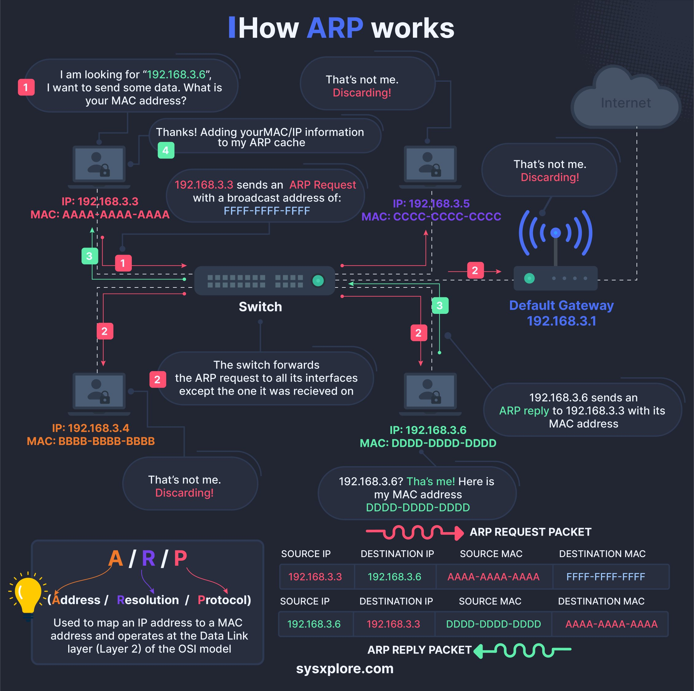

**Source:** [https://twitter.com/i/web/status/1869814952472748150](https://twitter.com/i/web/status/1869814952472748150)
**Original Post Date:** 2025-07-15 11:51:14

# Address Resolution Protocol (ARP): Workflow Explanation and Practical Implementation

## Introduction
The Address Resolution Protocol (ARP) is a fundamental protocol in network communication that maps IP addresses to MAC addresses. This process is essential for devices to communicate on a local area network (LAN). The ARP workflow involves several steps, including an initial request, switch forwarding, destination device response, ARP cache update, and handling of irrelevant requests. Understanding this process is crucial for network professionals and software engineers involved in system design and troubleshooting.

## Initial Request

The ARP workflow begins when a device wants to send data to another device on the same local network but does not know its MAC address. The source device broadcasts an ARP Request packet containing its own IP and MAC addresses, as well as the target IP address.

The ARP Request is sent with a broadcast MAC address (FFFF-FFFF-FFFF) to ensure all devices on the network receive it.

- Source IP: 192.168.3.3
- Source MAC: AAAA-AAAA-AAAA-AAAA
- Destination IP: 192.168.3.6
- Destination MAC: FFFF-FFFF-FFFF-FFFF (broadcast MAC address)

> **Note/Tip:** The broadcast nature of ARP Requests ensures that all devices on the local network receive and process the packet.

## Switch Forwarding

Upon receiving the ARP Request, a switch forwards the packet to all connected devices except the one it was received from. This behavior is inherent to how switches handle broadcast traffic.

The switch's role is crucial in ensuring that the ARP Request reaches all potential recipients on the local network.

> **Note/Tip:** Switches use a forwarding table to determine where to send packets, but for broadcasts like ARP Requests, they flood the packet across all ports except the one it came from.

## Destination Device Response

The device with the target IP address (192.168.3.6) receives the ARP Request and recognizes that it is the intended recipient. It then sends an ARP Reply packet back to the source device.

The ARP Reply contains the MAC address of the destination device, allowing the source device to establish communication.

- Source IP: 192.168.3.6
- Source MAC: DDDD-DDDD-DDDD-DDDD
- Destination IP: 192.168.3.3
- Destination MAC: AAAA-AAAA-AAAA-AAAA

> **Note/Tip:** The ARP Reply is a unicast packet, meaning it is sent directly to the source device rather than being broadcast.

## ARP Cache Update

Upon receiving the ARP Reply, the source device updates its ARP cache with the mapping between the target IP address (192.168.3.6) and its corresponding MAC address (DDDD-DDDD-DDDD-DDDD).

This cache allows the source device to quickly reference the MAC address for future communications with the same destination IP.

> **Note/Tip:** ARP caches have a time-to-live (TTL) and are periodically updated or flushed to maintain accurate mappings.

## Handling Irrelevant Requests

Devices that receive the ARP Request but do not match the target IP address simply discard the packet. This includes devices with IP addresses 192.168.3.4 and 192.168.3.5 in this example.

This behavior ensures network efficiency by preventing unnecessary processing of irrelevant packets.

> **Note/Tip:** Only the device with the target IP address responds to an ARP Request; all others ignore it.

## Default Gateway

The default gateway (192.168.3.1) is shown in the diagram but does not participate in this ARP resolution process since communication occurs within the local network.

However, if the destination IP address were outside the local network, the source device would send the packet to the default gateway for further routing.

> **Note/Tip:** Understanding the role of the default gateway is essential for troubleshooting network issues and designing efficient network architectures.

## Key Takeaways

- ARP is crucial for mapping IP addresses to MAC addresses in local networks.
- The ARP workflow involves broadcasting a request, receiving a reply, and updating the ARP cache.
- Switches play a key role in forwarding ARP Requests to all connected devices.
- Only the target device responds to an ARP Request with its MAC address.
- ARP operates at the Data Link Layer (Layer 2) of the OSI model.

## Conclusion
The Address Resolution Protocol (ARP) is a fundamental component of network communication, enabling devices to resolve IP addresses to MAC addresses efficiently. Understanding the ARP workflow, including its key components and technical details, is essential for network professionals and software engineers involved in system design and troubleshooting.

## External References

- [ARP (Address Resolution Protocol) - Cisco](https://www.cisco.com/c/en/us/support/docs/ip/address-resolution-protocol-arp/16043.html)
- [How ARP Works - IBM](https://www.ibm.com/support/pages/how-arp-works)

## Media

**Image Description:** ### Description of the Image: ARP (Address Resolution Protocol) Workflow

The image is a detailed infographic explaining how the **Address Resolution Protocol (ARP)** works in a network environment. ARP is a protocol used to map an IP address to a MAC (Media Access Control) address, which is essential for communication between devices on a local network. The infographic is visually organized with numbered steps, colored elements, and technical details to illustrate the process.

---

### **Main Subject: ARP Workflow**
The main subject of the image is the step-by-step process of how ARP resolves IP addresses to MAC addresses. The workflow is depicted using a network diagram with multiple devices, including hosts, a switch, and a default gateway. The process is explained through numbered steps, with each step highlighting a specific action or interaction.

---

### **Key Components and Technical Details**

#### **1. Initial Request**
- **Step 1**: A device (IP: 192.168.3.3, MAC: AAAA-AAAA-AAAA-AAAA) wants to send data to another device with the IP address 192.168.3.6. However, it does not know the MAC address of the destination device.
- The device broadcasts an **ARP Request** packet to all devices on the network. The ARP Request packet contains:
  - **Source IP**: 192.168.3.3
  - **Source MAC**: AAAA-AAAA-AAAA-AAAA
  - **Destination IP**: 192.168.3.6
  - **Destination MAC**: FFFF-FFFF-FFFF-FFFF (broadcast MAC address)

#### **2. Switch Forwarding**
- **Step 2**: The switch receives the ARP Request packet and forwards it to all connected devices except the one it was received from. This ensures that the packet reaches the intended recipient.

#### **3. Destination Device Responds**
- **Step 3**: The device with the IP address 192.168.3.6 (MAC: DDDD-DDDD-DDDD-DDDD) receives the ARP Request packet. It recognizes that the packet is intended for it and sends an **ARP Reply** packet back to the source device.
- The ARP Reply packet contains:
  - **Source IP**: 192.168.3.6
  - **Source MAC**: DDDD-DDDD-DDDD-DDDD
  - **Destination IP**: 192.168.3.3
  - **Destination MAC**: AAAA-AAAA-AAAA-AAAA

#### **4. ARP Cache Update**
- **Step 4**: The source device (192.168.3.3) receives the ARP Reply packet and learns the MAC address (DDDD-DDDD-DDDD-DDDD) of the destination device. It updates its **ARP cache** with the mapping of the IP address (192.168.3.6) to the MAC address (DDDD-DDDD-DDDD-DDDD).

#### **5. Other Devices Ignore the Request**
- Devices with IP addresses 192.168.3.4 and 192.168.3.5 discard the ARP Request packet because it is not intended for them.

#### **6. Default Gateway**
- The **Default Gateway** (192.168.3.1) is also shown in the diagram but does not participate in this ARP resolution process since the communication is happening within the local network.

---

### **Visual Elements**
- **Color Coding**:
  - **Red**: Used for ARP Request packets.
  - **Green**: Used for ARP Reply packets.
  - **Blue**: Used for text and explanations.
- **Icons**:
  - Devices are represented by icons of computers or users.
  - The switch is depicted as a central networking device.
  - The default gateway is shown as a router.
- **Arrows**:
  - Arrows indicate the direction of packet flow, showing how the ARP Request and Reply packets travel through the network.

#### **Additional Details**
- **ARP Packet Structure**:
  - The infographic includes a table showing the structure of both the ARP Request and ARP Reply packets, detailing the source and destination IP and MAC addresses.
- **OSI Model Reference**:
  - ARP operates at the **Data Link Layer (Layer 2)** of the OSI model, as noted in the infographic.

---

### **Conclusion**
The image provides a comprehensive and visually engaging explanation of how ARP works in a network. It breaks down the process into clear, numbered steps, highlighting the interaction between devices, the role of the switch, and the structure of ARP packets. The use of color coding, icons, and technical details makes the concept easy to understand for both beginners and experienced network professionals. The infographic is sourced from **sysxplore.com**, as indicated at the bottom of the image.
